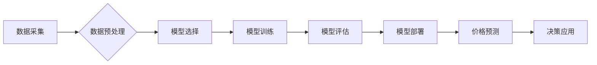

                 

## AI大模型在电商平台价格预测中的作用

> 关键词：电商平台、价格预测、AI大模型、机器学习、深度学习、自然语言处理、时间序列分析

## 1. 背景介绍

在当今数据爆炸的时代，电商平台作为商业交易的重要阵地，面临着日益激烈的竞争压力。价格是影响消费者购买决策的关键因素之一，准确的价格预测对于电商平台的运营至关重要。传统的定价方法往往依赖于经验和主观判断，难以适应市场变化的快速节奏。而随着人工智能技术的快速发展，特别是深度学习技术的突破，AI大模型在电商平台价格预测领域展现出巨大的潜力。

AI大模型能够通过学习海量数据中的复杂模式和关系，对价格进行更精准的预测，帮助电商平台制定更有效的定价策略。例如，AI大模型可以分析商品的属性、历史价格、市场趋势、用户行为等多方面因素，预测未来商品的价格走势，从而帮助平台制定合理的促销策略、库存管理策略和定价策略。

## 2. 核心概念与联系

### 2.1  电商平台价格预测

电商平台价格预测是指利用历史数据、市场信息和用户行为等数据，预测未来商品的价格走势。其目标是帮助电商平台制定更精准的定价策略，提高利润率，并提升用户体验。

### 2.2  AI大模型

AI大模型是指训练规模庞大、参数数量众多的人工智能模型，能够学习和处理复杂的数据模式。常见的AI大模型包括Transformer、BERT、GPT等。这些模型在自然语言处理、图像识别、语音识别等领域取得了突破性的进展，也为电商平台价格预测提供了强大的工具。

### 2.3  核心概念关系

电商平台价格预测的核心概念包括数据、模型、算法和应用。

* 数据：价格预测模型的训练数据包括商品属性、历史价格、市场趋势、用户行为等多方面信息。
* 模型：AI大模型是价格预测的核心，它能够学习数据中的复杂模式和关系，并进行预测。
* 算法：AI大模型的训练和预测都依赖于特定的算法，例如深度学习算法、时间序列分析算法等。
* 应用：价格预测模型的应用场景包括定价策略制定、库存管理、促销策略设计等。

**Mermaid 流程图**



## 3. 核心算法原理 & 具体操作步骤

### 3.1  算法原理概述

电商平台价格预测算法主要包括以下几种：

* **线性回归:**  一种简单的回归算法，假设价格与其他因素之间存在线性关系。
* **决策树:**  一种树形结构的算法，通过一系列规则将数据分类，并预测价格。
* **支持向量机:**  一种分类算法，通过寻找最佳的分隔超平面来分类数据，并预测价格。
* **神经网络:**  一种模仿人脑神经网络结构的算法，能够学习复杂的数据模式，并进行价格预测。

### 3.2  算法步骤详解

以神经网络为例，详细说明其价格预测的具体操作步骤：

1. **数据采集:** 收集商品属性、历史价格、市场趋势、用户行为等相关数据。
2. **数据预处理:** 对数据进行清洗、转换、归一化等处理，使其适合模型训练。
3. **模型选择:** 选择合适的深度学习模型，例如多层感知机 (MLP)、卷积神经网络 (CNN) 或循环神经网络 (RNN)。
4. **模型训练:** 使用训练数据训练模型，调整模型参数，使其能够准确预测价格。
5. **模型评估:** 使用测试数据评估模型的预测精度，并进行调整。
6. **模型部署:** 将训练好的模型部署到生产环境中，用于实时价格预测。

### 3.3  算法优缺点

**神经网络算法**

* **优点:** 能够学习复杂的数据模式，预测精度高。
* **缺点:** 训练时间长，参数数量多，需要大量数据进行训练。

**其他算法**

* **线性回归:** 算法简单，易于理解和实现，但预测精度有限。
* **决策树:** 算法易于解释，但容易过拟合。
* **支持向量机:** 预测精度较高，但训练时间长。

### 3.4  算法应用领域

电商平台价格预测算法广泛应用于以下领域：

* **定价策略制定:** 根据商品属性、市场趋势和用户行为等因素，制定合理的定价策略。
* **库存管理:** 预测商品需求，优化库存水平，降低库存成本。
* **促销策略设计:** 根据商品价格走势，设计有效的促销策略，提高销售额。
* **反欺诈:** 检测异常价格波动，识别潜在的欺诈行为。

## 4. 数学模型和公式 & 详细讲解 & 举例说明

### 4.1  数学模型构建

价格预测模型通常采用回归模型，目标是预测商品未来价格。一个简单的线性回归模型可以表示为：

$$
P = \beta_0 + \beta_1 X_1 + \beta_2 X_2 + ... + \beta_n X_n + \epsilon
$$

其中：

* $P$ 是预测的价格
* $X_1, X_2, ..., X_n$ 是商品属性、历史价格、市场趋势、用户行为等特征
* $\beta_0, \beta_1, ..., \beta_n$ 是模型参数
* $\epsilon$ 是误差项

### 4.2  公式推导过程

模型参数 $\beta_0, \beta_1, ..., \beta_n$ 可以通过最小二乘法进行估计。最小二乘法旨在找到一组参数，使得模型预测值与实际价格之间的误差平方和最小。

### 4.3  案例分析与讲解

假设我们想要预测商品 A 的未来价格，其特征包括商品属性、历史价格、市场趋势和用户行为等。我们可以使用线性回归模型进行预测，并根据模型参数的估计值，预测商品 A 的未来价格。

## 5. 项目实践：代码实例和详细解释说明

### 5.1  开发环境搭建

* Python 3.x
* TensorFlow 或 PyTorch 深度学习框架
* Pandas 数据处理库
* Scikit-learn 机器学习库
* Matplotlib 数据可视化库

### 5.2  源代码详细实现

```python
import pandas as pd
from sklearn.model_selection import train_test_split
from sklearn.linear_model import LinearRegression
from sklearn.metrics import mean_squared_error

# 数据加载
data = pd.read_csv('price_data.csv')

# 特征选择
features = ['商品属性', '历史价格', '市场趋势', '用户行为']
target = '未来价格'

# 数据分割
X_train, X_test, y_train, y_test = train_test_split(data[features], data[target], test_size=0.2)

# 模型训练
model = LinearRegression()
model.fit(X_train, y_train)

# 模型预测
y_pred = model.predict(X_test)

# 模型评估
mse = mean_squared_error(y_test, y_pred)
print(f'均方误差: {mse}')

# 结果展示
# 可视化预测结果
```

### 5.3  代码解读与分析

* 代码首先加载数据，并选择需要使用的特征和目标变量。
* 然后使用 `train_test_split` 函数将数据分割成训练集和测试集。
* 接下来创建线性回归模型，并使用 `fit` 方法训练模型。
* 训练完成后，使用 `predict` 方法对测试集进行预测。
* 最后使用 `mean_squared_error` 函数评估模型的预测精度。

### 5.4  运行结果展示

运行代码后，会输出模型的均方误差值，该值越小，模型的预测精度越高。

## 6. 实际应用场景

### 6.1  定价策略制定

电商平台可以利用价格预测模型，分析商品属性、市场趋势和用户行为等因素，制定更精准的定价策略。例如，对于热门商品，可以根据预测价格走势，制定动态定价策略，提高利润率。

### 6.2  库存管理

价格预测模型可以帮助电商平台预测商品需求，优化库存水平，降低库存成本。例如，对于季节性商品，可以根据预测价格走势，提前备货或降价促销，避免库存积压。

### 6.3  促销策略设计

电商平台可以利用价格预测模型，分析商品价格走势，设计更有效的促销策略。例如，可以根据预测价格走势，选择合适的促销时间和力度，提高促销效果。

### 6.4  未来应用展望

随着人工智能技术的不断发展，AI大模型在电商平台价格预测领域将发挥更重要的作用。未来，价格预测模型将更加智能化、个性化，能够更精准地预测商品价格，并为电商平台提供更全面的决策支持。

## 7. 工具和资源推荐

### 7.1  学习资源推荐

* **书籍:**
    * 《深度学习》 by Ian Goodfellow, Yoshua Bengio, Aaron Courville
    * 《机器学习实战》 by Sebastian Raschka, Vahid Mirjalili
* **在线课程:**
    * Coursera: 深度学习 Specialization
    * Udacity: 机器学习 Engineer Nanodegree
* **博客和网站:**
    * TensorFlow Blog: https://blog.tensorflow.org/
    * PyTorch Blog: https://pytorch.org/blog/

### 7.2  开发工具推荐

* **Python:** https://www.python.org/
* **TensorFlow:** https://www.tensorflow.org/
* **PyTorch:** https://pytorch.org/
* **Pandas:** https://pandas.pydata.org/
* **Scikit-learn:** https://scikit-learn.org/stable/

### 7.3  相关论文推荐

* **Attention Is All You Need:** https://arxiv.org/abs/1706.03762
* **BERT: Pre-training of Deep Bidirectional Transformers for Language Understanding:** https://arxiv.org/abs/1810.04805
* **Long Short-Term Memory:** https://arxiv.org/abs/1409.2329

## 8. 总结：未来发展趋势与挑战

### 8.1  研究成果总结

AI大模型在电商平台价格预测领域取得了显著的成果，能够提高预测精度，并为电商平台提供更精准的决策支持。

### 8.2  未来发展趋势

* **模型更智能化:** 未来价格预测模型将更加智能化，能够学习更复杂的模式和关系，并进行更精准的预测。
* **个性化预测:** 价格预测模型将更加个性化，能够根据用户的购买历史、偏好等信息，提供更精准的个性化价格预测。
* **多模态融合:** 未来价格预测模型将融合多模态数据，例如文本、图像、视频等，进行更全面的预测。

### 8.3  面临的挑战

* **数据质量:** 价格预测模型的精度依赖于数据质量，需要不断收集和清洗数据，保证数据的准确性和完整性。
* **模型 interpretability:** 许多AI大模型是黑盒模型，难以解释其预测结果，这对于电商平台的决策制定存在一定的挑战。
* **计算资源:** 训练大型AI模型需要大量的计算资源，这对于一些中小电商平台来说是一个挑战。

### 8.4  研究展望

未来，研究人员将继续探索更智能、更精准、更可解释的AI大模型，为电商平台提供更有效的决策支持。


## 9. 附录：常见问题与解答

**Q1:  AI大模型的价格预测精度如何？**

A1: AI大模型的价格预测精度取决于多种因素，例如模型类型、训练数据质量、特征选择等。一般来说，AI大模型能够比传统方法获得更高的预测精度。

**Q2:  如何选择合适的AI大模型？**

A2: 选择合适的AI大模型需要根据具体应用场景和数据特点进行选择。例如，对于时间序列数据，循环神经网络 (RNN) 是一种不错的选择；对于文本数据，Transformer 是一种有效的模型。

**Q3:  如何评估AI大模型的预测精度？**

A3: 常见的评估指标包括均方误差 (MSE)、平均绝对误差 (MAE) 等。

**Q4:  AI大模型的价格预测是否会受到黑盒效应的影响？**

A4: 许多AI大模型是黑盒模型，难以解释其预测结果。这对于电商平台的决策制定存在一定的挑战。未来，研究人员将继续探索更可解释的AI模型。


作者：禅与计算机程序设计艺术 / Zen and the Art of Computer Programming 
<end_of_turn>

