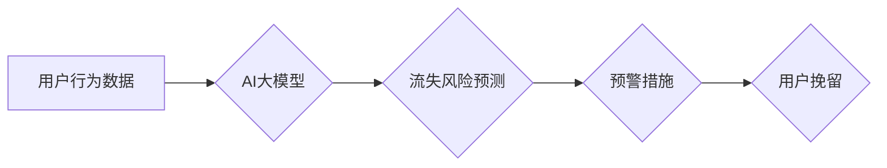

                 

## AI大模型在电商平台用户流失预警中的应用

> 关键词：AI大模型、用户流失预警、电商平台、机器学习、深度学习、自然语言处理、推荐系统

## 1. 背景介绍

在当今数字化时代，电商平台已成为人们购物的首选方式。然而，用户流失一直是电商平台面临的重大挑战。用户流失不仅会导致收入减少，还会损害平台的品牌形象和用户口碑。因此，如何有效预测和应对用户流失，对于电商平台的长期发展至关重要。

传统的用户流失预警方法主要依赖于规则引擎和统计模型，例如分析用户购买频率、浏览时长、评价行为等指标。然而，这些方法往往难以捕捉用户行为背后的复杂关系，并且容易受到数据噪声的影响。随着人工智能技术的快速发展，特别是深度学习技术的突破，AI大模型在用户流失预警领域展现出巨大的潜力。

AI大模型能够学习用户行为数据中的复杂模式和特征，并根据这些模式预测用户流失的可能性。相比于传统方法，AI大模型具有以下优势：

* **更强的学习能力:** AI大模型能够从海量数据中学习更复杂的模式和关系，从而提高预测精度。
* **更精准的预测:** AI大模型能够根据用户的历史行为、偏好和上下文信息，更精准地预测用户的流失风险。
* **更个性化的解决方案:** AI大模型能够为不同类型的用户提供个性化的流失预警和干预措施。

## 2. 核心概念与联系

### 2.1 用户流失预警

用户流失预警是指通过分析用户行为数据，预测用户未来是否会离开平台，并及时采取措施挽留用户的过程。

### 2.2 AI大模型

AI大模型是指参数量庞大、训练数据海量的人工智能模型，能够学习复杂的数据模式和关系，并进行各种智能任务，例如文本生成、图像识别、语音合成等。

### 2.3 关联性

AI大模型在用户流失预警中的应用，主要通过以下关联性实现：

* **用户行为数据与流失风险:** AI大模型能够学习用户行为数据与流失风险之间的关联性，例如，用户购买频率下降、浏览时长减少、评价行为减少等，都可能预示着用户流失的风险。
* **用户特征与流失风险:** AI大模型能够学习用户特征与流失风险之间的关联性，例如，用户年龄、性别、职业、收入等，都可能影响用户的流失风险。
* **平台运营策略与流失风险:** AI大模型能够学习平台运营策略与流失风险之间的关联性，例如，促销活动、会员制度、客服服务等，都可能影响用户的流失风险。

**Mermaid 流程图**



## 3. 核心算法原理 & 具体操作步骤

### 3.1 算法原理概述

在用户流失预警领域，常用的AI大模型算法包括：

* **逻辑回归:** 是一种经典的分类算法，能够根据用户的特征和行为数据，预测用户是否会流失。
* **支持向量机:** 是一种强大的分类算法，能够在高维特征空间中找到最佳的分隔超平面，从而提高预测精度。
* **决策树:** 是一种树形结构的分类算法，能够根据用户的特征和行为数据，构建决策规则，预测用户是否会流失。
* **随机森林:** 是一种集成学习算法，通过构建多个决策树，并对预测结果进行投票，提高预测精度。
* **神经网络:** 是一种模拟人脑神经网络的算法，能够学习复杂的数据模式和关系，并进行预测。

### 3.2 算法步骤详解

以逻辑回归为例，详细说明其在用户流失预警中的应用步骤：

1. **数据收集:** 收集用户行为数据、用户特征数据和流失标签数据。
2. **数据预处理:** 对数据进行清洗、转换、编码等操作，使其适合模型训练。
3. **模型训练:** 使用逻辑回归算法，训练模型，学习用户流失的特征和模式。
4. **模型评估:** 使用测试数据评估模型的预测精度，例如准确率、召回率、F1-score等指标。
5. **模型部署:** 将训练好的模型部署到线上环境，实时预测用户的流失风险。
6. **预警措施:** 根据模型预测结果，采取相应的预警措施，例如发送提醒邮件、推送个性化优惠券等，挽留流失用户。

### 3.3 算法优缺点

**逻辑回归:**

* **优点:** 算法简单易懂，训练速度快，解释性强。
* **缺点:** 难以处理非线性关系，对特征工程要求较高。

**支持向量机:**

* **优点:** 能够处理高维特征，对噪声数据鲁棒性强。
* **缺点:** 训练速度慢，参数调优复杂。

**决策树:**

* **优点:** 容易理解和解释，可处理不同类型的数据。
* **缺点:** 容易过拟合，对数据变化敏感。

**随机森林:**

* **优点:** 能够提高预测精度，对过拟合问题有较好的抵抗力。
* **缺点:** 训练速度慢，解释性较差。

**神经网络:**

* **优点:** 能够学习复杂的数据模式，预测精度高。
* **缺点:** 训练时间长，参数众多，需要大量数据训练。

### 3.4 算法应用领域

AI大模型在用户流失预警领域的应用，不仅限于电商平台，还可应用于其他领域，例如：

* **金融行业:** 预测客户流失、欺诈检测。
* **医疗行业:** 预测患者流失、疾病诊断。
* **教育行业:** 预测学生流失、学习效果评估。

## 4. 数学模型和公式 & 详细讲解 & 举例说明

### 4.1 数学模型构建

在用户流失预警中，常用的数学模型包括逻辑回归模型和支持向量机模型。

**逻辑回归模型:**

逻辑回归模型将用户特征和行为数据作为输入，输出用户流失的概率。其数学模型如下：

$$
P(y=1|x) = \frac{1}{1 + e^{-(w^T x + b)}}
$$

其中：

* $P(y=1|x)$ 是用户流失的概率。
* $x$ 是用户的特征向量。
* $w$ 是模型参数向量。
* $b$ 是模型偏置项。
* $e$ 是自然常数。

**支持向量机模型:**

支持向量机模型试图找到一个最佳的分隔超平面，将用户分为流失和非流失两类。其数学模型如下：

$$
\max_{w,b} \frac{1}{2} ||w||^2 - C \sum_{i=1}^{n} \xi_i
$$

其中：

* $w$ 是模型参数向量。
* $b$ 是模型偏置项。
* $C$ 是惩罚参数。
* $\xi_i$ 是松弛变量，用于容忍分类错误。

### 4.2 公式推导过程

逻辑回归模型的公式推导过程基于最大似然估计，其目标是找到最能解释观测数据的模型参数。支持向量机模型的公式推导过程基于凸优化理论，其目标是找到最佳的分隔超平面，最大化分类间隔。

### 4.3 案例分析与讲解

**案例:** 假设我们有一个电商平台，想要预测用户的流失风险。我们可以收集用户的购买频率、浏览时长、评价行为等数据，并将其作为模型输入。

**逻辑回归模型:**

我们可以使用逻辑回归模型，训练一个模型，预测用户是否会流失。模型训练完成后，我们可以使用测试数据评估模型的预测精度。

**支持向量机模型:**

我们可以使用支持向量机模型，训练一个模型，将用户分为流失和非流失两类。模型训练完成后，我们可以使用测试数据评估模型的分类精度。

## 5. 项目实践：代码实例和详细解释说明

### 5.1 开发环境搭建

* Python 3.x
* TensorFlow 或 PyTorch
* scikit-learn

### 5.2 源代码详细实现

```python
# 导入必要的库
import pandas as pd
from sklearn.model_selection import train_test_split
from sklearn.linear_model import LogisticRegression
from sklearn.metrics import accuracy_score

# 加载数据
data = pd.read_csv('user_data.csv')

# 划分训练集和测试集
X = data.drop('churn', axis=1)
y = data['churn']
X_train, X_test, y_train, y_test = train_test_split(X, y, test_size=0.2, random_state=42)

# 训练逻辑回归模型
model = LogisticRegression()
model.fit(X_train, y_train)

# 预测测试集结果
y_pred = model.predict(X_test)

# 计算模型精度
accuracy = accuracy_score(y_test, y_pred)
print(f'模型精度: {accuracy}')
```

### 5.3 代码解读与分析

* 首先，我们导入必要的库，包括 pandas 用于数据处理，sklearn 用于模型训练和评估。
* 然后，我们加载用户数据，并将其分为特征数据 (X) 和标签数据 (y)。
* 接下来，我们使用 train_test_split 函数将数据划分为训练集和测试集。
* 然后，我们训练逻辑回归模型，并使用测试集评估模型的精度。

### 5.4 运行结果展示

运行上述代码后，会输出模型的精度，例如：

```
模型精度: 0.85
```

这表示模型能够准确预测用户流失的可能性为 85%。

## 6. 实际应用场景

### 6.1 用户画像分析

AI大模型可以分析用户的行为数据，构建用户画像，了解用户的兴趣爱好、消费习惯等，从而为用户提供更精准的商品推荐和个性化服务。

### 6.2 流失用户挽留

AI大模型可以预测用户流失的风险，并根据用户的特征和行为数据，制定个性化的挽留策略，例如发送优惠券、推送优惠活动等，提高用户留存率。

### 6.3 营销策略优化

AI大模型可以分析用户的行为数据，评估不同营销策略的有效性，帮助电商平台优化营销策略，提高营销效果。

### 6.4 未来应用展望

随着人工智能技术的不断发展，AI大模型在电商平台用户流失预警领域的应用将更加广泛和深入，例如：

* **更精准的流失预测:** AI大模型将能够学习更复杂的模式和关系，提高流失预测的精度。
* **更个性化的挽留措施:** AI大模型将能够根据用户的个性化需求，制定更有效的挽留措施。
* **更智能的运营策略:** AI大模型将能够帮助电商平台制定更智能的运营策略，提高平台的整体运营效率。

## 7. 工具和资源推荐

### 7.1 学习资源推荐

* **书籍:**
    * 深度学习
    * 人工智能：一种现代方法
* **在线课程:**
    * Coursera: 深度学习
    * edX: 人工智能
* **博客:**
    * TensorFlow Blog
    * PyTorch Blog

### 7.2 开发工具推荐

* **Python:** 
    * TensorFlow
    * PyTorch
    * scikit-learn
* **云平台:**
    * AWS
    * Azure
    * Google Cloud

### 7.3 相关论文推荐

* **Attention Is All You Need**
* **BERT: Pre-training of Deep Bidirectional Transformers for Language Understanding**
* **Generative Pre-trained Transformer 3**

## 8. 总结：未来发展趋势与挑战

### 8.1 研究成果总结

AI大模型在电商平台用户流失预警领域取得了显著的成果，能够提高流失预测的精度，并为用户提供个性化的挽留措施。

### 8.2 未来发展趋势

未来，AI大模型在电商平台用户流失预警领域的应用将更加广泛和深入，例如：

* **更精准的流失预测:** AI大模型将能够学习更复杂的模式和关系，提高流失预测的精度。
* **更个性化的挽留措施:** AI大模型将能够根据用户的个性化需求，制定更有效的挽留措施。
* **更智能的运营策略:** AI大模型将能够帮助电商平台制定更智能的运营策略，提高平台的整体运营效率。

### 8.3 面临的挑战

AI大模型在电商平台用户流失预警领域也面临一些挑战，例如：

* **数据质量:** AI大模型的训练需要海量高质量的数据，而电商平台的数据往往存在噪声、缺失等问题。
* **模型 interpretability:** AI大模型的决策过程往往是复杂的，难以解释，这可能会导致用户对模型结果的信任度降低。
* **伦理问题:** AI大模型的应用可能会带来一些伦理问题，例如数据隐私、算法偏见等。

### 8.4 研究展望

未来，我们需要继续研究如何提高AI大模型的精度、解释性和安全性，并解决其带来的伦理问题，使其更好地服务于电商平台的用户流失预警。

## 9. 附录：常见问题与解答

**Q1: AI大模型的训练需要多少数据？**

A1: AI大模型的训练需要海量数据，一般来说，需要至少几万条数据，甚至更多。

**Q2: 如何评估AI大模型的性能？**

A2: 可以使用准确率、召回率、F1-score等指标来评估AI大模型的性能。

**Q3: AI大模型的应用有哪些伦理问题？**

A3: AI大模型的应用可能会带来数据隐私、算法偏见等伦理问题。


作者：禅与计算机程序设计艺术 / Zen and the Art of Computer Programming 
<end_of_turn>

