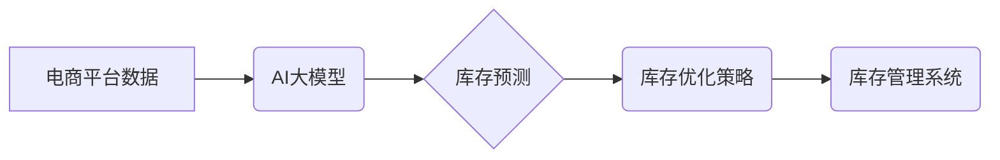

                 

## AI大模型如何优化电商平台的库存管理

> 关键词：AI大模型、库存管理、预测分析、机器学习、深度学习、电商平台、优化算法、数据驱动

## 1. 背景介绍

在当今竞争激烈的电商市场中，库存管理是电商平台运营的关键环节之一。传统的库存管理方法往往依赖于经验和历史数据，难以应对市场需求的快速变化和复杂性。随着人工智能技术的快速发展，特别是大模型技术的突破，AI大模型为电商平台的库存管理带来了新的机遇。

AI大模型凭借其强大的学习能力和预测能力，能够从海量数据中挖掘出隐藏的模式和趋势，从而实现对未来市场需求的更精准预测，帮助电商平台优化库存水平，降低库存成本，提高运营效率。

## 2. 核心概念与联系

### 2.1 核心概念

* **AI大模型:** 指的是参数量巨大、训练数据海量的人工智能模型，能够学习复杂的数据模式，并进行泛化学习，在新的数据上进行预测和决策。
* **库存管理:** 指的是企业对库存商品的规划、控制和管理，包括采购、储存、配送和报废等环节。
* **预测分析:** 利用历史数据和统计模型，预测未来事件或趋势，为决策提供依据。

### 2.2 架构关系



## 3. 核心算法原理 & 具体操作步骤

### 3.1 算法原理概述

AI大模型在库存管理中的核心算法主要包括：

* **机器学习算法:** 
    * **回归算法:** 用于预测未来商品需求量，例如线性回归、支持向量回归等。
    * **分类算法:** 用于预测商品是否会缺货或过剩，例如逻辑回归、决策树等。
* **深度学习算法:** 
    * **循环神经网络(RNN):** 用于处理时间序列数据，例如预测商品需求的趋势变化。
    * **卷积神经网络(CNN):** 用于提取商品特征，例如预测商品的销售潜力。

### 3.2 算法步骤详解

1. **数据收集:** 收集电商平台的历史销售数据、商品信息、市场趋势等相关数据。
2. **数据预处理:** 对收集到的数据进行清洗、转换、特征工程等处理，使其适合模型训练。
3. **模型选择:** 根据实际需求选择合适的机器学习或深度学习算法。
4. **模型训练:** 利用训练数据训练模型，调整模型参数，使其能够准确预测未来需求。
5. **模型评估:** 利用测试数据评估模型的预测精度，并进行模型调优。
6. **模型部署:** 将训练好的模型部署到生产环境中，用于实时预测商品需求。
7. **库存优化:** 根据模型预测结果，制定相应的库存优化策略，例如调整采购量、优化仓储布局等。

### 3.3 算法优缺点

**优点:**

* **预测精度高:** AI大模型能够从海量数据中挖掘出隐藏的模式，提高预测精度。
* **自动化程度高:** AI大模型可以自动完成预测和决策，降低人工成本。
* **适应性强:** AI大模型能够根据市场变化动态调整预测模型，提高适应性。

**缺点:**

* **数据依赖性强:** AI大模型的预测精度依赖于训练数据的质量和数量。
* **模型训练成本高:** 训练大型AI模型需要大量的计算资源和时间。
* **解释性差:** 深度学习模型的决策过程较为复杂，难以解释其预测结果。

### 3.4 算法应用领域

* **电商平台库存管理:** 预测商品需求，优化库存水平，降低库存成本。
* **制造业生产计划:** 预测产品需求，优化生产计划，提高生产效率。
* **物流运输管理:** 预测货物运输需求，优化运输路线，降低运输成本。
* **金融风险管理:** 预测金融风险，制定风险控制策略。

## 4. 数学模型和公式 & 详细讲解 & 举例说明

### 4.1 数学模型构建

在库存管理中，常用的数学模型包括：

* **经济订货量模型(EOQ):** 用于确定最优的订货量，以最小化库存成本和订货成本。
* **安全库存模型:** 用于确定安全库存水平，以避免缺货风险。
* **预测模型:** 用于预测未来商品需求量，例如ARIMA模型、Prophet模型等。

### 4.2 公式推导过程

**经济订货量模型(EOQ):**

假设：

* D: 年需求量
* S: 每次订货的订货成本
* H: 每单位库存的持有成本

则经济订货量(EOQ)为：

$$EOQ = \sqrt{\frac{2DS}{H}}$$

**安全库存模型:**

假设：

* L: 需求量波动范围
* Z: 缺货风险容忍度
* d: 平均每日需求量
* lead time: 订货周期

则安全库存(SS)为：

$$SS = Z \sqrt{lead time \times d} + L$$

### 4.3 案例分析与讲解

**案例:**

一家电商平台销售一种商品，年需求量为10000件，订货成本为100元/次，库存持有成本为1元/件/年。

**计算经济订货量:**

$$EOQ = \sqrt{\frac{2 \times 10000 \times 100}{1}} = 141.42$$

**结论:**

该电商平台最优的订货量为141件/次。

## 5. 项目实践：代码实例和详细解释说明

### 5.1 开发环境搭建

* Python 3.x
* TensorFlow/PyTorch
* Jupyter Notebook

### 5.2 源代码详细实现

```python
# 导入必要的库
import pandas as pd
from sklearn.model_selection import train_test_split
from sklearn.linear_model import LinearRegression

# 加载数据
data = pd.read_csv('sales_data.csv')

# 数据预处理
# ...

# 将数据分为训练集和测试集
X_train, X_test, y_train, y_test = train_test_split(data[['feature1', 'feature2']], data['demand'], test_size=0.2)

# 创建线性回归模型
model = LinearRegression()

# 训练模型
model.fit(X_train, y_train)

# 预测测试集数据
y_pred = model.predict(X_test)

# 评估模型性能
# ...
```

### 5.3 代码解读与分析

* 数据加载和预处理: 首先加载销售数据，并进行必要的预处理，例如缺失值处理、特征工程等。
* 数据分割: 将数据分为训练集和测试集，用于训练和评估模型。
* 模型选择: 选择合适的机器学习算法，例如线性回归。
* 模型训练: 利用训练集训练模型，调整模型参数。
* 模型预测: 利用训练好的模型预测测试集数据。
* 模型评估: 评估模型的预测精度，例如使用均方误差(MSE)或R-squared值。

### 5.4 运行结果展示

* 模型预测结果可视化: 使用图表展示模型预测结果与实际值之间的差异。
* 模型性能指标: 展示模型的预测精度、准确率等指标。

## 6. 实际应用场景

* **个性化库存管理:** 根据用户的购买历史和偏好，为每个用户定制个性化的库存管理策略。
* **动态库存调整:** 根据实时市场需求变化，动态调整库存水平，避免缺货或积压。
* **跨境电商库存管理:** 优化跨境电商平台的库存管理，降低物流成本和运输时间。

### 6.4 未来应用展望

* **智能化库存管理:** 利用人工智能技术，实现更智能化的库存管理，例如自动采购、自动配送等。
* **预测性维护:** 利用AI大模型预测库存设备的故障风险，提前进行维护，降低设备故障率。
* **供应链协同:** 利用AI大模型，实现电商平台、供应商、物流公司等供应链各环节的协同，优化整个供应链效率。

## 7. 工具和资源推荐

### 7.1 学习资源推荐

* **书籍:**
    * 《深度学习》
    * 《机器学习实战》
* **在线课程:**
    * Coursera: 深度学习课程
    * Udacity: 机器学习工程师课程

### 7.2 开发工具推荐

* **Python:** 
    * TensorFlow
    * PyTorch
* **数据分析工具:**
    * Pandas
    * Scikit-learn

### 7.3 相关论文推荐

* **《基于深度学习的电商平台库存预测模型》**
* **《AI大模型在供应链管理中的应用》**

## 8. 总结：未来发展趋势与挑战

### 8.1 研究成果总结

AI大模型在电商平台库存管理领域取得了显著的成果，能够提高预测精度、优化库存水平、降低运营成本。

### 8.2 未来发展趋势

* **模型精度提升:** 继续探索更先进的深度学习算法，提高模型预测精度。
* **数据融合:** 将更多数据类型融合到模型训练中，例如用户行为数据、市场趋势数据等。
* **场景化应用:** 开发针对不同电商平台和商品类型的个性化库存管理解决方案。

### 8.3 面临的挑战

* **数据质量:** AI大模型的预测精度依赖于训练数据的质量，需要不断提高数据采集和处理能力。
* **模型解释性:** 深度学习模型的决策过程较为复杂，难以解释其预测结果，需要开发更易解释的模型。
* **伦理问题:** AI大模型的应用可能带来一些伦理问题，例如数据隐私、算法偏见等，需要加强伦理规范和监管。

### 8.4 研究展望

未来，AI大模型在电商平台库存管理领域将继续发挥重要作用，并朝着更智能化、个性化、可解释的方向发展。


## 9. 附录：常见问题与解答

* **Q1: AI大模型的训练成本很高吗?**

* **A1:** 确实，训练大型AI模型需要大量的计算资源和时间，但随着云计算技术的进步，训练成本正在逐渐降低。

* **Q2: AI大模型的预测结果是否准确?**

* **A2:** AI大模型的预测精度取决于训练数据的质量和模型的复杂度。一般来说，训练数据越丰富，模型越复杂，预测精度越高。

* **Q3: 如何评估AI大模型的性能?**

* **A3:** 可以使用多种指标来评估AI大模型的性能，例如均方误差(MSE)、R-squared值、准确率等。

* **Q4: AI大模型的应用场景有哪些?**

* **A4:** AI大模型在电商平台库存管理、制造业生产计划、物流运输管理、金融风险管理等多个领域都有广泛的应用。


作者：禅与计算机程序设计艺术 / Zen and the Art of Computer Programming 
<end_of_turn>

