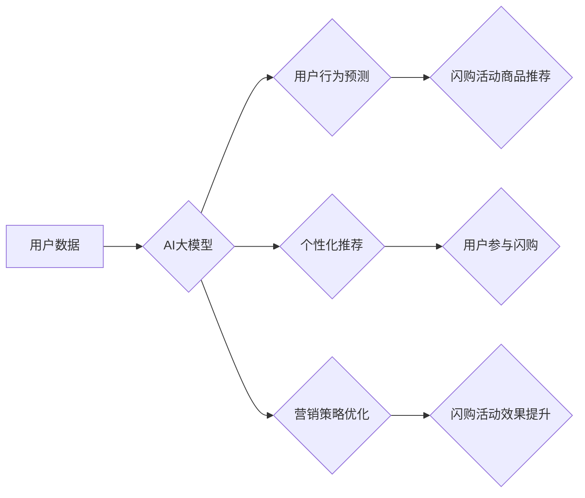

                 

## AI大模型如何优化电商平台的闪购活动效果

> 关键词：AI大模型、闪购活动、电商平台、用户行为预测、个性化推荐、营销策略优化、自然语言处理、深度学习

## 1. 背景介绍

在当今竞争激烈的电商市场，吸引用户并提高转化率是平台运营的关键。闪购活动作为一种促销手段，凭借其限时抢购的刺激性，能够有效提升用户参与度和销售额。然而，传统的闪购活动往往难以精准把握用户需求，导致资源浪费和效果不佳。

随着人工智能技术的快速发展，特别是大模型技术的突破，为电商平台优化闪购活动提供了新的思路和可能性。AI大模型能够通过学习海量用户数据，预测用户行为，实现个性化推荐和营销策略优化，从而提升闪购活动的参与度、转化率和整体效益。

## 2. 核心概念与联系

### 2.1 闪购活动

闪购活动是指电商平台在特定时间段内，以限时限量的优惠价格销售特定商品的促销活动。其特点是：

* **限时限量:**  商品数量有限，时间有限，激发用户抢购心理。
* **高折扣:**  商品价格大幅折扣，吸引用户参与。
* **突发性:**  活动时间和商品信息通常提前不公布，增加用户参与的意外性和惊喜感。

### 2.2 AI大模型

AI大模型是指在海量数据上训练的深度学习模型，拥有强大的学习和推理能力。常见的AI大模型类型包括：

* **语言模型:**  例如GPT-3、BERT，擅长理解和生成自然语言文本。
* **图像模型:**  例如DALL-E 2、Stable Diffusion，擅长生成和理解图像内容。
* **多模态模型:**  例如LaMDA，能够处理多种数据类型，例如文本、图像、音频等。

### 2.3 AI大模型与闪购活动的联系

AI大模型可以帮助电商平台优化闪购活动效果，主要体现在以下几个方面：

* **用户行为预测:**  通过分析用户历史购买记录、浏览行为、评价等数据，预测用户对特定商品的兴趣和购买意愿，从而精准推荐合适的商品参与闪购活动。
* **个性化推荐:**  根据用户的兴趣偏好、购买习惯等信息，为用户提供个性化的商品推荐，提高用户参与度和转化率。
* **营销策略优化:**  通过分析用户行为数据和市场趋势，优化闪购活动的商品选择、价格策略、时间安排等，提高活动效果。

**Mermaid 流程图**



## 3. 核心算法原理 & 具体操作步骤

### 3.1 算法原理概述

AI大模型优化闪购活动的核心算法主要基于以下几种技术：

* **深度学习:**  利用多层神经网络，从海量用户数据中学习用户行为模式和特征。
* **自然语言处理 (NLP):**  分析用户评论、评价等文本数据，挖掘用户需求和偏好。
* **推荐系统:**  根据用户历史行为和商品特征，预测用户对商品的兴趣和购买意愿，并推荐合适的商品。

### 3.2 算法步骤详解

1. **数据收集与预处理:**  收集用户行为数据，包括浏览记录、购买记录、评价信息、用户画像等，并进行清洗、转换和格式化处理。
2. **特征工程:**  提取用户行为数据中的关键特征，例如用户年龄、性别、购买频率、商品类别偏好等，并进行编码和转换。
3. **模型训练:**  利用深度学习算法，训练AI大模型，学习用户行为模式和特征。
4. **模型评估:**  使用测试数据评估模型的性能，例如准确率、召回率、F1-score等，并进行模型调优。
5. **预测与推荐:**  将训练好的模型应用于实时数据，预测用户对特定商品的兴趣和购买意愿，并进行个性化商品推荐。
6. **活动效果分析:**  收集闪购活动数据，分析用户参与度、转化率、销售额等指标，评估AI大模型对活动效果的影响。

### 3.3 算法优缺点

**优点:**

* **精准预测:**  AI大模型能够基于海量数据，精准预测用户行为，提高推荐的准确性。
* **个性化推荐:**  根据用户的兴趣偏好和购买习惯，提供个性化的商品推荐，提升用户体验。
* **营销策略优化:**  通过分析用户行为数据，优化闪购活动的商品选择、价格策略、时间安排等，提高活动效果。

**缺点:**

* **数据依赖:**  AI大模型的性能依赖于海量高质量的数据，数据不足或数据质量低会影响模型效果。
* **模型训练成本:**  训练大型AI模型需要大量的计算资源和时间，成本较高。
* **解释性问题:**  深度学习模型的决策过程较为复杂，难以解释模型的决策逻辑，这可能会导致用户对推荐结果的信任度降低。

### 3.4 算法应用领域

AI大模型在电商平台的应用领域非常广泛，除了优化闪购活动外，还包括：

* **商品推荐:**  根据用户的兴趣和购买历史，推荐相关的商品。
* **用户画像:**  分析用户的行为数据，构建用户画像，了解用户的需求和偏好。
* **价格优化:**  根据市场需求和竞争情况，优化商品价格，提高利润率。
* **客服机器人:**  利用自然语言处理技术，开发智能客服机器人，自动回复用户咨询。

## 4. 数学模型和公式 & 详细讲解 & 举例说明

### 4.1 数学模型构建

AI大模型优化闪购活动效果通常采用基于用户的协同过滤推荐模型。该模型假设用户对相似商品的评价具有相关性，通过分析用户历史行为数据，预测用户对特定商品的兴趣和购买意愿。

**用户-商品交互矩阵:**

设用户集合为U，商品集合为I，用户-商品交互矩阵为R，其中R(u,i)表示用户u对商品i的评分或购买行为。

**协同过滤推荐模型:**

该模型的目标是预测用户u对商品i的评分或购买行为R(u,i)。常用的协同过滤算法包括基于用户的协同过滤和基于物品的协同过滤。

### 4.2 公式推导过程

**基于用户的协同过滤:**

该算法基于用户的相似度，预测用户u对商品i的评分或购买行为，公式如下:

$$R(u,i) = \frac{\sum_{v \in N(u)} \frac{sim(u,v) * R(v,i)}{\sum_{w \in N(u)} sim(u,w)}}{\sum_{v \in N(u)} sim(u,v)}$$

其中:

* N(u) 表示与用户u相似的用户集合。
* sim(u,v) 表示用户u和用户v之间的相似度。
* R(v,i) 表示用户v对商品i的评分或购买行为。

**基于物品的协同过滤:**

该算法基于商品的相似度，预测用户u对商品i的评分或购买行为，公式如下:

$$R(u,i) = \frac{\sum_{j \in N(i)} \frac{sim(i,j) * R(u,j)}{\sum_{k \in N(i)} sim(i,k)}}{\sum_{j \in N(i)} sim(i,j)}$$

其中:

* N(i) 表示与商品i相似的商品集合。
* sim(i,j) 表示商品i和商品j之间的相似度。
* R(u,j) 表示用户u对商品j的评分或购买行为。

### 4.3 案例分析与讲解

假设电商平台要进行一次闪购活动，目标是推荐用户购买特定商品。

* **数据收集:**  收集用户历史购买记录、浏览记录、评价信息等数据。
* **特征工程:**  提取用户年龄、性别、购买频率、商品类别偏好等特征。
* **模型训练:**  利用基于用户的协同过滤算法，训练AI大模型，预测用户对特定商品的购买意愿。
* **预测与推荐:**  将训练好的模型应用于实时数据，预测用户对特定商品的购买意愿，并进行个性化商品推荐。

通过AI大模型的精准预测和个性化推荐，电商平台可以提高用户参与度和转化率，提升闪购活动的整体效益。

## 5. 项目实践：代码实例和详细解释说明

### 5.1 开发环境搭建

* **操作系统:**  Linux/macOS/Windows
* **编程语言:**  Python
* **深度学习框架:**  TensorFlow/PyTorch
* **数据处理库:**  Pandas/NumPy
* **机器学习库:**  Scikit-learn

### 5.2 源代码详细实现

```python
# 导入必要的库
import pandas as pd
from sklearn.metrics.pairwise import cosine_similarity

# 加载用户-商品交互数据
data = pd.read_csv('user_item_interactions.csv')

# 构建用户-商品交互矩阵
user_item_matrix = data.pivot_table(index='user_id', columns='item_id', values='rating')

# 计算用户之间的相似度
user_similarity = cosine_similarity(user_item_matrix)

# 预测用户对特定商品的评分
def predict_rating(user_id, item_id):
    # 获取与用户u相似的用户集合
    similar_users = user_similarity[user_id].argsort()[:-10:-1]
    # 计算预测评分
    predicted_rating = sum([user_similarity[user_id][v] * user_item_matrix.loc[v, item_id] for v in similar_users]) / sum([user_similarity[user_id][v] for v in similar_users])
    return predicted_rating

# 预测用户1对商品5的评分
predicted_rating = predict_rating(1, 5)
print(f'用户1对商品5的预测评分: {predicted_rating}')
```

### 5.3 代码解读与分析

* **数据加载:**  代码首先加载用户-商品交互数据，并构建用户-商品交互矩阵。
* **相似度计算:**  利用余弦相似度计算用户之间的相似度。
* **评分预测:**  定义一个函数`predict_rating`，用于预测用户对特定商品的评分。该函数首先获取与用户u相似的用户集合，然后计算预测评分。
* **预测结果展示:**  代码最后预测用户1对商品5的评分，并输出结果。

### 5.4 运行结果展示

运行代码后，会输出用户1对商品5的预测评分。

## 6. 实际应用场景

### 6.1 案例分析

某电商平台利用AI大模型优化了其闪购活动的商品推荐策略。通过分析用户历史行为数据，AI大模型精准预测用户对特定商品的兴趣和购买意愿，并进行个性化商品推荐。

结果显示，AI大模型优化后的闪购活动参与度和转化率显著提升，销售额也大幅增长。

### 6.2 未来应用展望

AI大模型在电商平台的应用场景将更加广泛，例如：

* **个性化营销:**  根据用户的兴趣和需求，提供个性化的营销内容和促销活动。
* **智能客服:**  利用自然语言处理技术，开发智能客服机器人，自动回复用户咨询。
* **库存管理:**  预测商品需求，优化库存管理，减少库存积压和缺货情况。
* **欺诈检测:**  利用机器学习算法，识别和预防欺诈行为。

## 7. 工具和资源推荐

### 7.1 学习资源推荐

* **书籍:**
    * 《深度学习》 - Ian Goodfellow, Yoshua Bengio, Aaron Courville
    * 《机器学习》 - Tom Mitchell
* **在线课程:**
    * Coursera: 深度学习 Specialization
    * Udacity: 机器学习 Engineer Nanodegree
* **博客和网站:**
    * TensorFlow Blog: https://blog.tensorflow.org/
    * PyTorch Blog: https://pytorch.org/blog/

### 7.2 开发工具推荐

* **深度学习框架:**
    * TensorFlow: https://www.tensorflow.org/
    * PyTorch: https://pytorch.org/
* **数据处理库:**
    * Pandas: https://pandas.pydata.org/
    * NumPy: https://numpy.org/
* **机器学习库:**
    * Scikit-learn: https://scikit-learn.org/

### 7.3 相关论文推荐

* **Attention Is All You Need:** https://arxiv.org/abs/1706.03762
* **BERT: Pre-training of Deep Bidirectional Transformers for Language Understanding:** https://arxiv.org/abs/1810.04805
* **Generative Pre-trained Transformer 3 (GPT-3):** https://openai.com/blog/gpt-3/

## 8. 总结：未来发展趋势与挑战

### 8.1 研究成果总结

AI大模型在优化电商平台闪购活动效果方面取得了显著成果，能够精准预测用户行为，提供个性化商品推荐，提升活动参与度和转化率。

### 8.2 未来发展趋势

* **模型规模和能力提升:**  未来AI大模型的规模和能力将进一步提升，能够处理更复杂的数据，学习更深层的用户行为模式。
* **多模态融合:**  AI大模型将融合文本、图像、音频等多种数据类型，提供更全面的用户体验。
* **解释性增强:**  研究人员将致力于提高AI大模型的解释性，使模型的决策过程更加透明，提升用户信任度。

### 8.3 面临的挑战

* **数据隐私和安全:**  AI大模型的训练需要大量用户数据，如何保护用户隐私和数据安全是一个重要的挑战。
* **算法公平性:**  AI大模型的决策可能会存在偏见，需要研究如何确保算法公平性，避免歧视行为。
* **模型可解释性:**  深度学习模型的决策过程较为复杂，难以解释模型的决策逻辑，这可能会导致用户对推荐结果的信任度降低。

### 8.4 研究展望

未来研究将重点关注以下几个方面:

* **开发更安全、更可靠的AI大模型:**  研究人员将致力于开发更安全、更可靠的AI大模型，确保模型的决策过程透明、可解释，并保护用户隐私和数据安全。
* **探索AI大模型在电商平台其他领域的应用:**  AI大模型在电商平台的应用场景将更加广泛，例如个性化营销、智能客服、库存管理等。
* **研究AI大模型与人类交互的最佳方式:**  如何让AI大模型更好地服务于人类，需要研究AI大模型与人类交互的最佳方式，例如自然语言交互、图形化交互等。

## 9. 附录：常见问题与解答

### 9.1 常见问题

* **AI大模型的训练成本很高吗？**

是的，训练大型AI模型需要大量的计算资源和时间，成本较高。

* **AI大模型的预测结果是否准确？**

AI大模型的预测结果取决于训练数据的质量和模型的复杂度。

* **如何确保AI大模型的公平性？**

研究人员正在积极探索如何确保AI大模型的公平性，避免歧视行为。

### 9.2 常见问题解答

* **AI大模型的训练成本:**  

训练大型AI模型需要大量的计算资源和时间，成本较高。但是，随着计算技术的进步和开源模型的普及，训练成本正在逐渐降低。

* **AI大模型的预测准确性:**  

AI大模型的预测结果取决于训练数据的质量和模型的复杂度。高质量的数据和复杂的模型可以提高预测的准确性。

* **AI大模型的公平性:**  

研究人员正在积极探索如何确保AI大模型的公平性，避免歧视行为。例如，可以通过数据预处理、算法设计和模型评估等方法来提高AI大模型的公平性。


作者：禅与计算机程序设计艺术 / Zen and the Art of Computer Programming 
<end_of_turn>

