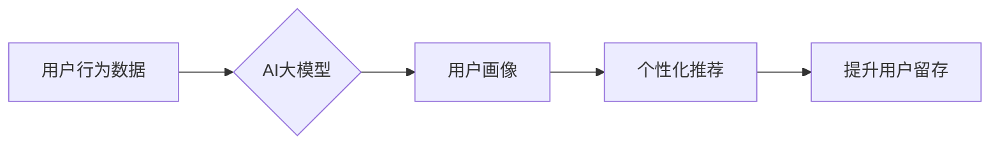

                 

## AI大模型对电商平台用户留存的影响

> 关键词：AI大模型、电商平台、用户留存、推荐系统、个性化、深度学习、自然语言处理

## 1. 背景介绍

在当今数字经济时代，电商平台已成为人们购物、娱乐、社交的重要平台。用户留存率作为衡量电商平台成功的重要指标，直接关系到平台的商业模式和长期发展。传统电商平台依靠规则引擎和基于特征的推荐系统来提高用户留存率，但随着用户行为的复杂化和数据量的激增，这些传统方法逐渐显得力不从心。

近年来，深度学习技术的发展为电商平台用户留存带来了新的机遇。AI大模型，特别是基于Transformer架构的大语言模型（LLM），凭借其强大的语义理解和文本生成能力，在个性化推荐、用户画像构建、内容创作等方面展现出巨大的潜力。

## 2. 核心概念与联系

### 2.1  电商平台用户留存

用户留存是指用户在一段时间内持续使用电商平台的比率。高留存率意味着用户对平台的满意度高，并愿意持续进行消费和互动。

### 2.2  AI大模型

AI大模型是指训练规模庞大、参数数量众多的深度学习模型。它们通过学习海量数据，能够掌握复杂的模式和关系，并进行预测、生成、翻译等多种任务。

### 2.3  核心概念联系

AI大模型可以帮助电商平台提升用户留存率，主要通过以下方式：

* **个性化推荐:** AI大模型可以分析用户的历史购买记录、浏览行为、评价等数据，构建用户的兴趣画像，并推荐更符合用户需求的商品。
* **精准营销:** AI大模型可以根据用户的特征和行为，进行精准的营销推送，提高用户参与度和转化率。
* **智能客服:** AI大模型可以模拟人类对话，提供智能客服服务，解决用户的疑问，提升用户体验。
* **内容创作:** AI大模型可以根据用户的兴趣和需求，生成个性化的商品描述、促销文案、推荐文章等内容，吸引用户的注意力。

**Mermaid 流程图**



## 3. 核心算法原理 & 具体操作步骤

### 3.1  算法原理概述

AI大模型在电商平台用户留存领域的应用主要基于以下核心算法：

* **深度学习:** 深度学习算法能够从海量数据中学习复杂的模式和关系，并进行预测和分类。
* **Transformer:** Transformer是一种新型的神经网络架构，能够有效处理序列数据，例如文本和时间序列数据，在自然语言处理领域取得了突破性进展。
* **推荐系统算法:** 推荐系统算法能够根据用户的历史行为和偏好，预测用户可能感兴趣的商品，并进行推荐。常见的推荐系统算法包括协同过滤、内容过滤和基于知识图谱的推荐。

### 3.2  算法步骤详解

1. **数据收集和预处理:** 收集用户行为数据，例如浏览记录、购买记录、评价等，并进行清洗、转换和特征工程。
2. **模型训练:** 使用深度学习算法和Transformer架构，训练AI大模型，使其能够学习用户行为模式和偏好。
3. **模型评估和优化:** 使用测试数据评估模型性能，并根据评估结果进行模型调优，提高模型准确性和效率。
4. **模型部署和应用:** 将训练好的模型部署到电商平台，并将其应用于个性化推荐、精准营销、智能客服等场景。

### 3.3  算法优缺点

**优点:**

* **个性化推荐:** AI大模型能够根据用户的个性化需求进行精准推荐，提升用户体验和转化率。
* **数据驱动:** AI大模型基于海量数据进行训练，能够学习到更复杂的模式和关系，提高推荐的准确性。
* **自动化:** AI大模型能够自动完成推荐和营销任务，降低人工成本。

**缺点:**

* **数据依赖:** AI大模型需要海量数据进行训练，否则模型性能会下降。
* **计算资源:** 训练AI大模型需要大量的计算资源，成本较高。
* **黑盒问题:** AI大模型的决策过程较为复杂，难以解释，这可能会导致用户对推荐结果的信任度降低。

### 3.4  算法应用领域

AI大模型在电商平台用户留存领域的应用场景广泛，包括：

* **商品推荐:** 根据用户的历史购买记录、浏览行为、评价等数据，推荐用户可能感兴趣的商品。
* **用户画像构建:** 分析用户的行为数据，构建用户的兴趣画像，以便进行精准营销和个性化服务。
* **内容创作:** 根据用户的兴趣和需求，生成个性化的商品描述、促销文案、推荐文章等内容。
* **智能客服:** 模拟人类对话，提供智能客服服务，解决用户的疑问，提升用户体验。

## 4. 数学模型和公式 & 详细讲解 & 举例说明

### 4.1  数学模型构建

在电商平台用户留存领域，常用的数学模型包括：

* **用户留存率模型:** 用于计算用户在特定时间段内留存的比例。

$$
L(t) = \frac{N(t)}{N(0)}
$$

其中：

* $L(t)$ 表示时间 $t$ 时刻的用户留存率。
* $N(t)$ 表示时间 $t$ 时刻的用户数量。
* $N(0)$ 表示初始用户数量。

* **推荐系统模型:** 用于预测用户对商品的点击、购买等行为。常见的推荐系统模型包括协同过滤模型、内容过滤模型和基于知识图谱的推荐模型。

### 4.2  公式推导过程

协同过滤模型的核心思想是基于用户的相似性或商品的相似性进行推荐。

**用户-基于协同过滤模型:**

假设用户 $u$ 和用户 $v$ 的相似度为 $sim(u,v)$，商品 $i$ 和商品 $j$ 的相似度为 $sim(i,j)$。

则用户 $u$ 对商品 $i$ 的预测评分为：

$$
\hat{r}_{ui} = r_{ui} + sim(u,v) * (r_{vi} - r_{ui})
$$

其中：

* $\hat{r}_{ui}$ 表示用户 $u$ 对商品 $i$ 的预测评分。
* $r_{ui}$ 表示用户 $u$ 对商品 $i$ 的真实评分。
* $r_{vi}$ 表示用户 $v$ 对商品 $i$ 的真实评分。

### 4.3  案例分析与讲解

假设电商平台有三个用户 $u1$, $u2$, $u3$，他们对三个商品 $i1$, $i2$, $i3$ 的评分如下：

| 用户 | 商品 $i1$ | 商品 $i2$ | 商品 $i3$ |
|---|---|---|---|
| $u1$ | 5 | 3 | 4 |
| $u2$ | 4 | 5 | 2 |
| $u3$ | 3 | 4 | 5 |

根据用户评分数据，我们可以计算用户之间的相似度，并使用协同过滤模型预测用户对商品的评分。例如，我们可以预测用户 $u1$ 对商品 $i3$ 的评分：

$$
\hat{r}_{u1i3} = 4 + sim(u1,u2) * (2 - 4)
$$

其中 $sim(u1,u2)$ 是用户 $u1$ 和 $u2$ 的相似度。

## 5. 项目实践：代码实例和详细解释说明

### 5.1  开发环境搭建

* **操作系统:** Linux/macOS
* **编程语言:** Python
* **深度学习框架:** TensorFlow/PyTorch
* **数据处理工具:** Pandas
* **版本管理工具:** Git

### 5.2  源代码详细实现

```python
# 导入必要的库
import tensorflow as tf
from tensorflow.keras.layers import Embedding, Dense, Flatten
from tensorflow.keras.models import Sequential

# 定义推荐模型
model = Sequential()
model.add(Embedding(input_dim=vocab_size, output_dim=embedding_dim))
model.add(Flatten())
model.add(Dense(units=1, activation='linear'))

# 编译模型
model.compile(optimizer='adam', loss='mse')

# 训练模型
model.fit(X_train, y_train, epochs=10)

# 预测用户对商品的评分
predictions = model.predict(X_test)
```

### 5.3  代码解读与分析

* **Embedding层:** 将用户和商品的ID转换为稠密的向量表示，以便模型学习用户和商品之间的关系。
* **Flatten层:** 将多维向量转换为一维向量，以便输入到全连接层。
* **Dense层:** 全连接层，用于学习用户和商品之间的关系，并预测用户对商品的评分。
* **Adam优化器:** 用于优化模型参数。
* **均方误差损失函数:** 用于衡量模型预测结果与真实评分之间的误差。

### 5.4  运行结果展示

训练完成后，我们可以使用测试数据评估模型性能，并展示预测结果。

## 6. 实际应用场景

### 6.1  个性化推荐

AI大模型可以根据用户的兴趣和偏好，推荐个性化的商品，提升用户体验和转化率。例如，电商平台可以根据用户的浏览记录、购买记录和评价等数据，推荐用户可能感兴趣的商品，并根据用户的性别、年龄、职业等信息，进行更精准的推荐。

### 6.2  精准营销

AI大模型可以分析用户的行为数据，构建用户的兴趣画像，并进行精准的营销推送，提高用户参与度和转化率。例如，电商平台可以根据用户的购买记录和浏览记录，推送相关的促销活动和优惠券，并根据用户的兴趣爱好，推送个性化的广告。

### 6.3  智能客服

AI大模型可以模拟人类对话，提供智能客服服务，解决用户的疑问，提升用户体验。例如，电商平台可以利用AI大模型构建智能客服机器人，帮助用户查询商品信息、处理订单问题、提供售后服务等。

### 6.4  未来应用展望

随着AI技术的不断发展，AI大模型在电商平台用户留存领域的应用将更加广泛和深入。例如，未来可能出现以下应用场景：

* **基于多模态数据的推荐:** 结合文本、图像、视频等多模态数据，进行更精准的推荐。
* **个性化内容创作:** 基于用户的兴趣和需求，自动生成个性化的商品描述、促销文案、推荐文章等内容。
* **预测用户行为:** 利用AI大模型预测用户的购买行为、浏览行为、评价行为等，帮助电商平台进行更有效的运营和营销。

## 7. 工具和资源推荐

### 7.1  学习资源推荐

* **书籍:**
    * 《深度学习》
    * 《自然语言处理》
    * 《推荐系统》
* **在线课程:**
    * Coursera
    * edX
    * Udacity

### 7.2  开发工具推荐

* **深度学习框架:** TensorFlow, PyTorch
* **数据处理工具:** Pandas, NumPy
* **版本管理工具:** Git

### 7.3  相关论文推荐

* **BERT: Pre-training of Deep Bidirectional Transformers for Language Understanding**
* **Attention Is All You Need**
* **Recurrent Neural Network for Sequence Prediction**

## 8. 总结：未来发展趋势与挑战

### 8.1  研究成果总结

AI大模型在电商平台用户留存领域的应用取得了显著成果，例如：

* **提升用户留存率:** AI大模型能够根据用户的个性化需求进行精准推荐，提升用户体验和转化率，从而提高用户留存率。
* **降低运营成本:** AI大模型能够自动化完成推荐和营销任务，降低人工成本。
* **提升用户满意度:** AI大模型能够提供智能客服服务，解决用户的疑问，提升用户满意度。

### 8.2  未来发展趋势

* **多模态数据融合:** 将文本、图像、视频等多模态数据融合，进行更精准的推荐和用户画像构建。
* **个性化内容创作:** 基于用户的兴趣和需求，自动生成个性化的商品描述、促销文案、推荐文章等内容。
* **预测用户行为:** 利用AI大模型预测用户的购买行为、浏览行为、评价行为等，帮助电商平台进行更有效的运营和营销。

### 8.3  面临的挑战

* **数据隐私:** AI大模型需要大量用户数据进行训练，如何保护用户隐私是一个重要的挑战。
* **模型解释性:** AI大模型的决策过程较为复杂，难以解释，这可能会导致用户对推荐结果的信任度降低。
* **计算资源:** 训练AI大模型需要大量的计算资源，成本较高。

### 8.4  研究展望

未来，AI大模型在电商平台用户留存领域的应用将更加广泛和深入，需要进一步研究以下问题：

* 如何更好地保护用户隐私，同时利用数据进行模型训练？
* 如何提高AI大模型的解释性，增强用户对推荐结果的信任度？
* 如何降低AI大模型的训练成本，使其更易于部署和应用？


## 9. 附录：常见问题与解答

**Q1: AI大模型的训练需要多少数据？**

A1: AI大模型的训练数据量取决于模型的复杂度和任务的难度。一般来说，需要至少百万级的数据量才能训练出有效的模型。

**Q2: 如何评估AI大模型的性能？**

A2: AI大模型的性能可以根据任务类型进行评估。例如，推荐系统的性能可以评估为点击率、转化率等指标。

**Q3: 如何部署AI大模型？**

A3: AI大模型可以部署到云服务器、边缘设备等平台。具体的部署方式取决于模型的规模和应用场景。


作者：禅与计算机程序设计艺术 / Zen and the Art of Computer Programming 
<end_of_turn>

