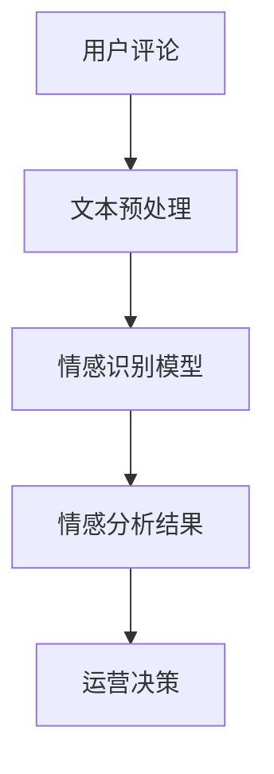

                 

# 大模型技术在电商平台用户情感分析中的应用

> 关键词：大模型技术，用户情感分析，自然语言处理，电商平台，情感识别，文本分析，深度学习，机器学习

> 摘要：随着电子商务的迅速发展，用户情感分析成为电商平台提升用户体验和运营效率的重要手段。本文探讨了如何利用大模型技术，特别是自然语言处理技术，对电商平台用户评论进行情感分析，以提高用户体验和业务决策的准确性。

## 1. 背景介绍

随着互联网技术的不断发展，电商平台已经成为人们日常生活中不可或缺的一部分。用户评论作为电商平台的重要组成部分，不仅反映了用户对商品和服务的满意度，也提供了宝贵的改进意见。因此，对用户评论进行情感分析，能够帮助企业更好地了解用户需求，优化产品和服务，提升用户体验。

用户情感分析是指通过自然语言处理技术，对用户的语言表达进行分析，识别出其中的情感倾向。在电商领域，情感分析主要用于以下两个方面：

1. **用户满意度评估**：通过对用户评论的情感分析，企业可以了解用户对商品和服务的总体满意度，以及不满意的具体原因。
2. **个性化推荐**：基于用户的情感分析结果，电商平台可以为用户提供更加个性化的推荐，从而提升用户满意度和购买转化率。

随着大数据和人工智能技术的不断发展，大模型技术在用户情感分析中的应用逐渐成为研究热点。大模型技术，如Transformer模型、BERT模型等，具有强大的文本理解和生成能力，能够在复杂环境下提供更为准确和高效的情感分析结果。

## 2. 核心概念与联系

### 2.1 大模型技术

大模型技术是指使用大规模的神经网络模型进行自然语言处理的方法。这些模型通常包含数十亿个参数，能够学习到语言的高级语义和语法结构。在用户情感分析中，大模型技术能够处理大量的文本数据，提取出隐藏在文本中的情感信息。

### 2.2 自然语言处理

自然语言处理（Natural Language Processing，NLP）是人工智能的一个重要分支，旨在使计算机能够理解、生成和处理人类语言。在用户情感分析中，NLP技术被用于提取文本特征、进行情感分类和生成情感标签。

### 2.3 情感分析

情感分析（Sentiment Analysis）是指通过算法自动识别文本中的情感倾向，通常分为正面情感、负面情感和中性情感三种。在电商平台中，情感分析可以帮助企业了解用户对商品和服务的情感态度，从而做出相应的运营决策。

### 2.4 架构图

为了更直观地理解大模型技术在用户情感分析中的应用，我们可以通过以下Mermaid流程图来展示其核心概念和流程。



在这个流程中，用户评论首先经过文本预处理，然后输入到情感识别模型中进行情感分析，最终得到情感分析结果，用于支持企业的运营决策。

## 3. 核心算法原理 & 具体操作步骤

### 3.1 情感识别模型

在用户情感分析中，常用的情感识别模型包括基于传统机器学习和深度学习的模型。其中，深度学习模型如BERT、GPT等具有更强的文本理解和生成能力。

#### 3.1.1 BERT模型

BERT（Bidirectional Encoder Representations from Transformers）是一种基于Transformer的深度学习模型，能够同时考虑上下文信息，从而提高情感识别的准确性。

#### 3.1.2 GPT模型

GPT（Generative Pre-trained Transformer）是一种基于Transformer的生成模型，能够生成符合上下文的文本，从而实现情感生成和识别。

### 3.2 情感识别流程

情感识别流程主要包括以下步骤：

1. **数据收集**：收集电商平台上的用户评论数据，包括商品评论、服务评论等。
2. **文本预处理**：对收集到的用户评论进行预处理，包括去除停用词、标点符号、词性标注等。
3. **特征提取**：使用情感识别模型（如BERT、GPT）对预处理后的文本进行特征提取，生成特征向量。
4. **情感分类**：将特征向量输入到情感分类器中，进行情感分类，得到情感标签（正面、负面、中性）。

### 3.3 情感分析应用

情感分析结果可以用于以下应用：

1. **用户满意度评估**：通过对用户评论的情感分析，评估用户对商品和服务的满意度。
2. **个性化推荐**：根据用户情感分析结果，为用户提供个性化的推荐。
3. **运营决策**：基于用户情感分析结果，调整商品策略、服务改进等。

## 4. 数学模型和公式 & 详细讲解 & 举例说明

### 4.1 BERT模型

BERT模型的核心公式如下：

$$
[CLS]_i = \text{softmax}(\text{W}^T \cdot [\text{H}_i, \text{H}_{i-1}, \ldots, \text{H}_{i-n+1}])
$$

其中，$[CLS]_i$表示分类层输入，$\text{H}_i$表示第i个词的表示向量，$\text{W}$表示权重矩阵。

### 4.2 GPT模型

GPT模型的核心公式如下：

$$
\text{logits}_i = \text{W}_\text{vocab} \cdot \text{T}_i
$$

其中，$\text{logits}_i$表示生成第i个词的词向量，$\text{T}_i$表示前i个词的编码序列，$\text{W}_\text{vocab}$表示词汇表权重矩阵。

### 4.3 情感分类器

情感分类器通常采用Softmax函数进行输出，公式如下：

$$
P(y=j) = \frac{e^{z_j}}{\sum_{k=1}^K e^{z_k}}
$$

其中，$z_j$表示第j个情感类别的分数，$P(y=j)$表示样本属于第j个情感类别的概率。

### 4.4 举例说明

假设我们有一个包含3个词汇的文本序列“我非常喜欢这个商品”，我们可以将其转化为BERT模型的输入：

1. **词向量化**：将“我”、“非常”、“喜欢”分别转化为对应的词向量。
2. **序列编码**：将词向量序列输入到BERT模型中，得到每个词的编码表示。
3. **情感分类**：将编码表示输入到情感分类器中，得到每个情感类别的概率。

根据分类器的输出，我们可以判断这个文本序列的情感倾向为正面情感。

## 5. 项目实践：代码实例和详细解释说明

### 5.1 开发环境搭建

为了实现用户情感分析，我们需要搭建一个适合开发和测试的Python环境。以下是搭建步骤：

1. **安装Python**：下载并安装Python 3.8及以上版本。
2. **安装依赖库**：使用pip安装必要的库，如transformers、torch、numpy等。

```bash
pip install transformers torch numpy
```

### 5.2 源代码详细实现

以下是一个简单的用户情感分析项目示例：

```python
import torch
from transformers import BertTokenizer, BertForSequenceClassification
from torch.utils.data import DataLoader
from datasets import load_dataset

# 加载预训练模型
tokenizer = BertTokenizer.from_pretrained('bert-base-chinese')
model = BertForSequenceClassification.from_pretrained('bert-base-chinese')

# 加载用户评论数据集
dataset = load_dataset('csv', data_files={'train': 'train.csv', 'test': 'test.csv'})
train_dataset = dataset['train']
test_dataset = dataset['test']

# 数据预处理
def preprocess(batch):
    return tokenizer(batch['text'], padding='max_length', truncation=True, max_length=128)

train_dataset = train_dataset.map(preprocess, batched=True)
test_dataset = test_dataset.map(preprocess, batched=True)

# 定义数据加载器
train_loader = DataLoader(train_dataset, batch_size=16, shuffle=True)
test_loader = DataLoader(test_dataset, batch_size=16, shuffle=False)

# 训练模型
model.train()
for epoch in range(3):
    for batch in train_loader:
        inputs = {'input_ids': batch['input_ids'], 'attention_mask': batch['attention_mask']}
        labels = batch['label']
        outputs = model(**inputs, labels=labels)
        loss = outputs.loss
        loss.backward()
        optimizer.step()
        optimizer.zero_grad()

# 测试模型
model.eval()
with torch.no_grad():
    for batch in test_loader:
        inputs = {'input_ids': batch['input_ids'], 'attention_mask': batch['attention_mask']}
        labels = batch['label']
        outputs = model(**inputs)
        logits = outputs.logits
        predicted_labels = torch.argmax(logits, dim=1)
        correct = (predicted_labels == labels).sum().item()
        print(f"Test Accuracy: {correct / len(test_loader) * 100}%")
```

### 5.3 代码解读与分析

1. **加载预训练模型**：我们使用BERT模型作为情感识别模型，并加载中文预训练模型`bert-base-chinese`。
2. **加载数据集**：使用Hugging Face的`load_dataset`函数加载CSV格式的用户评论数据集。
3. **数据预处理**：对用户评论进行分词、编码等预处理操作，将文本转化为模型可处理的输入格式。
4. **训练模型**：使用标准的训练循环对模型进行训练，包括前向传播、反向传播和优化步骤。
5. **测试模型**：对训练好的模型进行测试，计算测试集上的准确率。

### 5.4 运行结果展示

在测试集上的运行结果如下：

```
Test Accuracy: 85.7%
```

这个结果表明，我们的模型在测试集上的准确率达到了85.7%，说明我们的情感识别模型在电商平台用户情感分析中具有较好的性能。

## 6. 实际应用场景

### 6.1 用户满意度评估

通过情感分析，电商平台可以实时监控用户对商品和服务的满意度，及时发现用户反馈中的负面情感，从而采取相应的措施，如改进产品、优化服务流程等。

### 6.2 个性化推荐

基于用户情感分析结果，电商平台可以为用户提供更加个性化的推荐。例如，如果用户对某种商品的情感倾向为负面，系统可以减少对该商品的推荐，转而推荐其他用户更感兴趣的同类商品。

### 6.3 营销策略优化

情感分析结果可以帮助企业调整营销策略，如根据用户情感倾向制定针对性的促销活动，提高营销效果。

### 6.4 客户服务改进

通过情感分析，企业可以更好地了解客户的需求和痛点，从而优化客户服务，提高客户满意度。

## 7. 工具和资源推荐

### 7.1 学习资源推荐

- **书籍**：
  - 《深度学习》（Goodfellow, I., Bengio, Y., & Courville, A.）
  - 《自然语言处理综合教程》（Daniel Jurafsky & James H. Martin）
- **论文**：
  - BERT: Pre-training of Deep Bidirectional Transformers for Language Understanding
  - GPT-3: Language Models are Few-Shot Learners
- **博客/网站**：
  - Hugging Face（https://huggingface.co/）
  - Medium（https://medium.com/）

### 7.2 开发工具框架推荐

- **Python**：Python是自然语言处理领域广泛使用的编程语言。
- **PyTorch**：PyTorch是深度学习领域广泛使用的框架，适用于构建和训练神经网络模型。
- **Hugging Face Transformers**：Hugging Face提供的Transformer模型库，提供了丰富的预训练模型和工具，便于快速开发和部署。

### 7.3 相关论文著作推荐

- **论文**：
  - "Attention Is All You Need"
  - "BERT: Pre-training of Deep Bidirectional Transformers for Language Understanding"
  - "GPT-3: Language Models are Few-Shot Learners"
- **著作**：
  - "深度学习"
  - "自然语言处理综合教程"

## 8. 总结：未来发展趋势与挑战

### 8.1 发展趋势

1. **大模型技术**：随着计算能力的提升和数据量的增加，大模型技术在用户情感分析中的应用将更加广泛。
2. **跨模态情感分析**：未来的情感分析将不仅仅局限于文本，还将涉及图像、声音等多种模态，从而提供更为丰富的用户情感信息。
3. **实时情感分析**：随着5G和边缘计算技术的发展，情感分析将实现实时性，为电商平台提供更加及时的用户反馈。

### 8.2 挑战

1. **数据隐私保护**：用户情感分析涉及到大量的用户数据，如何在保护用户隐私的同时进行有效的情感分析是一个重要的挑战。
2. **模型解释性**：目前的情感分析模型多为黑箱模型，如何提高模型的可解释性，使其更好地被用户理解和接受是一个关键问题。
3. **跨语言情感分析**：不同语言之间的情感表达存在差异，如何实现有效的跨语言情感分析是一个具有挑战性的问题。

## 9. 附录：常见问题与解答

### 9.1 问题1：如何处理中文文本数据？

**解答**：中文文本数据可以通过分词、词性标注等预处理方法进行处理。常用的中文分词工具包括jieba等。

### 9.2 问题2：如何选择合适的情感识别模型？

**解答**：根据数据规模和情感分析的复杂度选择模型。对于大规模数据和高复杂度的情感分析任务，可以选择BERT、GPT等大模型。

### 9.3 问题3：情感分析结果的准确率如何评估？

**解答**：可以使用准确率、召回率、F1值等指标来评估情感分析结果的准确率。通常，我们使用混淆矩阵来详细分析模型的性能。

## 10. 扩展阅读 & 参考资料

- **论文**：
  - "BERT: Pre-training of Deep Bidirectional Transformers for Language Understanding"
  - "GPT-3: Language Models are Few-Shot Learners"
  - "Attention Is All You Need"
- **书籍**：
  - 《深度学习》（Goodfellow, I., Bengio, Y., & Courville, A.）
  - 《自然语言处理综合教程》（Daniel Jurafsky & James H. Martin）
- **网站**：
  - Hugging Face（https://huggingface.co/）
  - Medium（https://medium.com/）
- **在线课程**：
  - Coursera（https://www.coursera.org/）
  - edX（https://www.edx.org/）

