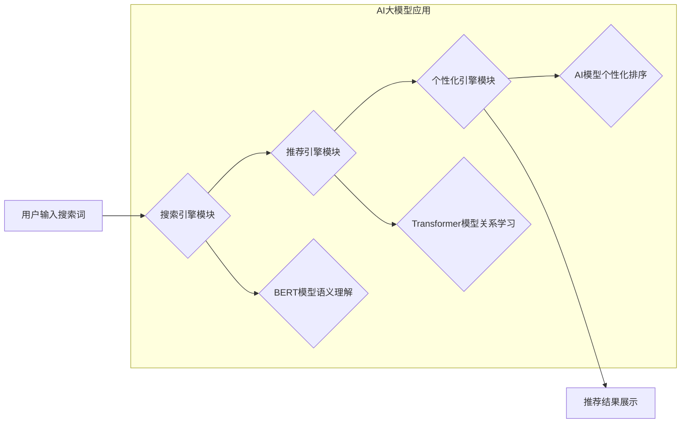

                 

## AI大模型赋能电商搜索推荐的用户满意度提升策略

> 关键词：AI大模型、电商搜索推荐、用户满意度、自然语言处理、深度学习、推荐算法、个性化推荐

## 1. 背景介绍

随着电商行业的蓬勃发展，搜索推荐系统已成为电商平台的核心竞争力之一。用户在电商平台上购物时，往往会依赖搜索引擎和推荐系统来快速找到心仪商品。传统的搜索推荐系统主要依赖于商品关键词匹配、用户浏览历史和购买记录等规则，难以满足用户日益增长的个性化需求。

近年来，深度学习技术的发展为电商搜索推荐带来了新的机遇。AI大模型，特别是基于Transformer架构的模型，凭借其强大的语义理解和文本生成能力，在电商搜索推荐领域展现出巨大的潜力。AI大模型可以学习用户行为、商品特征和市场趋势等复杂关系，为用户提供更精准、更个性化的商品推荐，从而提升用户满意度。

## 2. 核心概念与联系

### 2.1  电商搜索推荐系统

电商搜索推荐系统旨在帮助用户快速找到所需商品，并根据用户的兴趣和偏好提供个性化的商品推荐。系统通常由以下几个模块组成：

* **搜索引擎模块:** 处理用户搜索词，并返回与搜索词相关的商品列表。
* **推荐引擎模块:** 基于用户行为、商品特征和市场趋势等数据，为用户推荐相关商品。
* **个性化引擎模块:** 根据用户的个人信息、浏览历史、购买记录等数据，对推荐结果进行个性化排序和过滤。
* **展示引擎模块:** 将推荐结果以用户友好的方式展示给用户。

### 2.2  AI大模型

AI大模型是指在海量数据上训练的深度学习模型，具有强大的泛化能力和学习能力。常见的AI大模型架构包括Transformer、BERT、GPT等。

* **Transformer:**  一种基于注意力机制的深度学习架构，能够有效处理长文本序列，在自然语言处理任务中取得了突破性进展。
* **BERT:**  一种基于Transformer架构的预训练语言模型，能够理解上下文信息，在文本分类、问答等任务中表现出色。
* **GPT:**  一种基于Transformer架构的文本生成模型，能够生成流畅、自然的文本，在机器翻译、文本摘要等任务中展现出强大的能力。

### 2.3  AI大模型赋能电商搜索推荐

AI大模型可以应用于电商搜索推荐系统的各个模块，提升系统的性能和用户体验。

* **搜索引擎模块:**  利用BERT等预训练语言模型对用户搜索词进行语义理解，提高搜索结果的准确性和相关性。
* **推荐引擎模块:**  利用Transformer等模型学习用户行为、商品特征和市场趋势等复杂关系，为用户提供更精准、更个性化的商品推荐。
* **个性化引擎模块:**  利用AI大模型分析用户的兴趣偏好，对推荐结果进行个性化排序和过滤，提升用户满意度。

**Mermaid 流程图**



## 3. 核心算法原理 & 具体操作步骤

### 3.1  算法原理概述

AI大模型赋能电商搜索推荐的核心算法原理是基于深度学习的推荐算法，主要包括以下几个方面：

* **用户画像构建:** 利用AI模型分析用户的行为数据，构建用户的兴趣偏好、购买习惯等特征，形成用户画像。
* **商品特征提取:** 利用AI模型分析商品的描述信息、图片、评论等数据，提取商品的特征，例如商品类别、品牌、价格、属性等。
* **关系学习:** 利用AI模型学习用户和商品之间的关系，例如用户对商品的评分、购买记录、浏览历史等，构建用户-商品交互网络。
* **推荐策略:** 根据用户画像、商品特征和关系学习结果，采用不同的推荐策略，例如基于协同过滤、基于内容过滤、基于深度学习等，为用户推荐相关商品。

### 3.2  算法步骤详解

1. **数据预处理:** 收集用户行为数据、商品信息数据等，进行清洗、转换、编码等预处理操作，以便于模型训练。
2. **模型训练:** 选择合适的深度学习模型，例如Transformer、BERT等，并利用预处理后的数据进行模型训练。
3. **模型评估:** 利用测试数据对模型进行评估，评估模型的推荐准确率、召回率、覆盖率等指标。
4. **模型调优:** 根据模型评估结果，调整模型参数、训练策略等，优化模型性能。
5. **推荐系统部署:** 将训练好的模型部署到线上环境，为用户提供实时商品推荐服务。

### 3.3  算法优缺点

**优点:**

* **精准度高:** AI大模型能够学习用户行为和商品特征之间的复杂关系，为用户提供更精准的商品推荐。
* **个性化强:** AI大模型可以根据用户的个人信息、浏览历史、购买记录等数据，对推荐结果进行个性化排序和过滤，提升用户体验。
* **可扩展性强:** AI大模型可以根据需要扩展模型规模和训练数据，提升模型性能。

**缺点:**

* **训练成本高:** AI大模型的训练需要大量的计算资源和时间，训练成本较高。
* **数据依赖性强:** AI大模型的性能依赖于训练数据的质量和数量，数据质量差或数据量不足会导致模型性能下降。
* **解释性差:** AI大模型的决策过程较为复杂，难以解释模型的推荐结果，这可能会导致用户对推荐结果的信任度降低。

### 3.4  算法应用领域

AI大模型赋能电商搜索推荐的算法应用领域广泛，包括：

* **商品推荐:** 为用户推荐相关商品，例如基于用户的浏览历史、购买记录、兴趣偏好等数据进行推荐。
* **搜索结果排序:** 根据用户的搜索词和历史行为数据，对搜索结果进行排序，提升搜索结果的准确性和相关性。
* **个性化营销:** 根据用户的画像信息，进行个性化的营销推广，例如推送个性化的优惠券、广告等。
* **新品推荐:** 为用户推荐平台上的新品，例如根据用户的兴趣偏好和购买历史推荐新品。

## 4. 数学模型和公式 & 详细讲解 & 举例说明

### 4.1  数学模型构建

在电商搜索推荐系统中，常用的数学模型包括协同过滤模型、内容过滤模型和深度学习模型。

* **协同过滤模型:** 基于用户的行为数据，预测用户对商品的评分或购买意愿。常用的协同过滤算法包括基于用户的协同过滤和基于物品的协同过滤。
* **内容过滤模型:** 基于商品的特征信息，预测用户对商品的兴趣。常用的内容过滤算法包括基于关键词匹配、基于向量空间模型等。
* **深度学习模型:** 利用深度神经网络学习用户行为、商品特征和市场趋势等复杂关系，进行商品推荐。常用的深度学习模型包括Transformer、BERT、GPT等。

### 4.2  公式推导过程

**协同过滤模型的公式推导:**

假设用户 $u$ 对商品 $i$ 的评分为 $r_{ui}$，则协同过滤模型的目标是预测用户 $u$ 对商品 $i$ 的评分。

基于用户的协同过滤模型的公式如下:

$$
\hat{r}_{ui} = \bar{r}_u + \frac{\sum_{j \in N(u)} (r_{uj} - \bar{r}_u) \cdot sim(u, j)}{\sum_{j \in N(u)} sim(u, j)}
$$

其中:

* $\hat{r}_{ui}$ 是预测的用户 $u$ 对商品 $i$ 的评分。
* $\bar{r}_u$ 是用户 $u$ 的平均评分。
* $N(u)$ 是与用户 $u$ 相似的用户集合。
* $sim(u, j)$ 是用户 $u$ 和用户 $j$ 之间的相似度。

**内容过滤模型的公式推导:**

假设商品 $i$ 的特征向量为 $x_i$，用户 $u$ 的兴趣向量为 $y_u$，则内容过滤模型的目标是计算用户 $u$ 对商品 $i$ 的兴趣度。

常用的内容过滤模型是基于余弦相似度的模型，其公式如下:

$$
sim(u, i) = \frac{x_i \cdot y_u}{||x_i|| ||y_u||}
$$

其中:

* $sim(u, i)$ 是用户 $u$ 对商品 $i$ 的兴趣度。
* $x_i$ 是商品 $i$ 的特征向量。
* $y_u$ 是用户 $u$ 的兴趣向量。
* $||x_i||$ 和 $||y_u||$ 分别是商品 $i$ 和用户 $u$ 的特征向量的长度。

### 4.3  案例分析与讲解

**案例:** 假设有一个电商平台，用户 $A$ 购买了商品 $X$ 和 $Y$，用户 $B$ 购买了商品 $Y$ 和 $Z$。

* **协同过滤模型:** 可以根据用户 $A$ 和 $B$ 的购买记录，预测用户 $A$ 对商品 $Z$ 的兴趣度。
* **内容过滤模型:** 如果商品 $X$、$Y$ 和 $Z$ 的特征向量已知，可以根据用户 $A$ 的兴趣向量，预测用户 $A$ 对商品 $Z$ 的兴趣度。

## 5. 项目实践：代码实例和详细解释说明

### 5.1  开发环境搭建

* **操作系统:** Ubuntu 20.04 LTS
* **Python版本:** Python 3.8
* **深度学习框架:** TensorFlow 2.x
* **其他依赖库:** numpy, pandas, matplotlib等

### 5.2  源代码详细实现

```python
import tensorflow as tf
from tensorflow.keras.layers import Embedding, Dense, Flatten
from tensorflow.keras.models import Sequential

# 定义用户-商品交互矩阵
user_item_matrix = tf.constant([
    [1, 0, 1, 0],
    [0, 1, 1, 1],
    [1, 1, 0, 0],
    [0, 0, 1, 1]
])

# 定义用户和商品的embedding维度
embedding_dim = 10

# 创建用户和商品的embedding层
user_embedding = Embedding(input_dim=user_item_matrix.shape[0], output_dim=embedding_dim)
item_embedding = Embedding(input_dim=user_item_matrix.shape[1], output_dim=embedding_dim)

# 创建模型
model = Sequential()
model.add(user_embedding)
model.add(item_embedding)
model.add(Flatten())
model.add(Dense(1, activation='sigmoid'))

# 编译模型
model.compile(optimizer='adam', loss='binary_crossentropy', metrics=['accuracy'])

# 训练模型
model.fit(user_item_matrix, user_item_matrix, epochs=10)

# 预测用户对商品的评分
predictions = model.predict(user_item_matrix)

# 打印预测结果
print(predictions)
```

### 5.3  代码解读与分析

* 代码首先定义了用户-商品交互矩阵，表示用户对商品的评分。
* 然后创建了用户和商品的embedding层，将用户和商品映射到低维向量空间。
* 接着创建了一个深度学习模型，包含embedding层、flatten层和dense层。
* 模型使用adam优化器、binary_crossentropy损失函数和accuracy指标进行训练。
* 训练完成后，模型可以用来预测用户对商品的评分。

### 5.4  运行结果展示

运行代码后，会输出预测的用户对商品的评分结果。

## 6. 实际应用场景

### 6.1  电商平台商品推荐

AI大模型可以为电商平台用户提供个性化的商品推荐，例如根据用户的浏览历史、购买记录、兴趣偏好等数据，推荐用户可能感兴趣的商品。

### 6.2  搜索引擎结果排序

AI大模型可以分析用户的搜索词和历史行为数据，对搜索结果进行排序，提升搜索结果的准确性和相关性。

### 6.3  个性化营销

AI大模型可以根据用户的画像信息，进行个性化的营销推广，例如推送个性化的优惠券、广告等。

### 6.4  未来应用展望

AI大模型在电商搜索推荐领域的应用前景广阔，未来可能应用于以下场景:

* **多模态推荐:**  结合文本、图片、视频等多模态数据进行商品推荐，提升推荐的准确性和个性化程度。
* **实时推荐:**  利用实时数据流，进行动态的商品推荐，例如根据用户的实时行为数据，推荐相关的商品。
* **跨平台推荐:**  将用户行为数据整合到多个平台，进行跨平台的商品推荐，例如将电商平台的用户行为数据与社交平台的用户行为数据整合，进行更精准的商品推荐。

## 7. 工具和资源推荐

### 7.1  学习资源推荐

* **书籍:**
    * Deep Learning by Ian Goodfellow, Yoshua Bengio, and Aaron Courville
    * Natural Language Processing with Python by Steven Bird, Ewan Klein, and Edward Loper
* **在线课程:**
    * TensorFlow Tutorials: https://www.tensorflow.org/tutorials
    * Deep Learning Specialization by Andrew Ng: https://www.deeplearning.ai/

### 7.2  开发工具推荐

* **深度学习框架:** TensorFlow, PyTorch, Keras
* **数据处理工具:** Pandas, NumPy
* **可视化工具:** Matplotlib, Seaborn

### 7.3  相关论文推荐

* Attention Is All You Need (Vaswani et al., 2017)
* BERT: Pre-training of Deep Bidirectional Transformers for Language Understanding (Devlin et al., 2018)
* Transformer-XL: Attentive Language Modeling Beyond Millions of Tokens (Dai et al., 2019)

## 8. 总结：未来发展趋势与挑战

### 8.1  研究成果总结

AI大模型赋能电商搜索推荐取得了显著的成果，例如推荐准确率、用户满意度等指标得到提升。

### 8.2  未来发展趋势

* **模型规模和复杂度提升:** 未来AI大模型的规模和复杂度将进一步提升，例如使用更大的数据集、更深的网络结构等，提升模型的性能。
* **多模态融合:** 未来AI大模型将更加注重多模态数据的融合，例如结合文本、图片、视频等数据进行商品推荐，提升推荐的准确性和个性化程度。
* **解释性增强:** 未来AI大模型的解释性将得到加强，例如使用可解释机器学习方法，解释模型的推荐结果，提升用户对推荐结果的信任度。

### 8.3  面临的挑战

* **数据质量和隐私问题:** AI大模型的训练需要大量的优质数据，而数据质量和隐私问题是需要解决的挑战。
* **模型训练成本:** AI大模型的训练成本较高，需要大量的计算资源和时间，如何降低训练成本是需要解决的挑战。
* **模型解释性:** AI大模型的决策过程较为复杂，难以解释模型的推荐结果，如何提升模型的解释性是需要解决的挑战。

### 8.4  研究展望

未来，AI大模型在电商搜索推荐领域将继续发挥重要作用，并不断发展和完善。


## 9. 附录：常见问题与解答

**Q1: AI大模型的训练需要多少数据？**

A1: AI大模型的训练数据量取决于模型的规模和复杂度。一般来说，需要大量的训练数据，例如数十亿甚至上百亿条数据。

**Q2: 如何评估AI大模型的性能？**

A2: AI大模型的性能可以评估指标包括推荐准确率、召回率、覆盖率、点击率、转化率等。

**Q3: 如何解决AI大模型的解释性问题？**

A3: 可以使用可解释机器学习方法，例如LIME、SHAP等，解释模型的推荐结果。

**作者：禅与计算机程序设计艺术 / Zen and the Art of Computer Programming**


<end_of_turn>

