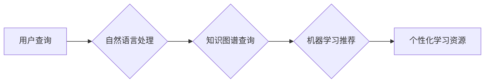

                 

## AI搜索引擎在教育领域的应用前景

> 关键词：人工智能、搜索引擎、教育、学习、个性化、知识图谱、自然语言处理

## 1. 背景介绍

教育领域一直致力于提升学习效率和体验，而人工智能（AI）技术的快速发展为教育带来了前所未有的机遇。AI搜索引擎作为一种新兴技术，凭借其强大的信息处理能力和智能化学习推荐功能，在教育领域展现出广阔的应用前景。

传统的搜索引擎主要依靠关键词匹配来检索信息，但教育场景需要更深入的理解和分析用户学习需求。AI搜索引擎通过自然语言处理（NLP）、机器学习（ML）等技术，能够理解用户的意图，提供更精准、更相关的学习资源。

## 2. 核心概念与联系

**2.1 核心概念**

* **AI搜索引擎:** 基于人工智能技术的搜索引擎，能够理解用户自然语言查询，并根据用户的学习目标、知识水平、学习风格等因素，提供个性化学习资源推荐。
* **知识图谱:**  一种结构化的知识表示形式，将知识点和它们之间的关系以图的形式表示，能够帮助AI搜索引擎理解知识之间的关联性，提供更深入的学习内容。
* **自然语言处理 (NLP):**  使计算机能够理解、处理和生成人类语言的技术，在AI搜索引擎中用于理解用户的查询意图，以及对学习资源进行文本分析和语义理解。
* **机器学习 (ML):**  一种人工智能技术，通过训练模型学习数据中的模式，能够根据用户的学习行为和偏好，推荐更符合其需求的学习资源。

**2.2 架构图**



**2.3 联系**

AI搜索引擎将上述核心概念有机结合，实现以下功能：

* **理解用户需求:**  通过NLP技术，AI搜索引擎能够理解用户的自然语言查询，识别用户的学习目标、知识水平和学习风格等信息。
* **精准检索学习资源:**  基于知识图谱，AI搜索引擎能够对学习资源进行语义分析，找到与用户需求最相关的资源。
* **个性化学习推荐:**  通过机器学习算法，AI搜索引擎能够根据用户的学习行为和偏好，推荐个性化的学习资源，提高学习效率和兴趣。

## 3. 核心算法原理 & 具体操作步骤

**3.1 算法原理概述**

AI搜索引擎的核心算法主要包括：

* **信息检索算法:**  用于从海量学习资源中检索与用户查询相关的文档。常见的算法包括TF-IDF、BM25等。
* **自然语言处理算法:**  用于理解用户的自然语言查询，提取关键词、识别意图等。常见的算法包括词性标注、依存句法分析、语义角色标注等。
* **机器学习算法:**  用于根据用户的学习行为和偏好，推荐个性化的学习资源。常见的算法包括协同过滤、内容过滤、混合推荐等。

**3.2 算法步骤详解**

1. **用户查询:** 用户输入自然语言查询。
2. **预处理:** 对用户查询进行预处理，例如去除停用词、词干提取等。
3. **关键词提取:** 使用NLP算法提取用户查询中的关键词。
4. **信息检索:** 使用信息检索算法从学习资源库中检索与关键词相关的文档。
5. **语义分析:** 使用NLP算法对检索到的文档进行语义分析，理解文档内容。
6. **知识图谱查询:**  根据文档内容，查询知识图谱，获取相关知识点和关系。
7. **个性化推荐:** 使用机器学习算法，根据用户的学习行为、偏好和知识图谱信息，推荐个性化的学习资源。
8. **结果展示:** 将推荐的学习资源以列表、卡片等形式展示给用户。

**3.3 算法优缺点**

**优点:**

* **精准度高:**  通过NLP和知识图谱技术，能够理解用户的真实需求，提供更精准的学习资源推荐。
* **个性化强:**  根据用户的学习行为和偏好，提供个性化的学习路径和资源推荐，提高学习效率和兴趣。
* **学习体验好:**  提供更智能、更便捷的学习体验，帮助用户更好地掌握知识。

**缺点:**

* **数据依赖:**  AI搜索引擎需要大量的数据进行训练，数据质量直接影响算法性能。
* **算法复杂:**  AI搜索引擎的算法比较复杂，需要专业的技术人员进行开发和维护。
* **伦理问题:**  AI搜索引擎的推荐结果可能存在偏差，需要关注算法公平性和伦理问题。

**3.4 算法应用领域**

* **在线教育平台:**  为学生提供个性化的学习资源推荐，提高学习效率和兴趣。
* **图书馆:**  帮助用户快速找到相关书籍和资料，提高图书馆资源利用率。
* **科研机构:**  帮助科研人员快速查找相关文献和数据，加速科研进度。

## 4. 数学模型和公式 & 详细讲解 & 举例说明

**4.1 数学模型构建**

AI搜索引擎的推荐系统通常采用基于用户的协同过滤算法，其核心数学模型可以表示为：

$$
r_{ui} = \alpha \cdot \sum_{j \in N(u)} \frac{s_{uj} \cdot s_{ij}}{\sqrt{\sum_{k \in N(u)} s_{uk}^2}} + \beta \cdot \sum_{k \in N(i)} \frac{s_{uk} \cdot s_{ki}}{\sqrt{\sum_{l \in N(i)} s_{lk}^2}}
$$

其中：

* $r_{ui}$ 表示用户 $u$ 对物品 $i$ 的评分或偏好度。
* $s_{uj}$ 表示用户 $u$ 对物品 $j$ 的评分或偏好度。
* $N(u)$ 表示与用户 $u$ 相似的用户集合。
* $N(i)$ 表示与物品 $i$ 相似的物品集合。
* $\alpha$ 和 $\beta$ 是权重参数，用于平衡基于用户的协同过滤和基于物品的协同过滤。

**4.2 公式推导过程**

该公式基于以下假设：

* 用户对相似物品的评分相似。
* 物品对相似用户的评分相似。

通过计算用户与其他用户之间的相似度，以及物品与其他物品之间的相似度，可以预测用户对特定物品的评分或偏好度。

**4.3 案例分析与讲解**

假设有一个在线教育平台，用户 $u$ 对数学课程感兴趣，平台根据用户的学习行为和偏好，推荐了以下课程：

* 课程 $i$:  高等代数
* 课程 $j$:  微积分
* 课程 $k$:  线性代数

平台使用协同过滤算法，计算用户 $u$ 与其他用户之间的相似度，以及课程 $i$、$j$、$k$ 与其他课程之间的相似度。

根据计算结果，平台发现用户 $u$ 与其他对数学课程感兴趣的用户相似，并且课程 $i$、$j$、$k$ 与其他数学课程相似。

因此，平台可以预测用户 $u$ 对课程 $i$、$j$、$k$ 的评分或偏好度，并根据预测结果推荐这些课程给用户 $u$。

## 5. 项目实践：代码实例和详细解释说明

**5.1 开发环境搭建**

* 操作系统: Ubuntu 20.04
* Python 版本: 3.8
* 必要的库:  NLTK, SpaCy, scikit-learn, TensorFlow/PyTorch

**5.2 源代码详细实现**

```python
# 导入必要的库
import nltk
import spacy
from sklearn.feature_extraction.text import TfidfVectorizer
from sklearn.metrics.pairwise import cosine_similarity

# 下载 NLTK 数据
nltk.download('punkt')
nltk.download('stopwords')

# 加载 SpaCy 模型
nlp = spacy.load("en_core_web_sm")

# 定义函数：预处理文本
def preprocess_text(text):
    # 分词
    tokens = nltk.word_tokenize(text)
    # 去除停用词
    stop_words = nltk.corpus.stopwords.words('english')
    tokens = [token for token in tokens if token not in stop_words]
    # 词干提取
    stemmer = nltk.PorterStemmer()
    tokens = [stemmer.stem(token) for token in tokens]
    return " ".join(tokens)

# 定义函数：计算文本相似度
def calculate_similarity(text1, text2):
    # 使用 TF-IDF 向量化文本
    vectorizer = TfidfVectorizer()
    tfidf_matrix = vectorizer.fit_transform([text1, text2])
    # 计算余弦相似度
    similarity = cosine_similarity(tfidf_matrix[0], tfidf_matrix[1])[0][0]
    return similarity

# 示例代码
text1 = "机器学习是一种人工智能技术"
text2 = "深度学习是机器学习的一种子集"

# 预处理文本
text1 = preprocess_text(text1)
text2 = preprocess_text(text2)

# 计算文本相似度
similarity = calculate_similarity(text1, text2)

# 打印结果
print(f"文本相似度: {similarity}")
```

**5.3 代码解读与分析**

* 该代码首先导入必要的库，并下载 NLTK 数据。
* 然后，加载 SpaCy 模型，并定义两个函数：`preprocess_text` 和 `calculate_similarity`。
* `preprocess_text` 函数用于预处理文本，包括分词、去除停用词和词干提取。
* `calculate_similarity` 函数用于计算文本相似度，使用 TF-IDF 向量化文本，并计算余弦相似度。
* 最后，示例代码演示了如何使用这两个函数计算两个文本的相似度。

**5.4 运行结果展示**

运行该代码后，会输出两个文本的相似度值，该值介于 0 和 1 之间，值越大表示两个文本越相似。

## 6. 实际应用场景

**6.1 个性化学习路径推荐**

AI搜索引擎可以根据用户的学习目标、知识水平、学习风格等信息，推荐个性化的学习路径，帮助用户更有效地掌握知识。

**6.2 智能化知识问答**

AI搜索引擎可以理解用户的自然语言问题，并从知识图谱中获取相关答案，提供智能化的知识问答服务。

**6.3 自动化学习资源生成**

AI搜索引擎可以根据用户的学习需求，自动生成学习资源，例如学习笔记、习题、练习题等，提高学习效率。

**6.4 跨学科知识关联**

AI搜索引擎可以帮助用户发现不同学科之间的知识关联，拓宽学习视野，促进跨学科学习。

**6.5 未来应用展望**

随着人工智能技术的不断发展，AI搜索引擎在教育领域的应用前景更加广阔。未来，AI搜索引擎可能具备以下功能：

* 更精准的学习需求识别
* 更个性化的学习资源推荐
* 更智能化的学习辅导
* 更丰富的学习体验

## 7. 工具和资源推荐

**7.1 学习资源推荐**

* **Stanford NLP Group:** https://nlp.stanford.edu/
* **OpenAI:** https://openai.com/
* **DeepMind:** https://deepmind.com/

**7.2 开发工具推荐**

* **TensorFlow:** https://www.tensorflow.org/
* **PyTorch:** https://pytorch.org/
* **SpaCy:** https://spacy.io/

**7.3 相关论文推荐**

* **BERT: Pre-training of Deep Bidirectional Transformers for Language Understanding**
* **Attention Is All You Need**
* **Knowledge Graph Embedding: A Survey**

## 8. 总结：未来发展趋势与挑战

**8.1 研究成果总结**

AI搜索引擎在教育领域的应用取得了显著成果，能够提供更精准、更个性化的学习体验，提高学习效率和兴趣。

**8.2 未来发展趋势**

未来，AI搜索引擎将朝着以下方向发展：

* **更深入的理解用户需求:**  利用更先进的NLP技术，更深入地理解用户的学习目标、知识水平和学习风格。
* **更个性化的学习推荐:**  根据用户的学习行为和偏好，提供更个性化的学习路径和资源推荐。
* **更智能化的学习辅导:**  提供更智能化的学习辅导，例如自动生成学习计划、提供个性化反馈等。
* **更丰富的学习体验:**  利用VR/AR等技术，提供更丰富的学习体验。

**8.3 面临的挑战**

AI搜索引擎在教育领域的应用也面临一些挑战：

* **数据质量问题:**  AI搜索引擎需要大量的数据进行训练，数据质量直接影响算法性能。
* **算法公平性问题:**  AI搜索引擎的推荐结果可能存在偏差，需要关注算法公平性和伦理问题。
* **隐私安全问题:**  AI搜索引擎需要收集用户的学习数据，需要保障用户的隐私安全。

**8.4 研究展望**

未来，需要进一步研究以下问题：

* 如何提高AI搜索引擎对用户需求的理解能力？
* 如何构建更公平、更透明的AI搜索引擎算法？
* 如何保障用户隐私安全？


## 9. 附录：常见问题与解答

**9.1 如何评估AI搜索引擎的性能？**

AI搜索引擎的性能可以评估以下指标：

* **准确率:**  推荐的学习资源与用户的真实需求的匹配程度。
* **召回率:**  推荐的学习资源覆盖了用户所有真实需求的比例。
* **覆盖率:**  推荐的学习资源种类和数量的丰富程度。
* **用户满意度:**  用户对AI搜索引擎推荐结果的满意程度。

**9.2 AI搜索引擎会取代传统教师吗？**

AI搜索引擎可以辅助教师，提高教学效率和质量，但不会取代传统教师。教师仍然是教育的核心，需要提供情感支持、个性化指导和批判性思维培养等方面的服务。

**9.3 AI搜索引擎的伦理问题有哪些？**

AI搜索引擎的伦理问题主要包括：

* **算法偏见:**  AI搜索引擎的推荐结果可能存在算法偏见，导致某些用户获得不公平的待遇。
* **数据隐私:**  AI搜索引擎需要收集用户的学习数据，需要保障用户的隐私安全。
* **信息操控:**  AI搜索引擎可以被用于操控用户的学习行为，需要防止其被滥用。


作者：禅与计算机程序设计艺术 / Zen and the Art of Computer Programming<end_of_turn>

