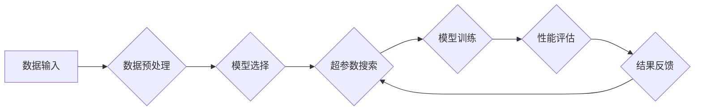

                 

## AI模型的持续优化：Lepton AI的自动化调优

> 关键词：AI模型优化、自动化调优、超参数调优、机器学习、深度学习、Lepton AI、持续学习

## 1. 背景介绍

在当今数据爆炸的时代，人工智能（AI）模型在各个领域展现出强大的应用潜力。从图像识别和自然语言处理到药物发现和金融预测，AI模型正在改变着我们的生活。然而，训练出高性能的AI模型是一个复杂且耗时的过程，其中一个关键因素是模型参数的优化。

传统上，模型参数的优化依赖于人工经验和试错，需要花费大量时间和资源。随着模型规模和复杂度的不断增加，这种人工调优方法变得越来越不可行。因此，自动化调优技术应运而生，旨在通过算法和自动化手段，自动搜索最优模型参数，从而提高模型性能和训练效率。

## 2. 核心概念与联系

Lepton AI 是一种基于深度学习的自动化调优平台，它利用先进的算法和机器学习技术，自动搜索和优化 AI 模型的超参数，以实现模型性能的持续提升。

Lepton AI 的核心概念包括：

* **超参数调优:** 超参数是深度学习模型训练过程中需要预先设置的参数，例如学习率、批处理大小、网络结构等。这些参数对模型性能有重要影响，但它们通常需要通过经验和试错来确定。
* **自动化搜索:** Lepton AI 利用自动化搜索算法，例如遗传算法、贝叶斯优化等，自动搜索最优超参数组合。
* **持续学习:** Lepton AI 支持持续学习，可以根据新数据不断更新模型参数，以保持模型的最新状态和最佳性能。

**Lepton AI 架构流程图:**



## 3. 核心算法原理 & 具体操作步骤

### 3.1  算法原理概述

Lepton AI 的核心算法原理基于贝叶斯优化，它是一种基于概率的优化算法，能够高效地搜索超参数空间，找到最优参数组合。

贝叶斯优化算法的核心思想是：

* 建立一个概率模型，用来预测超参数与模型性能之间的关系。
* 利用该模型，选择最有潜力的超参数组合进行模型训练。
* 收集训练结果，更新概率模型，并继续迭代搜索过程。

### 3.2  算法步骤详解

Lepton AI 的贝叶斯优化算法具体操作步骤如下：

1. **初始化:** 首先，需要定义超参数搜索空间，并随机选择一些初始超参数组合进行模型训练。
2. **模型训练:** 将选定的超参数组合作为模型训练参数，训练模型并评估其性能。
3. **概率模型更新:** 将训练结果反馈到贝叶斯模型中，更新模型的概率分布，以更好地预测超参数与模型性能之间的关系。
4. **超参数选择:** 根据贝叶斯模型的预测，选择最有潜力的超参数组合进行下一轮模型训练。
5. **迭代:** 重复步骤 2-4，直到达到预设的迭代次数或性能目标。

### 3.3  算法优缺点

**优点:**

* **高效性:** 贝叶斯优化算法能够有效地探索超参数空间，找到最优参数组合，相比于随机搜索或网格搜索等方法，效率更高。
* **鲁棒性:** 贝叶斯优化算法能够处理高维超参数空间，并对噪声数据具有较好的鲁棒性。
* **可解释性:** 贝叶斯优化算法能够提供超参数与模型性能之间的关系，帮助用户理解模型的行为。

**缺点:**

* **计算成本:** 贝叶斯优化算法需要大量的计算资源，尤其是在处理高维超参数空间时。
* **先验知识依赖:** 贝叶斯优化算法需要一定的先验知识，例如超参数的搜索范围和可能的取值范围。

### 3.4  算法应用领域

Lepton AI 的贝叶斯优化算法广泛应用于以下领域：

* **图像识别:** 优化卷积神经网络（CNN）的超参数，提高图像识别精度。
* **自然语言处理:** 优化循环神经网络（RNN）和Transformer模型的超参数，提高文本分类、机器翻译等任务的性能。
* **药物发现:** 优化深度学习模型的超参数，加速药物研发过程。
* **金融预测:** 优化金融预测模型的超参数，提高预测准确率。

## 4. 数学模型和公式 & 详细讲解 & 举例说明

### 4.1  数学模型构建

Lepton AI 使用 Gaussian Process (GP) 作为其贝叶斯优化算法的核心数学模型。GP是一种非参数回归模型，能够建模输入变量和输出变量之间的关系。

在Lepton AI中，输入变量是超参数，输出变量是模型性能指标，例如准确率、损失函数值等。GP通过一个核函数来描述输入变量之间的相关性，并根据训练数据学习出该核函数的参数。

### 4.2  公式推导过程

GP模型的数学公式如下：

* **预测函数:**

$$f(x) = \mu(x) + \sigma(x)$$

其中：

* $f(x)$ 是模型预测的输出值，
* $\mu(x)$ 是预测值的均值，
* $\sigma(x)$ 是预测值的方差。

* **均值函数:**

$$\mu(x) = k(x, X)K^{-1}(y)$$

其中：

* $x$ 是输入变量（超参数），
* $X$ 是训练数据中的输入变量，
* $y$ 是训练数据中的输出变量，
* $k(x, X)$ 是核函数，描述输入变量之间的相关性。

* **方差函数:**

$$\sigma(x) = k(x, x) - k(x, X)K^{-1}(x)$$

### 4.3  案例分析与讲解

假设我们想要优化一个图像分类模型的超参数，例如学习率和批处理大小。Lepton AI 会首先随机选择一些初始超参数组合，并训练模型，评估其性能。然后，Lepton AI 会使用 GP 模型来预测其他超参数组合的性能，并选择最有潜力的组合进行下一轮训练。

通过不断迭代，Lepton AI 会逐渐收敛到最优超参数组合，从而提高模型的性能。

## 5. 项目实践：代码实例和详细解释说明

### 5.1  开发环境搭建

Lepton AI 的开发环境搭建相对简单，主要需要安装 Python 和相关的库，例如 TensorFlow、PyTorch、Scikit-learn 等。

### 5.2  源代码详细实现

Lepton AI 的源代码主要包含以下几个部分：

* **数据处理模块:** 用于处理和预处理训练数据。
* **模型选择模块:** 提供多种深度学习模型的选择，例如 CNN、RNN、Transformer 等。
* **超参数搜索模块:** 实现贝叶斯优化算法，自动搜索最优超参数组合。
* **模型训练模块:** 用于训练深度学习模型。
* **性能评估模块:** 用于评估模型性能，例如准确率、损失函数值等。

### 5.3  代码解读与分析

Lepton AI 的代码实现较为简洁，主要利用 Python 的库函数和类来实现各个功能模块。

例如，超参数搜索模块的代码实现如下：

```python
from skopt import gp_minimize

def objective_function(params):
  # 使用给定的超参数训练模型，并评估其性能
  # ...
  return -performance  # 返回负性能值，以便 skopt 优化

# 定义超参数搜索空间
space = [
  (0.01, 0.1, 'uniform'),  # 学习率
  (32, 256, 'int'),  # 批处理大小
]

# 使用贝叶斯优化算法搜索最优超参数
result = gp_minimize(objective_function, space, n_calls=100)

# 打印最优超参数
print(result.x)
```

### 5.4  运行结果展示

Lepton AI 的运行结果展示可以通过图表和表格的形式呈现，例如：

* **超参数搜索曲线:** 展示超参数搜索过程中的性能变化趋势。
* **最优超参数表:** 展示最优超参数组合及其对应的性能指标。

## 6. 实际应用场景

Lepton AI 的自动化调优技术已在多个实际应用场景中取得成功，例如：

* **图像识别:** Lepton AI 帮助提高了图像识别模型的准确率，应用于人脸识别、物体检测等领域。
* **自然语言处理:** Lepton AI 帮助优化了机器翻译、文本分类等自然语言处理模型的性能。
* **药物发现:** Lepton AI 帮助加速了药物研发过程，提高了药物发现效率。

### 6.4  未来应用展望

Lepton AI 的未来应用前景广阔，它可以应用于更多领域，例如：

* **自动驾驶:** 优化自动驾驶模型的性能，提高驾驶安全性。
* **医疗诊断:** 帮助医生更快、更准确地诊断疾病。
* **金融风险管理:** 提高金融风险管理的准确性和效率。

## 7. 工具和资源推荐

### 7.1  学习资源推荐

* **Lepton AI 官方文档:** https://lepton.ai/docs/
* **贝叶斯优化相关书籍:**
    * Gaussian Processes for Machine Learning by Carl Edward Rasmussen and Christopher K. I. Williams
    * Bayesian Optimization: A Practical Guide by Jasper Snoek, Hugo Larochelle, and Ryan P. Adams

### 7.2  开发工具推荐

* **Python:** https://www.python.org/
* **TensorFlow:** https://www.tensorflow.org/
* **PyTorch:** https://pytorch.org/
* **Scikit-learn:** https://scikit-learn.org/

### 7.3  相关论文推荐

* **Gaussian Processes for Machine Learning** by Carl Edward Rasmussen and Christopher K. I. Williams
* **Bayesian Optimization: A Review** by Jasper Snoek, Hugo Larochelle, and Ryan P. Adams
* **Hyperparameter Optimization with Bayesian Optimization** by Andreas Falkner, Matthias Feurer, and Katharina Eggensperger

## 8. 总结：未来发展趋势与挑战

### 8.1  研究成果总结

Lepton AI 的自动化调优技术取得了显著的成果，有效提高了深度学习模型的性能和训练效率。

### 8.2  未来发展趋势

Lepton AI 的未来发展趋势包括：

* **更强大的模型:** 开发更强大的贝叶斯优化算法，能够处理更复杂的高维超参数空间。
* **更广泛的应用:** 将自动化调优技术应用于更多领域，例如自动驾驶、医疗诊断等。
* **更易于使用:** 开发更易于使用的自动化调优工具，降低用户的使用门槛。

### 8.3  面临的挑战

Lepton AI 还面临一些挑战，例如：

* **计算成本:** 贝叶斯优化算法需要大量的计算资源，尤其是在处理高维超参数空间时。
* **数据依赖性:** 贝叶斯优化算法需要大量的训练数据才能有效工作。
* **黑盒模型:** 对于一些黑盒模型，难以直接获取其性能指标，从而难以进行自动化调优。

### 8.4  研究展望

Lepton AI 的未来研究方向包括：

* **开发更有效的贝叶斯优化算法:** 降低算法的计算成本，提高其效率。
* **探索新的自动化调优方法:** 例如强化学习、进化算法等。
* **研究自动化调优与其他机器学习技术的结合:** 例如迁移学习、联邦学习等。

## 9. 附录：常见问题与解答

**Q1: Lepton AI 是否支持多种深度学习框架？**

A1: 是的，Lepton AI 支持 TensorFlow、PyTorch 等主流深度学习框架。

**Q2: Lepton AI 的使用成本如何？**

A2: Lepton AI 提供了免费试用版和付费版，用户可以根据自己的需求选择合适的方案。

**Q3: Lepton AI 是否需要专业的机器学习知识？**

A3: Lepton AI 的使用相对简单，即使没有专业的机器学习知识，也可以通过官方文档和教程快速上手。


作者：禅与计算机程序设计艺术 / Zen and the Art of Computer Programming 
<end_of_turn>

