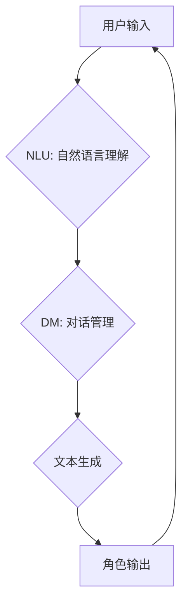

                 

## AI角色对话系统：创造生动的人物互动

> 关键词：人工智能、对话系统、角色扮演、自然语言处理、深度学习、文本生成、交互体验

### 1. 背景介绍

近年来，人工智能技术飞速发展，特别是自然语言处理（NLP）领域取得了突破性进展。对话系统作为人工智能的重要应用之一，已逐渐从简单的问答机器人演变为更智能、更具交互性的虚拟助手。而角色对话系统则将对话系统应用于更具创意和沉浸感的场景，通过赋予虚拟角色个性、背景和目标，创造出更加生动、富有魅力的人物互动体验。

角色对话系统在多个领域具有广泛的应用前景，例如：

* **游戏娱乐:**  为游戏玩家提供更逼真的角色互动体验，增强游戏代入感和趣味性。
* **教育培训:**  通过角色扮演的方式，帮助学生更好地理解和掌握知识，提高学习兴趣和效果。
* **艺术创作:**  为文学、戏剧、电影等艺术创作提供新的创作工具，创造出更具深度和感染力的作品。
* **心理咨询:**  为用户提供虚拟角色陪伴和情感支持，帮助用户缓解压力和焦虑。

### 2. 核心概念与联系

角色对话系统本质上是一个复杂的交互系统，它需要融合多个人工智能技术，包括自然语言理解（NLU）、对话管理（DM）、文本生成（Text Generation）等。

**2.1  核心概念**

* **角色:**  虚拟角色是对话系统的核心要素，它拥有独特的个性、背景、目标和行为模式。角色的设定需要考虑其年龄、性别、职业、爱好、价值观等多方面因素，以使其更加真实和可信。
* **对话:**  对话是角色之间进行交互的媒介，它需要遵循一定的语法规则和语义逻辑，以确保对话的流畅性和合理性。
* **上下文:**  上下文是指对话过程中积累的信息和状态，它帮助系统理解对话的语境，并做出更准确的回应。

**2.2  架构图**



### 3. 核心算法原理 & 具体操作步骤

**3.1  算法原理概述**

角色对话系统的核心算法主要包括自然语言理解、对话管理和文本生成三个部分。

* **自然语言理解 (NLU):**  NLU 算法负责将用户的自然语言输入转换为机器可理解的格式，例如实体识别、意图识别、情感分析等。
* **对话管理 (DM):**  DM 算法负责管理对话流程，根据用户的输入和对话上下文，选择合适的回复策略，并控制对话的走向。
* **文本生成 (Text Generation):**  文本生成算法负责根据对话上下文和角色设定，生成自然流畅的文本回复。

**3.2  算法步骤详解**

1. **用户输入:** 用户向角色对话系统发送文本输入。
2. **自然语言理解:** NLU 算法对用户的输入进行分析，识别出其中的实体、意图和情感等信息。
3. **对话状态跟踪:** DM 算法根据用户的输入和对话历史，跟踪对话状态，并更新对话上下文。
4. **回复策略选择:** DM 算法根据对话状态和角色设定，选择合适的回复策略，例如提供信息、进行问答、表达情感等。
5. **文本生成:** 文本生成算法根据回复策略和对话上下文，生成自然流畅的文本回复。
6. **角色输出:** 角色对话系统将生成的文本回复发送给用户。

**3.3  算法优缺点**

* **优点:** 
    * 可以创造出更加生动、富有魅力的人物互动体验。
    * 能够提供个性化的对话服务，满足用户的不同需求。
    * 在教育、娱乐、艺术等领域具有广泛的应用前景。
* **缺点:** 
    * 算法复杂度高，需要大量的训练数据和计算资源。
    * 角色的个性化程度难以完全控制，可能出现不符合预期的情况。
    * 难以处理复杂的情感和社会规范，可能会产生不恰当的回复。

**3.4  算法应用领域**

* **游戏:**  为游戏角色赋予更丰富的个性和行为，增强玩家的沉浸感和互动体验。
* **教育:**  通过角色扮演的方式，帮助学生更好地理解和掌握知识，提高学习兴趣和效果。
* **客服:**  提供智能化的客服服务，帮助用户解决问题，提高客户满意度。
* **医疗:**  为患者提供虚拟角色陪伴和情感支持，帮助患者缓解压力和焦虑。

### 4. 数学模型和公式 & 详细讲解 & 举例说明

角色对话系统的核心算法中，文本生成部分通常采用基于深度学习的模型，例如循环神经网络（RNN）和 transformers。

**4.1  数学模型构建**

RNN 模型是一种能够处理序列数据的网络结构，它通过循环连接，将输入序列中的信息传递到下一时刻，从而学习序列的上下文关系。

**4.2  公式推导过程**

RNN 的核心公式是隐藏状态的更新公式：

$$h_t = f(W_{hh}h_{t-1} + W_{xh}x_t + b_h)$$

其中：

* $h_t$ 是当前时刻的隐藏状态。
* $h_{t-1}$ 是上一个时刻的隐藏状态。
* $x_t$ 是当前时刻的输入。
* $W_{hh}$ 和 $W_{xh}$ 是权重矩阵。
* $b_h$ 是偏置项。
* $f$ 是激活函数。

**4.3  案例分析与讲解**

假设我们有一个简单的 RNN 模型，用于生成英文句子。输入序列为 "The cat sat on the"，目标是预测下一个词。

RNN 模型会将每个词作为输入，并根据隐藏状态的更新，预测下一个词的概率分布。最终，模型会选择概率最高的词作为输出，例如 "mat"。

### 5. 项目实践：代码实例和详细解释说明

**5.1  开发环境搭建**

* Python 3.x
* TensorFlow 或 PyTorch 深度学习框架
* NLTK 自然语言处理库
* 其他必要的库和工具

**5.2  源代码详细实现**

```python
import tensorflow as tf

# 定义 RNN 模型
model = tf.keras.Sequential([
    tf.keras.layers.Embedding(input_dim=vocab_size, output_dim=embedding_dim),
    tf.keras.layers.LSTM(units=hidden_units),
    tf.keras.layers.Dense(units=vocab_size, activation='softmax')
])

# 编译模型
model.compile(optimizer='adam', loss='sparse_categorical_crossentropy', metrics=['accuracy'])

# 训练模型
model.fit(x_train, y_train, epochs=epochs)

# 生成文本
text = "The cat sat on"
for _ in range(max_length):
    prediction = model.predict(tf.expand_dims(text, 0))
    predicted_index = tf.argmax(prediction[0]).numpy()
    predicted_word = word_index[predicted_index]
    text += " " + predicted_word
```

**5.3  代码解读与分析**

* 代码首先定义了一个 RNN 模型，包含 Embedding 层、LSTM 层和 Dense 层。
* Embedding 层将词语转换为向量表示。
* LSTM 层学习序列的上下文关系。
* Dense 层将隐藏状态映射到词语概率分布。
* 模型使用 Adam 优化器、稀疏类别交叉熵损失函数和准确率作为评估指标进行训练。
* 训练完成后，可以使用模型生成文本。

**5.4  运行结果展示**

运行代码后，模型会根据输入文本生成后续的文本内容。例如，输入 "The cat sat on"，模型可能会生成 "The cat sat on the mat"。

### 6. 实际应用场景

**6.1  游戏开发**

角色对话系统可以为游戏角色赋予更丰富的个性和行为，增强玩家的沉浸感和互动体验。例如，在 RPG 游戏中，角色对话系统可以帮助玩家更好地了解游戏世界和角色背景，并与角色进行更深入的互动。

**6.2  教育培训**

角色对话系统可以为学生提供个性化的学习体验，帮助他们更好地理解和掌握知识。例如，在语言学习中，角色对话系统可以扮演不同的角色，与学生进行对话练习，帮助学生提高口语表达能力。

**6.3  虚拟助手**

角色对话系统可以为用户提供更智能化的虚拟助手服务，例如聊天机器人、智能客服等。角色对话系统可以根据用户的需求，提供个性化的回复和服务。

**6.4  未来应用展望**

随着人工智能技术的不断发展，角色对话系统将在更多领域得到应用，例如：

* **医疗保健:**  为患者提供虚拟角色陪伴和情感支持，帮助患者缓解压力和焦虑。
* **心理咨询:**  为用户提供虚拟角色咨询服务，帮助用户解决心理问题。
* **艺术创作:**  为文学、戏剧、电影等艺术创作提供新的创作工具，创造出更具深度和感染力的作品。

### 7. 工具和资源推荐

**7.1  学习资源推荐**

* **书籍:**
    * 《深度学习》 by Ian Goodfellow, Yoshua Bengio, and Aaron Courville
    * 《自然语言处理》 by Dan Jurafsky and James H. Martin
* **在线课程:**
    * Coursera: Natural Language Processing Specialization
    * Udacity: Deep Learning Nanodegree

**7.2  开发工具推荐**

* **TensorFlow:**  开源深度学习框架
* **PyTorch:**  开源深度学习框架
* **NLTK:**  自然语言处理库
* **spaCy:**  自然语言处理库

**7.3  相关论文推荐**

* **Attention Is All You Need** by Vaswani et al. (2017)
* **BERT: Pre-training of Deep Bidirectional Transformers for Language Understanding** by Devlin et al. (2018)
* **GPT-3: Language Models are Few-Shot Learners** by Brown et al. (2020)

### 8. 总结：未来发展趋势与挑战

**8.1  研究成果总结**

近年来，角色对话系统取得了显著进展，特别是深度学习技术的应用，使得角色对话系统能够生成更自然、更流畅的文本回复。

**8.2  未来发展趋势**

* **更强大的文本生成能力:**  未来角色对话系统将能够生成更长、更复杂的文本，并更好地理解和表达人类的情感和意图。
* **更个性化的角色体验:**  角色对话系统将能够根据用户的喜好和需求，创建更个性化的角色，提供更沉浸式的互动体验。
* **跨模态交互:**  角色对话系统将能够与其他模态，例如图像、音频、视频等进行交互，提供更丰富的互动体验。

**8.3  面临的挑战**

* **数据标注:**  训练高质量的角色对话系统需要大量的标注数据，这对于数据标注人员和资源提出了挑战。
* **伦理问题:**  角色对话系统可能会被用于生成虚假信息或进行恶意攻击，因此需要考虑其伦理问题。
* **可解释性:**  深度学习模型的决策过程难以解释，这对于角色对话系统的可靠性和安全性提出了挑战。

**8.4  研究展望**

未来研究将重点关注以下几个方面：

* 开发更有效的文本生成算法，提高角色对话系统的文本质量和多样性。
* 研究更有效的角色个性化方法，使角色对话系统能够更好地理解和表达用户的需求。
* 探索跨模态交互的新方法，为用户提供更丰富的互动体验。
* 研究角色对话系统的伦理问题，确保其安全和可控使用。


### 9. 附录：常见问题与解答

**9.1  如何训练一个角色对话系统？**

训练一个角色对话系统需要以下步骤：

1. 收集和预处理对话数据。
2. 选择合适的深度学习模型，例如 RNN 或 transformers。
3. 训练模型，使用交叉熵损失函数和 Adam 优化器。
4. 评估模型性能，使用准确率、BLEU 等指标。
5. 调节模型参数，提高模型性能。

**9.2  如何设计一个具有个性化的角色？**

设计一个具有个性化的角色需要考虑以下因素：

* 角色的背景故事和经历。
* 角色的性格特点和价值观。
* 角色的语言风格和表达方式。
* 角色的目标和动机。

**9.3  如何避免角色对话系统生成不恰当的回复？**

避免角色对话系统生成不恰当的回复需要采取以下措施：

* 使用高质量的训练数据，过滤掉包含不恰当内容的数据。
* 在训练过程中，使用正则化技术，防止模型过拟合。
* 开发一套规则和策略，引导角色对话系统生成合适的回复。
* 定期评估模型性能，并及时进行调整。

**9.4  角色对话系统有哪些伦理问题？**

角色对话系统可能存在以下伦理问题：

* 生成虚假信息或进行恶意攻击。
* 侵犯用户隐私。
* 造成用户误导或伤害。
* 导致社会分化和偏见。

**9.5  如何解决角色对话系统的伦理问题？**

解决角色对话系统的伦理问题需要多方面的努力：

* 制定相关的法律法规和伦理规范。
* 开发可解释的模型，提高模型透明度。
* 加强用户教育和引导，提高用户对角色对话系统的认识。
* 鼓励社会公众参与讨论，共同探讨解决方案。


作者：禅与计算机程序设计艺术 / Zen and the Art of Computer Programming<end_of_turn>

