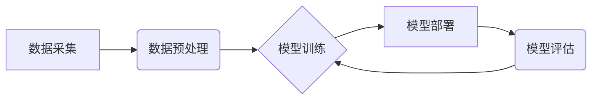

                 

## AI驱动的创新：人类计算在医疗行业的应用场景

> 关键词：人工智能、医疗保健、人类计算、机器学习、深度学习、自然语言处理、计算机视觉、诊断、预测

## 1. 背景介绍

医疗行业正处于一场由数据驱动和人工智能（AI）技术推动的变革浪潮之中。海量医疗数据、先进的计算能力和突破性的算法共同催生了AI在医疗领域的蓬勃发展。AI驱动的创新正在改变医疗保健的各个方面，从疾病诊断和治疗方案推荐到药物研发和患者管理。

传统医疗模式面临着诸多挑战，例如诊断效率低下、医疗资源分配不均、药物研发周期长等。AI技术凭借其强大的数据分析能力和模式识别能力，为解决这些挑战提供了新的思路和解决方案。

## 2. 核心概念与联系

**2.1 人类计算与AI**

人类计算是指人类利用其认知能力和经验进行计算和决策的过程。AI旨在模拟和增强人类的计算能力，通过算法和模型学习和分析数据，从而实现智能化决策和自动化执行。

**2.2 AI在医疗领域的应用**

AI在医疗领域的应用涵盖多个领域，包括：

* **疾病诊断:** 利用机器学习算法分析患者的影像、病史和基因信息，辅助医生进行疾病诊断。
* **治疗方案推荐:** 根据患者的病情和个人特征，推荐个性化的治疗方案。
* **药物研发:** 利用深度学习算法加速药物研发过程，例如预测药物的活性、筛选潜在的药物靶点。
* **患者管理:** 利用自然语言处理技术分析患者的医疗记录，辅助医生进行患者管理和风险评估。

**2.3 AI架构**

AI系统通常由以下几个核心组件组成：

* **数据采集:** 收集来自各种来源的医疗数据，例如电子病历、影像数据、基因数据等。
* **数据预处理:** 对收集到的数据进行清洗、转换和格式化，使其适合用于AI模型的训练。
* **模型训练:** 利用机器学习算法训练AI模型，使其能够学习数据中的模式和规律。
* **模型部署:** 将训练好的AI模型部署到实际应用场景中，例如医疗诊断系统、药物研发平台等。
* **模型评估:** 对部署的AI模型进行评估，并根据评估结果进行模型优化和迭代。



## 3. 核心算法原理 & 具体操作步骤

**3.1 算法原理概述**

在医疗领域，常用的AI算法包括：

* **机器学习:** 通过训练模型学习数据中的模式和规律，实现预测和分类。
* **深度学习:** 利用多层神经网络模拟人类大脑的学习过程，能够处理更复杂的数据和任务。
* **自然语言处理:** 处理和理解人类语言，例如分析患者的病历记录和聊天记录。
* **计算机视觉:** 处理和理解图像和视频数据，例如分析医学影像和监控视频。

**3.2 算法步骤详解**

以机器学习算法为例，其基本步骤包括：

1. **数据收集和预处理:** 收集相关数据，并进行清洗、转换和格式化。
2. **特征工程:** 从原始数据中提取有用的特征，用于训练模型。
3. **模型选择:** 根据任务需求选择合适的机器学习算法，例如线性回归、逻辑回归、决策树、支持向量机等。
4. **模型训练:** 利用训练数据训练模型，调整模型参数，使其能够准确地预测或分类。
5. **模型评估:** 利用测试数据评估模型的性能，例如准确率、召回率、F1-score等。
6. **模型优化:** 根据评估结果对模型进行优化，例如调整模型参数、增加训练数据等。
7. **模型部署:** 将训练好的模型部署到实际应用场景中。

**3.3 算法优缺点**

不同的AI算法具有不同的优缺点，需要根据具体应用场景选择合适的算法。

* **机器学习:** 优点是能够处理非结构化数据，并自动学习数据中的模式；缺点是需要大量的训练数据，并且模型解释性较差。
* **深度学习:** 优点是能够处理更复杂的数据和任务，并且具有更高的准确率；缺点是需要更强大的计算资源，并且模型训练时间较长。

**3.4 算法应用领域**

AI算法在医疗领域的应用非常广泛，例如：

* **疾病诊断:** 利用机器学习算法分析患者的影像、病史和基因信息，辅助医生进行疾病诊断。
* **治疗方案推荐:** 根据患者的病情和个人特征，推荐个性化的治疗方案。
* **药物研发:** 利用深度学习算法加速药物研发过程，例如预测药物的活性、筛选潜在的药物靶点。
* **患者管理:** 利用自然语言处理技术分析患者的医疗记录，辅助医生进行患者管理和风险评估。

## 4. 数学模型和公式 & 详细讲解 & 举例说明

**4.1 数学模型构建**

在AI算法中，数学模型是实现智能化决策和自动化执行的关键。常见的数学模型包括：

* **线性回归模型:** 用于预测连续变量，例如患者的年龄、血压等。
* **逻辑回归模型:** 用于预测分类变量，例如患者是否患有某种疾病。
* **决策树模型:** 用于分类和预测，通过一系列的决策规则将数据分类到不同的类别。
* **支持向量机模型:** 用于分类和回归，通过寻找数据中最佳的分隔超平面来实现分类。

**4.2 公式推导过程**

以线性回归模型为例，其目标是找到一条直线，使得预测值与实际值之间的误差最小。

线性回归模型的公式为：

$$y = w_0 + w_1x_1 + w_2x_2 + ... + w_nx_n + \epsilon$$

其中：

* $y$ 是预测值
* $w_0, w_1, w_2, ..., w_n$ 是模型参数
* $x_1, x_2, ..., x_n$ 是输入特征
* $\epsilon$ 是误差项

模型参数的求解可以通过最小二乘法来实现。最小二乘法的目标是找到一组参数，使得预测值与实际值之间的平方误差最小。

**4.3 案例分析与讲解**

假设我们想要预测患者的住院天数，输入特征包括患者的年龄、性别、疾病类型等。我们可以使用线性回归模型来构建预测模型。

通过训练数据，我们可以得到模型参数 $w_0, w_1, w_2, ..., w_n$。然后，我们可以使用这些参数来预测新患者的住院天数。

## 5. 项目实践：代码实例和详细解释说明

**5.1 开发环境搭建**

为了实现AI驱动的医疗应用，我们需要搭建一个合适的开发环境。常用的开发环境包括：

* **Python:** Python是一种流行的编程语言，拥有丰富的AI库和工具，例如TensorFlow、PyTorch、Scikit-learn等。
* **Jupyter Notebook:** Jupyter Notebook是一种交互式编程环境，方便进行数据分析和模型开发。
* **云计算平台:** 云计算平台，例如AWS、Azure、GCP等，提供强大的计算资源和存储服务，可以加速AI模型的训练和部署。

**5.2 源代码详细实现**

以下是一个使用Python和Scikit-learn库实现线性回归模型的代码示例：

```python
from sklearn.linear_model import LinearRegression
from sklearn.model_selection import train_test_split
from sklearn.metrics import mean_squared_error

# 加载数据
data = ...

# 将数据分为训练集和测试集
X_train, X_test, y_train, y_test = train_test_split(data.drop('住院天数', axis=1), data['住院天数'], test_size=0.2)

# 创建线性回归模型
model = LinearRegression()

# 训练模型
model.fit(X_train, y_train)

# 预测测试集数据
y_pred = model.predict(X_test)

# 计算模型性能
mse = mean_squared_error(y_test, y_pred)
print(f'模型均方误差: {mse}')
```

**5.3 代码解读与分析**

这段代码首先加载医疗数据，然后将数据分为训练集和测试集。接着，创建线性回归模型并使用训练集进行模型训练。最后，使用测试集数据进行模型预测，并计算模型性能。

**5.4 运行结果展示**

运行代码后，会输出模型的均方误差值。均方误差值越小，模型的预测性能越好。

## 6. 实际应用场景

**6.1 疾病诊断**

AI可以辅助医生进行疾病诊断，例如：

* **影像分析:** 利用计算机视觉技术分析医学影像，例如X光片、CT扫描、MRI等，识别肿瘤、骨折等异常情况。
* **病史分析:** 利用自然语言处理技术分析患者的病史记录，识别潜在的疾病风险因素。
* **基因检测:** 利用机器学习算法分析患者的基因信息，预测疾病风险和治疗效果。

**6.2 治疗方案推荐**

AI可以根据患者的病情和个人特征，推荐个性化的治疗方案，例如：

* **药物推荐:** 根据患者的疾病类型、病史、基因信息等，推荐最合适的药物和剂量。
* **手术方案推荐:** 根据患者的病情和身体状况，推荐最合适的手术方案。
* **康复方案推荐:** 根据患者的病情和康复目标，推荐个性化的康复方案。

**6.3 药物研发**

AI可以加速药物研发过程，例如：

* **药物靶点筛选:** 利用机器学习算法分析大量生物数据，筛选潜在的药物靶点。
* **药物活性预测:** 利用深度学习算法预测药物的活性，缩短药物筛选周期。
* **药物毒性预测:** 利用机器学习算法预测药物的毒性，提高药物安全性。

**6.4 未来应用展望**

AI在医疗领域的应用前景广阔，未来将有更多创新应用场景出现，例如：

* **远程医疗:** 利用AI技术实现远程诊断和治疗，提高医疗服务的可及性。
* **个性化医疗:** 利用AI技术为每个患者提供个性化的医疗方案，提高医疗效果。
* **医疗机器人:** 利用AI技术开发医疗机器人，辅助医生进行手术和护理。

## 7. 工具和资源推荐

**7.1 学习资源推荐**

* **在线课程:** Coursera、edX、Udacity等平台提供丰富的AI课程。
* **书籍:** 《深度学习》、《机器学习实战》等书籍是学习AI的基础教材。
* **开源项目:** TensorFlow、PyTorch等开源项目提供了丰富的代码示例和学习资源。

**7.2 开发工具推荐**

* **Python:** Python是一种流行的编程语言，拥有丰富的AI库和工具。
* **Jupyter Notebook:** Jupyter Notebook是一种交互式编程环境，方便进行数据分析和模型开发。
* **云计算平台:** AWS、Azure、GCP等云计算平台提供强大的计算资源和存储服务。

**7.3 相关论文推荐**

* **Nature:** https://www.nature.com/
* **Science:** https://www.science.org/
* **arXiv:** https://arxiv.org/

## 8. 总结：未来发展趋势与挑战

**8.1 研究成果总结**

AI在医疗领域的应用取得了显著进展，例如疾病诊断、治疗方案推荐、药物研发等方面都取得了突破。

**8.2 未来发展趋势**

未来AI在医疗领域的应用将更加广泛和深入，例如：

* **更精准的诊断:** 利用更先进的AI算法和数据分析技术，实现更精准的疾病诊断。
* **更个性化的治疗:** 利用AI技术为每个患者提供个性化的治疗方案，提高医疗效果。
* **更智能的医疗机器人:** 利用AI技术开发更智能的医疗机器人，辅助医生进行手术和护理。

**8.3 面临的挑战**

AI在医疗领域的应用也面临着一些挑战，例如：

* **数据隐私和安全:** 医疗数据是高度敏感的信息，需要采取有效的措施保护数据隐私和安全。
* **算法解释性和可信度:** AI算法的决策过程往往是复杂的，需要提高算法的解释性和可信度，才能获得医生的信任。
* **伦理问题:** AI在医疗领域的应用涉及到伦理问题，例如算法偏见、责任归属等，需要进行深入的探讨和研究。

**8.4 研究展望**

未来，我们需要继续加强AI在医疗领域的研发和应用，并积极应对挑战，推动AI技术更好地服务于人类健康。


## 9. 附录：常见问题与解答

**9.1 如何选择合适的AI算法？**

选择合适的AI算法需要根据具体应用场景和数据特点进行选择。例如，对于分类问题，可以考虑使用逻辑回归、决策树、支持向量机等算法；对于回归问题，可以考虑使用线性回归、支持向量回归等算法。

**9.2 如何处理医疗数据的隐私和安全问题？**

处理医疗数据的隐私和安全问题需要采取多种措施，例如：

* **数据脱敏:** 对医疗数据进行脱敏处理，去除敏感信息。
* **数据加密:** 对医疗数据进行加密，防止未经授权的访问。
* **访问控制:** 设置严格的访问控制机制，限制对医疗数据的访问权限。

**9.3 如何提高AI算法的解释性和可信度？**

提高AI算法的解释性和可信度可以通过以下方式实现：

* **使用可解释的AI算法:** 选择解释性强的AI算法，例如决策树、线性回归等。
* **进行模型可视化:** 对AI模型进行可视化，帮助医生理解模型的决策过程。
* **进行模型评估和验证:** 对AI模型进行严格的评估和验证，确保模型的准确性和可靠性。


作者：禅与计算机程序设计艺术 / Zen and the Art of Computer Programming 
<end_of_turn>

