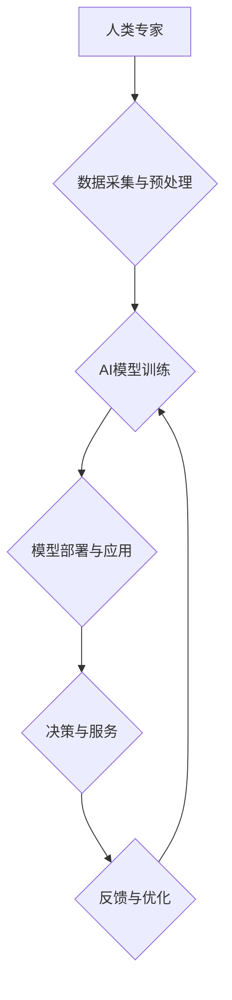

                 

## AI驱动的创新：人类计算在金融中的应用

> 关键词：人工智能、金融科技、机器学习、深度学习、自然语言处理、风险管理、预测分析、自动化

## 1. 背景介绍

金融行业作为全球经济的核心支柱，一直以来都致力于寻求更高效、更精准、更安全的运营模式。随着人工智能（AI）技术的飞速发展，其在金融领域的应用已成为不可忽视的趋势。AI驱动的创新正在深刻地改变着金融业的格局，为金融机构带来了前所未有的机遇和挑战。

传统金融模式往往依赖于人类经验和规则，存在着效率低下、风险控制不足、决策偏差等问题。而AI技术，特别是机器学习和深度学习，能够从海量数据中挖掘出隐藏的模式和规律，实现自动化决策、精准预测和智能风险管理，从而提升金融服务的效率、准确性和安全性。

## 2. 核心概念与联系

**2.1  人工智能（AI）**

人工智能是指模拟人类智能行为的计算机系统。它涵盖了多个领域，包括机器学习、深度学习、自然语言处理、计算机视觉等。

**2.2  金融科技（FinTech）**

金融科技是指利用科技手段创新金融服务和运营模式的行业。它涵盖了支付、借贷、投资、保险等多个领域，并不断融合人工智能、大数据、云计算等新兴技术。

**2.3  人类计算**

人类计算是指利用人类的智慧和判断能力，结合人工智能技术，共同完成复杂的任务。它强调人机协作，发挥各自优势，实现更高效、更智能的决策和服务。

**2.4  AI驱动的金融创新**

AI驱动的金融创新是指利用人工智能技术，在金融领域进行创新，例如：

* **智能客服：** 利用自然语言处理技术，构建智能聊天机器人，为客户提供24小时在线服务。
* **风险管理：** 利用机器学习算法，分析客户数据和市场风险，进行精准的风险评估和控制。
* **投资决策：** 利用深度学习算法，分析市场数据和投资策略，进行智能投资决策。
* **欺诈检测：** 利用机器学习算法，识别异常交易行为，防止金融欺诈。

**2.5  架构图**



## 3. 核心算法原理 & 具体操作步骤

**3.1  算法原理概述**

在金融领域，常用的AI算法包括：

* **机器学习算法：** 

    * **监督学习：** 利用标记数据训练模型，例如分类、回归等。
    * **非监督学习：** 从无标记数据中发现模式，例如聚类、降维等。
    * **强化学习：** 通过试错学习，优化策略，例如博弈论、机器人控制等。

* **深度学习算法：** 利用多层神经网络，学习更复杂的特征表示，例如卷积神经网络、循环神经网络等。

**3.2  算法步骤详解**

以机器学习算法为例，其基本步骤如下：

1. **数据采集与预处理：** 收集相关数据，并进行清洗、转换、特征工程等预处理操作。
2. **模型选择：** 根据具体任务选择合适的机器学习算法模型。
3. **模型训练：** 利用标记数据训练模型，调整模型参数，使其能够准确预测或分类。
4. **模型评估：** 利用测试数据评估模型的性能，例如准确率、召回率、F1-score等。
5. **模型部署与应用：** 将训练好的模型部署到实际应用场景中，用于预测、分类、决策等。
6. **模型监控与优化：** 持续监控模型的性能，并根据实际情况进行模型调整和优化。

**3.3  算法优缺点**

* **优点：**

    * 自动化决策，提高效率。
    * 精准预测，降低风险。
    * 个性化服务，提升客户体验。

* **缺点：**

    * 数据依赖，需要大量高质量数据。
    * 模型解释性差，难以理解模型决策逻辑。
    * 算法偏差，可能存在公平性问题。

**3.4  算法应用领域**

* **风险管理：** 识别欺诈交易、评估信用风险、预测市场风险等。
* **投资决策：** 分析市场趋势、预测股票价格、构建投资组合等。
* **客户服务：** 提供智能客服、个性化推荐、客户关系管理等。
* **运营效率：** 自动化流程、优化资源配置、提高运营效率等。

## 4. 数学模型和公式 & 详细讲解 & 举例说明

**4.1  数学模型构建**

在金融领域，常用的数学模型包括：

* **线性回归模型：** 用于预测连续变量，例如房价、股票价格等。

$$
y = \beta_0 + \beta_1x_1 + \beta_2x_2 + ... + \beta_nx_n + \epsilon
$$

其中：

* $y$ 是预测变量
* $x_1, x_2, ..., x_n$ 是自变量
* $\beta_0, \beta_1, ..., \beta_n$ 是模型参数
* $\epsilon$ 是误差项

* **逻辑回归模型：** 用于预测分类变量，例如客户是否会违约、交易是否为欺诈等。

$$
P(y=1|x) = \frac{1}{1 + e^{-( \beta_0 + \beta_1x_1 + \beta_2x_2 + ... + \beta_nx_n )}}
$$

其中：

* $P(y=1|x)$ 是预测变量为1的概率
* $x_1, x_2, ..., x_n$ 是自变量
* $\beta_0, \beta_1, ..., \beta_n$ 是模型参数

**4.2  公式推导过程**

例如，线性回归模型的 $\beta$ 参数可以通过最小二乘法推导得到。最小二乘法旨在找到使模型预测值与实际值误差平方和最小的参数值。

**4.3  案例分析与讲解**

例如，可以使用线性回归模型预测房价。根据历史房价数据和相关特征（例如房屋面积、位置、楼层等），训练一个线性回归模型。然后，可以使用这个模型预测新房子的价格。

## 5. 项目实践：代码实例和详细解释说明

**5.1  开发环境搭建**

* Python 3.x
* Jupyter Notebook
* scikit-learn
* pandas
* numpy

**5.2  源代码详细实现**

```python
import pandas as pd
from sklearn.linear_model import LinearRegression
from sklearn.model_selection import train_test_split

# 加载数据
data = pd.read_csv('house_price_data.csv')

# 选择特征和目标变量
features = ['area', 'location', 'floor']
target = 'price'

# 将数据分割为训练集和测试集
X_train, X_test, y_train, y_test = train_test_split(data[features], data[target], test_size=0.2)

# 创建线性回归模型
model = LinearRegression()

# 训练模型
model.fit(X_train, y_train)

# 预测测试集数据
y_pred = model.predict(X_test)

# 评估模型性能
from sklearn.metrics import mean_squared_error
mse = mean_squared_error(y_test, y_pred)
print(f'Mean Squared Error: {mse}')
```

**5.3  代码解读与分析**

* 首先，加载数据并选择特征和目标变量。
* 然后，将数据分割为训练集和测试集。
* 创建线性回归模型并训练模型。
* 使用训练好的模型预测测试集数据。
* 最后，评估模型性能，例如使用均方误差（MSE）来衡量预测精度。

**5.4  运行结果展示**

运行代码后，会输出测试集数据的均方误差值。

## 6. 实际应用场景

**6.1  智能客服**

* 利用自然语言处理技术，构建智能聊天机器人，为客户提供24小时在线服务。
* 例如，客户可以通过聊天机器人查询账户余额、转账、缴费等。

**6.2  风险管理**

* 利用机器学习算法，分析客户数据和市场风险，进行精准的风险评估和控制。
* 例如，银行可以使用机器学习算法识别欺诈交易、评估客户信用风险、预测市场风险等。

**6.3  投资决策**

* 利用深度学习算法，分析市场数据和投资策略，进行智能投资决策。
* 例如，基金公司可以使用深度学习算法分析股票价格趋势、预测股票价格波动、构建投资组合等。

**6.4  未来应用展望**

* **个性化金融服务：** 利用AI技术，为每个客户提供个性化的金融服务，例如定制化的投资建议、风险管理方案等。
* **金融普惠：** 利用AI技术，降低金融服务的成本和门槛，为更多人提供金融服务。
* **金融监管：** 利用AI技术，加强金融监管，预防和打击金融犯罪。

## 7. 工具和资源推荐

**7.1  学习资源推荐**

* **书籍：**

    * 《深度学习》
    * 《机器学习实战》
    * 《Python机器学习》

* **在线课程：**

    * Coursera
    * edX
    * Udacity

**7.2  开发工具推荐**

* **Python：** 

    * scikit-learn
    * TensorFlow
    * PyTorch

* **Jupyter Notebook：** 用于代码编写、数据分析和可视化。

**7.3  相关论文推荐**

* **深度学习在金融领域的应用：**

    * [Deep Learning for Financial Modeling](https://arxiv.org/abs/1809.03673)
    * [Deep Reinforcement Learning for Financial Trading](https://arxiv.org/abs/1708.05028)

* **机器学习在金融领域的应用：**

    * [Machine Learning in Finance](https://www.nature.com/articles/s41586-019-1677-7)
    * [Credit Risk Assessment Using Machine Learning](https://www.sciencedirect.com/science/article/pii/S092577611930049X)

## 8. 总结：未来发展趋势与挑战

**8.1  研究成果总结**

AI技术在金融领域的应用取得了显著成果，例如：

* **提高了风险管理的效率和准确性。**
* **优化了投资决策，提升了投资收益。**
* **提升了客户服务体验，提高了客户满意度。**

**8.2  未来发展趋势**

* **更强大的AI模型：** 随着深度学习技术的不断发展，将出现更强大的AI模型，能够处理更复杂的任务，提供更精准的预测和决策。
* **更广泛的应用场景：** AI技术将应用于金融领域的更多场景，例如反洗钱、知识图谱、数字货币等。
* **更注重伦理和可解释性：** 随着AI技术的应用越来越广泛，伦理和可解释性将成为越来越重要的研究方向。

**8.3  面临的挑战**

* **数据质量和隐私问题：** AI模型的性能依赖于高质量的数据，而金融数据往往存在隐私问题，需要采取有效的措施保护数据安全。
* **算法偏差和公平性问题：** AI算法可能存在偏差，导致不公平的结果，需要采取措施解决算法偏差问题。
* **监管和法律问题：** AI技术的应用涉及到监管和法律问题，需要制定相应的法律法规来规范AI技术的应用。

**8.4  研究展望**

未来，AI技术在金融领域的应用将更加广泛、更加深入。研究者需要继续探索更强大的AI模型、更广泛的应用场景、更有效的解决方法，推动AI技术在金融领域的创新发展。

## 9. 附录：常见问题与解答

**9.1  AI技术是否会取代金融工作者？**

AI技术可以自动化一些金融工作，但不会完全取代金融工作者。AI技术需要人类的指导和监督，而人类的工作者可以利用AI技术提高效率，专注于更复杂、更需要创造力的工作。

**9.2  如何保证AI技术的安全性？**

AI技术的安全性需要从多个方面考虑，例如数据安全、算法安全、系统安全等。需要采取有效的措施来保护数据安全，防止算法被恶意利用，确保系统安全稳定运行。

**9.3  如何解决AI算法的偏差问题？**

解决AI算法的偏差问题需要从多个方面入手，例如：

* 使用更全面、更代表性的训练数据。
* 开发更公平、更鲁棒的算法模型。
* 对算法进行定期评估和监控，及时发现和解决偏差问题。


作者：禅与计算机程序设计艺术 / Zen and the Art of Computer Programming 
<end_of_turn>

