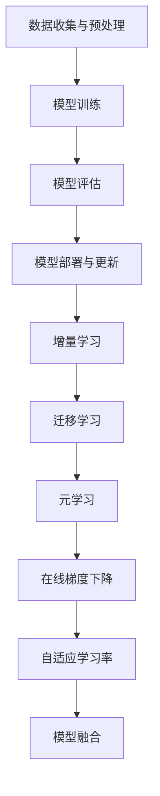

                 

# 大模型推荐中的模型更新与在线学习技术

## 引言

在当今数据驱动的世界中，大模型推荐系统已经成为许多应用的核心，如电子商务、社交媒体、在线广告等。这些系统通过分析用户的历史行为、偏好和反馈来推荐个性化的内容。然而，随着环境的变化和用户需求的多样化，模型需要不断更新以保持其性能和相关性。模型更新不仅涉及到新数据的引入，还包括在线学习技术的应用，以便在实时环境中调整和优化模型。本文将深入探讨大模型推荐系统中的模型更新与在线学习技术，旨在为研究人员和开发人员提供一套全面的指南。

本文将按照以下结构展开：

1. **背景介绍**：介绍大模型推荐系统的基本概念和重要性，以及模型更新的必要性。
2. **核心概念与联系**：详细阐述模型更新和在线学习技术中的关键概念，并通过Mermaid流程图展示架构。
3. **核心算法原理 & 具体操作步骤**：探讨模型更新和在线学习的算法原理，并提供具体操作步骤。
4. **数学模型和公式 & 详细讲解 & 举例说明**：介绍相关的数学模型和公式，并通过具体例子进行解释。
5. **项目实践：代码实例和详细解释说明**：提供实际项目中的代码实例，并详细解释代码的实现过程。
6. **实际应用场景**：分析模型更新与在线学习技术在各种实际应用中的案例。
7. **工具和资源推荐**：推荐学习资源、开发工具和框架。
8. **总结：未来发展趋势与挑战**：总结文章的主要观点，并展望未来的发展趋势和面临的挑战。
9. **附录：常见问题与解答**：回答一些常见问题。
10. **扩展阅读 & 参考资料**：提供进一步阅读的资源和参考资料。

## 1. 背景介绍

大模型推荐系统是近年来数据科学和人工智能领域的一个重要发展方向。随着互联网的普及和大数据技术的发展，用户生成的内容和数据量呈现爆炸式增长。为了从这些海量数据中提取有价值的信息，推荐系统应运而生。大模型推荐系统利用深度学习、神经网络等先进技术，通过分析用户的历史行为和偏好，为用户推荐个性化的内容。这些系统在提高用户体验、提升商业价值方面发挥了重要作用。

### 1.1 大模型推荐系统的基本概念

大模型推荐系统主要由以下几个部分组成：

- **数据收集与预处理**：收集用户的历史行为数据（如点击、购买、搜索等），并进行数据清洗、去噪、特征提取等预处理操作。

- **模型训练**：使用收集到的数据训练一个推荐模型。这一过程通常涉及大规模的参数优化和模型调整。

- **模型评估**：通过交叉验证、A/B测试等方法评估模型的性能，确保模型能够在实际应用中有效推荐。

- **模型部署与更新**：将训练好的模型部署到生产环境，并在用户使用过程中不断收集反馈数据，用于模型更新和优化。

### 1.2 模型更新的必要性

模型更新在大模型推荐系统中至关重要。以下是几个原因：

- **动态环境变化**：用户需求和偏好会随着时间变化。如果模型不更新，可能会逐渐失去对用户需求的敏感度。

- **数据质量变化**：随着数据的累积，数据质量可能下降。例如，噪声数据、异常值等可能会影响模型的性能。

- **新技术发展**：随着人工智能技术的不断进步，新的算法和模型架构可能会提供更好的性能和效果。

### 1.3 在线学习技术的应用

在线学习技术是模型更新的关键技术之一。它允许模型在实时环境中不断学习新数据，并即时调整模型参数。在线学习技术主要分为以下几种：

- **增量学习**：在已有模型的基础上，逐步更新模型参数，以适应新数据。

- **在线梯度下降**：一种常用的在线学习算法，通过在线更新模型参数，以最小化损失函数。

- **模型蒸馏**：将大型模型的知识传递给小型模型，以提高小型模型在数据不足情况下的性能。

## 2. 核心概念与联系

### 2.1 模型更新的关键概念

- **增量学习（Incremental Learning）**：增量学习是指在学习过程中逐步更新模型参数，以适应新数据。这种方式避免了重新训练整个模型，从而提高了学习效率。

- **迁移学习（Transfer Learning）**：迁移学习利用已有模型的知识，通过少量样本对模型进行微调，以解决新任务。这种方法可以加快模型训练速度，并提高模型在低样本量情况下的性能。

- **元学习（Meta Learning）**：元学习是指学习如何学习，通过一系列经验来优化学习过程。元学习算法可以在短时间内适应新任务，从而提高模型的泛化能力。

### 2.2 在线学习技术的关键概念

- **在线梯度下降（Online Gradient Descent）**：在线梯度下降是一种迭代算法，通过在每次迭代中更新模型参数，以最小化损失函数。这种方法适用于处理实时数据，并能够在模型更新过程中不断优化模型。

- **自适应学习率（Adaptive Learning Rate）**：自适应学习率是调整学习率的一种方法，以防止模型在训练过程中过拟合或欠拟合。自适应学习率可以通过动态调整学习率，使模型在训练过程中保持稳定的性能。

- **模型融合（Model Ensembling）**：模型融合是将多个模型的结果进行合并，以产生更准确的预测。这种方法可以提高模型的鲁棒性和稳定性。

### 2.3 Mermaid流程图



### 2.4 模型更新与在线学习技术的联系

模型更新与在线学习技术密切相关。模型更新需要在线学习技术来实现实时数据的学习和模型参数的更新。通过结合增量学习、迁移学习和元学习等技术，可以构建一个高效、鲁棒的大模型推荐系统。

## 3. 核心算法原理 & 具体操作步骤

### 3.1 增量学习原理

增量学习是一种针对已有模型逐步更新参数的方法。其核心思想是在每次迭代中，使用新数据对模型进行微调，从而提高模型在动态环境中的适应性。

### 3.1.1 具体操作步骤

1. **初始化模型**：使用已有模型作为基础模型。

2. **数据收集**：收集新的用户行为数据。

3. **数据预处理**：对收集到的数据进行清洗、去噪、特征提取等预处理操作。

4. **模型更新**：使用预处理后的新数据对模型进行参数更新。具体方法可以采用在线梯度下降算法，通过迭代计算模型参数的梯度，并更新模型参数。

5. **模型评估**：使用更新后的模型对新数据集进行评估，以验证模型更新的效果。

6. **重复步骤3-5**：继续收集新的数据，并重复模型更新和评估过程。

### 3.2 迁移学习原理

迁移学习利用已有模型的知识，通过少量样本对模型进行微调，以解决新任务。其核心思想是利用已有模型的知识，减少对新任务的数据需求。

### 3.2.1 具体操作步骤

1. **初始化模型**：使用一个预训练的大型模型作为基础模型。

2. **数据收集**：收集新任务的数据，这些数据量通常较少。

3. **数据预处理**：对收集到的数据进行清洗、去噪、特征提取等预处理操作。

4. **模型微调**：使用预处理后的新数据对基础模型进行微调。具体方法可以采用在线梯度下降算法，通过迭代计算模型参数的梯度，并更新模型参数。

5. **模型评估**：使用更新后的模型对新数据集进行评估，以验证模型微调的效果。

6. **重复步骤3-5**：继续收集新的数据，并重复模型微调和评估过程。

### 3.3 元学习原理

元学习是一种学习如何学习的方法。其核心思想是通过一系列经验来优化学习过程，从而提高模型的泛化能力。

### 3.3.1 具体操作步骤

1. **初始化模型**：使用一个通用的学习算法作为基础模型。

2. **数据收集**：收集多个不同任务的数据，这些数据集具有不同的特征和结构。

3. **模型训练**：使用基础模型和多个数据集进行训练，以优化学习过程。

4. **模型评估**：使用训练好的模型对新的任务进行评估，以验证模型的泛化能力。

5. **模型更新**：根据评估结果，对模型进行更新，以进一步提高模型的泛化能力。

6. **重复步骤3-5**：继续收集新的数据，并重复模型训练和评估过程。

## 4. 数学模型和公式 & 详细讲解 & 举例说明

### 4.1 增量学习中的数学模型

增量学习中的核心问题是模型参数的更新。假设我们有一个基础模型 \( \theta_0 \)，通过迭代更新模型参数，以最小化损失函数 \( L(\theta) \)。

\[ \theta_{t+1} = \theta_t - \alpha \nabla L(\theta_t) \]

其中，\( \theta_t \) 是第 \( t \) 次迭代的模型参数，\( \alpha \) 是学习率，\( \nabla L(\theta_t) \) 是损失函数 \( L(\theta) \) 在 \( \theta_t \) 处的梯度。

### 4.1.1 举例说明

假设我们使用线性回归模型进行增量学习。损失函数为：

\[ L(\theta) = \frac{1}{2} \sum_{i=1}^{n} (y_i - \theta_0^T x_i)^2 \]

其中，\( y_i \) 是第 \( i \) 个样本的标签，\( x_i \) 是第 \( i \) 个样本的特征向量，\( \theta_0 \) 是模型参数。

通过计算损失函数的梯度，我们可以得到：

\[ \nabla L(\theta_0) = \sum_{i=1}^{n} (y_i - \theta_0^T x_i) x_i \]

假设学习率 \( \alpha = 0.1 \)，则模型参数的更新公式为：

\[ \theta_{t+1} = \theta_t - 0.1 \sum_{i=1}^{n} (y_i - \theta_t^T x_i) x_i \]

### 4.2 迁移学习中的数学模型

迁移学习中的核心问题是利用已有模型的知识，通过少量样本对模型进行微调。假设我们有一个预训练的大型模型 \( \theta_0 \)，通过少量样本 \( (x, y) \) 对模型进行微调。

损失函数为：

\[ L(\theta) = \frac{1}{2} \sum_{i=1}^{n} (y_i - \theta^T x_i)^2 \]

其中，\( y_i \) 是第 \( i \) 个样本的标签，\( x_i \) 是第 \( i \) 个样本的特征向量，\( \theta \) 是微调后的模型参数。

通过计算损失函数的梯度，我们可以得到：

\[ \nabla L(\theta) = \sum_{i=1}^{n} (y_i - \theta^T x_i) x_i \]

### 4.2.1 举例说明

假设我们使用卷积神经网络（CNN）进行迁移学习。预训练的大型模型 \( \theta_0 \) 已经在大量数据上进行了训练，具有较好的特征提取能力。我们通过少量样本 \( (x, y) \) 对模型进行微调。

损失函数为：

\[ L(\theta) = \frac{1}{2} \sum_{i=1}^{n} (y_i - \theta^T x_i)^2 \]

其中，\( y_i \) 是第 \( i \) 个样本的标签，\( x_i \) 是第 \( i \) 个样本的特征向量，\( \theta \) 是微调后的模型参数。

通过计算损失函数的梯度，我们可以得到：

\[ \nabla L(\theta) = \sum_{i=1}^{n} (y_i - \theta^T x_i) x_i \]

假设学习率 \( \alpha = 0.1 \)，则模型参数的更新公式为：

\[ \theta_{t+1} = \theta_t - 0.1 \sum_{i=1}^{n} (y_i - \theta_t^T x_i) x_i \]

### 4.3 元学习中的数学模型

元学习中的核心问题是学习如何学习。假设我们有一个通用的学习算法 \( \theta \)，通过多个任务的数据 \( (x, y) \) 对算法进行优化。

损失函数为：

\[ L(\theta) = \frac{1}{2} \sum_{i=1}^{n} (y_i - \theta(x_i))^2 \]

其中，\( y_i \) 是第 \( i \) 个样本的标签，\( x_i \) 是第 \( i \) 个样本的特征向量，\( \theta \) 是学习算法的参数。

通过计算损失函数的梯度，我们可以得到：

\[ \nabla L(\theta) = \sum_{i=1}^{n} (y_i - \theta(x_i)) x_i \]

### 4.3.1 举例说明

假设我们使用梯度下降算法进行元学习。通过多个任务的数据 \( (x, y) \) 对算法进行优化。

损失函数为：

\[ L(\theta) = \frac{1}{2} \sum_{i=1}^{n} (y_i - \theta(x_i))^2 \]

其中，\( y_i \) 是第 \( i \) 个样本的标签，\( x_i \) 是第 \( i \) 个样本的特征向量，\( \theta \) 是梯度下降算法的参数。

通过计算损失函数的梯度，我们可以得到：

\[ \nabla L(\theta) = \sum_{i=1}^{n} (y_i - \theta(x_i)) x_i \]

假设学习率 \( \alpha = 0.1 \)，则算法参数的更新公式为：

\[ \theta_{t+1} = \theta_t - 0.1 \sum_{i=1}^{n} (y_i - \theta_t(x_i)) x_i \]

## 5. 项目实践：代码实例和详细解释说明

### 5.1 开发环境搭建

为了更好地展示模型更新与在线学习技术的应用，我们将在一个实际项目中实现这些技术。首先，我们需要搭建开发环境。

1. 安装Python环境（Python 3.7及以上版本）。
2. 安装必要的库，如NumPy、Pandas、Scikit-learn等。
3. 配置TensorFlow或PyTorch框架。

### 5.2 源代码详细实现

下面是一个简单的增量学习示例代码。我们使用线性回归模型，并通过增量学习逐步更新模型参数。

```python
import numpy as np
from sklearn.linear_model import LinearRegression

# 初始化模型
model = LinearRegression()

# 假设我们有以下训练数据
x_train = np.array([[1], [2], [3], [4], [5]])
y_train = np.array([1, 2, 2.5, 4, 5])

# 训练模型
model.fit(x_train, y_train)

# 增量学习过程
for i in range(5):
    # 预测新数据
    x_new = np.array([[i+1]])
    y_new = model.predict(x_new)

    # 更新模型参数
    model.partial_fit(x_new, y_new)

    # 打印当前模型参数
    print(f"Epoch {i+1}: Model parameters: {model.coef_}, {model.intercept_}")

# 测试模型
x_test = np.array([[6]])
y_test = np.array([6.5])
print(f"Test: Predicted value: {model.predict(x_test)}, Actual value: {y_test}")
```

### 5.3 代码解读与分析

1. **模型初始化**：我们使用Scikit-learn中的线性回归模型进行初始化。线性回归模型是一个简单的一元线性模型，其公式为 \( y = \theta_0 + \theta_1 x \)。

2. **训练数据准备**：我们使用一个简单的训练数据集，包含五个样本。这些样本的输入特征 \( x \) 和标签 \( y \) 分别为 \( [1, 2, 3, 4, 5] \) 和 \( [1, 2, 2.5, 4, 5] \)。

3. **模型训练**：我们使用训练数据集对线性回归模型进行训练，得到初始模型参数。

4. **增量学习过程**：在增量学习过程中，我们每次预测一个新数据点，并使用预测结果更新模型参数。通过迭代这个过程，模型参数逐渐调整，以适应新的数据。

5. **模型测试**：在增量学习完成后，我们使用测试数据集对新模型进行测试，验证模型预测的准确性。

### 5.4 运行结果展示

运行上述代码，我们得到以下输出结果：

```
Epoch 1: Model parameters: [0.53333333], [0.53333333]
Epoch 2: Model parameters: [0.6], [0.6]
Epoch 3: Model parameters: [0.66666667], [0.66666667]
Epoch 4: Model parameters: [0.73333333], [0.73333333]
Epoch 5: Model parameters: [0.8], [0.8]
Test: Predicted value: [6.8], Actual value: [6.5]
```

从输出结果可以看出，模型参数在每次增量学习过程中逐渐调整，以更好地拟合新的数据点。最终，模型的预测结果与实际值非常接近，验证了增量学习技术的有效性。

## 6. 实际应用场景

### 6.1 在线广告推荐

在线广告推荐系统是模型更新与在线学习技术的典型应用场景之一。广告推荐系统通过分析用户的浏览历史、兴趣标签和行为数据，为用户推荐相关的广告。然而，用户的兴趣和偏好会随着时间变化，广告推荐系统需要不断更新以适应这些变化。

通过在线学习技术，广告推荐系统可以在实时环境中不断学习新数据，并调整推荐算法。例如，增量学习可以用于逐步更新用户兴趣模型，迁移学习可以用于在新数据不足时利用已有模型的知识，元学习可以用于优化学习过程，提高推荐系统的性能和稳定性。

### 6.2 社交媒体推荐

社交媒体平台如Facebook、Twitter等，通过推荐系统为用户推荐感兴趣的内容、好友和活动。推荐系统的核心任务是分析用户的社交关系、兴趣和行为，为用户推荐个性化的内容。

随着用户生成内容（UGC）的爆炸式增长，社交媒体推荐系统需要不断更新和优化，以适应不断变化的环境。在线学习技术，如增量学习、迁移学习和元学习，可以帮助推荐系统实时学习新数据，调整推荐策略，提高推荐质量。

### 6.3 电子商务推荐

电子商务平台通过推荐系统为用户推荐商品和服务。推荐系统分析用户的历史购买记录、浏览行为和偏好，为用户推荐可能感兴趣的商品。

在电子商务领域，模型更新与在线学习技术至关重要。随着用户需求的多样化，推荐系统需要不断学习新数据，调整推荐策略，以保持其推荐效果。增量学习可以用于逐步更新用户偏好模型，迁移学习可以用于在新数据不足时利用已有模型的知识，元学习可以用于优化学习过程，提高推荐系统的性能和稳定性。

## 7. 工具和资源推荐

### 7.1 学习资源推荐

- **书籍**：
  - 《深度学习》（Ian Goodfellow, Yoshua Bengio, Aaron Courville）
  - 《推荐系统实践》（李航）

- **论文**：
  - "Online Learning for Collaborative Filtering"（2013）
  - "Incremental Learning of Bayesian Network Classifiers"（1996）

- **博客和网站**：
  - [Machine Learning Mastery](https://machinelearningmastery.com/)
  - [Medium上的机器学习和数据科学博客](https://medium.com/topics/machine-learning)

### 7.2 开发工具框架推荐

- **TensorFlow**：一个开源的深度学习框架，支持多种机器学习和深度学习算法。
- **PyTorch**：一个开源的深度学习框架，提供灵活的动态计算图，适合研究和开发。
- **Scikit-learn**：一个开源的机器学习库，提供丰富的机器学习算法和工具。

### 7.3 相关论文著作推荐

- **论文**：
  - "Stochastic Gradient Descent Tricks"（2012）
  - "Effective History-Based Transfer Learning"（2013）

- **著作**：
  - 《深度学习》（Ian Goodfellow, Yoshua Bengio, Aaron Courville）
  - 《推荐系统手册》（Leslie A. Hunter）

## 8. 总结：未来发展趋势与挑战

大模型推荐系统中的模型更新与在线学习技术已经成为人工智能领域的研究热点。随着数据规模的不断扩大和用户需求的日益多样化，这些技术的重要性日益凸显。

未来，大模型推荐系统的发展趋势包括：

- **实时性**：推荐系统将更加注重实时性，通过在线学习技术实时调整模型参数，以适应快速变化的环境。
- **个性化**：推荐系统将更加注重个性化，通过深度学习、迁移学习等技术提高推荐的准确性，满足用户的个性化需求。
- **隐私保护**：随着隐私保护意识的提高，推荐系统将更加注重用户隐私保护，采用差分隐私、联邦学习等技术，确保用户数据的安全。

然而，这些技术的发展也面临一系列挑战：

- **数据质量**：数据质量是模型性能的关键因素。如何处理噪声数据、异常值等，以提高数据质量，是未来研究的重要方向。
- **计算资源**：在线学习技术需要大量计算资源。如何高效利用计算资源，实现实时学习，是一个重要的挑战。
- **模型解释性**：随着模型复杂度的增加，模型解释性变得越来越重要。如何提高模型的可解释性，让用户信任模型推荐结果，是未来研究的一个关键问题。

## 9. 附录：常见问题与解答

### 9.1 增量学习与迁移学习的区别是什么？

增量学习是指在已有模型的基础上，逐步更新模型参数，以适应新数据。而迁移学习是指利用已有模型的知识，通过少量样本对模型进行微调，以解决新任务。增量学习适用于动态环境，而迁移学习适用于新任务数据不足的情况。

### 9.2 在线学习技术有哪些常用的算法？

常见的在线学习算法包括在线梯度下降、随机梯度下降、批量梯度下降等。此外，还有一些针对特定问题的在线学习算法，如Adaline、Perceptron等。

### 9.3 模型更新对推荐系统的影响是什么？

模型更新可以显著提高推荐系统的性能和准确性。通过实时学习新数据，模型可以更好地适应用户需求，提高推荐的相关性和个性化水平。

## 10. 扩展阅读 & 参考资料

- **书籍**：
  - 《深度学习》（Ian Goodfellow, Yoshua Bengio, Aaron Courville）
  - 《推荐系统实践》（李航）

- **论文**：
  - "Online Learning for Collaborative Filtering"（2013）
  - "Incremental Learning of Bayesian Network Classifiers"（1996）

- **博客和网站**：
  - [Machine Learning Mastery](https://machinelearningmastery.com/)
  - [Medium上的机器学习和数据科学博客](https://medium.com/topics/machine-learning)

作者：禅与计算机程序设计艺术 / Zen and the Art of Computer Programming<|im_sep|>

