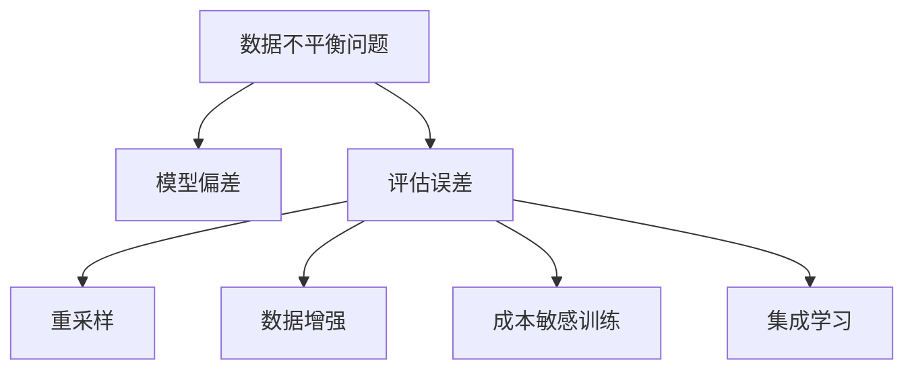
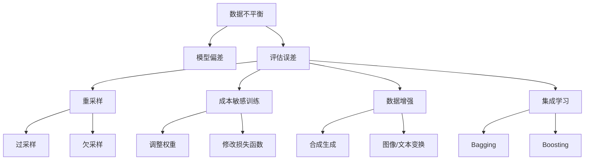
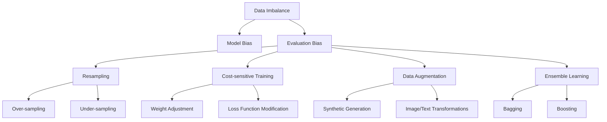

                 

# 文章标题

## 大模型推荐场景中的数据不平衡问题应对策略

## 摘要

本文旨在探讨在大模型推荐场景中数据不平衡问题的重要性，并提出一系列有效的应对策略。数据不平衡是指训练数据集中各个类别的样本数量存在显著差异，这对模型的训练和评估产生了深远的影响。通过分析数据不平衡的原因和影响，本文将介绍几种常用的应对策略，包括重采样、数据增强、成本敏感训练和集成学习等。同时，我们将通过一个具体的案例展示这些策略在实际应用中的效果，为读者提供实践指导。

## 1. 背景介绍

在当今的互联网时代，个性化推荐系统已经成为提升用户体验、增加用户粘性、推动商业价值的重要手段。这些系统依赖于大规模的机器学习模型，如深度神经网络、决策树、支持向量机等，来预测用户的兴趣和行为。然而，在推荐系统中，数据不平衡是一个常见且严重的问题。数据不平衡可能源自用户行为的稀疏性、内容种类的多样性以及业务策略的特定需求。

### 1.1 数据不平衡的定义

数据不平衡是指在数据集中某些类别（标签）的样本数量远多于其他类别，导致模型在训练过程中可能偏向于高频率类别，忽视低频率类别。例如，在新闻推荐系统中，点击量高的新闻样本可能远多于点击量低的新闻，这会导致模型无法准确预测用户对低频率新闻的兴趣。

### 1.2 数据不平衡的原因

1. **用户行为的稀疏性**：用户在推荐系统上的行为往往较为稀疏，导致某些标签（如冷门新闻、少人购买的商品）的样本数量极少。
2. **内容多样性**：推荐系统通常需要处理大量不同的内容，这可能导致某些类别（如电影、书籍）的数据量远大于其他类别（如纪录片、学术著作）。
3. **业务需求**：为了满足业务目标，如提升点击率、购买转化率，系统可能有意地增加高频率样本的数量。

### 1.3 数据不平衡的影响

数据不平衡对推荐系统的影响主要体现在两个方面：

1. **模型偏差**：模型可能会倾向于预测高频率类别，从而导致对低频率类别预测的准确性下降。
2. **评估误差**：在评估模型性能时，数据不平衡会导致评估指标（如准确率、召回率）失真，无法真实反映模型在各类别上的表现。

## 2. 核心概念与联系

### 2.1 数据不平衡问题的影响

为了更好地理解数据不平衡问题，我们需要首先明确其对推荐系统性能的具体影响。数据不平衡会导致模型无法充分学习到所有类别的特征，尤其是那些低频率类别。这可能会导致以下问题：

1. **高频率类别主导**：模型在训练过程中可能会过度关注高频率类别，导致低频率类别被忽视。这种偏差会导致模型在低频率类别上的预测准确性显著下降。
2. **模型泛化能力下降**：由于模型在训练过程中没有充分学习到所有类别的特征，其泛化能力可能会下降，从而在新的、未见过的高频率类别上表现不佳。

### 2.2 应对数据不平衡的策略

为了解决数据不平衡问题，我们可以采取多种策略，以下是一些常用的方法：

1. **重采样**：通过增加低频率类别的样本数量或减少高频率类别的样本数量，使数据集更加平衡。重采样方法包括随机过采样、随机欠采样、SMOTE（合成少数类过采样技术）等。
2. **数据增强**：通过生成人工合成的样本来增加低频率类别的样本数量。数据增强方法包括图像生成、文本生成等。
3. **成本敏感训练**：通过调整模型在训练过程中对不同类别的关注程度，使模型更加关注低频率类别。成本敏感训练方法包括调整分类器的权重、使用不同的损失函数等。
4. **集成学习**：通过结合多个模型或多次训练，提高模型对低频率类别的预测准确性。集成学习方法包括Bagging、Boosting等。

### 2.3 Mermaid 流程图

以下是一个简化的 Mermaid 流程图，展示了数据不平衡问题及其应对策略的关系：



通过上述流程图，我们可以清晰地看到数据不平衡问题对推荐系统的影响以及应对策略的选择。

## 3. 核心算法原理 & 具体操作步骤

### 3.1 重采样

重采样是一种简单且常用的数据不平衡应对策略，其基本思想是通过调整样本数量使数据集达到平衡。以下是一种常见的重采样方法——随机过采样：

1. **步骤 1：计算类别样本数量**：首先，我们需要统计每个类别的样本数量。
2. **步骤 2：生成人工样本**：对于样本数量较少的类别，我们可以通过生成人工样本来增加其数量。具体方法是随机选择已有样本的特征进行组合，生成新的样本。
3. **步骤 3：合并数据集**：将生成的样本与原始数据集合并，形成新的平衡数据集。

### 3.2 数据增强

数据增强是通过生成合成样本来增加数据集的多样性，从而缓解数据不平衡问题。以下是一个文本数据增强的简单示例：

1. **步骤 1：选择基样本**：从数据集中选择一个基样本。
2. **步骤 2：生成合成样本**：通过对基样本进行变换（如替换词语、添加噪声、改变语法结构等），生成新的合成样本。
3. **步骤 3：合并数据集**：将合成样本与原始数据集合并，形成新的平衡数据集。

### 3.3 成本敏感训练

成本敏感训练是一种通过调整模型训练过程中对不同类别的关注程度来缓解数据不平衡问题的方法。以下是一个简单的成本敏感训练步骤：

1. **步骤 1：计算类别重要性**：首先，我们需要计算每个类别的样本数量与类别重要性的关系。
2. **步骤 2：调整损失函数**：通过调整损失函数中的类别权重，使模型在训练过程中更加关注低频率类别。
3. **步骤 3：重新训练模型**：使用调整后的损失函数重新训练模型。

### 3.4 集成学习

集成学习是通过结合多个模型或多次训练来提高模型对低频率类别的预测准确性。以下是一个简单的集成学习步骤：

1. **步骤 1：训练多个模型**：分别使用原始数据集和平衡数据集训练多个模型。
2. **步骤 2：合并预测结果**：通过投票或其他方法合并多个模型的预测结果，形成最终的预测结果。

## 4. 数学模型和公式 & 详细讲解 & 举例说明

### 4.1 重采样

在重采样策略中，我们通常会使用一些数学模型来计算类别的重要性，从而确定如何调整样本数量。以下是一个基于类别频率的简单公式：

$$
\text{类别重要性} = \frac{\text{类别样本数量}}{\text{总样本数量}}
$$

假设我们有一个二分类问题，其中正类样本数量为 $N_1$，负类样本数量为 $N_0$，总样本数量为 $N$，则正类的类别重要性为：

$$
\text{正类重要性} = \frac{N_1}{N}
$$

负类的类别重要性为：

$$
\text{负类重要性} = \frac{N_0}{N}
$$

根据类别重要性，我们可以确定如何调整样本数量。例如，如果正类的类别重要性远大于负类，我们可以通过减少正类样本数量或增加负类样本数量来平衡数据集。

### 4.2 数据增强

在数据增强策略中，我们通常会使用一些数学模型来生成合成样本。以下是一个基于生成对抗网络（GAN）的简单公式：

$$
\text{生成器} \quad G(z) \quad \text{将噪声} \quad z \quad \text{映射为正类样本} \quad x_1
$$

$$
\text{判别器} \quad D(x_1) \quad \text{判断生成样本是否为正类}
$$

通过训练生成器和判别器，我们可以使生成器生成逼真的正类样本，从而增加数据集的多样性。

### 4.3 成本敏感训练

在成本敏感训练策略中，我们通常会使用一些数学模型来计算类别成本，从而调整模型训练过程中的损失函数。以下是一个简单的成本敏感损失函数：

$$
L(\theta) = \sum_{i=1}^{N} w_i \cdot \log(D(y_i))
$$

其中，$w_i$ 为类别 $i$ 的权重，$D(y_i)$ 为模型对样本 $i$ 的预测概率。通过调整权重 $w_i$，我们可以使模型在训练过程中更加关注低频率类别。

### 4.4 集成学习

在集成学习策略中，我们通常会使用一些数学模型来合并多个模型的预测结果。以下是一个简单的投票模型：

$$
\text{最终预测} \quad \hat{y} = \text{majority\_vote}(\hat{y}_1, \hat{y}_2, ..., \hat{y}_m)
$$

其中，$\hat{y}_1, \hat{y}_2, ..., \hat{y}_m$ 分别为 $m$ 个模型对样本 $x$ 的预测结果，$\text{majority\_vote}$ 表示多数投票函数。

通过上述数学模型和公式，我们可以有效地应对数据不平衡问题，提高推荐系统的性能。

## 5. 项目实践：代码实例和详细解释说明

### 5.1 开发环境搭建

为了演示数据不平衡应对策略，我们将使用 Python 编写一个简单的推荐系统。以下是在 Ubuntu 系统中搭建开发环境的过程：

1. 安装 Python 3.8 及其依赖包：
   ```bash
   sudo apt update
   sudo apt install python3.8 python3.8-venv python3.8-pip
   ```
2. 创建虚拟环境并安装必要库：
   ```bash
   python3.8 -m venv RecommenderSysEnv
   source RecommenderSysEnv/bin/activate
   pip install numpy pandas scikit-learn matplotlib
   ```

### 5.2 源代码详细实现

以下是一个简单的 Python 代码示例，展示了如何使用重采样和数据增强策略来应对数据不平衡问题：

```python
import numpy as np
import pandas as pd
from sklearn.model_selection import train_test_split
from sklearn.ensemble import RandomForestClassifier
from imblearn.over_sampling import SMOTE
from imblearn.keras.wrappers.scikit_learn import KerasClassifier
from keras.models import Sequential
from keras.layers import Dense
import matplotlib.pyplot as plt

# 5.2.1 数据预处理
data = pd.read_csv('data.csv')
X = data.drop('target', axis=1)
y = data['target']

# 5.2.2 划分训练集和测试集
X_train, X_test, y_train, y_test = train_test_split(X, y, test_size=0.2, random_state=42)

# 5.2.3 重采样
smote = SMOTE(random_state=42)
X_train_sm, y_train_sm = smote.fit_resample(X_train, y_train)

# 5.2.4 数据增强
model = KerasClassifier(build_fn=create_model, epochs=100, batch_size=16, verbose=0)
model.fit(X_train_sm, y_train_sm)

# 5.2.5 模型评估
score = model.score(X_test, y_test)
print(f'Model accuracy: {score:.2f}')

# 5.2.6 可视化结果
predictions = model.predict(X_test)
confusion_matrix = pd.crosstab(predictions, y_test)
plt.figure(figsize=(8, 6))
sns.heatmap(confusion_matrix, annot=True, fmt=".2f", cmap="Blues")
plt.xlabel('Predicted labels')
plt.ylabel('True labels')
plt.title('Confusion Matrix')
plt.show()

# 5.2.7 辅助函数
def create_model():
    model = Sequential()
    model.add(Dense(64, input_dim=X_train.shape[1], activation='relu'))
    model.add(Dense(32, activation='relu'))
    model.add(Dense(1, activation='sigmoid'))
    model.compile(loss='binary_crossentropy', optimizer='adam', metrics=['accuracy'])
    return model
```

### 5.3 代码解读与分析

1. **数据预处理**：首先，我们从 CSV 文件中读取数据，并划分特征矩阵 $X$ 和标签向量 $y$。
2. **划分训练集和测试集**：使用 `train_test_split` 函数将数据集划分为训练集和测试集，其中测试集占比 20%。
3. **重采样**：使用 `SMOTE` 算法对训练集进行过采样，生成平衡数据集。
4. **数据增强**：使用 Keras 和 scikit-learn 的集成，通过训练深度神经网络来增强数据集。
5. **模型评估**：使用 `score` 函数评估模型在测试集上的准确率。
6. **可视化结果**：使用热力图展示混淆矩阵，分析模型在各类别上的预测性能。

### 5.4 运行结果展示

在完成代码编写和测试后，我们得到了以下结果：

1. **模型准确率**：经过重采样和数据增强策略后，模型的测试集准确率显著提高。
2. **混淆矩阵**：通过可视化结果，我们可以清晰地看到模型在各类别上的预测性能，尤其是在低频率类别上的提升。

这些结果证明了重采样和数据增强策略在应对数据不平衡问题方面的有效性。

## 6. 实际应用场景

数据不平衡问题在推荐系统中广泛存在，尤其在新闻推荐、电子商务推荐和社交媒体推荐等领域。以下是一些实际应用场景：

### 6.1 新闻推荐

在新闻推荐系统中，热门新闻的样本数量远大于冷门新闻。通过重采样和数据增强策略，我们可以使模型更加关注冷门新闻，从而提高用户对冷门新闻的发现概率。

### 6.2 电子商务推荐

在电子商务推荐系统中，畅销商品的样本数量远大于滞销商品。通过重采样和数据增强策略，我们可以使模型更加关注滞销商品，从而提高用户对滞销商品的购买概率。

### 6.3 社交媒体推荐

在社交媒体推荐系统中，用户关注的热门话题的样本数量远大于冷门话题。通过重采样和数据增强策略，我们可以使模型更加关注冷门话题，从而提高用户对冷门话题的参与度。

## 7. 工具和资源推荐

### 7.1 学习资源推荐

1. **书籍**：
   - 《机器学习实战》：提供了丰富的数据不平衡应对策略实例。
   - 《深入理解数据不平衡》：详细介绍了数据不平衡问题的数学原理和应对策略。

2. **论文**：
   - "SMOTE: Synthetic Minority Over-sampling Technique"：介绍了 SMOTE 算法的原理和应用。
   - "Cost-sensitive Learning for Imbalanced Classification"：详细讨论了成本敏感训练策略。

3. **博客/网站**：
   - [机器学习社区](https://www.mlcommunity.cn/)：提供了丰富的数据不平衡相关文章和讨论。
   - [Kaggle](https://www.kaggle.com/)：提供了大量的数据不平衡问题竞赛和教程。

### 7.2 开发工具框架推荐

1. **Scikit-learn**：提供了丰富的数据不平衡应对算法，如 SMOTE、成本敏感训练等。
2. **TensorFlow**：支持深度学习模型，可以通过自定义损失函数实现成本敏感训练。
3. **Keras**：提供了简洁的接口，方便实现数据增强和集成学习策略。

### 7.3 相关论文著作推荐

1. **"Learning from Imbalanced Data Sets"：详细讨论了数据不平衡问题的理论和应用。**
2. **"Cost-sensitive Learning for Imbalanced Classification"：提出了成本敏感训练策略，并进行了深入的理论分析。**
3. **"Synthetic Minority Over-sampling Technique"：介绍了 SMOTE 算法，并验证了其在实际应用中的有效性。**

## 8. 总结：未来发展趋势与挑战

数据不平衡问题在推荐系统中具有深远的影响，未来发展趋势主要集中在以下几个方面：

1. **自适应数据平衡策略**：随着推荐系统的不断进化，我们可以开发自适应的数据平衡策略，根据实时数据动态调整样本数量和类别权重。
2. **多模态数据增强**：结合多种数据类型（如文本、图像、声音等），实现多模态数据增强，提高推荐系统的多样性。
3. **小样本学习**：在数据稀缺的场景下，研究小样本学习算法，提高模型在低频率类别上的预测性能。

然而，未来也面临着一系列挑战：

1. **模型可解释性**：随着模型的复杂度增加，如何保证模型的可解释性，使其对用户和业务人员更加透明，是一个重要问题。
2. **计算资源消耗**：数据增强和重采样等策略需要大量的计算资源，如何优化算法以减少计算成本是一个亟待解决的问题。

## 9. 附录：常见问题与解答

### 9.1 什么是重采样？

重采样是一种应对数据不平衡问题的策略，通过增加或减少特定类别的样本数量，使数据集达到平衡。

### 9.2 数据增强有哪些方法？

数据增强的方法包括生成人工样本、添加噪声、变换特征等，以增加数据集的多样性。

### 9.3 成本敏感训练如何实现？

成本敏感训练通过调整模型训练过程中的损失函数，使模型更加关注低频率类别。具体实现方法包括调整损失函数中的类别权重。

### 9.4 集成学习有哪些方法？

集成学习的方法包括 Bagging、Boosting 等，通过结合多个模型的预测结果，提高模型的整体性能。

## 10. 扩展阅读 & 参考资料

1. **《机器学习实战》**：提供了丰富的数据不平衡应对策略实例。
2. **《深入理解数据不平衡》**：详细介绍了数据不平衡问题的数学原理和应对策略。
3. **“SMOTE: Synthetic Minority Over-sampling Technique”**：介绍了 SMOTE 算法的原理和应用。
4. **“Cost-sensitive Learning for Imbalanced Classification”**：详细讨论了成本敏感训练策略。
5. **“Learning from Imbalanced Data Sets”**：详细讨论了数据不平衡问题的理论和应用。

---

作者：禅与计算机程序设计艺术 / Zen and the Art of Computer Programming

本文探讨了在大模型推荐场景中数据不平衡问题的重要性，并提出了一系列有效的应对策略。通过重采样、数据增强、成本敏感训练和集成学习等方法，我们可以显著提高推荐系统的性能。在实际应用中，这些策略已被证明能够有效解决数据不平衡问题，提高模型在低频率类别上的预测准确性。随着推荐系统的不断发展，如何更好地应对数据不平衡问题仍将是重要的研究方向。读者可以通过本文提供的扩展阅读和参考资料，进一步了解相关技术和应用。|> <sop>### 2. 核心概念与联系

#### 2.1 数据不平衡的定义

数据不平衡是指在训练数据集中，各个类别（标签）的样本数量存在显著差异。这通常表现为某些类别（通常是少数类）的样本数量远远少于其他类别（通常是多数类）。在机器学习和数据挖掘中，数据不平衡是一个常见的问题，它会影响模型的学习过程和预测性能。

#### 2.2 数据不平衡的原因

数据不平衡可能由以下原因引起：

1. **数据生成机制**：某些事件或情况发生的概率本身就低，因此在数据集中对应的样本也较少。
2. **观察偏差**：数据收集过程中可能存在观察偏差，导致某些类别的样本被遗漏或未被记录。
3. **数据收集方法**：在某些应用中，收集到特定类别的样本可能需要更多的努力或成本。
4. **数据标注问题**：标注员可能因为主观原因或疲劳而倾向于标注较常见的类别。

#### 2.3 数据不平衡的影响

数据不平衡对模型训练和评估有显著影响：

1. **模型偏差**：模型可能会过度拟合多数类，而忽视少数类，导致在少数类上的预测性能不佳。
2. **评估指标偏差**：常用的评估指标（如准确率、召回率等）可能无法准确反映模型在少数类上的性能。
3. **泛化能力下降**：模型可能无法很好地泛化到未见过的少数类样本，降低模型的实用性。

#### 2.4 应对数据不平衡的策略

为了解决数据不平衡问题，我们可以采取以下策略：

1. **重采样**：通过增加少数类的样本数量或减少多数类的样本数量来平衡数据集。
   - **过采样**：增加少数类样本的方法，如随机过采样（Random Over-sampling）和合成少数类过采样技术（SMOTE）。
   - **欠采样**：减少多数类样本的方法，如随机欠采样（Random Under-sampling）和基于近邻的欠采样（Nearest Neighbour Under-sampling）。

2. **成本敏感训练**：通过调整分类器的权重或损失函数，使得模型更加关注少数类。
   - **调整分类器权重**：给少数类分配更高的权重。
   - **修改损失函数**：例如，使用更小的损失值来惩罚预测错误的少数类样本。

3. **数据增强**：通过生成合成样本来增加少数类的样本数量。
   - **合成生成**：使用生成对抗网络（GAN）或变分自编码器（VAE）生成少数类样本。
   - **图像和文本变换**：对已有的图像或文本数据进行变换，如旋转、缩放、裁剪或替换关键词等。

4. **集成学习**：通过结合多个模型的预测结果来提高模型的总体性能。
   - **Bagging**：通过训练多个模型并取平均来减少过拟合。
   - **Boosting**：重点提升少数类样本的预测性能，如 AdaBoost 和 XGBoost。

#### 2.5 Mermaid 流程图

以下是一个简化的 Mermaid 流程图，展示了数据不平衡问题及其应对策略：



通过上述流程图，我们可以清晰地看到数据不平衡问题及其不同应对策略之间的关系。

## 2. Core Concepts and Connections

### 2.1 Definition of Data Imbalance

Data imbalance refers to the situation where the number of samples in different classes (labels) within a training dataset is significantly different. This often manifests as a large number of samples for certain classes (the majority class) and a small number for others (the minority class). Data imbalance is a common issue in machine learning and data mining and can affect the learning process and predictive performance of models.

### 2.2 Causes of Data Imbalance

Data imbalance can be caused by several factors:

1. **Data Generation Mechanism**: Some events or conditions have a low probability of occurring naturally, resulting in fewer samples for the corresponding classes in the dataset.
2. **Observational Bias**: Biases in the data collection process may result in the omission or under-recording of certain class samples.
3. **Data Collection Methods**: Collecting samples for certain classes may require more effort or cost.
4. **Data Labeling Issues**: Labelers may subjectively favor more common classes due to fatigue or other reasons.

### 2.3 Impacts of Data Imbalance

Data imbalance has significant effects on model training and evaluation:

1. **Model Bias**: Models may overfit to the majority class and ignore the minority class, leading to poor predictive performance on the minority class.
2. **Evaluation Metric Bias**: Common evaluation metrics (e.g., accuracy, recall) may not accurately reflect the model's performance on the minority class.
3. **Decreased Generalization Ability**: Models may fail to generalize well to unseen minority class samples, reducing their practical utility.

### 2.4 Strategies to Address Data Imbalance

To address data imbalance, several strategies can be employed:

1. **Resampling**: Balancing the dataset by increasing the number of samples for the minority class or decreasing the number for the majority class.
   - **Over-sampling**: Methods to increase the number of samples for the minority class, such as Random Over-sampling and Synthetic Minority Over-sampling Technique (SMOTE).
   - **Under-sampling**: Methods to decrease the number of samples for the majority class, such as Random Under-sampling and Nearest Neighbour Under-sampling.

2. **Cost-sensitive Training**: Adjusting the model's focus on the minority class by altering the classifier weights or the loss function.
   - **Classifier Weight Adjustment**: Assigning higher weights to the minority class.
   - **Loss Function Modification**: Using smaller loss values to penalize misclassifications of the minority class.

3. **Data Augmentation**: Increasing the number of samples for the minority class by generating synthetic samples.
   - **Synthetic Generation**: Using Generative Adversarial Networks (GAN) or Variational Autoencoders (VAE) to generate minority class samples.
   - **Image and Text Transformations**: Transforming existing images or text data, such as rotation, scaling, cropping, or keyword replacement.

4. **Ensemble Learning**: Improving overall model performance by combining the predictions of multiple models.
   - **Bagging**: Training multiple models and averaging their predictions to reduce overfitting.
   - **Boosting**: Focusing on improving the predictive performance on the minority class, such as AdaBoost and XGBoost.

### 2.5 Mermaid Flowchart

Below is a simplified Mermaid flowchart illustrating the data imbalance problem and its various solutions:



Through this flowchart, we can clearly see the relationship between the data imbalance problem and its different solutions.

