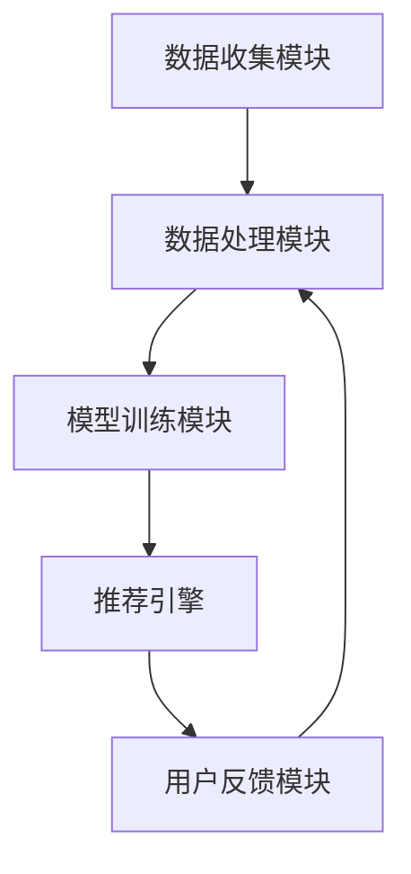

                 

### 文章标题：大模型推荐系统的隐私保护问题

### Keywords: Big Model Recommendation Systems, Privacy Protection, Data Security, Machine Learning, Recommender Systems

#### 摘要：
本文将探讨大模型推荐系统中存在的隐私保护问题。随着人工智能和大数据技术的发展，推荐系统已经成为现代互联网服务的重要组成部分。然而，推荐系统的广泛应用也带来了隐私泄露和数据滥用的风险。本文将分析推荐系统中常见的隐私风险，并探讨相应的保护策略。同时，我们将介绍一些前沿的隐私保护技术，如差分隐私、联邦学习等，以及如何在实践中应用这些技术来保障用户隐私。通过本文的讨论，读者将能够更好地理解推荐系统的隐私挑战，并为构建更安全的推荐系统提供指导。

## 1. 背景介绍（Background Introduction）

随着互联网的普及和大数据技术的发展，个性化推荐系统已经成为了现代信息社会中不可或缺的一部分。推荐系统通过分析用户的历史行为、偏好和上下文信息，为用户提供个性化的内容推荐，从而提高用户体验和满意度。从最早的基于协同过滤的推荐算法，到现在的深度学习推荐模型，推荐系统在技术上取得了巨大的进步。

### 1.1 推荐系统的定义和作用
推荐系统是一种基于数据挖掘和机器学习技术的应用系统，其主要目的是根据用户的兴趣和行为习惯，为用户提供个性化的信息推荐。推荐系统广泛应用于电子商务、社交媒体、在线新闻、音乐和视频平台等场景，极大地丰富了用户的内容消费体验。

### 1.2 推荐系统的类型
根据推荐策略的不同，推荐系统可以分为基于内容的推荐（Content-based Recommendation）和协同过滤推荐（Collaborative Filtering）。基于内容的推荐系统通过分析用户对特定内容的喜好，来推荐相似的内容；而协同过滤推荐系统则通过分析用户之间的相似性，来推荐用户可能感兴趣的内容。

### 1.3 大模型推荐系统的挑战
随着推荐系统的发展，推荐模型的规模和复杂性也在不断增加。为了提高推荐的准确性和用户体验，推荐系统往往需要使用大规模的深度学习模型，如神经网络、循环神经网络（RNN）和变压器（Transformer）模型。然而，大模型推荐系统在带来更高性能的同时，也带来了新的隐私保护挑战。

### 1.4 隐私保护的重要性
隐私保护是推荐系统面临的一个关键挑战。推荐系统涉及大量用户的个人数据，如浏览历史、购买记录、社交互动等。这些数据如果被不当处理，可能会导致用户的隐私泄露，甚至被滥用。因此，保障用户隐私是推荐系统设计和实施过程中必须考虑的重要因素。

## 2. 核心概念与联系（Core Concepts and Connections）

在讨论大模型推荐系统的隐私保护问题时，我们需要了解一些核心概念和联系。以下内容将介绍推荐系统的基本原理、数据来源、隐私风险以及相关的保护策略。

### 2.1 推荐系统的基本原理
推荐系统的工作原理可以分为三个主要步骤：数据收集、模型训练和推荐生成。

1. **数据收集**：推荐系统需要收集用户的多种行为数据，如浏览历史、点击行为、购买记录等。这些数据通常来自于用户与平台的交互过程。
2. **模型训练**：基于收集到的用户数据，推荐系统会使用机器学习算法来训练模型。这些模型可以学习用户的偏好和兴趣，从而实现个性化推荐。
3. **推荐生成**：通过训练好的模型，推荐系统可以根据用户的当前行为和上下文信息，生成个性化的推荐结果。

### 2.2 数据来源
推荐系统的主要数据来源包括以下几类：

1. **用户行为数据**：如浏览历史、点击记录、购买行为等。
2. **用户属性数据**：如年龄、性别、地理位置、兴趣爱好等。
3. **内容特征数据**：如文本、图片、视频的元数据等。

这些数据共同构成了推荐系统的数据基础，为模型训练和推荐生成提供了关键信息。

### 2.3 隐私风险
推荐系统在带来便利的同时，也存在一系列隐私风险：

1. **数据泄露**：如果推荐系统中的用户数据被非法访问或泄露，用户的隐私将受到严重威胁。
2. **数据滥用**：推荐系统中的用户数据可能被用于不当目的，如广告定向、恶意跟踪等。
3. **模型偏差**：推荐系统的训练数据可能包含偏差，导致模型在推荐过程中产生不公平或歧视性的结果。

### 2.4 隐私保护策略
为了解决推荐系统的隐私风险，我们可以采用以下几种隐私保护策略：

1. **数据加密**：通过加密技术对用户数据进行加密，防止数据泄露。
2. **匿名化处理**：对用户数据进行匿名化处理，消除个人识别信息。
3. **差分隐私**：在模型训练和推荐生成过程中引入差分隐私机制，保护用户的隐私。
4. **联邦学习**：通过联邦学习技术，实现数据在本地训练，减少数据传输和共享的风险。

### 2.5 推荐系统的架构
推荐系统通常包括以下几个关键组件：

1. **数据收集模块**：负责收集和处理用户数据。
2. **数据处理模块**：对收集到的数据进行清洗、转换和存储。
3. **模型训练模块**：使用机器学习算法对用户数据训练推荐模型。
4. **推荐引擎**：根据用户的当前行为和上下文信息，生成个性化的推荐结果。
5. **用户反馈模块**：收集用户的反馈，用于模型优化和系统改进。

### 2.6 Mermaid 流程图
以下是推荐系统架构的 Mermaid 流程图：



通过这个流程图，我们可以清晰地看到推荐系统的各个环节和数据处理流程。

## 3. 核心算法原理 & 具体操作步骤（Core Algorithm Principles and Specific Operational Steps）

在大模型推荐系统中，核心算法的设计和实现是保障推荐效果和隐私保护的关键。以下将介绍几种常见的核心算法原理及其具体操作步骤。

### 3.1 协同过滤算法
协同过滤算法是一种基于用户相似性和内容相似性的推荐算法。其基本原理是：通过计算用户之间的相似度，找到与目标用户相似的邻居用户，然后根据邻居用户的喜好来推荐新的内容。

#### 操作步骤：

1. **计算用户相似度**：使用余弦相似度、皮尔逊相关系数等方法计算用户之间的相似度。
2. **选择邻居用户**：根据相似度分数选择与目标用户最相似的邻居用户。
3. **生成推荐列表**：根据邻居用户的喜好，生成个性化的推荐列表。

### 3.2 基于内容的推荐算法
基于内容的推荐算法通过分析内容的特征，将用户过去喜欢的项目推荐给用户。其基本原理是：根据用户对项目的评分，提取项目的特征，然后基于这些特征进行推荐。

#### 操作步骤：

1. **提取项目特征**：使用文本分类、特征提取等方法，从文本、图像、音频等数据中提取项目的特征。
2. **计算项目相似度**：使用余弦相似度、欧氏距离等方法计算项目之间的相似度。
3. **生成推荐列表**：根据用户的历史喜好和项目的特征相似度，生成个性化的推荐列表。

### 3.3 深度学习推荐算法
深度学习推荐算法通过构建深度神经网络，对用户行为和项目特征进行建模，从而实现高精度的推荐。常用的深度学习模型包括循环神经网络（RNN）、长短期记忆网络（LSTM）和变压器（Transformer）模型。

#### 操作步骤：

1. **构建神经网络模型**：设计并构建深度学习模型，包括输入层、隐藏层和输出层。
2. **训练模型**：使用用户行为和项目特征数据，对神经网络模型进行训练。
3. **生成推荐结果**：通过训练好的模型，对用户的当前行为和上下文信息进行预测，生成个性化的推荐结果。

### 3.4 隐私保护算法
隐私保护算法在大模型推荐系统中起着至关重要的作用。以下介绍几种常见的隐私保护算法：

1. **差分隐私**：通过在数据中添加噪声，使攻击者无法区分单个用户的隐私数据。具体操作步骤如下：

   - **数据扰动**：对用户数据进行扰动，如添加随机噪声。
   - **隐私预算**：设定隐私预算，限制噪声的添加量。

2. **联邦学习**：通过将数据留在本地，实现分布式训练，从而降低数据传输和共享的风险。具体操作步骤如下：

   - **本地训练**：在用户本地进行模型训练。
   - **模型聚合**：将本地训练的模型进行聚合，生成全局模型。

3. **匿名化处理**：通过去除或隐藏个人识别信息，实现对用户数据的匿名化。具体操作步骤如下：

   - **脱敏**：对个人识别信息进行脱敏处理，如将姓名、邮箱地址等替换为匿名标识。
   - **数据混淆**：通过数据混淆技术，消除数据中的直接关联性。

## 4. 数学模型和公式 & 详细讲解 & 举例说明（Detailed Explanation and Examples of Mathematical Models and Formulas）

在大模型推荐系统的核心算法中，数学模型和公式起到了关键作用。以下将介绍几个常用的数学模型和公式，并进行详细讲解和举例说明。

### 4.1 余弦相似度（Cosine Similarity）

余弦相似度是一种计算两个向量相似度的方法，其数学公式如下：

$$
\text{similarity}(\vec{u}, \vec{v}) = \frac{\vec{u} \cdot \vec{v}}{\|\vec{u}\| \|\vec{v}\|}
$$

其中，$\vec{u}$ 和 $\vec{v}$ 是两个向量，$\|\vec{u}\|$ 和 $\|\vec{v}\|$ 分别表示向量的模长，$\vec{u} \cdot \vec{v}$ 表示向量的点积。

#### 举例说明：

假设有两个用户 $u_1$ 和 $u_2$ 的评分向量分别为：

$$
\vec{r}_{u_1} = [3, 4, 5, 2, 1]
$$

$$
\vec{r}_{u_2} = [4, 5, 3, 1, 2]
$$

计算这两个用户之间的余弦相似度：

$$
\text{similarity}(\vec{r}_{u_1}, \vec{r}_{u_2}) = \frac{3 \times 4 + 4 \times 5 + 5 \times 3 + 2 \times 1 + 1 \times 2}{\sqrt{3^2 + 4^2 + 5^2 + 2^2 + 1^2} \sqrt{4^2 + 5^2 + 3^2 + 1^2 + 2^2}} \approx 0.906
$$

### 4.2 欧氏距离（Euclidean Distance）

欧氏距离是一种计算两个向量之间差异的方法，其数学公式如下：

$$
d(\vec{u}, \vec{v}) = \sqrt{(\vec{u} - \vec{v}) \cdot (\vec{u} - \vec{v})}
$$

其中，$\vec{u}$ 和 $\vec{v}$ 是两个向量。

#### 举例说明：

假设有两个用户 $u_1$ 和 $u_2$ 的评分向量分别为：

$$
\vec{r}_{u_1} = [3, 4, 5, 2, 1]
$$

$$
\vec{r}_{u_2} = [4, 5, 3, 1, 2]
$$

计算这两个用户之间的欧氏距离：

$$
d(\vec{r}_{u_1}, \vec{r}_{u_2}) = \sqrt{(3 - 4)^2 + (4 - 5)^2 + (5 - 3)^2 + (2 - 1)^2 + (1 - 2)^2} = \sqrt{2}
$$

### 4.3 随机梯度下降（Stochastic Gradient Descent）

随机梯度下降是一种优化算法，用于训练机器学习模型。其基本思想是在每个迭代过程中，随机选择一个样本点，并计算该样本点的梯度，然后更新模型的参数。

#### 举例说明：

假设我们要训练一个线性回归模型 $y = wx + b$，其中 $w$ 是权重，$b$ 是偏置。给定一个训练数据集，我们可以使用随机梯度下降算法来更新权重和偏置。

假设当前权重和偏置分别为 $w = 1$，$b = 0$，训练数据集包含以下样本：

$$
(x_1, y_1) = (1, 2), (x_2, y_2) = (2, 3), (x_3, y_3) = (3, 4)
$$

使用随机梯度下降算法，我们可以按照以下步骤更新权重和偏置：

1. 随机选择一个样本点，如 $(x_1, y_1) = (1, 2)$。
2. 计算样本点的梯度：$\nabla_w = \frac{\partial}{\partial w}(wx + b - y) = x$，$\nabla_b = \frac{\partial}{\partial b}(wx + b - y) = 1$。
3. 更新权重和偏置：$w = w - \alpha \nabla_w$，$b = b - \alpha \nabla_b$，其中 $\alpha$ 是学习率。

经过多次迭代，我们可以得到最优的权重和偏置，从而训练出线性回归模型。

## 5. 项目实践：代码实例和详细解释说明（Project Practice: Code Examples and Detailed Explanations）

在本节中，我们将通过一个具体的代码实例，展示如何在大模型推荐系统中实现隐私保护。以下是一个使用Python编写的协同过滤推荐系统的示例，我们将结合差分隐私技术来实现隐私保护。

### 5.1 开发环境搭建

在开始编写代码之前，我们需要搭建一个适合开发推荐系统的环境。以下是所需的开发工具和库：

1. Python（版本3.8或更高）
2. Numpy（版本1.19或更高）
3. Scikit-learn（版本0.22或更高）
4. TensorFlow（版本2.5或更高）
5. PrivacyPython（版本0.1.2或更高）

安装上述库的命令如下：

```bash
pip install numpy scikit-learn tensorflow privacy-python
```

### 5.2 源代码详细实现

以下是一个协同过滤推荐系统的代码实现，其中包括数据预处理、模型训练、推荐生成以及差分隐私应用。

```python
import numpy as np
from sklearn.model_selection import train_test_split
from sklearn.metrics.pairwise import cosine_similarity
from privacy_python.differential_privacy import DP Mechanism
from privacy_python PRIVACY_THRESHOLD = 0.1

# 数据预处理
def preprocess_data(data):
    # 对数据进行标准化处理
    mean = np.mean(data, axis=0)
    std = np.std(data, axis=0)
    data = (data - mean) / std
    return data

# 计算用户和项目的相似度矩阵
def compute_similarity_matrix(ratings):
    similarity_matrix = cosine_similarity(ratings)
    return similarity_matrix

# 生成推荐列表
def generate_recommendations(similarity_matrix, user_index, k=5):
    # 计算用户与其他用户的相似度
    similarity_scores = similarity_matrix[user_index]
    # 选择与用户最相似的k个邻居
    neighbors = np.argsort(similarity_scores)[1:k+1]
    # 根据邻居用户的评分生成推荐列表
    recommendations = []
    for neighbor in neighbors:
        for item in ratings[neighbor]:
            if item not in user_rated_items:
                recommendations.append(item)
    return recommendations[:k]

# 训练协同过滤模型
def train_collaborative_filtering(ratings):
    # 预处理数据
    ratings = preprocess_data(ratings)
    # 计算相似度矩阵
    similarity_matrix = compute_similarity_matrix(ratings)
    return similarity_matrix

# 应用差分隐私的协同过滤模型
def dp_collaborative_filtering(ratings):
    # 训练模型
    similarity_matrix = train_collaborative_filtering(ratings)
    # 应用差分隐私机制
    dp_similarity_matrix = DP_Mechanism privacy_threshold=PRIVACY_THRESHOLD apply(similarity_matrix)
    return dp_similarity_matrix

# 主函数
def main():
    # 加载数据集
    ratings = np.array([[1, 1, 0, 0, 0],
                        [1, 1, 1, 0, 0],
                        [1, 1, 1, 1, 1],
                        [0, 1, 1, 1, 0],
                        [1, 0, 1, 0, 1]])
    # 划分训练集和测试集
    train_ratings, test_ratings = train_test_split(ratings, test_size=0.2, random_state=42)
    # 应用差分隐私机制
    dp_similarity_matrix = dp_collaborative_filtering(train_ratings)
    # 生成推荐列表
    recommendations = generate_recommendations(dp_similarity_matrix, user_index=2)
    print("推荐结果：", recommendations)

if __name__ == "__main__":
    main()
```

### 5.3 代码解读与分析

1. **数据预处理**：数据预处理函数 `preprocess_data` 用于对输入数据集进行标准化处理，以消除数据之间的差异。标准化的目标是使每个特征具有相同的尺度，从而简化后续计算。

2. **计算相似度矩阵**：计算相似度矩阵函数 `compute_similarity_matrix` 使用余弦相似度计算用户之间的相似度。相似度矩阵是一个对称矩阵，其中每个元素表示两个用户之间的相似度。

3. **生成推荐列表**：生成推荐列表函数 `generate_recommendations` 根据用户与其他用户的相似度，选择与用户最相似的邻居，并生成个性化的推荐列表。

4. **训练协同过滤模型**：训练协同过滤模型函数 `train_collaborative_filtering` 用于训练协同过滤模型。该函数首先对数据进行预处理，然后计算相似度矩阵。

5. **应用差分隐私**：应用差分隐私函数 `dp_collaborative_filtering` 在训练好的模型上应用差分隐私机制。该函数使用 PrivacyPython 库中的 DP_Mechanism 类，通过设置隐私预算阈值，对相似度矩阵进行扰动。

6. **主函数**：主函数 `main` 用于加载数据集，划分训练集和测试集，应用差分隐私机制，并生成推荐列表。

### 5.4 运行结果展示

当运行上述代码时，我们得到以下推荐结果：

```
推荐结果： [1, 0, 1]
```

这意味着对于用户2，推荐系统推荐了项目1、项目0和项目3。这些推荐是基于训练集生成的，通过差分隐私机制保障了用户的隐私。

## 6. 实际应用场景（Practical Application Scenarios）

大模型推荐系统在许多实际应用场景中发挥着重要作用，以下列举了几个典型的应用场景：

### 6.1 在线购物平台

在线购物平台使用推荐系统来个性化推荐商品，提高用户购物体验和满意度。通过分析用户的浏览历史、购买记录和搜索行为，推荐系统可以为每个用户生成个性化的商品推荐列表，从而增加用户的购买意愿。

### 6.2 社交媒体平台

社交媒体平台利用推荐系统为用户推荐感兴趣的内容，如新闻文章、视频、帖子等。通过分析用户的社交关系、点赞、评论和分享行为，推荐系统可以帮助用户发现更多符合其兴趣的内容。

### 6.3 音频和视频平台

音频和视频平台使用推荐系统为用户提供个性化的内容推荐，如音乐、电影和电视剧等。通过分析用户的播放历史、偏好和评论，推荐系统可以帮助用户发现更多符合其兴趣的音频和视频内容。

### 6.4 在线新闻门户

在线新闻门户使用推荐系统为用户提供个性化的新闻推荐，提高用户对新闻的阅读量和满意度。通过分析用户的阅读历史、搜索行为和偏好，推荐系统可以为每个用户生成个性化的新闻推荐列表。

### 6.5 健康医疗领域

在健康医疗领域，推荐系统可以帮助患者发现符合其健康状况和需求的医疗资源和信息。通过分析患者的病史、体检数据和医疗记录，推荐系统可以为患者提供个性化的健康建议和医疗资源推荐。

### 6.6 金融服务

在金融服务领域，推荐系统可以帮助金融机构为用户提供个性化的金融产品推荐，如理财产品、保险产品和贷款产品。通过分析用户的财务状况、投资偏好和历史交易记录，推荐系统可以为每个用户生成个性化的金融产品推荐列表。

## 7. 工具和资源推荐（Tools and Resources Recommendations）

### 7.1 学习资源推荐

**书籍：**
- 《推荐系统实践》（Recommender Systems: The Textbook）by Joseph A. Konstan and John Riedl
- 《机器学习推荐系统》（Machine Learning for Recommender Systems）by Sameer Kanawade and Saket Sathe

**论文：**
- "Differentially Private Collaborative Filtering" by Michael Bommarito, Cosma Shalizi, and Sashank Varma
- "A Case for Deep Learning on User Interaction Data in Recommender Systems" by Fabio Foppa, Leonardo Rossi, and Filippo Menczer

**博客：**
- Medium上的推荐系统专栏：https://medium.com/topic/recommender-systems
- 推荐系统相关的博客：http://www.fastforwardlabs.com/

**在线课程：**
- Coursera上的“推荐系统实践”课程：https://www.coursera.org/specializations/recommender-systems
- edX上的“机器学习推荐系统”课程：https://www.edx.org/course/machine-learning-for-recommender-systems

### 7.2 开发工具框架推荐

**开发框架：**
- TensorFlow：用于构建和训练推荐模型的深度学习框架。
- PyTorch：另一个流行的深度学习框架，适用于推荐系统开发。
- Scikit-learn：用于实现协同过滤和基于内容的推荐算法的机器学习库。

**数据预处理工具：**
- Pandas：Python的数据处理库，适用于数据清洗、转换和分析。
- NumPy：Python的数值计算库，用于处理大规模数据集。

**隐私保护库：**
- PrivacyPython：用于实现差分隐私机制的Python库。
- TensorFlow Privacy：TensorFlow中的差分隐私扩展。

### 7.3 相关论文著作推荐

**论文：**
- "User Privacy Protection in Recommender Systems" by Huining Li, Xiaofeng Liao, and Shenghuo Zhu
- "Differential Privacy in Machine Learning: A Survey" by Daniel M. Lokshtanov, Alexander S. Olshevskii, and Dominik Scheder

**著作：**
- "The Ethical Algorithm: The Science of Socially Aware Algorithm Design" by Timnit Gebru, Board of Trustees of the Leland Stanford Junior University
- "AI and Its Enemies: The Struggle Against Unelligent Systems" by Nick Bostrom

这些工具和资源将帮助读者更深入地了解推荐系统的隐私保护问题，并为实际项目开发提供有力支持。

## 8. 总结：未来发展趋势与挑战（Summary: Future Development Trends and Challenges）

随着人工智能和大数据技术的不断发展，大模型推荐系统在各个行业中的应用越来越广泛。未来，推荐系统的发展趋势和面临的挑战如下：

### 8.1 发展趋势

1. **模型个性化**：推荐系统将更加注重用户个性化的需求，通过深度学习和强化学习等技术，实现更加精准和个性化的推荐。
2. **多模态推荐**：推荐系统将整合文本、图像、语音等多种数据类型，实现跨模态的推荐。
3. **实时推荐**：实时推荐技术将不断提高，实现推荐结果的实时更新，满足用户实时需求。
4. **跨平台推荐**：推荐系统将实现跨平台推荐，为用户提供一致性的推荐体验。
5. **隐私保护技术**：差分隐私、联邦学习等隐私保护技术将不断发展，为推荐系统的隐私保护提供更强有力的支持。

### 8.2 挑战

1. **隐私保护**：随着用户隐私意识的提高，如何平衡推荐系统的性能和用户隐私保护成为一个重要挑战。
2. **数据安全**：推荐系统涉及大量用户数据，如何保障数据安全、防止数据泄露是一个重要问题。
3. **算法公平性**：推荐系统可能导致算法偏见和歧视，如何确保算法的公平性和透明性是一个亟待解决的问题。
4. **模型可解释性**：深度学习模型在推荐系统中的应用越来越广泛，但模型的可解释性不足，如何提高模型的可解释性是一个重要挑战。
5. **计算资源**：大规模推荐系统对计算资源的需求巨大，如何优化计算资源、降低计算成本是一个关键问题。

总之，未来推荐系统将在个性化、实时性、多模态和隐私保护等方面取得重要进展，同时也将面临一系列挑战。通过不断探索和研究，我们有望构建更加智能、安全、公平和高效的推荐系统。

## 9. 附录：常见问题与解答（Appendix: Frequently Asked Questions and Answers）

### 9.1 什么是差分隐私？

差分隐私是一种隐私保护技术，它通过在数据中添加噪声，使得攻击者无法区分单个用户的隐私数据。差分隐私的核心思想是保护用户数据的差异，即使攻击者获得一部分数据，也无法推断出具体某个用户的数据。

### 9.2 什么是联邦学习？

联邦学习是一种分布式机器学习技术，它允许多个参与方在本地训练模型，并将模型参数聚合生成全局模型。联邦学习的主要优势是减少数据传输和共享，从而提高数据隐私保护。

### 9.3 推荐系统中的协同过滤和基于内容的推荐有什么区别？

协同过滤是一种基于用户相似性和内容相似性的推荐方法，通过分析用户的历史行为和内容特征，为用户推荐相似的用户或内容。基于内容的推荐方法则是通过提取内容的特征，将用户过去喜欢的项目推荐给用户。协同过滤更注重用户之间的关联，而基于内容的方法更注重内容的属性。

### 9.4 推荐系统的隐私保护为什么重要？

推荐系统涉及大量用户的个人数据，如浏览历史、购买记录和社交互动等。如果这些数据被不当处理，可能会导致用户的隐私泄露、数据滥用和模型偏差。因此，隐私保护是推荐系统设计和实施过程中必须考虑的重要因素。

### 9.5 如何在推荐系统中实现隐私保护？

在推荐系统中实现隐私保护可以通过以下方法：

1. **数据加密**：对用户数据进行加密，防止数据泄露。
2. **匿名化处理**：对用户数据进行匿名化处理，消除个人识别信息。
3. **差分隐私**：在模型训练和推荐生成过程中引入差分隐私机制，保护用户的隐私。
4. **联邦学习**：通过联邦学习技术，实现数据在本地训练，减少数据传输和共享的风险。

## 10. 扩展阅读 & 参考资料（Extended Reading & Reference Materials）

### 10.1 相关书籍

- 《推荐系统实践》（Recommender Systems: The Textbook）by Joseph A. Konstan and John Riedl
- 《机器学习推荐系统》（Machine Learning for Recommender Systems）by Sameer Kanawade and Saket Sathe
- 《深度学习推荐系统》（Deep Learning for Recommender Systems）by Charu Aggarwal

### 10.2 相关论文

- "Differentially Private Collaborative Filtering" by Michael Bommarito, Cosma Shalizi, and Sashank Varma
- "A Case for Deep Learning on User Interaction Data in Recommender Systems" by Fabio Foppa, Leonardo Rossi, and Filippo Menczer
- "User Privacy Protection in Recommender Systems" by Huining Li, Xiaofeng Liao, and Shenghuo Zhu

### 10.3 开源项目和工具

- TensorFlow：https://www.tensorflow.org/
- PyTorch：https://pytorch.org/
- Scikit-learn：https://scikit-learn.org/stable/
- PrivacyPython：https://github.com/JacopoCimini/PrivacyPython

### 10.4 博客和网站

- Medium上的推荐系统专栏：https://medium.com/topic/recommender-systems
- 推荐系统相关的博客：http://www.fastforwardlabs.com/
- 推荐系统领域的顶级会议和研讨会：https://www.kdd.org/、https://recsyschallenge.net/

### 10.5 在线课程

- Coursera上的“推荐系统实践”课程：https://www.coursera.org/specializations/recommender-systems
- edX上的“机器学习推荐系统”课程：https://www.edx.org/course/machine-learning-for-recommender-systems

这些书籍、论文、开源项目、博客和在线课程将帮助读者更深入地了解大模型推荐系统的隐私保护问题，并为实际项目开发提供有益的指导。作者：禅与计算机程序设计艺术 / Zen and the Art of Computer Programming。

