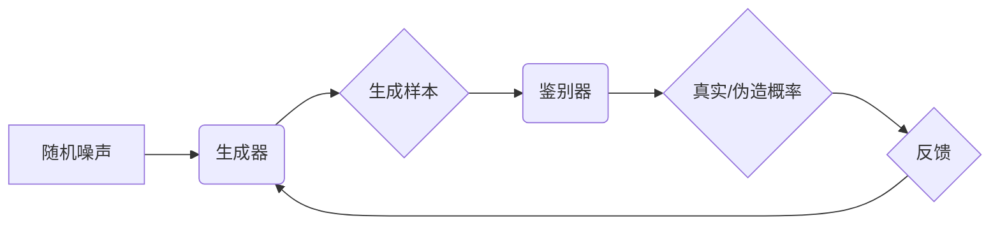

                 

## 1. 背景介绍

近年来，人工智能（AI）领域取得了令人瞩目的进展，其中生成对抗网络（Generative Adversarial Networks，GANs）作为一种革新性的技术，在图像生成、文本生成、音频合成等领域展现出强大的创造力。GANs 能够学习数据分布，并生成逼真、高质量的样本，为我们提供了一种全新的视角，去理解和操控数据。

传统的机器学习方法主要依赖于监督学习，需要大量的标注数据进行训练。而 GANs 则采用了一种全新的无监督学习方法，通过两个相互竞争的网络——生成器（Generator）和鉴别器（Discriminator）——共同学习数据分布。这种对抗机制使得 GANs 能够学习到更复杂的模式和结构，并生成更逼真的样本。

## 2. 核心概念与联系

### 2.1  生成器（Generator）

生成器网络负责生成新的数据样本，其输入是一个随机噪声向量，输出则是模拟真实数据分布的样本。

### 2.2  鉴别器（Discriminator）

鉴别器网络负责判断数据样本的真实性，其输入是数据样本，输出是一个概率值，表示该样本是真实数据还是生成数据。

### 2.3  对抗机制

生成器和鉴别器之间存在着一种对抗关系。生成器试图生成逼真的样本来欺骗鉴别器，而鉴别器则试图准确地识别出生成样本。这种相互竞争的过程不断推动着两个网络的改进，最终使得生成器能够生成越来越逼真的样本。

**Mermaid 流程图**



## 3. 核心算法原理 & 具体操作步骤

### 3.1  算法原理概述

GANs 的核心算法原理是基于两个神经网络的对抗训练。生成器网络试图生成逼真的样本，而鉴别器网络试图区分真实样本和生成样本。这两个网络在对抗训练过程中不断学习和改进，最终使得生成器能够生成逼真的样本。

### 3.2  算法步骤详解

1. **初始化：** 初始化生成器和鉴别器网络的权重。
2. **生成样本：** 生成器网络根据随机噪声向量生成样本。
3. **鉴别样本：** 鉴别器网络对真实样本和生成样本进行分类，输出真实/伪造概率。
4. **更新权重：** 根据鉴别器的反馈，更新生成器网络的权重，使其生成更逼真的样本。
5. **更新鉴别器：** 根据真实样本和生成样本的分类结果，更新鉴别器网络的权重，使其更准确地识别生成样本。
6. **重复步骤 2-5：** 重复上述步骤，直到生成器能够生成逼真的样本，或者达到预设的训练目标。

### 3.3  算法优缺点

**优点：**

* **生成逼真样本：** GANs 能够学习到数据分布的复杂模式，并生成逼真的样本。
* **无监督学习：** GANs 不需要大量的标注数据进行训练，可以利用未标记的数据进行学习。
* **应用广泛：** GANs 在图像生成、文本生成、音频合成等领域都有广泛的应用。

**缺点：**

* **训练困难：** GANs 的训练过程比较复杂，容易出现模式崩溃等问题。
* **评价指标不完善：** 目前还没有一个完善的评价指标来衡量 GANs 的生成质量。
* **伦理问题：** GANs 可以生成逼真的虚假内容，可能引发一些伦理问题。

### 3.4  算法应用领域

* **图像生成：** 生成高质量的图像，例如人脸、风景、物体等。
* **文本生成：** 生成逼真的文本，例如小说、诗歌、对话等。
* **音频合成：** 生成逼真的音频，例如语音、音乐、音效等。
* **视频生成：** 生成逼真的视频，例如电影片段、动画等。
* **数据增强：** 生成新的训练数据，提高机器学习模型的性能。

## 4. 数学模型和公式 & 详细讲解 & 举例说明

### 4.1  数学模型构建

GANs 的数学模型主要由两个部分组成：生成器网络 $G$ 和鉴别器网络 $D$。

* **生成器网络 $G$：** 接收一个随机噪声向量 $z$ 作为输入，输出一个模拟真实数据分布的样本 $x'$。

* **鉴别器网络 $D$：** 接收一个数据样本 $x$ 作为输入，输出一个概率值 $p(x)$，表示该样本是真实数据还是生成数据。

### 4.2  公式推导过程

GANs 的训练目标是让生成器网络生成逼真的样本，使得鉴别器网络无法区分真实样本和生成样本。

* **生成器损失函数：**

$$
L_G(G, D) = -E_{z \sim p_z(z)}[log(D(G(z)))]
$$

* **鉴别器损失函数：**

$$
L_D(G, D) = -E_{x \sim p_{data}(x)}[log(D(x))] - E_{z \sim p_z(z)}[log(1 - D(G(z)))]
$$

其中：

* $p_z(z)$ 是随机噪声向量的分布。
* $p_{data}(x)$ 是真实数据样本的分布。

### 4.3  案例分析与讲解

假设我们想要训练一个生成人脸图像的 GANs。

* **生成器网络 $G$：** 接收一个随机噪声向量 $z$ 作为输入，输出一张人脸图像 $x'$。
* **鉴别器网络 $D$：** 接收一张图像 $x$ 作为输入，输出一个概率值 $p(x)$，表示该图像是真实人脸图像还是生成人脸图像。

训练过程中，生成器网络会不断尝试生成逼真的人脸图像，而鉴别器网络会不断尝试识别出生成的人脸图像。最终，生成器网络能够生成逼真的人脸图像，使得鉴别器网络无法区分真实人脸图像和生成人脸图像。

## 5. 项目实践：代码实例和详细解释说明

### 5.1  开发环境搭建

* **操作系统：** Linux 或 macOS
* **编程语言：** Python
* **深度学习框架：** TensorFlow 或 PyTorch
* **其他依赖：** NumPy、Matplotlib 等

### 5.2  源代码详细实现

以下是一个使用 TensorFlow 实现简单 GANs 的代码示例：

```python
import tensorflow as tf

# 定义生成器网络
def generator(z):
  # ...

# 定义鉴别器网络
def discriminator(x):
  # ...

# 定义损失函数和优化器
optimizer_G = tf.keras.optimizers.Adam(learning_rate=0.0002)
optimizer_D = tf.keras.optimizers.Adam(learning_rate=0.0002)

# 定义训练循环
def train_step(images):
  # ...

# 训练模型
for epoch in range(num_epochs):
  for batch in dataloader:
    train_step(batch)

```

### 5.3  代码解读与分析

* **生成器网络：** 接收一个随机噪声向量 $z$ 作为输入，并通过一系列全连接层和卷积层生成一张人脸图像 $x'$。
* **鉴别器网络：** 接收一张图像 $x$ 作为输入，并通过一系列卷积层和全连接层输出一个概率值 $p(x)$，表示该图像是真实人脸图像还是生成人脸图像。
* **损失函数：** 生成器网络的损失函数是使鉴别器网络输出的概率值尽可能高，而鉴别器网络的损失函数是使真实样本的概率值尽可能高，生成样本的概率值尽可能低。
* **优化器：** 使用 Adam 优化器来更新生成器网络和鉴别器网络的权重。

### 5.4  运行结果展示

训练完成后，可以将生成器网络输入随机噪声向量，生成逼真的人脸图像。

## 6. 实际应用场景

### 6.1  图像生成

* **艺术创作：** 生成新的艺术作品，例如绘画、雕塑、音乐等。
* **游戏开发：** 生成游戏场景、角色、道具等。
* **电影制作：** 生成电影特效、虚拟角色等。

### 6.2  文本生成

* **小说创作：** 生成小说、诗歌、剧本等。
* **对话系统：** 生成逼真的对话文本，用于聊天机器人、虚拟助手等。
* **机器翻译：** 生成高质量的机器翻译文本。

### 6.3  音频合成

* **语音合成：** 生成逼真的语音，用于语音助手、语音识别等。
* **音乐创作：** 生成新的音乐作品，例如旋律、伴奏等。
* **音效制作：** 生成逼真的音效，用于游戏、电影等。

### 6.4  未来应用展望

GANs 在未来将有更广泛的应用，例如：

* **医疗领域：** 生成医学图像，辅助医生诊断和治疗。
* **教育领域：** 生成个性化学习内容，提高学习效率。
* **科学研究：** 生成新的科学数据，加速科学发现。

## 7. 工具和资源推荐

### 7.1  学习资源推荐

* **书籍：**
    * 《Generative Deep Learning》 by David Foster
    * 《Deep Learning》 by Ian Goodfellow, Yoshua Bengio, and Aaron Courville
* **在线课程：**
    * Coursera: Deep Learning Specialization
    * Udacity: Deep Learning Nanodegree
* **博客和网站：**
    * Distill.pub
    * Towards Data Science

### 7.2  开发工具推荐

* **深度学习框架：** TensorFlow, PyTorch, Keras
* **编程语言：** Python
* **数据可视化工具：** Matplotlib, Seaborn

### 7.3  相关论文推荐

* **Generative Adversarial Networks** by Ian Goodfellow et al. (2014)
* **DCGAN: Unsupervised Representation Learning with Deep Convolutional Generative Adversarial Networks** by Radford Neal et al. (2015)
* **Progressive Growing of GANs for Improved Quality, Stability, and Variation** by Tero Karras et al. (2017)

## 8. 总结：未来发展趋势与挑战

### 8.1  研究成果总结

GANs 在过去几年取得了显著的进展，在图像生成、文本生成、音频合成等领域取得了令人瞩目的成果。

### 8.2  未来发展趋势

* **更高质量的样本生成：** 研究者们将继续探索新的 GANs 架构和训练方法，以生成更高质量、更逼真的样本。
* **更广泛的应用场景：** GANs 将应用于更多领域，例如医疗、教育、科学研究等。
* **更强大的控制能力：** 研究者们将探索如何更好地控制 GANs 的生成过程，使其能够生成更符合特定需求的样本。

### 8.3  面临的挑战

* **训练稳定性：** GANs 的训练过程比较复杂，容易出现模式崩溃等问题。
* **样本质量评估：** 目前还没有一个完善的评价指标来衡量 GANs 的生成质量。
* **伦理问题：** GANs 可以生成逼真的虚假内容，可能引发一些伦理问题。

### 8.4  研究展望

未来，GANs 将继续是一个重要的研究方向，我们将看到更多新的进展和应用。


## 9. 附录：常见问题与解答

* **什么是模式崩溃？**

模式崩溃是指 GANs 训练过程中，生成器网络生成样本质量下降，甚至退化到一个固定的模式。

* **如何解决模式崩溃问题？**

一些方法可以用来解决模式崩溃问题，例如：

* 使用更复杂的 GANs 架构。
* 使用更好的训练策略，例如：

* 梯度惩罚
* 权重衰减
* 

* 使用更大的数据集。

* **如何评价 GANs 的生成质量？**

目前还没有一个完善的评价指标来衡量 GANs 的生成质量。一些常用的指标包括：

* Inception Score (IS)
* Fréchet Inception Distance (FID)
* 

* **GANs 的伦理问题是什么？**

GANs 可以生成逼真的虚假内容，可能引发一些伦理问题，例如：

* 虚假信息传播
* 身份盗窃
* 

* **GANs 的未来发展趋势是什么？**

GANs 将继续是一个重要的研究方向，我们将看到更多新的进展和应用。


作者：禅与计算机程序设计艺术 / Zen and the Art of Computer Programming<end_of_turn>

