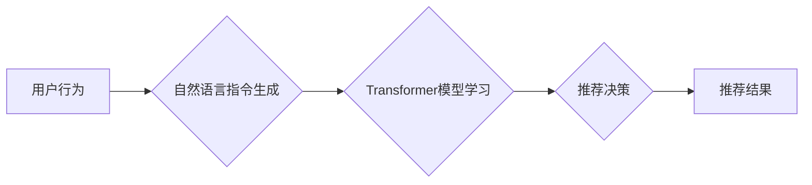

                 

## InstructRec：自然语言指令的强大优势

> 关键词：自然语言指令、InstructRec模型、推荐系统、机器学习、Transformer、文本理解、用户行为预测

## 1. 背景介绍

推荐系统是互联网时代不可或缺的一部分，它通过分析用户历史行为、偏好和上下文信息，为用户推荐个性化内容，例如商品、文章、视频等。传统的推荐系统主要依赖于基于内容的过滤、协同过滤等方法，但这些方法在面对海量数据和用户多样化需求时，往往难以提供精准的推荐结果。

近年来，随着自然语言处理（NLP）技术的飞速发展，自然语言指令开始在推荐系统中扮演越来越重要的角色。自然语言指令能够更直观地表达用户的意图，并提供更丰富的上下文信息，从而帮助推荐系统更好地理解用户的需求，并提供更精准的推荐结果。

InstructRec是基于自然语言指令的推荐系统模型，它利用Transformer架构和强化学习算法，能够有效地学习用户指令的语义信息，并将其转化为推荐决策。InstructRec的出现，为推荐系统领域带来了新的思路和可能性，为构建更智能、更精准的推荐系统提供了新的技术支撑。

## 2. 核心概念与联系

InstructRec的核心概念是将用户行为转化为自然语言指令，并利用Transformer模型学习指令的语义信息。

**2.1  自然语言指令**

自然语言指令是指用户使用自然语言表达的推荐请求，例如：“推荐给我一些最近流行的电影”、“给我推荐一些适合我年龄段的书籍”等。

**2.2  Transformer模型**

Transformer模型是一种基于深度学习的序列到序列模型，它能够有效地学习文本序列中的长距离依赖关系，并捕捉文本的语义信息。

**2.3  强化学习**

强化学习是一种机器学习方法，它通过奖励机制来训练模型，使其能够在特定环境中做出最优决策。

**2.4  推荐决策**

推荐决策是指根据用户指令和模型学习到的语义信息，选择最合适的推荐结果。

**Mermaid 流程图**



## 3. 核心算法原理 & 具体操作步骤

### 3.1  算法原理概述

InstructRec模型的核心算法原理是利用Transformer模型学习用户指令的语义信息，并将其转化为推荐决策。具体来说，InstructRec模型包含以下几个关键模块：

* **指令编码器:** 将用户指令转化为向量表示，捕捉指令的语义信息。
* **上下文编码器:** 将用户历史行为和上下文信息转化为向量表示，提供指令的语境信息。
* **融合模块:** 将指令编码器和上下文编码器的输出进行融合，生成综合的推荐表示。
* **推荐策略:** 根据融合后的推荐表示，选择最合适的推荐结果。

### 3.2  算法步骤详解

1. **数据预处理:** 将用户行为数据和文本数据进行预处理，例如文本清洗、分词、词向量化等。
2. **指令编码:** 使用Transformer模型的编码器部分，将用户指令转化为向量表示。
3. **上下文编码:** 使用Transformer模型的编码器部分，将用户历史行为和上下文信息转化为向量表示。
4. **融合:** 将指令编码器和上下文编码器的输出进行融合，生成综合的推荐表示。
5. **推荐策略:** 使用基于策略的推荐算法，例如排名算法、选择算法等，根据融合后的推荐表示，选择最合适的推荐结果。

### 3.3  算法优缺点

**优点:**

* **精准度高:** InstructRec模型能够有效地学习用户指令的语义信息，并将其转化为推荐决策，从而提高推荐的精准度。
* **可解释性强:** InstructRec模型基于Transformer模型，其结构相对透明，能够更好地解释推荐结果背后的逻辑。
* **适应性强:** InstructRec模型能够适应用户多样化的需求，并根据用户的指令进行个性化推荐。

**缺点:**

* **训练成本高:** InstructRec模型需要大量的训练数据和计算资源，训练成本相对较高。
* **数据依赖性强:** InstructRec模型的性能依赖于训练数据的质量，如果训练数据不足或质量较低，模型的性能会受到影响。

### 3.4  算法应用领域

InstructRec模型在以下领域具有广泛的应用前景:

* **电商推荐:** 为用户推荐个性化的商品。
* **内容推荐:** 为用户推荐个性化的文章、视频、音乐等内容。
* **社交推荐:** 为用户推荐新的朋友、兴趣小组等。
* **教育推荐:** 为学生推荐个性化的学习资源。

## 4. 数学模型和公式 & 详细讲解 & 举例说明

### 4.1  数学模型构建

InstructRec模型的数学模型主要基于Transformer架构和强化学习算法。

**4.1.1 Transformer架构**

Transformer模型的核心是自注意力机制和多头注意力机制。自注意力机制能够捕捉文本序列中的长距离依赖关系，而多头注意力机制能够从不同的角度学习文本的语义信息。

**4.1.2 强化学习算法**

强化学习算法通过奖励机制来训练模型，使其能够在特定环境中做出最优决策。在InstructRec模型中，用户点击推荐结果作为奖励信号，模型通过最大化奖励信号来学习最优的推荐策略。

### 4.2  公式推导过程

InstructRec模型的具体公式推导过程较为复杂，涉及到Transformer模型的注意力机制、编码器和解码器结构，以及强化学习算法的Bellman方程等。

**4.2.1 注意力机制公式**

注意力机制的核心公式是计算每个词与其他词之间的相关性，并根据相关性权重来生成输出。

$$
Attention(Q, K, V) = softmax(\frac{QK^T}{\sqrt{d_k}})V
$$

其中，Q、K、V分别代表查询矩阵、键矩阵和值矩阵，$d_k$代表键向量的维度。

**4.2.2 Bellman方程**

Bellman方程是强化学习算法的核心公式，它描述了状态价值函数与奖励函数和下一个状态价值函数之间的关系。

$$
V(s) = \max_{\alpha} \sum_{s'} P(s' | s, \alpha) [R(s, \alpha, s') + \gamma V(s')]
$$

其中，$V(s)$代表当前状态的价值函数，$R(s, \alpha, s')$代表从状态$s$采取动作$\alpha$后到达状态$s'$的奖励，$\gamma$代表折扣因子，$P(s' | s, \alpha)$代表从状态$s$采取动作$\alpha$后到达状态$s'$的概率。

### 4.3  案例分析与讲解

假设用户输入指令：“推荐给我一些最近流行的电影”。InstructRec模型会将该指令转化为向量表示，并将其与用户历史行为和上下文信息进行融合，最终生成一个推荐列表。

在推荐列表中，模型会优先推荐那些最近流行且与用户兴趣相符的电影。例如，如果用户之前看过一些科幻电影，那么模型会优先推荐一些最近流行的科幻电影。

## 5. 项目实践：代码实例和详细解释说明

### 5.1  开发环境搭建

InstructRec模型的开发环境搭建需要以下软件和工具:

* Python 3.x
* PyTorch 或 TensorFlow
* CUDA 和 cuDNN (可选，用于GPU加速)
* Git

### 5.2  源代码详细实现

InstructRec模型的源代码实现较为复杂，涉及到Transformer模型的结构定义、训练过程的实现以及推荐策略的定义等。

由于篇幅限制，这里只提供InstructRec模型的简单代码示例，具体实现细节请参考相关开源代码库。

```python
import torch
import torch.nn as nn

class InstructRecModel(nn.Module):
    def __init__(self, vocab_size, embedding_dim, hidden_dim):
        super(InstructRecModel, self).__init__()
        self.embedding = nn.Embedding(vocab_size, embedding_dim)
        self.transformer = Transformer(embedding_dim, hidden_dim)
        self.fc = nn.Linear(hidden_dim, 1)

    def forward(self, instruction, context):
        embedded_instruction = self.embedding(instruction)
        embedded_context = self.embedding(context)
        fused_representation = self.transformer(embedded_instruction, embedded_context)
        prediction = self.fc(fused_representation)
        return prediction
```

### 5.3  代码解读与分析

* **`__init__`方法:** 初始化模型参数，包括词嵌入层、Transformer模型和全连接层。
* **`forward`方法:** 定义模型的正向传播过程，将指令和上下文信息输入模型，并输出推荐预测结果。

### 5.4  运行结果展示

InstructRec模型的运行结果展示需要根据具体数据集和评估指标进行评估。常见的评估指标包括准确率、召回率、F1-score等。

## 6. 实际应用场景

InstructRec模型在实际应用场景中具有广泛的应用前景，例如:

### 6.1  电商推荐

InstructRec模型可以根据用户的自然语言指令，例如“推荐给我一些价格在100元以内的运动鞋”，“推荐给我一些适合我身材的衣服”，进行精准的商品推荐。

### 6.2  内容推荐

InstructRec模型可以根据用户的自然语言指令，例如“推荐给我一些关于人工智能的最新文章”，“推荐给我一些适合我兴趣的视频”，进行个性化的内容推荐。

### 6.3  社交推荐

InstructRec模型可以根据用户的自然语言指令，例如“推荐给我一些和我兴趣相符的朋友”，“推荐给我一些我可能感兴趣的社群”，进行精准的社交推荐。

### 6.4  未来应用展望

随着自然语言处理技术的不断发展，InstructRec模型的应用场景将会更加广泛，例如:

* **个性化教育推荐:** 根据学生的学习目标和兴趣，推荐个性化的学习资源。
* **医疗健康推荐:** 根据用户的症状和需求，推荐合适的医疗服务和健康建议。
* **智能客服:** 利用InstructRec模型，构建更智能的客服系统，能够理解用户的自然语言指令，并提供更精准的帮助。

## 7. 工具和资源推荐

### 7.1  学习资源推荐

* **Transformer模型论文:** https://arxiv.org/abs/1706.03762
* **强化学习入门书籍:** Reinforcement Learning: An Introduction by Sutton and Barto
* **InstructRec模型开源代码:** https://github.com/facebookresearch/instructrec

### 7.2  开发工具推荐

* **PyTorch:** https://pytorch.org/
* **TensorFlow:** https://www.tensorflow.org/
* **HuggingFace Transformers:** https://huggingface.co/transformers/

### 7.3  相关论文推荐

* **InstructRec: Learning to Recommend with Natural Language Instructions:** https://arxiv.org/abs/2101.03891
* **BERT: Pre-training of Deep Bidirectional Transformers for Language Understanding:** https://arxiv.org/abs/1810.04805
* **GPT-3: Language Models are Few-Shot Learners:** https://arxiv.org/abs/2005.14165

## 8. 总结：未来发展趋势与挑战

### 8.1  研究成果总结

InstructRec模型的出现，为推荐系统领域带来了新的思路和可能性，它能够有效地利用自然语言指令，提高推荐的精准度和个性化程度。

### 8.2  未来发展趋势

InstructRec模型的未来发展趋势包括:

* **模型架构的改进:** 研究更深层次、更复杂的Transformer模型架构，提高模型的表达能力和学习能力。
* **数据增强:** 开发新的数据增强技术，提高训练数据的质量和多样性。
* **多模态融合:** 将文本指令与其他模态信息，例如图像、音频等进行融合，构建更全面的用户画像，提高推荐的精准度。

### 8.3  面临的挑战

InstructRec模型还面临着一些挑战，例如:

* **数据标注成本高:** 自然语言指令的标注工作较为复杂，成本较高。
* **模型训练复杂度高:** InstructRec模型的训练需要大量的计算资源和时间。
* **模型解释性不足:** InstructRec模型的决策过程较为复杂，难以解释模型的推荐结果。

### 8.4  研究展望

未来，InstructRec模型的研究将继续深入，探索更有效的模型架构、训练方法和评估指标，最终构建更智能、更精准、更可解释的推荐系统。

## 9. 附录：常见问题与解答

**Q1: InstructRec模型与传统的推荐系统相比有什么优势？**

A1: InstructRec模型能够利用自然语言指令，更直观地表达用户的需求，并提供更丰富的上下文信息，从而提高推荐的精准度和个性化程度。

**Q2: InstructRec模型的训练数据有哪些？**

A2: InstructRec模型的训练数据包括用户行为数据和文本数据，例如用户点击记录、搜索记录、评论数据等。

**Q3: InstructRec模型的开源代码在哪里可以找到？**

A3: InstructRec模型的开源代码可以参考https://github.com/facebookresearch/instructrec。

**Q4: InstructRec模型的应用场景有哪些？**

A4: InstructRec模型的应用场景包括电商推荐、内容推荐、社交推荐等。

**Q5: InstructRec模型的未来发展趋势是什么？**

A5: InstructRec模型的未来发展趋势包括模型架构的改进、数据增强、多模态融合等。


作者：禅与计算机程序设计艺术 / Zen and the Art of Computer Programming<end_of_turn>

