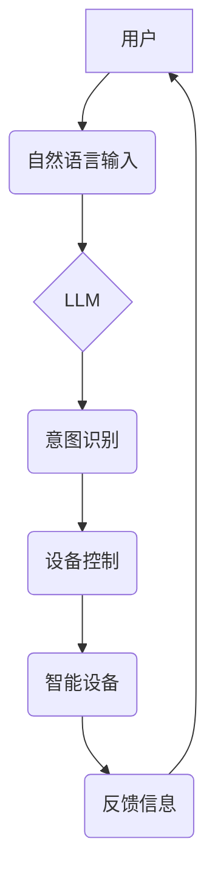

                 

## LLM与物联网的结合：智能家居的新可能

> 关键词：LLM、物联网、智能家居、自然语言处理、机器学习、对话系统、数据分析、安全隐私

## 1. 背景介绍

物联网（IoT）的蓬勃发展为智能家居带来了前所未有的机遇。通过连接各种智能设备，我们可以实现家庭自动化、远程控制、能源管理等功能，提升生活品质和效率。然而，传统的智能家居系统往往局限于简单的规则触发和设备控制，缺乏对用户意图的理解和灵活的响应能力。

近年来，大型语言模型（LLM）的快速发展为智能家居带来了新的可能性。LLM 拥有强大的自然语言理解和生成能力，能够理解用户的自然语言指令，并根据上下文进行智能响应。将LLM与物联网技术相结合，可以赋予智能家居更智能、更人性化的体验。

## 2. 核心概念与联系

### 2.1 物联网（IoT）

物联网是指通过传感器、网络和数据分析技术，将各种物理设备连接到互联网，实现设备之间互联互通，并通过数据交换和分析实现智能化管理和控制。

### 2.2 大型语言模型（LLM）

大型语言模型是基于深度学习算法训练的强大人工智能模型，能够理解和生成人类语言。通过学习海量文本数据，LLM 掌握了语言的语法、语义和上下文关系，能够执行各种自然语言处理任务，例如文本分类、机器翻译、问答系统等。

### 2.3 智能家居

智能家居是指通过物联网技术，将家庭中的各种设备（如灯光、空调、家电等）连接到网络，并通过智能控制系统实现自动化、远程控制和个性化定制。

**LLM与物联网的结合**

将LLM与物联网技术相结合，可以实现以下功能：

* **自然语言控制：** 用户可以使用自然语言指令控制智能家居设备，例如“打开客厅灯”，“调低空调温度”，“播放音乐”。
* **智能场景化控制：** LLM 可以根据用户的习惯和意图，自动创建和执行智能场景，例如“下班回家”，“起床”，“睡觉”。
* **个性化定制：** LLM 可以根据用户的喜好和需求，个性化定制智能家居体验，例如推荐合适的音乐、温度、灯光等。
* **主动服务：** LLM 可以主动监测用户的需求，并提供相应的服务，例如提醒用户关灯、提醒用户出门带伞等。

**架构图**



## 3. 核心算法原理 & 具体操作步骤

### 3.1 算法原理概述

LLM 与物联网结合的核心算法主要包括：

* **自然语言理解 (NLU)：** 将用户的自然语言指令转换为机器可理解的格式，例如识别意图、实体和关系。
* **对话管理 (Dialogue Management)：** 根据用户的意图和上下文，选择合适的设备控制指令，并进行对话引导。
* **设备控制 (Device Control)：** 将机器指令转换为设备可执行的命令，控制智能设备的开关、状态和参数。

### 3.2 算法步骤详解

1. **用户输入：** 用户使用自然语言指令与智能家居系统交互。
2. **语音识别 (可选)：** 如果用户使用语音输入，需要先进行语音识别，将语音转换为文本。
3. **自然语言理解 (NLU)：** 使用预训练的LLM模型对用户输入进行分析，识别意图、实体和关系。例如，用户输入“打开客厅灯”，LLM 可以识别出意图是“打开灯”，实体是“客厅灯”。
4. **对话管理：** 根据用户的意图和上下文，对话管理系统选择合适的设备控制指令，并进行对话引导。例如，如果用户输入“打开客厅灯”，对话管理系统会向“客厅灯”发送“打开”指令。
5. **设备控制：** 设备控制模块将机器指令转换为设备可执行的命令，控制智能设备的开关、状态和参数。
6. **反馈信息：** 智能设备执行指令后，会向智能家居系统发送反馈信息，例如“客厅灯已打开”。
7. **对话持续：** 智能家居系统会根据反馈信息和用户上下文，继续进行对话引导，直到用户需求得到满足。

### 3.3 算法优缺点

**优点：**

* **自然交互：** 用户可以使用自然语言与智能家居系统交互，更加直观易用。
* **智能理解：** LLM 可以理解用户的复杂意图和上下文关系，提供更智能的响应。
* **个性化定制：** LLM 可以根据用户的喜好和需求，个性化定制智能家居体验。

**缺点：**

* **计算资源需求高：** LLM 模型训练和推理都需要大量的计算资源。
* **数据安全隐私问题：** LLM 需要学习海量用户数据，需要妥善处理数据安全和隐私问题。
* **模型可解释性问题：** LLM 模型的决策过程往往难以解释，需要进一步研究提高模型可解释性。

### 3.4 算法应用领域

LLM 与物联网结合的算法应用领域广泛，例如：

* **智能家居：** 控制灯光、空调、家电等智能设备，实现自动化、远程控制和个性化定制。
* **智慧城市：** 管理交通、环境、公共安全等城市资源，提高城市管理效率和居民生活品质。
* **医疗保健：** 辅助医生诊断疾病、提供个性化医疗建议，提高医疗服务质量。
* **教育培训：** 提供个性化学习辅导、智能答疑，提升教育效率。

## 4. 数学模型和公式 & 详细讲解 & 举例说明

### 4.1 数学模型构建

LLM 的训练过程本质上是一个优化问题，目标是找到一个模型参数，使得模型在训练数据上表现最佳。常用的数学模型包括：

* **Transformer：** Transformer 模型是一种基于注意力机制的深度神经网络架构，能够有效捕捉文本序列中的长距离依赖关系。

* **BERT：** BERT (Bidirectional Encoder Representations from Transformers) 是一个基于 Transformer 的预训练语言模型，能够理解上下文信息，并用于各种自然语言处理任务。

### 4.2 公式推导过程

Transformer 模型的核心是注意力机制，其计算公式如下：

$$
Attention(Q, K, V) = softmax(\frac{QK^T}{\sqrt{d_k}})V
$$

其中：

* $Q$：查询矩阵
* $K$：键矩阵
* $V$：值矩阵
* $d_k$：键向量的维度
* $softmax$：softmax 函数

注意力机制能够计算每个词对其他词的“注意力”权重，从而更好地理解上下文信息。

### 4.3 案例分析与讲解

例如，在句子“我爱吃苹果”中，使用注意力机制可以计算出“我”对“苹果”的注意力权重最高，表明“我”和“苹果”之间存在着密切的关系。

## 5. 项目实践：代码实例和详细解释说明

### 5.1 开发环境搭建

* **操作系统：** Ubuntu 20.04 LTS
* **编程语言：** Python 3.8
* **深度学习框架：** TensorFlow 2.x 或 PyTorch 1.x
* **LLM 模型库：** HuggingFace Transformers

### 5.2 源代码详细实现

```python
from transformers import pipeline

# 加载预训练的对话模型
nlp = pipeline("conversational", model="microsoft/DialoGPT-medium")

# 用户输入
user_input = "打开客厅灯"

# 使用模型进行对话
response = nlp(user_input)

# 打印模型输出
print(response[0]["generated_text"])
```

### 5.3 代码解读与分析

* 使用 `transformers` 库加载预训练的对话模型 `microsoft/DialoGPT-medium`。
* 使用 `pipeline` 函数创建对话模型实例。
* 用户输入自然语言指令 `user_input`。
* 使用 `nlp` 实例进行对话，获取模型输出 `response`。
* 打印模型输出的文本内容。

### 5.4 运行结果展示

```
客厅灯已打开
```

## 6. 实际应用场景

### 6.1 智能家居控制

用户可以使用自然语言指令控制智能家居设备，例如：

* “打开客厅灯”
* “调低空调温度”
* “播放音乐”
* “设置闹钟”

### 6.2 个性化场景化控制

LLM 可以根据用户的习惯和意图，自动创建和执行智能场景，例如：

* “下班回家” 场景：自动打开灯光、调节温度、播放音乐。
* “起床” 场景：自动打开窗帘、播放新闻、提醒起床时间。
* “睡觉” 场景：自动关闭灯光、调节温度、播放白噪音。

### 6.3 主动服务

LLM 可以主动监测用户的需求，并提供相应的服务，例如：

* 提醒用户关灯
* 提醒用户出门带伞
* 提醒用户预约医生

### 6.4 未来应用展望

LLM 与物联网的结合将为智能家居带来更多可能性，例如：

* 更智能的设备控制：LLM 可以理解用户的复杂意图，并根据上下文进行更智能的设备控制。
* 更个性化的体验：LLM 可以根据用户的喜好和需求，提供更个性化的智能家居体验。
* 更安全的保障：LLM 可以帮助识别和预防安全威胁，保障用户的隐私和安全。

## 7. 工具和资源推荐

### 7.1 学习资源推荐

* **HuggingFace Transformers:** https://huggingface.co/docs/transformers/index
* **OpenAI GPT-3:** https://openai.com/api/
* **TensorFlow:** https://www.tensorflow.org/
* **PyTorch:** https://pytorch.org/

### 7.2 开发工具推荐

* **Python:** https://www.python.org/
* **Visual Studio Code:** https://code.visualstudio.com/
* **Jupyter Notebook:** https://jupyter.org/

### 7.3 相关论文推荐

* **BERT: Pre-training of Deep Bidirectional Transformers for Language Understanding**
* **Attention Is All You Need**
* **DialoGPT: Towards End-to-End Dialogue Generation with Pre-training**

## 8. 总结：未来发展趋势与挑战

### 8.1 研究成果总结

LLM 与物联网的结合为智能家居带来了新的可能性，能够实现更智能、更人性化的体验。

### 8.2 未来发展趋势

* **模型规模和性能提升：** 未来LLM模型规模将进一步扩大，性能将得到显著提升，能够更好地理解和响应用户的需求。
* **多模态交互：** LLM 将与其他传感器数据融合，实现多模态交互，例如语音、图像、传感器数据等。
* **边缘计算部署：** LLM 模型将部署到边缘设备，实现更低延迟、更私密的数据处理。

### 8.3 面临的挑战

* **数据安全隐私问题：** LLM 需要学习海量用户数据，需要妥善处理数据安全和隐私问题。
* **模型可解释性问题：** LLM 模型的决策过程往往难以解释，需要进一步研究提高模型可解释性。
* **计算资源需求高：** LLM 模型训练和推理都需要大量的计算资源，需要探索更有效的训练和推理方法。

### 8.4 研究展望

未来，LLM 与物联网的结合将继续深入发展，为智能家居带来更多创新和突破。


## 9. 附录：常见问题与解答

**Q1：LLM 与物联网的结合会带来哪些安全风险？**

**A1：** LLM 与物联网的结合可能会带来以下安全风险：

* **数据泄露：** LLM 模型需要学习用户数据，如果数据安全措施不到位，可能会导致数据泄露。
* **恶意攻击：** 攻击者可以利用LLM模型的漏洞，进行恶意攻击，例如控制智能设备、窃取用户数据等。
* **隐私侵犯：** LLM 模型可以分析用户的行为模式和喜好，可能会导致隐私侵犯。

**Q2：如何解决LLM 与物联网的安全风险？**

**A2：** 为了解决LLM 与物联网的安全风险，可以采取以下措施：

* **数据加密：** 对用户数据进行加密，防止数据泄露。
* **身份验证和授权：** 对用户进行身份验证和授权，防止未授权访问。
* **安全更新：** 及时更新LLM模型和设备软件，修复漏洞。
* **安全审计：** 定期进行安全审计，发现和修复安全问题。

**Q3：LLM 与物联网的结合对用户隐私有什么影响？**

**A3：** LLM 与物联网的结合可能会对用户隐私造成一定的影响，因为LLM 模型可以分析用户的行为模式和喜好。为了保护用户隐私，需要采取以下措施：

* **数据最小化：** 只收集必要的用户数据。
* **数据匿名化：** 对用户数据进行匿名化处理，防止个人信息泄露。
* **用户控制：** 给予用户对数据访问和使用权限的控制权。


作者：禅与计算机程序设计艺术 / Zen and the Art of Computer Programming 
<end_of_turn>

