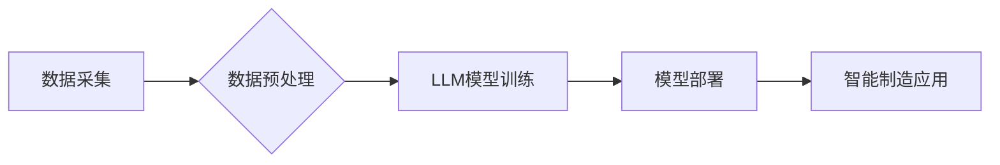

                 

## LLM在智能制造中的应用前景

> 关键词：大型语言模型（LLM）、智能制造、自然语言处理（NLP）、预测性维护、质量控制、生产优化、数据分析、自动化

## 1. 背景介绍

智能制造作为第四次工业革命的重要组成部分，旨在通过数字化、智能化手段提升制造业效率、柔性、可持续性。其中，大型语言模型（LLM）作为人工智能领域的新兴技术，凭借其强大的文本理解和生成能力，展现出巨大的应用潜力。

传统制造业面临着诸多挑战，例如：

* **数据孤岛问题：**制造企业拥有海量数据，但数据分散、难以整合，导致信息利用率低。
* **人工成本高昂：**制造业依赖大量人工操作，导致成本高、效率低。
* **生产效率低下：**生产流程复杂、环节多，难以实现实时优化和控制。
* **质量控制难度大：**产品质量受多种因素影响，难以保证一致性。

LLM的出现为解决这些问题提供了新的思路。其强大的文本处理能力可以帮助企业实现数据整合、知识提取、智能决策等功能，从而提升制造业的智能化水平。

## 2. 核心概念与联系

**2.1  智能制造概述**

智能制造是指利用数字化、网络化、智能化技术，实现生产过程的自动化、智能化、柔性化和可持续化。其核心目标是通过数据驱动、智能决策、协同优化等手段，提升制造业的效率、质量、柔性和可持续性。

**2.2  大型语言模型概述**

大型语言模型（LLM）是一种基于深度学习的强大人工智能模型，能够理解和生成人类语言。其训练数据通常包含海量文本信息，通过学习语言的语法、语义和上下文关系，能够完成各种自然语言处理任务，例如文本分类、机器翻译、文本摘要、对话生成等。

**2.3  LLM与智能制造的联系**

LLM可以与智能制造系统相结合，发挥其强大的文本处理能力，为制造业带来诸多创新应用。例如：

* **数据分析与洞察：**LLM可以分析制造过程中的海量数据，提取关键信息，发现潜在问题和趋势，为生产优化提供决策支持。
* **智能预测与预警：**LLM可以根据历史数据和实时传感器信息，预测设备故障、生产瓶颈等问题，提前预警，避免停机损失。
* **自动化流程与决策：**LLM可以自动完成生产计划、物料采购、质量控制等流程，提高生产效率和准确性。
* **智能客服与支持：**LLM可以提供智能化的客户服务和技术支持，解决用户问题，提升用户体验。

**2.4  LLM应用架构**



## 3. 核心算法原理 & 具体操作步骤

**3.1  算法原理概述**

LLM的核心算法原理是基于Transformer网络架构，其特点是能够捕捉长距离依赖关系，并具有并行计算能力，能够高效地处理海量文本数据。

Transformer网络由编码器和解码器两部分组成。编码器负责将输入文本序列编码成语义向量，解码器则根据编码后的语义向量生成输出文本序列。

**3.2  算法步骤详解**

1. **数据预处理：**将原始文本数据进行清洗、分词、标记等预处理操作，使其能够被LLM模型理解。
2. **模型训练：**使用预处理后的数据训练LLM模型，通过调整模型参数，使其能够准确地理解和生成文本。
3. **模型评估：**使用测试数据评估模型的性能，例如准确率、召回率、BLEU分数等。
4. **模型部署：**将训练好的模型部署到生产环境中，用于实际应用。

**3.3  算法优缺点**

**优点：**

* 强大的文本理解和生成能力
* 能够捕捉长距离依赖关系
* 并行计算能力强，训练效率高

**缺点：**

* 模型规模庞大，训练成本高
* 对训练数据质量要求高
* 缺乏可解释性，难以理解模型决策过程

**3.4  算法应用领域**

LLM在自然语言处理领域有着广泛的应用，例如：

* 文本分类
* 机器翻译
* 文本摘要
* 对话生成
* 代码生成

## 4. 数学模型和公式 & 详细讲解 & 举例说明

**4.1  数学模型构建**

LLM的数学模型主要基于Transformer网络架构，其核心是注意力机制和多头注意力机制。

**注意力机制**

注意力机制允许模型关注输入序列中与当前输出相关的部分，从而提高模型的理解能力。

注意力权重计算公式：

$$
\text{Attention}(Q, K, V) = \text{softmax}\left(\frac{QK^T}{\sqrt{d_k}}\right)V
$$

其中：

* $Q$：查询矩阵
* $K$：键矩阵
* $V$：值矩阵
* $d_k$：键向量的维度

**多头注意力机制**

多头注意力机制通过使用多个注意力头，可以捕捉到不同层次的语义信息，从而提高模型的表达能力。

**4.2  公式推导过程**

Transformer网络的编码器和解码器分别由多个编码层和解码层组成。每个编码层和解码层包含多头注意力机制、前馈神经网络等模块。

**4.3  案例分析与讲解**

例如，在机器翻译任务中，LLM可以将源语言文本编码成语义向量，然后通过解码器生成目标语言文本。

## 5. 项目实践：代码实例和详细解释说明

**5.1  开发环境搭建**

使用Python语言开发LLM应用，需要安装相关的库和框架，例如：

* TensorFlow或PyTorch深度学习框架
* HuggingFace Transformers库，提供预训练的LLM模型和工具

**5.2  源代码详细实现**

以下是一个简单的LLM文本分类代码示例：

```python
from transformers import pipeline

# 加载预训练的文本分类模型
classifier = pipeline("sentiment-analysis")

# 对文本进行分类
result = classifier("这是一个很棒的句子!")

# 打印结果
print(result)
```

**5.3  代码解读与分析**

该代码使用HuggingFace Transformers库加载预训练的文本分类模型，并对输入文本进行分类。

**5.4  运行结果展示**

运行结果示例：

```
[{'label': 'POSITIVE', 'score': 0.9999999403953552}]
```

## 6. 实际应用场景

**6.1  预测性维护**

LLM可以分析设备运行数据，预测设备故障风险，提前进行维护，避免停机损失。

**6.2  质量控制**

LLM可以识别产品缺陷，提高产品质量，降低返工率。

**6.3  生产优化**

LLM可以分析生产流程数据，优化生产计划，提高生产效率。

**6.4  未来应用展望**

LLM在智能制造领域的应用前景广阔，未来将有更多创新应用场景出现，例如：

* 智能机器人协作
* 个性化产品定制
* 自适应生产流程
* 数字孪生系统

## 7. 工具和资源推荐

**7.1  学习资源推荐**

* **书籍：**

    * 《深度学习》
    * 《自然语言处理》

* **在线课程：**

    * Coursera
    * edX
    * Udacity

**7.2  开发工具推荐**

* **深度学习框架：**

    * TensorFlow
    * PyTorch

* **自然语言处理库：**

    * HuggingFace Transformers
    * NLTK

**7.3  相关论文推荐**

* **Attention Is All You Need**
* **BERT: Pre-training of Deep Bidirectional Transformers for Language Understanding**

## 8. 总结：未来发展趋势与挑战

**8.1  研究成果总结**

LLM在智能制造领域的应用取得了显著成果，例如：

* 提高了生产效率和质量
* 降低了生产成本
* 增强了生产的可持续性

**8.2  未来发展趋势**

未来LLM在智能制造领域的应用将朝着以下方向发展：

* 模型规模更大，能力更强
* 应用场景更加广泛
* 与其他人工智能技术融合更加紧密

**8.3  面临的挑战**

LLM在智能制造领域的应用也面临一些挑战，例如：

* 模型训练成本高
* 数据安全和隐私问题
* 模型解释性和可信度问题

**8.4  研究展望**

未来研究将重点关注以下方面：

* 降低模型训练成本
* 提高模型的效率和准确性
* 增强模型的可解释性和可信度


## 9. 附录：常见问题与解答

**9.1  LLM模型训练需要哪些数据？**

LLM模型训练需要大量的文本数据，数据类型可以包括：

* 文本文件
* 网页内容
* 代码
* 对话记录

**9.2  LLM模型的应用场景有哪些？**

LLM模型的应用场景非常广泛，例如：

* 文本分类
* 机器翻译
* 文本摘要
* 对话生成
* 代码生成

**9.3  如何评估LLM模型的性能？**

LLM模型的性能可以评估指标包括：

* 准确率
* 召回率
* BLEU分数
* perplexity

**9.4  LLM模型的安全性如何保障？**

LLM模型的安全性需要从以下几个方面保障：

* 数据安全
* 模型训练过程安全
* 模型部署过程安全

**9.5  LLM模型的未来发展趋势是什么？**

LLM模型的未来发展趋势包括：

* 模型规模更大，能力更强
* 应用场景更加广泛
* 与其他人工智能技术融合更加紧密


作者：禅与计算机程序设计艺术 / Zen and the Art of Computer Programming 
<end_of_turn>

