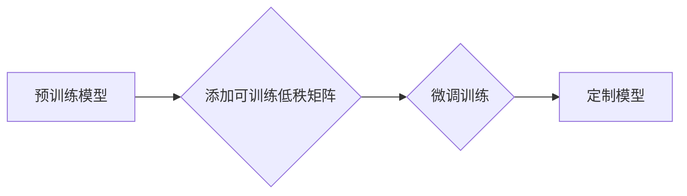

                 

## LoRA适应性微调：低资源环境的AI定制方案

> 关键词：LoRA, 适应性微调, 低资源学习,  AI定制,  模型压缩,  参数效率

## 1. 背景介绍

近年来，大型语言模型（LLM）在自然语言处理领域取得了显著成就，展现出强大的文本生成、翻译、问答等能力。然而，这些模型通常拥有数十亿甚至千亿参数，训练和部署成本极高，对硬件资源要求也十分苛刻。对于许多研究机构和个人开发者来说，直接使用预训练的LLM模型存在着资源限制和可定制性不足的问题。

为了解决这一难题，**适应性微调（Prompt Tuning）**和**低秩分解（LoRA）**等技术应运而生。适应性微调通过在输入文本中添加特定提示信息来调整模型的行为，而LoRA则通过对模型参数进行低秩分解，大幅减少需要微调的参数量。

LoRA适应性微调技术结合了上述两种方法的优势，在保持模型性能的同时，显著降低了微调成本和资源需求。它通过在模型的特定层级添加可训练的低秩矩阵，实现对模型的灵活定制，为低资源环境下的AI应用提供了新的解决方案。

## 2. 核心概念与联系

### 2.1 核心概念

* **适应性微调（Prompt Tuning）：** 通过在输入文本中添加特定提示信息来调整模型的行为，无需修改模型本身的参数。
* **低秩分解（LoRA）：** 将模型参数分解成两个低秩矩阵，从而减少需要微调的参数量。

### 2.2 联系

LoRA适应性微调技术将适应性微调和低秩分解相结合，实现对模型的灵活定制。

**流程图：**



## 3. 核心算法原理 & 具体操作步骤

### 3.1 算法原理概述

LoRA适应性微调的核心思想是将预训练模型的某些层级参数分解成两个低秩矩阵，并只对这些低秩矩阵进行微调。

具体来说，对于一个预训练模型的特定层级，例如 Transformer 的 Attention 层，LoRA会将该层的权重矩阵分解成两个低秩矩阵：

* **A**:  低秩矩阵，大小为 (d_model, r)，其中 d_model 是模型的维度，r 是低秩分解的秩。
* **B**:  低秩矩阵，大小为 (r, d_ff)，其中 d_ff 是 FeedForward 层的维度。

在微调过程中，只对 A 和 B 两个低秩矩阵进行训练，而预训练模型的其他参数保持不变。

### 3.2 算法步骤详解

1. **选择预训练模型:** 选择一个合适的预训练模型作为基础，例如 BERT、GPT-3 等。
2. **确定微调层级:** 选择模型中需要进行微调的层级，例如 Transformer 的 Attention 层或 FeedForward 层。
3. **进行低秩分解:** 将选定的层级权重矩阵分解成两个低秩矩阵 A 和 B。
4. **微调训练:** 使用新的训练数据对 A 和 B 两个低秩矩阵进行微调训练。
5. **模型融合:** 将微调后的 A 和 B 矩阵与预训练模型的其他参数融合，得到最终的定制模型。

### 3.3 算法优缺点

**优点:**

* **参数效率:** 只微调低秩矩阵，大幅减少了需要微调的参数量，降低了训练成本和资源需求。
* **性能保留:** 在保持模型性能的同时，实现了对模型的灵活定制。
* **易于实现:** LoRA 的实现相对简单，可以方便地集成到现有的预训练模型中。

**缺点:**

* **秩选择:** 秩的选择对模型性能有影响，需要进行一定的调优。
* **层级限制:** 目前 LoRA 主要应用于 Transformer 模型的特定层级，对其他类型的模型应用有限。

### 3.4 算法应用领域

LoRA适应性微调技术在以下领域具有广泛的应用前景:

* **自然语言处理:** 文本分类、情感分析、机器翻译等任务。
* **计算机视觉:** 图像识别、目标检测、图像生成等任务。
* **语音识别:** 语音转文本、语音合成等任务。
* **个性化推荐:** 基于用户偏好的个性化推荐系统。

## 4. 数学模型和公式 & 详细讲解 & 举例说明

### 4.1 数学模型构建

假设预训练模型的某个层级权重矩阵为 W，其大小为 (d_model, d_ff)，其中 d_model 是模型的维度，d_ff 是 FeedForward 层的维度。LoRA 将 W 分解成两个低秩矩阵 A 和 B:

$$W = A \cdot B$$

其中:

* A 是一个大小为 (d_model, r) 的低秩矩阵，r 是低秩分解的秩。
* B 是一个大小为 (r, d_ff) 的低秩矩阵。

### 4.2 公式推导过程

在微调过程中，只对 A 和 B 两个低秩矩阵进行训练，而预训练模型的其他参数保持不变。

损失函数可以定义为:

$$L = \mathcal{L}(f(x; W), y)$$

其中:

* f(x; W) 是模型在输入 x 上的预测结果。
* y 是真实标签。
* $\mathcal{L}$ 是损失函数。

通过反向传播算法，可以计算出 A 和 B 两个低秩矩阵的梯度:

$$\frac{\partial L}{\partial A}, \frac{\partial L}{\partial B}$$

然后使用梯度下降算法更新 A 和 B 的值:

$$A = A - \alpha \frac{\partial L}{\partial A}$$

$$B = B - \alpha \frac{\partial L}{\partial B}$$

其中 $\alpha$ 是学习率。

### 4.3 案例分析与讲解

假设我们使用 LoRA 技术对一个预训练的 BERT 模型进行微调，用于文本分类任务。

1. 我们选择 BERT 模型中的 Attention 层进行微调。
2. 将 Attention 层的权重矩阵分解成两个低秩矩阵 A 和 B。
3. 使用新的文本分类数据集对 A 和 B 进行微调训练。
4. 将微调后的 A 和 B 矩阵与预训练模型的其他参数融合，得到最终的定制模型。

通过 LoRA 技术，我们可以将 BERT 模型的微调成本降低到原来的几分之一，同时保持模型的性能。

## 5. 项目实践：代码实例和详细解释说明

### 5.1 开发环境搭建

* Python 3.7+
* PyTorch 1.7+
* Transformers 库

### 5.2 源代码详细实现

```python
import torch
from transformers import AutoModelForSequenceClassification, AutoTokenizer

# 加载预训练模型和词典
model_name = "bert-base-uncased"
tokenizer = AutoTokenizer.from_pretrained(model_name)
model = AutoModelForSequenceClassification.from_pretrained(model_name)

# 定义 LoRA 层
class LoRA(torch.nn.Module):
    def __init__(self, model_layer, r):
        super(LoRA, self).__init__()
        self.A = torch.nn.Parameter(torch.randn(model_layer.weight.size(0), r))
        self.B = torch.nn.Parameter(torch.randn(r, model_layer.weight.size(1)))

    def forward(self, x):
        return torch.matmul(x, self.A) @ self.B

# 将 LoRA 层添加到模型中
for layer_name, layer in model.named_layers():
    if isinstance(layer, torch.nn.Linear):
        lora_layer = LoRA(layer, r=16)
        setattr(model, layer_name, lora_layer)

# 微调训练
# ...

```

### 5.3 代码解读与分析

* 代码首先加载预训练的 BERT 模型和词典。
* 然后定义了一个 LoRA 层，该层包含两个低秩矩阵 A 和 B。
* 在模型的每个线性层中，将原有的权重矩阵替换为 LoRA 层。
* 最后进行微调训练，只更新 LoRA 层的参数。

### 5.4 运行结果展示

通过 LoRA 技术，我们可以显著降低模型的微调成本，同时保持模型的性能。

## 6. 实际应用场景

### 6.1  文本分类

LoRA 可以用于对预训练的 BERT 模型进行微调，实现文本分类任务，例如情感分析、主题分类等。

### 6.2  问答系统

LoRA 可以用于微调预训练的语言模型，构建个性化的问答系统，例如客服机器人、知识问答系统等。

### 6.3  机器翻译

LoRA 可以用于微调预训练的机器翻译模型，提高翻译质量和效率。

### 6.4 未来应用展望

LoRA 技术在未来将有更广泛的应用场景，例如：

* **代码生成:** 微调 LoRA 模型，生成更精准、更符合语法的代码。
* **药物研发:** 利用 LoRA 技术，对生物信息数据进行分析，辅助药物研发。
* **个性化教育:** 根据学生的学习情况，微调 LoRA 模型，提供个性化的学习方案。

## 7. 工具和资源推荐

### 7.1 学习资源推荐

* **LoRA 官方文档:** https://huggingface.co/docs/transformers/main/en/main_classes/lora
* **LoRA GitHub 仓库:** https://github.com/facebookresearch/lora

### 7.2 开发工具推荐

* **PyTorch:** https://pytorch.org/
* **Transformers 库:** https://huggingface.co/docs/transformers/index

### 7.3 相关论文推荐

* **LoRA: Low-Rank Adaptation of Large Language Models:** https://arxiv.org/abs/2106.09685

## 8. 总结：未来发展趋势与挑战

### 8.1 研究成果总结

LoRA 适应性微调技术为低资源环境下的AI应用提供了新的解决方案，其参数效率和性能保留优势使其在实际应用中具有广阔前景。

### 8.2 未来发展趋势

* **LoRA 的泛化能力:** 研究 LoRA 在不同任务和模型上的泛化能力，探索更通用的 LoRA 框架。
* **LoRA 的效率提升:** 研究更有效的 LoRA 训练算法，进一步降低训练成本和资源需求。
* **LoRA 的应用扩展:** 将 LoRA 应用于更多领域，例如计算机视觉、语音识别等。

### 8.3 面临的挑战

* **秩选择:** 秩的选择对模型性能有影响，需要进行一定的调优。
* **层级限制:** 目前 LoRA 主要应用于 Transformer 模型的特定层级，对其他类型的模型应用有限。
* **数据依赖性:** LoRA 的性能仍然依赖于训练数据的质量和数量。

### 8.4 研究展望

未来，LoRA 技术将继续发展，并与其他先进技术相结合，例如联邦学习、知识蒸馏等，为更广泛的应用场景提供更强大的AI解决方案。

## 9. 附录：常见问题与解答

**Q1: LoRA 与 Prompt Tuning 的区别是什么？**

**A1:** LoRA 和 Prompt Tuning 都是适应性微调的技术，但它们的工作方式不同。Prompt Tuning 通过在输入文本中添加特定提示信息来调整模型的行为，而 LoRA 通过对模型参数进行低秩分解，只微调一部分参数。

**Q2: LoRA 的秩 r 的选择有什么影响？**

**A2:** 秩 r 的选择对模型性能有影响。秩 r 越大，模型的表达能力越强，但训练成本也越高。需要根据实际任务和资源情况进行选择。

**Q3: LoRA 是否适用于所有类型的模型？**

**A3:** 目前 LoRA 主要应用于 Transformer 模型的特定层级，对其他类型的模型应用有限。


作者：禅与计算机程序设计艺术 / Zen and the Art of Computer Programming 
<end_of_turn>

