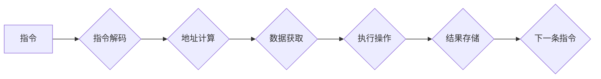

                 

## MIPS架构：深入理解RISC处理器设计

> 关键词：MIPS架构, RISC, 处理器设计, 指令集, 硬件设计, 计算机体系结构

## 1. 背景介绍

微处理器指令集架构 (MIPS) 是一种指令集架构 (ISA)，由 MIPS Technologies 公司开发。它以其简洁、易于理解和实现而闻名，成为了嵌入式系统、网络设备和教学平台的热门选择。本文将深入探讨 MIPS 架构的原理、设计理念和应用场景，帮助读者理解 RISC 处理器设计的核心概念。

### 1.1 RISC 架构的兴起

20 世纪 70 年代，随着计算机性能的提升，传统的 CISC (复杂指令集计算机) 架构面临着越来越多的挑战。CISC 架构指令复杂，长度不固定，需要复杂的解码和执行过程，导致芯片面积大、功耗高、性能难以提升。

为了解决这些问题，RISC (精简指令集计算机) 架构应运而生。RISC 架构的核心思想是使用简单、固定长度的指令，并采用流水线技术提高执行效率。MIPS 架构正是 RISC 架构的代表之一。

### 1.2 MIPS 架构的特点

MIPS 架构具有以下特点：

* **指令集简化:** MIPS 指令集相对简单，指令长度固定为 32 位，每个指令执行一个基本操作，例如加、减、移位等。
* **固定长度指令:** 指令长度固定，简化了指令解码过程，提高了执行效率。
* **寄存器密集型:** MIPS 架构采用寄存器密集型设计，将常用的数据存储在寄存器中，减少了内存访问，提高了执行速度。
* **流水线技术:** MIPS 架构采用流水线技术，将指令的执行过程分解成多个阶段，并并行执行，提高了指令吞吐量。
* **可扩展性:** MIPS 架构支持多种扩展指令集，可以根据不同的应用需求进行定制。

## 2. 核心概念与联系

MIPS 架构的核心概念包括指令格式、寄存器文件、指令执行流程和内存管理。

**Mermaid 流程图:**



### 2.1 指令格式

MIPS 指令采用固定长度的 32 位格式，分为 opcode、rs、rt、rd、shamt 和 funct 六个字段。

* opcode: 指令操作码，表示指令的类型。
* rs, rt, rd: 源寄存器、目标寄存器和结果寄存器地址。
* shamt: 逻辑移位量。
* funct: 操作码扩展字段，用于指定具体的指令操作。

### 2.2 寄存器文件

MIPS 架构拥有 32 个通用寄存器，每个寄存器 32 位宽。寄存器文件是处理器中存储数据的核心部件，用于存放指令、数据和中间结果。

### 2.3 指令执行流程

MIPS 指令执行流程包括以下步骤：

1. **指令获取:** 从内存中获取下一条指令。
2. **指令解码:** 解码指令操作码和地址字段。
3. **地址计算:** 计算数据地址。
4. **数据获取:** 从内存中获取数据。
5. **执行操作:** 执行指令操作，例如加、减、移位等。
6. **结果存储:** 将结果存储到目标寄存器。

### 2.4 内存管理

MIPS 架构采用分段式内存管理，将内存划分为多个段，每个段都有自己的地址空间。处理器使用段寄存器来管理段信息。

## 3. 核心算法原理 & 具体操作步骤

MIPS 架构的核心算法是指令执行算法，它负责将指令解码、执行并存储结果。

### 3.1 算法原理概述

MIPS 指令执行算法采用流水线技术，将指令执行过程分解成多个阶段，并并行执行。每个阶段负责执行一个特定的操作，例如指令解码、地址计算、数据获取、执行操作和结果存储。

### 3.2 算法步骤详解

1. **指令获取:** 从内存中获取下一条指令。
2. **指令解码:** 解码指令操作码和地址字段。
3. **地址计算:** 计算数据地址。
4. **数据获取:** 从内存中获取数据。
5. **执行操作:** 执行指令操作，例如加、减、移位等。
6. **结果存储:** 将结果存储到目标寄存器。

### 3.3 算法优缺点

**优点:**

* **高执行效率:** 流水线技术提高了指令吞吐量。
* **易于实现:** 指令集简单，易于设计和实现。

**缺点:**

* **分支预测:** 处理分支指令时需要进行预测，可能会导致性能下降。
* **指令级并行:** 无法充分利用多核处理器。

### 3.4 算法应用领域

MIPS 指令执行算法广泛应用于嵌入式系统、网络设备、游戏机和教学平台等领域。

## 4. 数学模型和公式 & 详细讲解 & 举例说明

MIPS 架构的性能可以利用数学模型和公式进行分析和评估。

### 4.1 数学模型构建

MIPS 架构的性能可以表示为指令吞吐量和平均指令周期。

* 指令吞吐量 (IPC): 指的是每秒钟执行的指令数量。
* 平均指令周期 (CPI): 指的是执行一条指令所需的平均时钟周期数。

**公式:**

$$
IPC = \frac{指令数量}{时钟周期数}
$$

$$
CPI = \frac{时钟周期数}{指令数量}
$$

### 4.2 公式推导过程

指令吞吐量和平均指令周期之间的关系可以通过以下公式推导得出:

$$
性能 = IPC \times 频率
$$

其中，频率是指处理器的工作频率。

### 4.3 案例分析与讲解

假设一个 MIPS 处理器工作频率为 1 GHz，指令吞吐量为 2，则其性能为 2 GHz。

## 5. 项目实践：代码实例和详细解释说明

### 5.1 开发环境搭建

为了实践 MIPS 架构，需要搭建一个开发环境。常用的开发环境包括：

* **仿真器:** 例如 MARS, QEMU 等。
* **汇编器:** 例如 SPIM, GAS 等。
* **调试器:** 例如 GDB 等。

### 5.2 源代码详细实现

以下是一个简单的 MIPS 汇编程序，用于计算两个整数的和:

```assembly
# 程序名: add.asm
# 计算两个整数的和

.data
num1: .word 10
num2: .word 20
sum: .word 0

.text
.globl main

main:
    # 将 num1 的值加载到寄存器 $t0
    lw $t0, num1

    # 将 num2 的值加载到寄存器 $t1
    lw $t1, num2

    # 将 $t0 和 $t1 相加，结果存储到 $t2
    add $t2, $t0, $t1

    # 将 $t2 的值存储到 sum
    sw $t2, sum

    # 返回
    jr $ra
```

### 5.3 代码解读与分析

* `.data` 段定义了程序使用的变量，包括两个整数 `num1` 和 `num2`，以及一个用于存储结果的变量 `sum`。
* `.text` 段定义了程序的代码，包括 `main` 函数。
* `lw` 指令用于从内存中加载数据到寄存器。
* `add` 指令用于将两个寄存器的值相加。
* `sw` 指令用于将数据从寄存器存储到内存。
* `jr $ra` 指令用于返回函数。

### 5.4 运行结果展示

运行上述程序后，`sum` 变量的值将为 30。

## 6. 实际应用场景

MIPS 架构广泛应用于各种实际场景，例如：

* **嵌入式系统:** MIPS 处理器由于其低功耗、高性能和易于实现的特点，成为了嵌入式系统的热门选择，例如路由器、交换机、智能家居设备等。
* **网络设备:** MIPS 处理器也广泛应用于网络设备，例如防火墙、VPN 设备、无线路由器等。
* **游戏机:** 过去，一些游戏机，例如 Nintendo 64 和 PlayStation 2，也采用了 MIPS 处理器。
* **教学平台:** MIPS 架构由于其简单易懂的特点，成为了教学平台的热门选择，例如大学计算机体系结构课程。

### 6.4 未来应用展望

随着技术的不断发展，MIPS 架构将在未来继续发挥重要作用。例如:

* **物联网:** MIPS 处理器可以用于构建小型、低功耗的物联网设备。
* **人工智能:** MIPS 处理器可以用于构建边缘人工智能设备，例如智能摄像头、智能音箱等。
* **云计算:** MIPS 处理器可以用于构建云计算服务器，例如虚拟化平台、数据库服务器等。

## 7. 工具和资源推荐

### 7.1 学习资源推荐

* **MIPS 编程语言参考手册:** https://www.mips.com/
* **MIPS 架构教程:** https://www.tutorialspoint.com/mips/index.htm
* **MIPS 汇编语言教程:** https://www.cs.cmu.edu/~fp/mips/

### 7.2 开发工具推荐

* **仿真器:** MARS, QEMU
* **汇编器:** SPIM, GAS
* **调试器:** GDB

### 7.3 相关论文推荐

* **The MIPS Architecture:** https://www.researchgate.net/publication/228844336_The_MIPS_Architecture
* **RISC Architecture:** https://www.sciencedirect.com/topics/computer-science/risc-architecture

## 8. 总结：未来发展趋势与挑战

### 8.1 研究成果总结

MIPS 架构的发展历程证明了 RISC 架构的成功，其简洁、易于实现的特点使其成为嵌入式系统和教学平台的理想选择。

### 8.2 未来发展趋势

未来，MIPS 架构将继续朝着以下方向发展:

* **更低的功耗:** 随着物联网和移动设备的发展，低功耗成为越来越重要的需求。
* **更高的性能:** 随着人工智能和云计算的发展，更高的性能需求也日益增长。
* **更强的安全性:** 随着网络安全威胁的增加，安全性也成为越来越重要的考虑因素。

### 8.3 面临的挑战

MIPS 架构也面临着一些挑战:

* **指令级并行:** MIPS 架构无法充分利用多核处理器的优势。
* **分支预测:** 处理分支指令时需要进行预测，可能会导致性能下降。
* **竞争对手:** 随着 ARM 架构的崛起，MIPS 架构面临着来自竞争对手的挑战。

### 8.4 研究展望

未来，研究者将继续探索新的方法来提高 MIPS 架构的性能、功耗和安全性。例如:

* **开发新的指令集:** 为了更好地支持现代应用需求，可以开发新的指令集，例如针对人工智能和云计算的指令集。
* **改进分支预测算法:** 可以开发新的分支预测算法，以提高分支指令的执行效率。
* **探索新的架构设计:** 可以探索新的架构设计，例如多核 MIPS 架构，以更好地利用多核处理器的优势。

## 9. 附录：常见问题与解答

### 9.1 MIPS 和 ARM 架构的区别

MIPS 和 ARM 架构都是 RISC 架构，但它们在指令集、硬件设计和应用领域方面存在一些差异。

* **指令集:** MIPS 和 ARM 架构的指令集不同，MIPS 指令集相对简单，而 ARM 指令集更加丰富。
* **硬件设计:** MIPS 架构采用寄存器密集型设计，而 ARM 架构采用更灵活的内存管理机制。
* **应用领域:** MIPS 架构主要应用于嵌入式系统和教学平台，而 ARM 架构应用范围更广，包括移动设备、服务器和嵌入式系统。

### 9.2 MIPS 架构的优缺点

**优点:**

* **简单易懂:** MIPS 指令集简单，易于学习和实现。
* **低功耗:** MIPS 架构的低功耗使其成为嵌入式系统的理想选择。
* **高性能:** MIPS 架构的流水线技术提高了指令吞吐量。

**缺点:**

* **指令级并行:** MIPS 架构无法充分利用多核处理器的优势。
* **分支预测:** 处理分支指令时需要进行预测，可能会导致性能下降。
* **竞争对手:** 随着 ARM 架构的崛起，MIPS 架构面临着来自竞争对手的挑战。


作者：禅与计算机程序设计艺术 / Zen and the Art of Computer Programming 
<end_of_turn>

