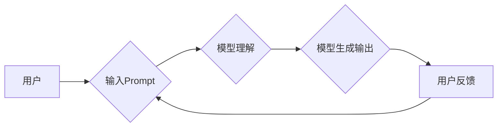

                 

## 1. 背景介绍

在人工智能领域，Prompt的设计与效果至关重要。Prompt，即提示，是用户与人工智能模型交互的关键媒介。一个精心设计的Prompt能够引导模型生成更准确、更相关的输出，而一个糟糕的Prompt则可能导致模型产生错误、模糊或无意义的回复。随着大型语言模型（LLM）的快速发展，Prompt工程逐渐成为人工智能应用开发中不可或缺的一部分。

近年来，Prompt工程的研究和实践取得了显著进展。从传统的基于规则的Prompt设计到如今的基于学习的Prompt优化，研究者们不断探索新的方法和技术，以提高Prompt的有效性和生成模型的性能。

## 2. 核心概念与联系

Prompt工程的核心概念包括：

* **Prompt:** 指向模型的指令或输入，引导模型完成特定任务。
* **Few-shot Learning:** 通过提供少量示例数据，引导模型学习新的任务。
* **Fine-tuning:** 对预训练模型进行微调，使其在特定任务上表现更优。
* **Prompt Template:** 预定义的Prompt结构，可以根据具体任务进行参数化。
* **Prompt Evaluation:** 评估Prompt效果的指标和方法。

**Mermaid 流程图**



## 3. 核心算法原理 & 具体操作步骤

### 3.1  算法原理概述

Prompt工程的核心算法原理是基于自然语言处理（NLP）和机器学习（ML）技术。

* **NLP技术:** 用于分析和理解用户的输入Prompt，提取关键信息和意图。
* **ML技术:** 用于优化Prompt结构和参数，提高模型的生成性能。

常见的Prompt工程算法包括：

* **基于规则的Prompt设计:** 根据任务需求，制定规则来构建Prompt结构。
* **基于学习的Prompt优化:** 使用机器学习模型，根据训练数据自动优化Prompt参数。

### 3.2  算法步骤详解

**基于规则的Prompt设计:**

1. **任务分析:** 首先需要明确用户想要完成的任务。
2. **关键词提取:** 从任务描述中提取关键信息和关键词。
3. **Prompt结构构建:** 根据任务需求和关键词，构建Prompt结构，例如：

```
[任务]：翻译以下文本到英文。
[文本]：你好，世界！
```

**基于学习的Prompt优化:**

1. **数据准备:** 收集大量训练数据，包括Prompt和对应的模型输出。
2. **模型训练:** 使用机器学习模型，例如强化学习，训练一个Prompt优化器。
3. **Prompt优化:** 使用训练好的Prompt优化器，对Prompt进行优化，例如调整关键词顺序、添加引导语等。

### 3.3  算法优缺点

**基于规则的Prompt设计:**

* **优点:** 简单易行，易于理解和维护。
* **缺点:** 难以处理复杂的任务，缺乏灵活性。

**基于学习的Prompt优化:**

* **优点:** 可以自动优化Prompt，提高模型性能。
* **缺点:** 需要大量训练数据，训练过程复杂。

### 3.4  算法应用领域

Prompt工程的应用领域非常广泛，包括：

* **自然语言生成:** 文本摘要、机器翻译、对话系统等。
* **代码生成:** 代码补全、代码翻译、代码生成等。
* **数据分析:** 数据分类、文本情感分析、问答系统等。

## 4. 数学模型和公式 & 详细讲解 & 举例说明

### 4.1  数学模型构建

Prompt工程中常用的数学模型包括：

* **概率模型:** 用于计算模型生成不同输出的概率。
* **损失函数:** 用于衡量模型输出与真实值的差异。
* **优化算法:** 用于更新模型参数，降低损失函数值。

### 4.2  公式推导过程

例如，在文本生成任务中，可以使用概率模型来计算模型生成每个词的概率。假设模型的输出是一个词序列，每个词的概率可以用softmax函数计算：

$$
P(w_i|w_1, w_2, ..., w_{i-1}) = \frac{exp(s_i)}{\sum_{j=1}^{V} exp(s_j)}
$$

其中：

* $w_i$ 是第i个词。
* $s_i$ 是模型对第i个词的预测得分。
* $V$ 是词汇表的大小。

### 4.3  案例分析与讲解

假设我们有一个文本生成模型，需要生成一个关于“猫”的句子。

* **输入Prompt:** 写一个关于猫的句子。
* **模型输出:** 猫咪很可爱。

在这个例子中，模型根据输入Prompt和其训练数据，计算出每个词的概率，最终生成了一个关于猫的句子。

## 5. 项目实践：代码实例和详细解释说明

### 5.1  开发环境搭建

* **操作系统:** Linux/macOS/Windows
* **编程语言:** Python
* **深度学习框架:** TensorFlow/PyTorch
* **其他工具:** Git、Jupyter Notebook

### 5.2  源代码详细实现

```python
import tensorflow as tf

# 定义模型
model = tf.keras.Sequential([
    tf.keras.layers.Embedding(input_dim=vocab_size, output_dim=embedding_dim),
    tf.keras.layers.LSTM(units=128),
    tf.keras.layers.Dense(units=vocab_size, activation='softmax')
])

# 编译模型
model.compile(optimizer='adam', loss='sparse_categorical_crossentropy', metrics=['accuracy'])

# 训练模型
model.fit(train_data, train_labels, epochs=10)

# 生成文本
prompt = "写一个关于猫的句子"
generated_text = model.predict(prompt)
```

### 5.3  代码解读与分析

* **模型定义:** 使用了嵌入层、LSTM层和全连接层构建一个文本生成模型。
* **模型编译:** 使用Adam优化器、交叉熵损失函数和准确率作为评估指标。
* **模型训练:** 使用训练数据训练模型，训练10个epochs。
* **文本生成:** 使用预训练好的模型，根据输入Prompt生成文本。

### 5.4  运行结果展示

运行代码后，模型将生成一个关于猫的句子，例如：

```
猫咪很可爱。
```

## 6. 实际应用场景

Prompt工程在各个领域都有广泛的应用场景：

* **聊天机器人:** 通过设计合适的Prompt，可以引导聊天机器人生成更自然、更符合语境的回复。
* **搜索引擎:** 使用Prompt可以帮助搜索引擎更好地理解用户的查询意图，并返回更相关的搜索结果。
* **代码生成工具:** Prompt可以帮助代码生成工具生成更准确、更符合规范的代码。
* **教育领域:** Prompt可以用于个性化学习，根据学生的学习进度和需求生成相应的学习内容。

### 6.4  未来应用展望

随着人工智能技术的不断发展，Prompt工程的应用场景将更加广泛。

* **多模态Prompt:** 将文本、图像、音频等多种模态信息整合到Prompt中，实现更丰富的交互体验。
* **个性化Prompt:** 根据用户的个人特征和偏好，生成个性化的Prompt，提供更精准的服务。
* **跨语言Prompt:** 支持多种语言的Prompt设计和应用，打破语言障碍。

## 7. 工具和资源推荐

### 7.1  学习资源推荐

* **书籍:**
    * 《Prompt Engineering for Large Language Models》
    * 《The Alignment Problem: Machine Learning and Human Values》
* **在线课程:**
    * Coursera: Natural Language Processing Specialization
    * edX: Artificial Intelligence

### 7.2  开发工具推荐

* **OpenAI API:** 提供访问GPT-3等大型语言模型的接口。
* **Hugging Face Transformers:** 提供预训练的语言模型和Prompt模板。
* **LangChain:** 用于构建基于大型语言模型的应用的框架。

### 7.3  相关论文推荐

* **"Prompt Engineering for Text Classification"**
* **"Few-Shot Learning with Language Models"**
* **"Scaling Laws for Neural Language Models"**

## 8. 总结：未来发展趋势与挑战

### 8.1  研究成果总结

Prompt工程的研究取得了显著进展，从传统的基于规则的Prompt设计到如今的基于学习的Prompt优化，研究者们不断探索新的方法和技术，以提高Prompt的有效性和生成模型的性能。

### 8.2  未来发展趋势

未来Prompt工程的发展趋势包括：

* **多模态Prompt:** 将文本、图像、音频等多种模态信息整合到Prompt中，实现更丰富的交互体验。
* **个性化Prompt:** 根据用户的个人特征和偏好，生成个性化的Prompt，提供更精准的服务。
* **跨语言Prompt:** 支持多种语言的Prompt设计和应用，打破语言障碍。

### 8.3  面临的挑战

Prompt工程也面临着一些挑战：

* **Prompt设计缺乏标准化:** 目前Prompt设计缺乏统一的标准和规范，难以进行量化评估和比较。
* **数据稀缺性:** 训练高质量的Prompt优化器需要大量的训练数据，而许多领域的数据仍然稀缺。
* **模型可解释性:** 许多大型语言模型的决策过程难以解释，这使得Prompt设计更加困难。

### 8.4  研究展望

未来研究方向包括：

* **开发更有效的Prompt设计方法和工具。**
* **探索新的Prompt优化算法和技术。**
* **研究Prompt工程的伦理和社会影响。**

## 9. 附录：常见问题与解答

* **什么是Prompt工程？**

Prompt工程是指设计和优化Prompt，以引导人工智能模型生成更准确、更相关的输出。

* **Prompt工程与机器学习有什么关系？**

Prompt工程与机器学习密切相关。许多Prompt优化算法基于机器学习技术，例如强化学习。

* **如何设计一个好的Prompt？**

设计一个好的Prompt需要考虑以下因素：

* **任务明确:** 确保Prompt清楚地表达了用户想要完成的任务。
* **关键词突出:** 使用相关的关键词，引导模型关注关键信息。
* **语义清晰:** 使用简洁明了的语言，避免歧义和误解。
* **示例提供:** 提供一些示例数据，帮助模型理解任务要求。

* **Prompt工程的应用领域有哪些？**

Prompt工程的应用领域非常广泛，包括自然语言生成、代码生成、数据分析等。


作者：禅与计算机程序设计艺术 / Zen and the Art of Computer Programming 
<end_of_turn>

