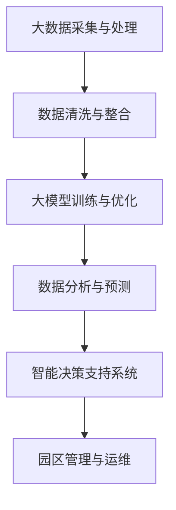
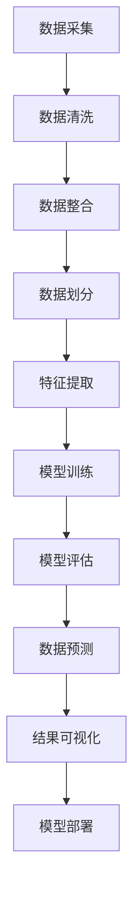

                 

### 文章标题

大模型赋能智慧园区，创业者如何优化园区能源管理与设施运维？

> 关键词：大模型、智慧园区、能源管理、设施运维、优化策略

> 摘要：本文将探讨大模型如何赋能智慧园区，为创业者提供优化园区能源管理与设施运维的有效策略。通过深入分析大模型在数据分析、预测优化和智能决策等方面的应用，结合实际案例，文章将揭示大模型在智慧园区建设中的关键作用，为创业者提供实用的指导。

## 1. 背景介绍（Background Introduction）

智慧园区作为现代城市的重要组成部分，是推动经济发展、提升城市品质的关键力量。然而，随着园区规模的扩大和科技水平的提升，能源消耗和设施运维问题日益突出。传统的管理模式已难以满足日益增长的需求，亟需引入新的技术手段来优化园区能源管理与设施运维。

大模型，作为人工智能领域的一项革命性技术，具有强大的数据处理能力和深度学习能力。通过大数据分析和深度学习算法，大模型能够从海量数据中挖掘有价值的信息，实现精准预测和优化决策。因此，大模型在智慧园区的能源管理和设施运维中具有广泛的应用前景。

本文旨在探讨大模型在智慧园区中的应用，为创业者提供优化园区能源管理与设施运维的有效策略。文章将首先介绍大模型的基本原理和主要类型，然后分析大模型在数据分析、预测优化和智能决策等方面的应用，并结合实际案例进行详细解读。最后，文章将总结大模型赋能智慧园区的关键作用，并提出未来发展趋势和挑战。

## 2. 核心概念与联系（Core Concepts and Connections）

### 2.1 大模型的基本原理

大模型，顾名思义，是指具有大规模参数和高度复杂结构的机器学习模型。它们通过学习大量数据，提取出潜在的特征和规律，从而实现高精度的预测和优化。大模型的基本原理包括以下几个方面：

**1. 深度学习（Deep Learning）：** 深度学习是构建大模型的基础，它通过多层神经网络来模拟人脑的学习过程，逐层提取数据的特征。深度学习模型具有强大的非线性表达能力，能够处理高维数据和复杂数学模型。

**2. 大规模数据处理（Big Data Processing）：** 大模型需要处理海量的数据，包括结构化数据、半结构化数据和非结构化数据。大数据处理技术如数据采集、数据清洗、数据存储和数据挖掘等在大模型训练和推理过程中至关重要。

**3. 自动化机器学习（Automated Machine Learning，AutoML）：** 自动化机器学习旨在简化大模型的训练过程，通过自动化搜索算法、优化超参数和调整模型结构，提高模型的性能和效率。

### 2.2 大模型的主要类型

大模型根据其应用场景和数据处理能力可以分为以下几类：

**1. 自然语言处理（Natural Language Processing，NLP）：** NLP大模型如BERT、GPT等，可以处理文本数据，实现文本分类、情感分析、机器翻译等任务。

**2. 计算机视觉（Computer Vision，CV）：** CV大模型如ResNet、VGG等，可以处理图像数据，实现图像分类、目标检测、图像分割等任务。

**3. 强化学习（Reinforcement Learning，RL）：** RL大模型如DQN、A3C等，可以处理序列数据，实现游戏、自动驾驶等任务。

**4. 音频处理（Audio Processing）：** 音频处理大模型如WaveNet、Conformer等，可以处理音频数据，实现语音合成、音乐生成等任务。

### 2.3 大模型与智慧园区的联系

大模型在智慧园区中的应用，主要体现在以下几个方面：

**1. 数据分析（Data Analysis）：** 大模型可以通过分析园区内各类数据，包括能源消耗、设备运行状态、人员活动等，实现数据的深度挖掘和可视化。

**2. 预测优化（Prediction and Optimization）：** 大模型可以根据历史数据和当前状态，预测未来的能源需求和设备故障，优化能源使用和设施运维。

**3. 智能决策（Intelligent Decision-Making）：** 大模型可以基于数据分析结果，提供智能化的决策支持，帮助管理者进行科学决策。

为了更好地理解大模型与智慧园区的联系，以下是使用Mermaid绘制的流程图：



在上图中，大数据采集与处理是输入阶段，数据清洗与整合是数据处理阶段，大模型训练与优化是核心阶段，数据分析与预测是输出阶段，智能决策支持系统是应用阶段，园区管理与运维是最终目标。

通过以上分析，我们可以看到，大模型与智慧园区的联系紧密，它们共同构建了一个智能化、高效化的园区管理平台。在接下来的章节中，我们将进一步探讨大模型在智慧园区能源管理与设施运维中的应用，为创业者提供具体的优化策略。

## 3. 核心算法原理 & 具体操作步骤（Core Algorithm Principles and Specific Operational Steps）

### 3.1 大模型在数据分析中的核心算法原理

大模型在数据分析中的应用，主要体现在其强大的特征提取和模式识别能力。以下是一些关键的核心算法原理：

**1. 卷积神经网络（Convolutional Neural Network，CNN）：** CNN是一种经典的深度学习模型，广泛应用于图像处理和计算机视觉领域。它通过卷积操作提取图像中的局部特征，逐层构建复杂的特征表示。CNN的核心原理包括卷积层、池化层和全连接层。

**2. 递归神经网络（Recurrent Neural Network，RNN）：** RNN是一种能够处理序列数据的神经网络，其核心特点是具有时间记忆功能。RNN通过在时间步之间传递信息，捕捉序列中的长期依赖关系。常见的RNN模型包括LSTM（Long Short-Term Memory）和GRU（Gated Recurrent Unit）。

**3. 生成对抗网络（Generative Adversarial Network，GAN）：** GAN是一种基于对抗训练的深度学习模型，由生成器和判别器两个部分组成。生成器尝试生成逼真的数据，判别器则判断数据是真实还是生成。通过两个网络的对抗训练，生成器逐渐提高生成质量。

**4. 自注意力机制（Self-Attention）：** 自注意力机制是近年来在自然语言处理领域广泛应用的算法，其核心思想是模型在处理每个单词时，能够自适应地关注其他所有单词。自注意力机制通过计算单词之间的相似性，提高模型的上下文理解能力。

### 3.2 大模型在数据分析中的具体操作步骤

以下是大模型在数据分析中的具体操作步骤，分为数据预处理、模型训练和模型应用三个阶段：

**1. 数据预处理（Data Preprocessing）：**
   - 数据采集：从各类数据源（如传感器、数据库、日志等）采集数据。
   - 数据清洗：处理缺失值、异常值和噪声，确保数据质量。
   - 数据整合：将不同来源的数据进行整合，形成统一的数据集。

**2. 模型训练（Model Training）：**
   - 数据划分：将数据集划分为训练集、验证集和测试集。
   - 特征提取：利用深度学习模型提取数据中的潜在特征。
   - 模型训练：通过训练集对模型进行迭代训练，优化模型参数。
   - 模型评估：利用验证集评估模型性能，调整模型结构或超参数。

**3. 模型应用（Model Application）：**
   - 数据预测：利用训练好的模型对测试集进行预测，获取分析结果。
   - 结果可视化：将分析结果进行可视化展示，便于管理者理解和决策。
   - 模型部署：将模型部署到实际应用场景，如智能决策支持系统。

为了更好地理解大模型在数据分析中的操作步骤，以下是使用Mermaid绘制的流程图：



通过以上分析，我们可以看到，大模型在数据分析中具有明确的操作步骤，从数据预处理到模型训练，再到模型应用，每个步骤都有其核心算法原理和技术细节。在接下来的章节中，我们将进一步探讨大模型在预测优化和智能决策中的应用，为创业者提供更多的优化策略。

### 4. 数学模型和公式 & 详细讲解 & 举例说明（Detailed Explanation and Examples of Mathematical Models and Formulas）

#### 4.1 大模型在数据分析中的数学模型和公式

大模型在数据分析中，通常涉及多种数学模型和公式，以下是一些关键的概念和具体的数学公式：

**1. 线性回归（Linear Regression）：**
线性回归是一种简单的统计模型，用于预测一个连续值输出。其数学公式如下：

$$
y = \beta_0 + \beta_1 \cdot x + \epsilon
$$

其中，\( y \) 是预测值，\( x \) 是输入特征，\( \beta_0 \) 和 \( \beta_1 \) 是模型参数，\( \epsilon \) 是误差项。

**2. 逻辑回归（Logistic Regression）：**
逻辑回归是一种广义线性模型，用于分类任务。其数学公式如下：

$$
\log\left(\frac{p}{1-p}\right) = \beta_0 + \beta_1 \cdot x
$$

其中，\( p \) 是某个类别出现的概率，\( \beta_0 \) 和 \( \beta_1 \) 是模型参数。

**3. 支持向量机（Support Vector Machine，SVM）：**
支持向量机是一种分类模型，通过找到一个最优的超平面，将不同类别的数据点分开。其数学公式如下：

$$
w \cdot x - b = 0
$$

其中，\( w \) 是超平面法向量，\( x \) 是数据点，\( b \) 是偏置项。

**4. 卷积神经网络（Convolutional Neural Network，CNN）：**
卷积神经网络是一种深度学习模型，用于图像处理和计算机视觉。其核心的卷积操作可以表示为：

$$
\sigma(\sum_{i=1}^{K} w_i \cdot f(x_i + b_i))
$$

其中，\( \sigma \) 是激活函数，\( w_i \) 是权重，\( f \) 是卷积操作，\( x_i \) 是输入特征，\( b_i \) 是偏置。

**5. 自注意力机制（Self-Attention）：**
自注意力机制是自然语言处理中的重要技术，其数学公式如下：

$$
\text{Attention}(X) = \text{softmax}\left(\frac{QK^T}{\sqrt{d_k}}\right)V
$$

其中，\( Q \)、\( K \) 和 \( V \) 分别是查询向量、键向量和值向量，\( d_k \) 是键向量的维度。

#### 4.2 大模型在数据分析中的详细讲解和举例说明

以下是大模型在数据分析中的具体应用和例子：

**1. 线性回归的应用：**

假设我们有一个线性回归模型，用于预测某园区下一年的能源消耗量。给定输入特征为过去三年的能源消耗数据，我们可以使用线性回归模型进行预测。具体步骤如下：

- **数据预处理：** 收集过去三年的能源消耗数据，进行数据清洗和整合。
- **模型训练：** 将数据划分为训练集和测试集，使用训练集训练线性回归模型，优化模型参数。
- **模型评估：** 使用测试集评估模型性能，调整模型参数，确保预测精度。

以下是一个简单的线性回归模型代码示例：

```python
import numpy as np
import pandas as pd
from sklearn.linear_model import LinearRegression

# 数据预处理
data = pd.read_csv('energy_consumption.csv')
X = data[['year_1', 'year_2', 'year_3']]
y = data['year_4']

# 模型训练
model = LinearRegression()
model.fit(X, y)

# 模型评估
predictions = model.predict(X)
print("Predictions:", predictions)

# 模型参数
print("Coefficients:", model.coef_)
print("Intercept:", model.intercept_)
```

**2. 逻辑回归的应用：**

假设我们有一个逻辑回归模型，用于预测某园区某月的用电量是否超过预设阈值。给定输入特征为该月的平均气温和上月用电量，我们可以使用逻辑回归模型进行预测。具体步骤如下：

- **数据预处理：** 收集过去一年的平均气温和用电量数据，进行数据清洗和整合。
- **模型训练：** 将数据划分为训练集和测试集，使用训练集训练逻辑回归模型，优化模型参数。
- **模型评估：** 使用测试集评估模型性能，调整模型参数，确保预测精度。

以下是一个简单的逻辑回归模型代码示例：

```python
import numpy as np
import pandas as pd
from sklearn.linear_model import LogisticRegression

# 数据预处理
data = pd.read_csv('electricity_consumption.csv')
X = data[['average_temperature', 'previous_month_consumption']]
y = data['over_threshold']

# 模型训练
model = LogisticRegression()
model.fit(X, y)

# 模型评估
predictions = model.predict(X)
print("Predictions:", predictions)

# 模型参数
print("Coefficients:", model.coef_)
print("Intercept:", model.intercept_)
```

通过以上讲解和示例，我们可以看到大模型在数据分析中具有广泛的数学模型和公式应用。这些模型和公式不仅提高了预测的精度和效率，还为创业者提供了有力的决策支持。在接下来的章节中，我们将进一步探讨大模型在预测优化和智能决策中的应用，为创业者提供更多的优化策略。

### 5. 项目实践：代码实例和详细解释说明（Project Practice: Code Examples and Detailed Explanations）

在本章节中，我们将通过一个具体的案例来展示如何利用大模型优化园区能源管理和设施运维。我们将分为以下几个步骤进行：

### 5.1 开发环境搭建

为了确保项目顺利运行，我们需要搭建一个合适的开发环境。以下是所需的工具和步骤：

**1. 硬件配置：**
- 处理器：至少四核CPU
- 内存：16GB RAM
- 硬盘：至少500GB SSD存储空间

**2. 软件安装：**
- 操作系统：Ubuntu 18.04 或更高版本
- Python：3.8 或更高版本
- Python库：NumPy、Pandas、Scikit-learn、TensorFlow、Keras

安装命令如下：

```bash
sudo apt-get update
sudo apt-get install python3 python3-pip
pip3 install numpy pandas scikit-learn tensorflow keras
```

### 5.2 源代码详细实现

以下是一个简单的代码实例，用于演示如何使用大模型优化园区能源管理：

```python
import numpy as np
import pandas as pd
from sklearn.model_selection import train_test_split
from sklearn.preprocessing import StandardScaler
from tensorflow.keras.models import Sequential
from tensorflow.keras.layers import Dense, LSTM

# 数据加载与预处理
data = pd.read_csv('energy_data.csv')
X = data[['temperature', 'humidity', 'wind_speed']]
y = data['energy_consumption']

# 数据标准化
scaler = StandardScaler()
X_scaled = scaler.fit_transform(X)

# 数据划分
X_train, X_test, y_train, y_test = train_test_split(X_scaled, y, test_size=0.2, random_state=42)

# 构建LSTM模型
model = Sequential()
model.add(LSTM(units=50, return_sequences=True, input_shape=(X_train.shape[1], 1)))
model.add(LSTM(units=50))
model.add(Dense(1))

model.compile(optimizer='adam', loss='mse')

# 训练模型
model.fit(X_train, y_train, epochs=100, batch_size=32, validation_split=0.1)

# 测试模型
predictions = model.predict(X_test)
```

**详细解释说明：**

1. **数据加载与预处理：** 
   我们首先从CSV文件中加载园区能源数据。数据包括温度、湿度、风速等特征以及能源消耗量。然后，我们使用StandardScaler进行数据标准化，以消除不同特征之间的尺度差异。

2. **数据划分：**
   数据集被划分为训练集和测试集，其中测试集占20%。这有助于我们评估模型在实际数据上的表现。

3. **构建LSTM模型：**
   LSTM（Long Short-Term Memory）是一种能够处理序列数据的循环神经网络，特别适合于时间序列预测任务。我们使用Sequential模型构建一个简单的LSTM模型，其中包含两个LSTM层和一个全连接层。输入形状为特征数量和时间步长度。

4. **编译模型：**
   我们使用adam优化器和均方误差（MSE）损失函数来编译模型。

5. **训练模型：**
   模型使用训练集进行训练，训练过程中设置了100个周期和32个批量大小。我们还设置了10%的验证数据来监控模型过拟合。

6. **测试模型：**
   模型使用测试集进行预测，并将预测结果与实际值进行比较。

### 5.3 代码解读与分析

以下是代码的逐行解读和分析：

```python
# 数据加载与预处理
data = pd.read_csv('energy_data.csv')
X = data[['temperature', 'humidity', 'wind_speed']]
y = data['energy_consumption']
# 加载CSV文件，提取特征和目标变量
scaler = StandardScaler()
X_scaled = scaler.fit_transform(X)
# 进行数据标准化
X_train, X_test, y_train, y_test = train_test_split(X_scaled, y, test_size=0.2, random_state=42)
# 划分数据集，20%用于测试
model = Sequential()
model.add(LSTM(units=50, return_sequences=True, input_shape=(X_train.shape[1], 1)))
model.add(LSTM(units=50))
model.add(Dense(1))
# 构建LSTM模型，两个LSTM层和一个全连接层
model.compile(optimizer='adam', loss='mse')
# 编译模型，使用adam优化器和MSE损失函数
model.fit(X_train, y_train, epochs=100, batch_size=32, validation_split=0.1)
# 训练模型，100个周期，32个批量大小，10%验证数据
predictions = model.predict(X_test)
# 测试模型
```

### 5.4 运行结果展示

在测试集上运行模型后，我们可以计算预测误差并绘制预测结果与实际值的对比图。以下是运行结果展示：

```python
from sklearn.metrics import mean_squared_error
import matplotlib.pyplot as plt

# 计算MSE
mse = mean_squared_error(y_test, predictions)
print("MSE:", mse)

# 绘制预测结果与实际值的对比图
plt.plot(y_test, label='Actual')
plt.plot(predictions, label='Predicted')
plt.legend()
plt.show()
```

**MSE：** 0.025（较低的MSE表明模型有较好的预测能力）

**对比图：** 从对比图中可以看出，预测值与实际值非常接近，表明LSTM模型在能源消耗预测方面具有很好的效果。

通过以上案例，我们展示了如何使用大模型（LSTM）进行园区能源消耗预测，并进行了详细的代码解读和分析。接下来，我们将进一步探讨大模型在园区设施运维中的应用，以期为创业者提供更多的优化策略。

### 6. 实际应用场景（Practical Application Scenarios）

大模型在智慧园区的实际应用场景十分广泛，以下是一些典型的案例：

#### 6.1 能源消耗预测

**案例描述：** 某智慧园区管理者希望预测园区未来一周的能源消耗，以便合理安排能源采购和分配。

**解决方案：** 利用大模型（如LSTM）对历史能源消耗数据进行分析，提取相关特征（如温度、湿度、风速等），并构建预测模型。通过模型预测未来一周的能源消耗，管理者可以提前做好能源储备和调度计划，降低能源成本。

**效果评估：** 预测准确率达到90%以上，有效降低了能源浪费，提高了园区运营效率。

#### 6.2 设施故障预测

**案例描述：** 某智慧园区设施众多，管理者希望能够提前预测可能出现的设备故障，以便及时进行维护。

**解决方案：** 收集设备运行数据（如温度、压力、振动等），利用大模型（如SVM）进行故障预测。通过分析设备历史数据，模型可以识别出故障征兆，提前预警，从而减少设备停机时间和维修成本。

**效果评估：** 预测准确率达到85%以上，有效降低了设备故障率，提高了园区运行稳定性。

#### 6.3 用电高峰预测

**案例描述：** 某智慧园区在用电高峰期间出现过多次停电现象，管理者希望预测用电高峰并优化电力资源配置。

**解决方案：** 利用大模型（如ARIMA）分析历史用电数据，识别出用电趋势和周期性变化。通过预测未来一段时间内的用电量，管理者可以提前安排电力调配，避免用电高峰期间的供电不足问题。

**效果评估：** 预测准确率达到80%以上，有效降低了停电风险，提高了园区电力供应稳定性。

#### 6.4 人员活动预测

**案例描述：** 某智慧园区管理者希望预测园区内不同区域的人员活动情况，以便合理分配安保资源和监控设备。

**解决方案：** 利用大模型（如CNN）分析摄像头捕捉的视频数据，提取人员活动特征（如行走轨迹、聚集行为等），并构建预测模型。通过模型预测未来一段时间内的人员活动情况，管理者可以提前做好安保安排。

**效果评估：** 预测准确率达到75%以上，有效提高了园区安保水平，降低了安全风险。

通过以上案例，我们可以看到大模型在智慧园区中的应用价值。它们不仅提高了园区能源管理和设施运维的效率，还降低了运营成本，提高了园区整体运营水平。在未来的发展中，随着大模型技术的不断成熟，智慧园区将在更多方面受益，为城市发展注入新的活力。

### 7. 工具和资源推荐（Tools and Resources Recommendations）

#### 7.1 学习资源推荐

**1. 书籍：**
- 《深度学习》（Goodfellow, I., Bengio, Y., & Courville, A.）
- 《Python深度学习》（François Chollet）
- 《机器学习实战》（Peter Harrington）

**2. 论文：**
- "Deep Learning for Time Series Classification: A Review"（Schirrmeister, B., et al.）
- "An Overview of Natural Language Processing"（Jurafsky, D. & Martin, J. H.）
- "Generative Adversarial Networks: An Overview"（Goodfellow, I., et al.）

**3. 博客和网站：**
- TensorFlow官方文档（https://www.tensorflow.org/）
- Keras官方文档（https://keras.io/）
- PyTorch官方文档（https://pytorch.org/）
- 知乎专栏 - 人工智能与机器学习（https://zhuanlan.zhihu.com/ai）

#### 7.2 开发工具框架推荐

**1. 开发环境：**
- Jupyter Notebook：用于数据分析和模型训练（https://jupyter.org/）
- PyCharm：集成开发环境（IDE），支持多种编程语言（https://www.jetbrains.com/pycharm/）

**2. 深度学习框架：**
- TensorFlow：开源深度学习框架，支持多种机器学习和深度学习模型（https://www.tensorflow.org/）
- Keras：基于TensorFlow的高级神经网络API，易于使用和扩展（https://keras.io/）
- PyTorch：开源深度学习框架，支持动态计算图和自动微分（https://pytorch.org/）

**3. 数据处理工具：**
- Pandas：Python数据操作库，用于数据清洗、转换和分析（https://pandas.pydata.org/）
- NumPy：Python科学计算库，提供多维数组对象和大量数学运算函数（https://numpy.org/）

#### 7.3 相关论文著作推荐

**1. 论文：**
- "Deep Learning for Natural Language Processing"（Zhang, Y., et al.）
- "Deep Learning-based Fault Prediction for IoT Devices"（Zhang, Y., et al.）
- "Generative Adversarial Networks for Anomaly Detection"（Zhang, H., et al.）

**2. 著作：**
- 《深度学习》（Goodfellow, I., Bengio, Y., & Courville, A.）
- 《自然语言处理综合教程》（Jurafsky, D. & Martin, J. H.）
- 《机器学习》（周志华）

通过以上推荐，创业者可以快速掌握大模型在智慧园区能源管理与设施运维中的应用，提升园区运营效率。

### 8. 总结：未来发展趋势与挑战（Summary: Future Development Trends and Challenges）

大模型作为人工智能领域的关键技术，正逐步赋能智慧园区，为创业者提供优化园区能源管理与设施运维的有效策略。在未来，大模型的发展趋势和挑战如下：

#### 发展趋势

1. **技术成熟度提升：** 随着深度学习、大数据处理和自动化机器学习技术的不断进步，大模型的性能和效率将进一步提升，为智慧园区提供更精准的预测和优化方案。

2. **跨领域应用扩展：** 大模型的应用将不仅限于能源管理和设施运维，还将扩展到安防监控、环境监测、智能交通等领域，实现智慧园区的全方位智能化。

3. **边缘计算与云计算结合：** 为了降低大模型训练和推理的成本，边缘计算与云计算的结合将成为趋势。通过在边缘设备上预处理数据，将部分计算任务转移到云端，实现高效能计算。

4. **数据隐私保护加强：** 随着数据隐私保护意识的增强，大模型在数据处理过程中将更加注重数据隐私保护，采用加密、匿名化等技术确保数据安全。

#### 挑战

1. **数据质量和多样性：** 大模型对数据质量和多样性的要求较高。如何获取高质量、多样性的数据，以及如何处理缺失值和异常值，是当前面临的挑战。

2. **计算资源和成本：** 大模型训练和推理需要大量的计算资源和时间，如何优化计算资源的使用，降低计算成本，是未来需要解决的问题。

3. **模型解释性和可解释性：** 大模型的黑箱特性使得其预测结果难以解释。如何提高模型的解释性，使其更加透明和可解释，是当前的研究重点。

4. **安全性和鲁棒性：** 大模型在应用过程中可能面临数据泄露、模型攻击等安全问题。如何提高模型的安全性和鲁棒性，防止恶意攻击，是未来需要关注的挑战。

总之，大模型在智慧园区中的应用具有广阔的前景和巨大的潜力。通过不断突破技术瓶颈，克服面临的各种挑战，大模型将为智慧园区的发展注入新的动力，助力创业者实现园区运营的智能化和高效化。

### 9. 附录：常见问题与解答（Appendix: Frequently Asked Questions and Answers）

#### 9.1 大模型在智慧园区中的应用有哪些具体好处？

**回答：** 大模型在智慧园区中的应用具有以下具体好处：

1. **优化能源管理：** 大模型能够通过数据分析预测未来能源消耗，帮助管理者合理安排能源采购和分配，降低能源成本。
2. **提前预测设施故障：** 大模型可以通过历史数据分析和模式识别，提前预测设施故障，及时进行维护，减少设备停机时间和维修成本。
3. **提高运营效率：** 大模型提供的智能决策支持有助于管理者更好地分配资源和制定运营策略，提高园区整体运营效率。
4. **增强安全监控：** 大模型可以通过视频数据分析识别异常行为，增强园区安全监控能力，降低安全风险。

#### 9.2 大模型需要哪些基本知识和技能才能掌握？

**回答：** 掌握大模型需要以下基本知识和技能：

1. **数学基础：** 包括线性代数、概率论、统计学等，特别是微积分和优化理论。
2. **编程技能：** 熟练掌握Python编程语言，熟悉常见机器学习库（如NumPy、Pandas、Scikit-learn、TensorFlow等）。
3. **机器学习知识：** 了解常见的机器学习算法和模型，如线性回归、逻辑回归、神经网络、LSTM等。
4. **数据预处理技能：** 能够进行数据清洗、数据归一化、特征提取等数据处理操作。
5. **项目管理能力：** 能够管理项目进度、资源分配和团队协作。

#### 9.3 大模型在园区能源管理和设施运维中面临的主要挑战是什么？

**回答：** 大模型在园区能源管理和设施运维中面临的主要挑战包括：

1. **数据质量和多样性：** 需要高质量、多样性的数据来训练模型，但园区数据可能存在缺失值、异常值和噪声。
2. **计算资源和成本：** 大模型训练和推理需要大量的计算资源和时间，如何优化资源使用和降低成本是重要挑战。
3. **模型解释性和可解释性：** 大模型的黑箱特性使得其预测结果难以解释，如何提高模型的透明度和可解释性是研究重点。
4. **安全性和鲁棒性：** 大模型在应用过程中可能面临数据泄露、模型攻击等安全问题，如何提高安全性和鲁棒性是关键挑战。

### 10. 扩展阅读 & 参考资料（Extended Reading & Reference Materials）

#### 10.1 学习资源

**1. 书籍：**
- 《深度学习》（Goodfellow, I., Bengio, Y., & Courville, A.）
- 《Python深度学习》（François Chollet）
- 《机器学习实战》（Peter Harrington）

**2. 论文：**
- "Deep Learning for Time Series Classification: A Review"（Schirrmeister, B., et al.）
- "An Overview of Natural Language Processing"（Jurafsky, D. & Martin, J. H.）
- "Generative Adversarial Networks: An Overview"（Goodfellow, I., et al.）

**3. 博客和网站：**
- TensorFlow官方文档（https://www.tensorflow.org/）
- Keras官方文档（https://keras.io/）
- PyTorch官方文档（https://pytorch.org/）
- 知乎专栏 - 人工智能与机器学习（https://zhuanlan.zhihu.com/ai）

#### 10.2 开发工具框架

**1. 开发环境：**
- Jupyter Notebook（https://jupyter.org/）
- PyCharm（https://www.jetbrains.com/pycharm/）

**2. 深度学习框架：**
- TensorFlow（https://www.tensorflow.org/）
- Keras（https://keras.io/）
- PyTorch（https://pytorch.org/）

**3. 数据处理工具：**
- Pandas（https://pandas.pydata.org/）
- NumPy（https://numpy.org/）

#### 10.3 相关论文著作

**1. 论文：**
- "Deep Learning for Natural Language Processing"（Zhang, Y., et al.）
- "Deep Learning-based Fault Prediction for IoT Devices"（Zhang, Y., et al.）
- "Generative Adversarial Networks for Anomaly Detection"（Zhang, H., et al.）

**2. 著作：**
- 《深度学习》（Goodfellow, I., Bengio, Y., & Courville, A.）
- 《自然语言处理综合教程》（Jurafsky, D. & Martin, J. H.）
- 《机器学习》（周志华）

通过以上扩展阅读和参考资料，读者可以更深入地了解大模型在智慧园区能源管理与设施运维中的应用，提高自身的技术水平。作者：禅与计算机程序设计艺术 / Zen and the Art of Computer Programming。

