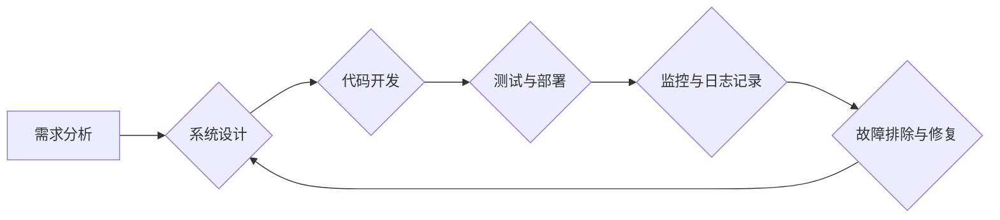

                 

## SRE（站点可靠性工程）：确保系统稳定性

> 关键词：站点可靠性工程 (SRE)、系统稳定性、DevOps、监控、故障排除、自动化、容错设计、服务等级协议 (SLA)

### 1. 背景介绍

在当今数字化时代，网站和应用程序已经成为企业和个人生活不可或缺的一部分。用户对网站和应用程序的可用性和性能要求越来越高，任何系统故障都可能导致巨大的经济损失和声誉损害。因此，确保系统稳定性成为一项至关重要的任务。

站点可靠性工程 (Site Reliability Engineering，简称 SRE) 应运而生，它是一种将软件工程的最佳实践与 IT 运维相结合的工程实践。SRE 的目标是通过自动化、监控和故障排除等手段，提高系统的可靠性、可用性和性能。

### 2. 核心概念与联系

SRE 的核心概念包括：

* **可靠性 (Reliability):** 系统在预期条件下持续正常运行的能力。
* **可用性 (Availability):** 系统在任何给定时间内能够被用户访问和使用的能力。
* **性能 (Performance):** 系统在处理用户请求时的速度和效率。
* **可观测性 (Observability):** 通过监控和日志记录，能够深入了解系统内部状态的能力。
* **自动化 (Automation):** 通过脚本和工具，自动化重复性任务，提高效率和降低人为错误。

SRE 的工作流程通常包括以下几个阶段：



**SRE 与 DevOps 的关系:**

SRE 可以看作是 DevOps 的一部分，它强调了开发和运维之间的协作和沟通。DevOps 的目标是通过自动化和流程优化，缩短软件交付周期，提高软件质量。SRE 则专注于提高软件系统的可靠性和可用性。

### 3. 核心算法原理 & 具体操作步骤

SRE 中使用许多算法和技术来实现其目标，例如：

* **故障排除算法:** 用于分析系统日志和监控数据，识别故障原因并提供解决方案。
* **容错算法:** 用于设计能够在部分组件故障的情况下仍然正常运行的系统。
* **负载均衡算法:** 用于将用户请求分配到多个服务器，提高系统的吞吐量和可用性。

#### 3.1 算法原理概述

SRE 中使用的算法通常基于以下原理：

* **数据驱动:** SRE 依赖于大量的监控数据和日志记录，通过分析这些数据来识别问题和改进系统。
* **自动化:** SRE 尽可能自动化重复性任务，例如部署、监控和故障排除，提高效率和降低人为错误。
* **持续改进:** SRE 采用持续改进的方法，不断收集反馈，优化系统和流程。

#### 3.2 算法步骤详解

以下是一个典型的故障排除算法步骤：

1. **收集数据:** 收集系统日志、监控数据和用户反馈等相关信息。
2. **分析数据:** 使用工具和技术分析数据，识别异常行为和潜在问题。
3. **定位故障:** 确定故障发生的具体位置和原因。
4. **修复故障:** 根据故障原因采取相应的措施进行修复。
5. **验证修复:** 验证修复措施是否有效，确保系统恢复正常运行。
6. **记录和总结:** 记录故障信息和修复过程，以便日后参考和改进。

#### 3.3 算法优缺点

SRE 中使用的算法具有以下优点：

* **提高效率:** 自动化任务可以节省大量时间和人力。
* **降低错误率:** 自动化可以减少人为错误，提高系统稳定性。
* **提高可观测性:** 监控和日志记录可以帮助工程师深入了解系统状态，更快地定位和解决问题。

但也存在一些缺点：

* **算法复杂性:** 一些算法可能比较复杂，需要专业的知识和技能才能理解和应用。
* **数据依赖:** 算法的准确性依赖于数据的质量和完整性。
* **成本:** 构建和维护 SRE 系统需要一定的成本投入。

#### 3.4 算法应用领域

SRE 中使用的算法广泛应用于各种领域，例如：

* **云计算:** 云服务提供商使用 SRE 技术来确保其平台的可靠性和可用性。
* **金融服务:** 金融机构使用 SRE 技术来保障其交易系统的安全性和稳定性。
* **电商平台:** 电商平台使用 SRE 技术来提高其网站的性能和可用性，确保用户能够顺利购物。

### 4. 数学模型和公式 & 详细讲解 & 举例说明

SRE 中使用一些数学模型和公式来量化系统性能和可靠性，例如：

#### 4.1 数学模型构建

**可用性 (Availability):**

可用性通常用百分比表示，计算公式如下：

$$Availability = \frac{Uptime}{Total Time} \times 100\%$$

其中：

* Uptime: 系统处于正常运行状态的时间。
* Total Time: 系统运行的总时间。

**故障率 (Failure Rate):**

故障率表示系统在特定时间段内发生故障的概率，计算公式如下：

$$Failure Rate = \frac{Number of Failures}{Total Time} $$

#### 4.2 公式推导过程

**平均故障间隔时间 (Mean Time Between Failures, MTBF):**

MTBF 是指系统在两次故障之间平均间隔的时间，计算公式如下：

$$MTBF = \frac{1}{Failure Rate}$$

**平均恢复时间 (Mean Time To Repair, MTTR):**

MTTR 是指修复系统故障所需的时间，计算公式如下：

$$MTTR = \frac{Total Repair Time}{Number of Failures}$$

#### 4.3 案例分析与讲解

假设一个网站的 Uptime 为 99.9%，则其可用性为 99.9%。如果该网站在一年内发生 10 次故障，并且每次故障的修复时间平均为 2 小时，则其故障率为：

$$Failure Rate = \frac{10}{365 \times 24} = 0.0014$$

其 MTBF 为：

$$MTBF = \frac{1}{0.0014} = 714.29 \text{ hours}$$

其 MTTR 为：

$$MTTR = \frac{20}{10} = 2 \text{ hours}$$

### 5. 项目实践：代码实例和详细解释说明

以下是一个简单的 SRE 项目实践示例，演示如何使用 Python 脚本监控网站的可用性：

#### 5.1 开发环境搭建

* Python 3.x 环境
* requests 库
* time 库
* logging 库

#### 5.2 源代码详细实现

```python
import requests
import time
import logging

# 设置日志级别
logging.basicConfig(level=logging.INFO)

# 设置目标网站 URL
target_url = "https://www.example.com"

# 设置监控间隔时间
interval = 60

# 监控循环
while True:
    try:
        # 发送 HTTP 请求
        response = requests.get(target_url)

        # 检查响应状态码
        if response.status_code == 200:
            logging.info(f"{target_url} is up!")
        else:
            logging.error(f"{target_url} is down! Status code: {response.status_code}")

    except Exception as e:
        logging.error(f"Error checking {target_url}: {e}")

    # 等待指定时间间隔
    time.sleep(interval)
```

#### 5.3 代码解读与分析

* 该脚本使用 `requests` 库发送 HTTP 请求到目标网站，并检查响应状态码。
* 如果状态码为 200，则表示网站正常运行，记录日志信息。
* 如果状态码不为 200，则表示网站出现问题，记录错误日志信息。
* 脚本使用 `time` 库设置监控间隔时间，并使用 `while True` 循环持续监控网站状态。

#### 5.4 运行结果展示

当脚本运行时，它会持续监控目标网站的可用性，并将结果记录到日志文件中。如果网站正常运行，日志文件中会记录 "网站正常" 的信息；如果网站出现问题，日志文件中会记录错误信息。

### 6. 实际应用场景

SRE 的应用场景非常广泛，例如：

* **云服务平台:** 云服务提供商使用 SRE 技术来确保其平台的可靠性和可用性，例如 AWS、Azure 和 Google Cloud。
* **金融机构:** 金融机构使用 SRE 技术来保障其交易系统的安全性和稳定性，例如银行、证券公司和保险公司。
* **电商平台:** 电商平台使用 SRE 技术来提高其网站的性能和可用性，例如 Amazon、eBay 和 Alibaba。
* **社交媒体平台:** 社交媒体平台使用 SRE 技术来确保其平台的稳定性和可用性，例如 Facebook、Twitter 和 Instagram。

#### 6.4 未来应用展望

随着数字化转型加速，SRE 将在未来发挥越来越重要的作用。

* **人工智能 (AI) 和机器学习 (ML):** AI 和 ML 技术将被用于自动化故障排除、预测故障和优化系统性能。
* **Serverless 架构:** Serverless 架构将更加普及，SRE 需要适应这种新的架构模式，并开发相应的监控和管理工具。
* **边缘计算:** 边缘计算的兴起将带来新的挑战和机遇，SRE 需要考虑如何将可靠性工程应用到边缘计算环境中。

### 7. 工具和资源推荐

#### 7.1 学习资源推荐

* **书籍:**
    * "Site Reliability Engineering" by Betsy Beyer, Chris Jones, and Jennifer Petoff
    * "The Phoenix Project" by Gene Kim, Kevin Behr, and George Spafford
* **在线课程:**
    * Google Cloud Platform SRE Fundamentals
    * Udemy SRE Courses
* **博客和网站:**
    * Google SRE Blog
    * DevOps.com

#### 7.2 开发工具推荐

* **监控工具:** Prometheus, Grafana, Datadog, New Relic
* **日志管理工具:** Elasticsearch, Logstash, Kibana (ELK Stack), Splunk
* **自动化工具:** Ansible, Puppet, Chef, Terraform
* **配置管理工具:** Git, Jenkins, CircleCI

#### 7.3 相关论文推荐

* "Building a Culture of Reliability" by Betsy Beyer
* "The Site Reliability Workbook" by Chris Jones
* "Chaos Engineering: Building Resilience in the Face of Uncertainty" by Casey Rosenthal

### 8. 总结：未来发展趋势与挑战

#### 8.1 研究成果总结

SRE 已经取得了显著的成果，帮助企业提高了系统的可靠性和可用性。

* 自动化和监控技术的进步使得 SRE 能够更加高效地管理系统。
* DevOps 文化的推广促进了 SRE 和开发团队之间的协作。

#### 8.2 未来发展趋势

* **AI 和 ML 的应用:** AI 和 ML 将被用于自动化故障排除、预测故障和优化系统性能。
* **Serverless 架构的普及:** SRE 需要适应 Serverless 架构，并开发相应的监控和管理工具。
* **边缘计算的兴起:** SRE 需要考虑如何将可靠性工程应用到边缘计算环境中。

#### 8.3 面临的挑战

* **复杂系统:** 现代系统越来越复杂，SRE 需要面对更加复杂的挑战。
* **人才短缺:** SRE 需要具备丰富的技术和经验，人才短缺是一个普遍的挑战。
* **文化变革:** SRE 需要改变企业文化，促进开发和运维之间的协作。

#### 8.4 研究展望

未来 SRE 研究将继续关注以下几个方面:

* **更智能的自动化:** 开发更加智能的自动化工具，能够自动识别和解决问题。
* **更有效的监控:** 开发更加有效的监控工具，能够更深入地了解系统状态。
* **更强大的容错能力:** 研究更强大的容错算法，能够更好地应对系统故障。

### 9. 附录：常见问题与解答

* **什么是 SRE?**

SRE (Site Reliability Engineering) 是将软件工程的最佳实践与 IT 运维相结合的工程实践，旨在提高系统的可靠性、可用性和性能。

* **SRE 和 DevOps 的区别是什么?**

SRE 可以看作是 DevOps 的一部分，它强调了开发和运维之间的协作和沟通。DevOps 的目标是通过自动化和流程优化，缩短软件交付周期，提高软件质量。SRE 则专注于提高软件系统的可靠性和可用性。

* **SRE 需要哪些技能?**

SRE 需要具备丰富的技术和经验，包括软件开发、系统运维、监控、自动化、故障排除等。

* **如何学习 SRE?**

可以通过阅读书籍、参加在线课程、学习开源工具和参与开源项目来学习 SRE。


作者：禅与计算机程序设计艺术 / Zen and the Art of Computer Programming 
<end_of_turn>

