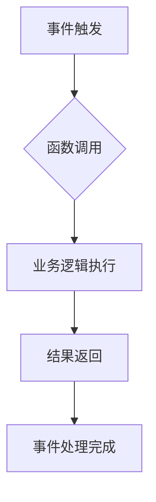

                 

## Serverless架构：Focus on Code, Not Servers

> 关键词：Serverless, 函数式计算, 云原生, 微服务, 自动伸缩, 事件驱动, 代码优先

### 1. 背景介绍

随着云计算技术的蓬勃发展，传统的服务器管理模式逐渐被新的架构模式所取代。其中，Serverless架构作为一种革命性的计算模式，以其轻量级、弹性、可扩展等特点，迅速成为云原生应用的热门选择。

Serverless架构的核心思想是将应用程序的运行逻辑抽象为独立的函数，由云服务提供商负责提供基础设施和资源管理，开发者只需专注于编写业务逻辑代码。这种模式极大地简化了开发和运维流程，降低了成本，提高了开发效率。

### 2. 核心概念与联系

#### 2.1  核心概念

* **函数式计算 (Function as a Service, FaaS):** Serverless架构的核心是函数式计算，将应用程序拆分成一个个独立的函数，每个函数执行一个特定的任务。
* **事件驱动 (Event-Driven):** Serverless架构通常采用事件驱动的方式，当触发事件发生时，相应的函数会被自动调用执行。
* **无服务器 (Serverless):** 云服务提供商负责提供服务器、操作系统、网络等基础设施，开发者无需关心这些底层细节。

#### 2.2  架构关系



### 3. 核心算法原理 & 具体操作步骤

#### 3.1  算法原理概述

Serverless架构的核心算法原理是将应用程序的执行逻辑抽象为函数，并通过事件驱动机制触发函数执行。

* **函数抽象:** 将应用程序拆分成一个个独立的函数，每个函数执行一个特定的任务，可以独立部署和管理。
* **事件驱动:** 使用事件作为函数调用的触发机制，当事件发生时，相应的函数会被自动调用执行。
* **自动伸缩:** 云服务提供商根据实际需求自动调整函数的执行实例数量，保证应用程序的性能和可用性。

#### 3.2  算法步骤详解

1. **开发函数:** 开发者编写业务逻辑代码，将其封装成独立的函数。
2. **部署函数:** 将函数代码上传到云服务提供商的平台，平台会自动构建和部署函数。
3. **事件触发:** 当触发事件发生时，云服务平台会自动调用相应的函数。
4. **函数执行:** 函数执行业务逻辑，并返回结果。
5. **结果处理:** 云服务平台将函数返回的结果传递给后续处理环节。

#### 3.3  算法优缺点

**优点:**

* **简化开发和运维:** 开发者无需关心服务器管理，可以专注于编写业务逻辑代码。
* **弹性伸缩:** 云服务提供商根据实际需求自动调整函数的执行实例数量，保证应用程序的性能和可用性。
* **成本效益:** 只为实际执行时间付费，无需预先购买和维护服务器。

**缺点:**

* **冷启动问题:** 函数第一次执行时需要从冷启动状态启动，可能会导致延迟。
* **状态管理:** 函数是无状态的，需要开发者自行处理状态管理。
* **监控和调试:** 对函数的监控和调试需要使用云服务平台提供的工具。

#### 3.4  算法应用领域

Serverless架构广泛应用于以下领域:

* **微服务架构:** 将大型应用程序拆分成多个独立的服务，每个服务作为一个函数部署和运行。
* **事件驱动架构:** 处理各种事件，例如用户登录、数据更新、订单创建等。
* **实时数据处理:** 处理实时数据流，例如传感器数据、社交媒体数据等。
* **API 开发:** 快速构建和部署API，简化API开发和管理流程。

### 4. 数学模型和公式 & 详细讲解 & 举例说明

#### 4.1  数学模型构建

Serverless架构的成本模型可以抽象为以下数学模型:

$$
C = \alpha \cdot T + \beta \cdot N
$$

其中:

* $C$ 表示总成本
* $T$ 表示函数执行时间
* $N$ 表示函数执行实例数量
* $\alpha$ 表示每单位时间执行成本
* $\beta$ 表示每个执行实例的固定成本

#### 4.2  公式推导过程

该模型基于以下假设:

* 函数执行时间与成本成正比
* 函数执行实例数量与成本成正比

#### 4.3  案例分析与讲解

假设一个函数执行时间为10秒，执行实例数量为10个，每秒执行成本为0.01美元，每个执行实例的固定成本为0.1美元。

则总成本为:

$$
C = 0.01 \cdot 10 + 0.1 \cdot 10 = 0.1 + 1 = 1.1 \text{美元}
$$

### 5. 项目实践：代码实例和详细解释说明

#### 5.1  开发环境搭建

* 选择一个支持Serverless架构的云服务平台，例如AWS Lambda、Azure Functions、Google Cloud Functions等。
* 安装云服务平台的SDK和必要的开发工具。

#### 5.2  源代码详细实现

```python
# AWS Lambda 函数示例
def lambda_handler(event, context):
    # 业务逻辑代码
    print("Hello, Serverless!")
    return {
        'statusCode': 200,
        'body': 'Serverless function executed successfully!'
    }
```

#### 5.3  代码解读与分析

* 该代码是一个简单的Python函数，定义了`lambda_handler`函数。
* 函数接收`event`和`context`两个参数，`event`包含触发函数的事件信息，`context`包含函数执行环境信息。
* 函数内部执行业务逻辑，打印一条消息，并返回一个JSON响应。

#### 5.4  运行结果展示

当触发该函数时，云服务平台会自动执行该函数，并返回以下JSON响应:

```json
{
  "statusCode": 200,
  "body": "Serverless function executed successfully!"
}
```

### 6. 实际应用场景

#### 6.1  微服务架构

Serverless架构非常适合构建微服务架构，将大型应用程序拆分成多个独立的服务，每个服务作为一个函数部署和运行。

#### 6.2  事件驱动架构

Serverless架构可以轻松处理各种事件，例如用户登录、数据更新、订单创建等。

#### 6.3  实时数据处理

Serverless架构可以用于处理实时数据流，例如传感器数据、社交媒体数据等。

#### 6.4  未来应用展望

Serverless架构在未来将继续发展，并应用于更多领域，例如：

* **边缘计算:** 将Serverless函数部署到边缘设备，实现更低延迟的计算。
* **人工智能:** 将AI模型部署为Serverless函数，实现更灵活和可扩展的AI应用。
* **区块链:** 将区块链智能合约部署为Serverless函数，实现更安全和高效的智能合约执行。

### 7. 工具和资源推荐

#### 7.1  学习资源推荐

* **Serverless Computing: A Practical Guide:** https://www.amazon.com/Serverless-Computing-Practical-Guide-Architecture/dp/1492077939
* **Serverless Architectures on AWS:** https://aws.amazon.com/serverless/

#### 7.2  开发工具推荐

* **AWS Lambda:** https://aws.amazon.com/lambda/
* **Azure Functions:** https://azure.microsoft.com/en-us/services/functions/
* **Google Cloud Functions:** https://cloud.google.com/functions/

#### 7.3  相关论文推荐

* **Serverless Computing: Vision, Hype, Reality, and Challenges:** https://dl.acm.org/doi/10.1145/3349117.3349124

### 8. 总结：未来发展趋势与挑战

#### 8.1  研究成果总结

Serverless架构已经取得了显著的成果，简化了开发和运维流程，降低了成本，提高了开发效率。

#### 8.2  未来发展趋势

Serverless架构将继续发展，并应用于更多领域，例如边缘计算、人工智能、区块链等。

#### 8.3  面临的挑战

Serverless架构还面临一些挑战，例如冷启动问题、状态管理问题、监控和调试问题等。

#### 8.4  研究展望

未来研究将集中在解决Serverless架构面临的挑战，提高其性能、可靠性和安全性。

### 9. 附录：常见问题与解答

* **什么是Serverless架构?**

Serverless架构是一种云计算架构模式，开发者无需关心服务器管理，只需专注于编写业务逻辑代码。

* **Serverless架构有哪些优点?**

Serverless架构的优点包括简化开发和运维流程、弹性伸缩、成本效益等。

* **Serverless架构有哪些缺点?**

Serverless架构的缺点包括冷启动问题、状态管理问题、监控和调试问题等。


作者：禅与计算机程序设计艺术 / Zen and the Art of Computer Programming 
<end_of_turn>

