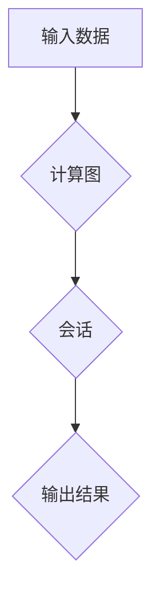

                 

## TensorFlow深度学习：从基础到高级应用

> 关键词：TensorFlow, 深度学习, 神经网络, 机器学习, 编程, 算法, 应用

## 1. 背景介绍

深度学习作为机器学习领域的一个重要分支，近年来取得了令人瞩目的成就，在图像识别、自然语言处理、语音识别等领域展现出强大的应用潜力。TensorFlow作为谷歌开发的开源深度学习框架，凭借其灵活、高效、易于扩展的特点，成为了深度学习研究和应用的热门选择。

随着深度学习技术的不断发展，TensorFlow也经历了从基础版本到高级版本的迭代升级，提供了越来越丰富的功能和工具，满足了从初学者到专家用户的需求。本书将带领读者深入了解TensorFlow的各个方面，从基础概念到高级应用，全面掌握TensorFlow的学习和应用技巧。

## 2. 核心概念与联系

TensorFlow的核心概念是**张量（Tensor）**。张量是一种多维数组，可以表示各种数据类型，例如数字、图像、文本等。TensorFlow通过定义和操作张量来实现深度学习模型的构建和训练。

**TensorFlow的架构主要包含以下几个部分：**

* **计算图（Computational Graph）：** TensorFlow使用计算图来表示深度学习模型，计算图由节点和边组成，节点代表运算，边代表数据流。
* **会话（Session）：** 会话是执行计算图的执行环境，它负责分配资源、执行运算并返回结果。
* **变量（Variable）：** 变量是计算图中可训练的参数，它们的值会在训练过程中不断更新。
* **操作（Operation）：** 操作是计算图中的基本运算，例如加法、减法、矩阵乘法等。

**TensorFlow架构流程图：**



## 3. 核心算法原理 & 具体操作步骤

### 3.1  算法原理概述

TensorFlow支持多种深度学习算法，其中最常用的算法是**反向传播算法（Backpropagation）**。反向传播算法通过计算损失函数的梯度，来更新模型参数，从而使模型的预测结果越来越准确。

**反向传播算法的基本步骤如下：**

1. 将输入数据输入到模型中，得到预测结果。
2. 计算预测结果与真实值的损失函数值。
3. 使用链式法则计算损失函数对每个参数的梯度。
4. 根据梯度更新每个参数的值。

### 3.2  算法步骤详解

1. **前向传播（Forward Propagation）：** 将输入数据通过神经网络层层传递，最终得到预测结果。
2. **损失函数计算（Loss Function）：** 计算预测结果与真实值的差异，即损失函数值。常用的损失函数包括均方误差（MSE）、交叉熵损失（Cross-Entropy Loss）等。
3. **反向传播（Backpropagation）：** 计算损失函数对每个参数的梯度，并根据梯度更新每个参数的值。
4. **优化器（Optimizer）：** 使用优化器算法来更新参数，例如梯度下降（Gradient Descent）、动量法（Momentum）等。

### 3.3  算法优缺点

**优点：**

* 能够学习复杂的非线性关系。
* 训练效果通常优于传统机器学习算法。
* 广泛应用于各种机器学习任务。

**缺点：**

* 训练过程需要大量的计算资源和时间。
* 模型参数很多，容易过拟合。
* 对数据质量要求较高。

### 3.4  算法应用领域

反向传播算法广泛应用于以下领域：

* **图像识别：** 人脸识别、物体检测、图像分类等。
* **自然语言处理：** 机器翻译、文本摘要、情感分析等。
* **语音识别：** 语音转文本、语音合成等。
* **推荐系统：** 商品推荐、用户画像等。

## 4. 数学模型和公式 & 详细讲解 & 举例说明

### 4.1  数学模型构建

深度学习模型通常由多个神经网络层组成，每一层都包含多个神经元。每个神经元接收来自上一层的输入，并通过激活函数进行处理，输出到下一层。

**神经网络层：**

* **输入层：** 接收原始数据。
* **隐藏层：** 对数据进行特征提取和表示。
* **输出层：** 输出最终预测结果。

**激活函数：**

激活函数的作用是引入非线性，使神经网络能够学习复杂的非线性关系。常用的激活函数包括 sigmoid 函数、ReLU 函数、tanh 函数等。

### 4.2  公式推导过程

**损失函数：**

损失函数用于衡量模型预测结果与真实值的差异。常用的损失函数包括均方误差（MSE）和交叉熵损失（Cross-Entropy Loss）。

**MSE：**

$$
MSE = \frac{1}{N} \sum_{i=1}^{N} (y_i - \hat{y}_i)^2
$$

其中：

* $N$ 是样本数量。
* $y_i$ 是真实值。
* $\hat{y}_i$ 是预测值。

**交叉熵损失：**

$$
Cross-Entropy Loss = -\sum_{i=1}^{N} y_i \log(\hat{y}_i)
$$

其中：

* $y_i$ 是真实值（0或1）。
* $\hat{y}_i$ 是预测值（0到1之间的概率）。

**梯度下降：**

梯度下降算法用于更新模型参数，使其能够最小化损失函数值。

$$
\theta = \theta - \alpha \frac{\partial Loss}{\partial \theta}
$$

其中：

* $\theta$ 是模型参数。
* $\alpha$ 是学习率。
* $\frac{\partial Loss}{\partial \theta}$ 是损失函数对参数 $\theta$ 的梯度。

### 4.3  案例分析与讲解

**图像分类：**

假设我们有一个图像分类任务，目标是将图像分类为猫或狗。我们可以使用卷积神经网络（CNN）来实现这个任务。CNN能够自动学习图像特征，并将其用于分类。

**训练过程：**

1. 将图像数据分成训练集和测试集。
2. 使用训练集训练CNN模型，并使用损失函数和梯度下降算法来更新模型参数。
3. 使用测试集评估模型的性能，例如准确率、召回率等。

## 5. 项目实践：代码实例和详细解释说明

### 5.1  开发环境搭建

TensorFlow可以使用Python语言进行开发。需要安装Python和TensorFlow库。

**安装TensorFlow：**

```bash
pip install tensorflow
```

### 5.2  源代码详细实现

以下是一个简单的TensorFlow代码示例，用于实现线性回归模型：

```python
import tensorflow as tf

# 定义模型参数
W = tf.Variable(0.0, name="W")
b = tf.Variable(0.0, name="b")

# 定义模型输入和输出
x = tf.placeholder(tf.float32, name="x")
y = tf.placeholder(tf.float32, name="y")

# 定义模型预测结果
y_pred = W * x + b

# 定义损失函数
loss = tf.reduce_mean(tf.square(y_pred - y))

# 定义优化器
optimizer = tf.train.GradientDescentOptimizer(learning_rate=0.01)
train_op = optimizer.minimize(loss)

# 初始化变量
init = tf.global_variables_initializer()

# 创建会话
with tf.Session() as sess:
    # 初始化变量
    sess.run(init)

    # 训练模型
    for i in range(1000):
        # 训练数据
        x_data = [1.0, 2.0, 3.0, 4.0, 5.0]
        y_data = [2.0, 4.0, 6.0, 8.0, 10.0]

        # 执行训练操作
        sess.run(train_op, feed_dict={x: x_data, y: y_data})

    # 获取模型参数
    W_val, b_val = sess.run([W, b])

    # 打印模型参数
    print("W:", W_val)
    print("b:", b_val)
```

### 5.3  代码解读与分析

这段代码定义了一个简单的线性回归模型，并使用梯度下降算法进行训练。

* **模型定义：** 使用`tf.Variable`定义模型参数W和b。
* **输入和输出：** 使用`tf.placeholder`定义模型输入x和y。
* **预测结果：** 使用`W * x + b`计算模型预测结果y_pred。
* **损失函数：** 使用`tf.reduce_mean(tf.square(y_pred - y))`计算均方误差损失。
* **优化器：** 使用`tf.train.GradientDescentOptimizer`定义梯度下降优化器。
* **训练操作：** 使用`optimizer.minimize(loss)`定义训练操作。
* **会话：** 使用`tf.Session`创建会话，并执行训练操作。

### 5.4  运行结果展示

训练完成后，代码会打印出模型参数W和b的值。这些值代表了模型学习到的线性关系。

## 6. 实际应用场景

TensorFlow在各个领域都有广泛的应用，例如：

* **图像识别：** Google Photos使用TensorFlow识别图像中的物体，并进行自动分类和搜索。
* **语音识别：** Google Assistant使用TensorFlow进行语音识别，并理解用户的指令。
* **自然语言处理：** Google Translate使用TensorFlow进行机器翻译，将文本从一种语言翻译成另一种语言。
* **推荐系统：** Netflix使用TensorFlow构建推荐系统，根据用户的观看历史推荐感兴趣的电影和电视剧。

### 6.4  未来应用展望

随着深度学习技术的不断发展，TensorFlow的应用场景将会更加广泛。例如：

* **医疗诊断：** 使用TensorFlow分析医学图像，辅助医生进行诊断。
* **自动驾驶：** 使用TensorFlow训练自动驾驶汽车，使其能够感知周围环境并做出决策。
* **个性化教育：** 使用TensorFlow根据学生的学习情况提供个性化的学习内容和建议。

## 7. 工具和资源推荐

### 7.1  学习资源推荐

* **TensorFlow官方文档：** https://www.tensorflow.org/
* **TensorFlow教程：** https://www.tensorflow.org/tutorials
* **Deep Learning Specialization (Coursera)：** https://www.coursera.org/specializations/deep-learning

### 7.2  开发工具推荐

* **Jupyter Notebook：** https://jupyter.org/
* **VS Code：** https://code.visualstudio.com/

### 7.3  相关论文推荐

* **AlexNet：** http://papers.nips.cc/paper/4824-imagenet-classification-with-deep-convolutional-neural-networks.pdf
* **VGGNet：** http://arxiv.org/abs/1409.1556
* **ResNet：** http://arxiv.org/abs/1512.03385

## 8. 总结：未来发展趋势与挑战

### 8.1  研究成果总结

TensorFlow的发展经历了从基础版本到高级版本的迭代升级，提供了越来越丰富的功能和工具，满足了从初学者到专家用户的需求。

### 8.2  未来发展趋势

* **模型效率提升：** 研究更轻量级、更高效的深度学习模型，降低训练和推理成本。
* **可解释性增强：** 研究更易于理解和解释的深度学习模型，提高模型的透明度和可信度。
* **边缘计算应用：** 将深度学习模型部署到边缘设备，实现更快速的响应和更低的延迟。

### 8.3  面临的挑战

* **数据隐私和安全：** 深度学习模型的训练需要大量数据，如何保护数据隐私和安全是一个重要的挑战。
* **模型公平性：** 深度学习模型可能存在偏见，如何确保模型的公平性和公正性是一个重要的研究方向。
* **模型可维护性：** 深度学习模型的复杂性使得模型的维护和更新变得困难，如何提高模型的可维护性和可扩展性是一个重要的挑战。

### 8.4  研究展望

未来，TensorFlow将会继续朝着更强大、更灵活、更易于使用的方向发展，为深度学习的应用提供更丰富的工具和资源。


## 9. 附录：常见问题与解答

**Q1：如何安装TensorFlow？**

A1：可以使用pip命令安装TensorFlow：

```bash
pip install tensorflow
```

**Q2：TensorFlow有哪些不同的版本？**

A2：TensorFlow有两种主要版本：

* **TensorFlow 1.x：** 这是TensorFlow的早期版本，使用静态图计算图。
* **TensorFlow 2.x：** 这是TensorFlow的最新版本，使用动态图计算图，更加灵活和易于使用。

**Q3：TensorFlow有哪些常用的深度学习模型？**

A3：TensorFlow提供了许多常用的深度学习模型，例如：

* **CNN（卷积神经网络）：** 用于图像识别、物体检测等任务。
* **RNN（循环神经网络）：** 用于自然语言处理、语音识别等任务。
* **LSTM（长短期记忆网络）：** 是一种特殊的RNN，能够处理长序列数据。

**Q4：如何使用TensorFlow进行模型训练？**

A4：可以使用TensorFlow的`tf.train.GradientDescentOptimizer`定义梯度下降优化器，并使用`optimizer.minimize(loss)`定义训练操作。

**Q5：如何评估深度学习模型的性能？**

A5：可以使用准确率、召回率、F1-score等指标来评估深度学习模型的性能。


作者：禅与计算机程序设计艺术 / Zen and the Art of Computer Programming<end_of_turn>

