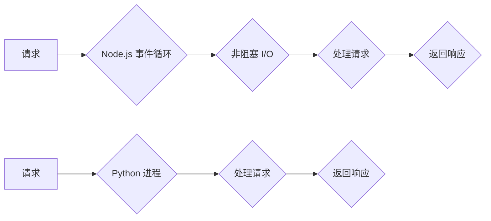

                 

## Web 后端开发：Node.js 和 Python

> 关键词：Node.js, Python, Web 后端, 异步编程, 框架, 数据库, RESTful API

### 1. 背景介绍

随着互联网的蓬勃发展，Web 应用的需求日益增长，后端开发成为构建强大、可靠和可扩展Web 应用的关键环节。Node.js 和 Python 作为两种流行的编程语言，在Web 后端开发领域占据着重要地位。

Node.js 基于 Chrome 的 V8 引擎，采用非阻塞、事件驱动模型，擅长处理高并发请求，特别适合构建实时应用和高性能 Web 服务器。Python 以其简洁易读的语法和丰富的第三方库而闻名，在数据科学、机器学习等领域也表现出色，在 Web 后端开发中也拥有广泛的应用。

本文将深入探讨 Node.js 和 Python 在 Web 后端开发中的应用，分析其核心概念、算法原理、项目实践以及实际应用场景，并展望其未来发展趋势。

### 2. 核心概念与联系

#### 2.1 Node.js 核心概念

* **事件驱动模型:** Node.js 基于事件驱动模型，它通过事件循环机制处理异步操作，避免了阻塞式编程带来的性能瓶颈。当一个事件发生时，相应的回调函数会被执行。
* **非阻塞 I/O:** Node.js 使用非阻塞 I/O 模型，这意味着它可以同时处理多个请求，而不会等待一个请求完成才能处理下一个请求。
* **单线程多任务:** Node.js 采用单线程模型，但通过事件循环机制实现多任务处理。

#### 2.2 Python 核心概念

* **面向对象编程:** Python 支持面向对象编程，可以利用类和对象来组织代码，提高代码的可读性和可维护性。
* **动态类型:** Python 是一种动态类型语言，这意味着变量类型在运行时确定，不需要事先声明。
* **丰富的库:** Python 拥有丰富的第三方库，例如 Django 和 Flask，可以简化 Web 开发流程。

#### 2.3 Node.js 和 Python 的联系

Node.js 和 Python 都可以用于 Web 后端开发，它们之间存在着一些联系：

* **两者都支持异步编程:** 虽然实现方式不同，但 Node.js 和 Python 都支持异步编程，可以提高程序的效率。
* **两者都拥有丰富的生态系统:** Node.js 和 Python 都拥有庞大的社区和丰富的第三方库，可以帮助开发者快速构建 Web 应用。
* **两者都可以与数据库和 API 集成:** Node.js 和 Python 都可以与各种数据库和 API 集成，可以构建复杂的 Web 应用。

**Mermaid 流程图**



### 3. 核心算法原理 & 具体操作步骤

#### 3.1  算法原理概述

Node.js 和 Python 在 Web 后端开发中使用的核心算法主要包括：

* **事件循环:** Node.js 的核心机制，通过轮询处理事件队列，实现异步编程。
* **协程:** Python 中的一种轻量级线程，可以实现并发执行，提高程序效率。
* **路由算法:** 用于将请求映射到相应的处理函数，实现 URL 的分发。

#### 3.2  算法步骤详解

* **事件循环:**

1.  Node.js 接收一个请求。
2.  将请求添加到事件队列中。
3.  事件循环不断轮询事件队列，取出事件并执行相应的回调函数。
4.  回调函数处理请求，并返回响应。
5.  响应发送给客户端。

* **协程:**

1.  Python 进程启动一个协程。
2.  协程执行一段代码，然后遇到协程暂停点。
3.  协程暂停，释放 CPU 资源。
4.  其他协程可以继续执行。
5.  当暂停的协程的条件满足时，它会被重新激活，继续执行。

* **路由算法:**

1.  接收请求 URL。
2.  根据 URL 的路径和参数，匹配相应的路由规则。
3.  将请求转发到对应的处理函数。

#### 3.3  算法优缺点

* **事件循环:**

    * **优点:** 高并发性能，响应速度快。
    * **缺点:** 复杂性较高，调试难度大。

* **协程:**

    * **优点:** 轻量级，资源占用低，可以实现并发执行。
    * **缺点:** 协程切换需要时间，对于某些任务可能不如多线程高效。

* **路由算法:**

    * **优点:** 可以将请求高效地分发到相应的处理函数。
    * **缺点:** 路由规则的配置可能比较复杂。

#### 3.4  算法应用领域

* **事件循环:** 实时聊天应用、游戏服务器、高并发 Web 服务器。
* **协程:** 网络爬虫、数据处理、异步任务执行。
* **路由算法:** Web 应用框架、API 开发。

### 4. 数学模型和公式 & 详细讲解 & 举例说明

#### 4.1  数学模型构建

在 Web 后端开发中，可以使用数学模型来分析和优化系统性能。例如，可以使用 **Little's Law** 来估算系统中的平均等待时间：

$$W = \frac{L}{λ}$$

其中：

* **W** 是平均等待时间
* **L** 是系统中的平均队列长度
* **λ** 是到达率

#### 4.2  公式推导过程

Little's Law 的推导过程基于以下假设：

* 系统是一个稳态系统，即到达率和服务率保持恒定。
* 队列长度是随机的，服从某种概率分布。

根据这些假设，可以推导出 Little's Law 的公式。

#### 4.3  案例分析与讲解

假设一个 Web 服务器处理请求的平均时间为 100 毫秒，每分钟有 1000 个请求到达，则可以使用 Little's Law 来估算平均等待时间：

$$W = \frac{L}{λ} = \frac{L}{1000/60} = \frac{L}{16.67}$$

为了计算平均队列长度 **L**，需要根据实际情况进行分析和测量。

### 5. 项目实践：代码实例和详细解释说明

#### 5.1  开发环境搭建

* **Node.js:** 下载并安装 Node.js，访问 https://nodejs.org/ 下载。
* **Python:** 下载并安装 Python，访问 https://www.python.org/ 下载。
* **IDE:** 选择合适的 IDE，例如 Visual Studio Code、Atom 或 PyCharm。

#### 5.2  源代码详细实现

**Node.js 示例:**

```javascript
const express = require('express');
const app = express();

app.get('/', (req, res) => {
  res.send('Hello World!');
});

app.listen(3000, () => {
  console.log('Server listening on port 3000');
});
```

**Python 示例:**

```python
from flask import Flask

app = Flask(__name__)

@app.route('/')
def hello_world():
  return 'Hello World!'

if __name__ == '__main__':
  app.run(debug=True)
```

#### 5.3  代码解读与分析

* **Node.js:** 使用 Express 框架构建一个简单的 Web 服务器，监听端口 3000，处理根路径的 GET 请求，返回 "Hello World!" 字符串。
* **Python:** 使用 Flask 框架构建一个简单的 Web 服务器，定义一个路由规则 `/`，处理 GET 请求，返回 "Hello World!" 字符串。

#### 5.4  运行结果展示

运行上述代码，访问 http://localhost:3000/ 或 http://127.0.0.1:5000/，即可看到 "Hello World!" 的输出。

### 6. 实际应用场景

#### 6.1  Node.js 应用场景

* **实时聊天应用:** Node.js 的非阻塞 I/O 模型非常适合处理大量实时消息，例如聊天应用、在线游戏等。
* **高并发 Web 服务器:** Node.js 可以处理大量的并发请求，适合构建高性能的 Web 服务器，例如电商平台、社交媒体等。
* **API 开发:** Node.js 可以快速构建 RESTful API，用于提供数据和服务给其他应用。

#### 6.2  Python 应用场景

* **数据科学和机器学习:** Python 拥有丰富的科学计算库和机器学习库，例如 NumPy、Pandas、Scikit-learn 等，广泛应用于数据分析、机器学习等领域。
* **Web 开发:** Python 拥有 Django 和 Flask 等流行的 Web 框架，可以快速构建 Web 应用。
* **自动化脚本:** Python 的语法简洁易读，可以用于编写自动化脚本，例如系统管理、数据处理等。

#### 6.3  Node.js 和 Python 的共同应用场景

* **微服务架构:** Node.js 和 Python 都可以用于构建微服务，实现系统模块化和可扩展性。
* **DevOps:** Node.js 和 Python 都可以用于 DevOps 工具链，例如自动化部署、监控、日志分析等。

#### 6.4  未来应用展望

* **Serverless 计算:** Node.js 和 Python 都支持 Serverless 计算模型，可以更灵活地部署和管理 Web 应用。
* **人工智能和机器学习:** Node.js 和 Python 都可以与人工智能和机器学习框架集成，构建智能 Web 应用。
* **区块链技术:** Node.js 和 Python 都可以用于开发区块链应用，例如智能合约、去中心化应用等。

### 7. 工具和资源推荐

#### 7.1  学习资源推荐

* **Node.js:** https://nodejs.org/en/docs/
* **Python:** https://docs.python.org/3/

#### 7.2  开发工具推荐

* **IDE:** Visual Studio Code, Atom, PyCharm
* **包管理器:** npm (Node.js), pip (Python)
* **调试工具:** Chrome DevTools, pdb (Python)

#### 7.3  相关论文推荐

* **Node.js 事件循环机制:** https://www.researchgate.net/publication/329870504_Understanding_Node_js_Event_Loop
* **Python 协程:** https://docs.python.org/3/library/asyncio-intro.html

### 8. 总结：未来发展趋势与挑战

#### 8.1  研究成果总结

Node.js 和 Python 在 Web 后端开发领域取得了显著的成果，为开发者提供了高效、灵活的工具和框架。

#### 8.2  未来发展趋势

* **更强大的异步编程模型:** Node.js 和 Python 将继续发展更强大的异步编程模型，提高程序的效率和性能。
* **更紧密的生态系统:** Node.js 和 Python 的生态系统将继续扩展，提供更多丰富的库和工具，支持更广泛的应用场景。
* **更智能的 Web 应用:** Node.js 和 Python 将与人工智能和机器学习技术深度融合，构建更智能、更具交互性的 Web 应用。

#### 8.3  面临的挑战

* **安全问题:** Web 应用的安全问题始终是重要的挑战，需要不断改进安全机制，防止攻击和漏洞。
* **性能优化:** 随着 Web 应用的规模和复杂度不断增加，性能优化将成为越来越重要的挑战。
* **人才培养:** Node.js 和 Python 的应用越来越广泛，对相关人才的需求也越来越高，人才培养将成为一个重要的课题。

#### 8.4  研究展望

未来，Node.js 和 Python 将继续在 Web 后端开发领域发挥重要作用，并与其他新兴技术融合，推动 Web 应用的创新发展。


### 9. 附录：常见问题与解答

#### 9.1  Node.js 和 Python 的区别

* **语言特性:** Node.js 基于 JavaScript，Python 是一种独立的语言。
* **执行模型:** Node.js 使用非阻塞 I/O 模型，Python 使用多进程模型。
* **生态系统:** Node.js 和 Python 都拥有丰富的生态系统，但各有侧重。

#### 9.2  如何选择 Node.js 或 Python

选择 Node.js 或 Python 取决于具体的应用场景和需求。

* **高并发实时应用:** Node.js 更适合。
* **数据科学和机器学习:** Python 更适合。
* **Web 开发:** 两种语言都适用，可以根据项目需求和开发团队经验选择。


作者：禅与计算机程序设计艺术 / Zen and the Art of Computer Programming 
<end_of_turn>

