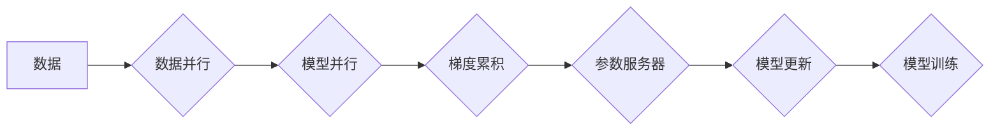

                 

## ZeRO优化：大规模分布式训练的突破

> 关键词：分布式训练、ZeRO、模型并行、参数服务器、内存优化、梯度累积、大规模模型

## 1. 背景介绍

深度学习模型的规模不断增长，以应对越来越复杂的任务需求。然而，随着模型规模的扩大，训练这些模型所需的计算资源和内存也成倍增加。传统的分布式训练方法，例如数据并行和模型并行，在处理海量数据和参数时面临着瓶颈。

数据并行将训练数据分割到多个节点上进行并行处理，但它容易受到数据不平衡和通信开销的影响。模型并行将模型参数分割到多个节点上进行训练，但它需要大量的内存来存储模型参数，并且参数更新的通信开销较大。

为了解决这些问题，Facebook AI Research (FAIR) 提出了 ZeRO (Zero Redundancy Optimizer) 优化框架，它通过将模型参数和梯度存储在单个节点上，并使用梯度累积和参数服务器等技术，有效地降低了内存占用和通信开销，从而支持更大规模的分布式训练。

## 2. 核心概念与联系

ZeRO 优化框架的核心概念是将模型参数和梯度存储在单个节点上，并使用梯度累积和参数服务器等技术，将参数更新的通信开销降到最低。

**ZeRO 架构流程图:**



**ZeRO 的主要组件包括：**

* **数据并行:** 将训练数据分割到多个节点上进行并行处理。
* **模型并行:** 将模型参数分割到多个节点上进行训练。
* **梯度累积:** 在每个节点上累积多个梯度，然后将累积后的梯度发送到参数服务器进行更新。
* **参数服务器:** 负责存储模型参数和接收梯度更新。

**ZeRO 的工作原理:**

1. 数据并行将训练数据分割到多个节点上。
2. 模型并行将模型参数分割到多个节点上。
3. 每个节点计算模型的梯度，并将其累积到本地。
4. 每个节点将累积后的梯度发送到参数服务器。
5. 参数服务器接收所有节点的梯度，并更新模型参数。
6. 更新后的模型参数被广播到所有节点。
7. 节点使用更新后的模型参数继续训练。

## 3. 核心算法原理 & 具体操作步骤

### 3.1  算法原理概述

ZeRO 优化框架的核心算法原理是通过梯度累积和参数服务器来降低内存占用和通信开销。

**梯度累积:** 在每个节点上，模型的梯度在多个训练步骤中累积，然后将累积后的梯度发送到参数服务器进行更新。这可以有效地减少每个节点需要发送的梯度量，从而降低通信开销。

**参数服务器:** 参数服务器负责存储模型参数和接收梯度更新。它可以将模型参数存储在内存中，或者存储在磁盘上。

### 3.2  算法步骤详解

1. **数据并行:** 将训练数据分割到多个节点上。
2. **模型并行:** 将模型参数分割到多个节点上。
3. **梯度计算:** 每个节点计算模型的梯度，并将其累积到本地。
4. **梯度累积:** 在每个节点上，模型的梯度在多个训练步骤中累积。
5. **梯度发送:** 每个节点将累积后的梯度发送到参数服务器。
6. **参数更新:** 参数服务器接收所有节点的梯度，并更新模型参数。
7. **参数广播:** 更新后的模型参数被广播到所有节点。
8. **模型训练:** 节点使用更新后的模型参数继续训练。

### 3.3  算法优缺点

**优点:**

* **降低内存占用:** 通过梯度累积和参数服务器，可以有效地降低每个节点需要存储的模型参数量。
* **降低通信开销:** 梯度累积可以减少每个节点需要发送的梯度量，从而降低通信开销。
* **支持更大规模的模型训练:** ZeRO 优化框架可以支持训练更大的模型，因为其可以有效地利用更多的计算资源和内存。

**缺点:**

* **复杂性增加:** ZeRO 优化框架比传统的分布式训练方法更加复杂，需要更多的配置和维护。
* **性能瓶颈:** 参数服务器可能会成为性能瓶颈，因为需要处理来自所有节点的梯度更新。

### 3.4  算法应用领域

ZeRO 优化框架广泛应用于各种深度学习任务，例如：

* **自然语言处理:** 机器翻译、文本摘要、问答系统等。
* **计算机视觉:** 图像分类、目标检测、图像分割等。
* **语音识别:** 语音转文本、语音合成等。

## 4. 数学模型和公式 & 详细讲解 & 举例说明

### 4.1  数学模型构建

假设我们有一个深度学习模型 $f(x; \theta)$，其中 $x$ 是输入数据，$\theta$ 是模型参数。模型的目标是最小化损失函数 $L(f(x; \theta), y)$，其中 $y$ 是真实标签。

ZeRO 优化框架使用梯度下降算法来更新模型参数。梯度下降算法的基本公式如下：

$$\theta = \theta - \eta \nabla L(f(x; \theta), y)$$

其中 $\eta$ 是学习率，$\nabla L$ 是损失函数的梯度。

### 4.2  公式推导过程

在 ZeRO 优化框架中，梯度累积和参数服务器被用来降低内存占用和通信开销。

**梯度累积:** 在每个节点上，模型的梯度在多个训练步骤中累积。假设每个节点在 $k$ 个训练步骤中累积梯度，则累积后的梯度为：

$$\nabla L_k = \frac{1}{k} \sum_{i=1}^{k} \nabla L(f(x_i; \theta), y_i)$$

其中 $\nabla L_k$ 是累积后的梯度，$x_i$ 和 $y_i$ 是第 $i$ 个训练步骤的数据和标签。

**参数服务器:** 参数服务器负责存储模型参数和接收梯度更新。参数服务器更新模型参数的公式如下：

$$\theta = \theta - \eta \sum_{j=1}^{n} \nabla L_j$$

其中 $n$ 是节点的数量，$\nabla L_j$ 是第 $j$ 个节点的累积梯度。

### 4.3  案例分析与讲解

假设我们有一个包含 1000 个参数的深度学习模型，并使用 ZeRO 优化框架进行分布式训练。

* **数据并行:** 将训练数据分割到 4 个节点上。
* **模型并行:** 将模型参数分割到 4 个节点上。
* **梯度累积:** 每个节点在 10 个训练步骤中累积梯度。

在 ZeRO 优化框架中，每个节点只需要存储 250 个模型参数，而不是 1000 个。

## 5. 项目实践：代码实例和详细解释说明

### 5.1  开发环境搭建

ZeRO 优化框架可以与 PyTorch 和 TensorFlow 等深度学习框架集成。

**PyTorch 环境搭建:**

```bash
pip install torch torchvision torchaudio
```

### 5.2  源代码详细实现

```python
import torch
import torch.nn as nn
from torch.distributed import init_process_group, destroy_process_group
from torch.optim import SGD

# 初始化分布式训练环境
init_process_group(backend='nccl')

# 定义模型
class MyModel(nn.Module):
    # ...

# 实例化模型
model = MyModel()

# 定义损失函数和优化器
criterion = nn.CrossEntropyLoss()
optimizer = SGD(model.parameters(), lr=0.01)

# 训练循环
for epoch in range(num_epochs):
    # 数据加载和预处理
    # ...

    # 梯度累积
    for batch_idx, (data, target) in enumerate(dataloader):
        # 计算梯度
        optimizer.zero_grad()
        output = model(data)
        loss = criterion(output, target)
        loss.backward()

        # 累积梯度
        optimizer.step()

# 参数广播
# ...

# 销毁分布式训练环境
destroy_process_group()
```

### 5.3  代码解读与分析

* **分布式训练环境初始化:** 使用 `init_process_group()` 函数初始化分布式训练环境。
* **模型定义:** 定义深度学习模型。
* **损失函数和优化器:** 定义损失函数和优化器。
* **训练循环:** 迭代训练数据，计算梯度，累积梯度，并更新模型参数。
* **参数广播:** 将更新后的模型参数广播到所有节点。
* **销毁分布式训练环境:** 使用 `destroy_process_group()` 函数销毁分布式训练环境。

### 5.4  运行结果展示

ZeRO 优化框架可以显著提高分布式训练的效率，并支持训练更大的模型。

## 6. 实际应用场景

ZeRO 优化框架已在许多实际应用场景中得到广泛应用，例如：

* **自然语言处理:** 使用 ZeRO 优化框架训练大型语言模型，例如 GPT-3 和 BERT。
* **计算机视觉:** 使用 ZeRO 优化框架训练图像分类、目标检测和图像分割模型。
* **语音识别:** 使用 ZeRO 优化框架训练语音识别模型，例如 Whisper 和 Wav2Vec 2.0。

### 6.4  未来应用展望

ZeRO 优化框架在未来将继续发挥重要作用，并推动深度学习模型的规模和性能不断提升。

## 7. 工具和资源推荐

### 7.1  学习资源推荐

* **ZeRO 官方文档:** https://ai.facebook.com/blog/zero-optimization-for-large-scale-distributed-training/
* **PyTorch ZeRO 示例代码:** https://github.com/pytorch/pytorch/tree/master/torch/distributed/examples/zero

### 7.2  开发工具推荐

* **PyTorch:** https://pytorch.org/
* **TensorFlow:** https://www.tensorflow.org/

### 7.3  相关论文推荐

* **ZeRO: Rethinking Parameter Server Architectures for Scalable Training:** https://arxiv.org/abs/2006.09941

## 8. 总结：未来发展趋势与挑战

### 8.1  研究成果总结

ZeRO 优化框架为大规模分布式训练提供了新的思路和方法，有效地降低了内存占用和通信开销，并支持训练更大的模型。

### 8.2  未来发展趋势

* **更有效的梯度累积策略:** 研究更有效的梯度累积策略，例如异步梯度累积和混合精度梯度累积。
* **更灵活的参数服务器架构:** 研究更灵活的参数服务器架构，例如分布式参数服务器和边缘参数服务器。
* **支持更多深度学习框架:** 将 ZeRO 优化框架扩展到更多深度学习框架，例如 JAX 和 Flax。

### 8.3  面临的挑战

* **参数服务器瓶颈:** 参数服务器可能会成为性能瓶颈，需要进一步优化参数服务器的架构和算法。
* **模型并行复杂度:** 模型并行的复杂度较高，需要更有效的模型并行策略和工具。
* **异构计算资源:** 如何利用异构计算资源，例如 GPU 和 TPU，进行高效的分布式训练，仍然是一个挑战。

### 8.4  研究展望

未来，ZeRO 优化框架将继续发展和完善，并为深度学习模型的规模和性能提升做出更大的贡献。


## 9. 附录：常见问题与解答

**Q1: ZeRO 优化框架与传统的分布式训练方法相比有什么优势？**

**A1:** ZeRO 优化框架通过梯度累积和参数服务器，可以有效地降低内存占用和通信开销，从而支持训练更大的模型，并提高训练效率。

**Q2: ZeRO 优化框架有哪些局限性？**

**A2:** ZeRO 优化框架的局限性包括：

* 参数服务器可能会成为性能瓶颈。
* 模型并行的复杂度较高。
* 难以支持异构计算资源。

**Q3: 如何选择合适的 ZeRO 优化策略？**

**A3:** 选择合适的 ZeRO 优化策略需要根据具体的模型、数据集和硬件资源进行评估。

**Q4: ZeRO 优化框架是否适用于所有深度学习任务？**

**A4:** ZeRO 优化框架适用于许多深度学习任务，例如自然语言处理、计算机视觉和语音识别。但是，对于一些特定的任务，例如小规模模型训练，传统的分布式训练方法可能更合适。


作者：禅与计算机程序设计艺术 / Zen and the Art of Computer Programming 
<end_of_turn>

