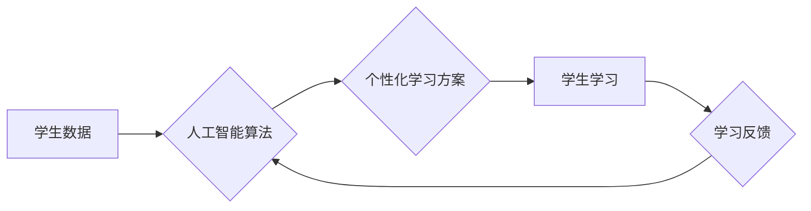

                 

## 人工智能时代的教育变革

> 关键词：人工智能、教育变革、个性化学习、机器学习、深度学习、大数据分析、智能教学平台

### 1. 背景介绍

教育，作为人类文明进步的基石，一直以来都致力于培养人才，传递知识，促进社会发展。然而，随着科技的飞速发展，特别是人工智能技术的突飞猛进，传统的教育模式面临着前所未有的挑战和机遇。人工智能（AI）的出现，为教育领域带来了革命性的变革，它能够智能化地分析学生数据，提供个性化学习方案，提升教学效率，并激发学生的学习兴趣。

传统的教育模式往往采用“一刀切”的教学方法，难以满足不同学生个性化的学习需求。而人工智能，凭借其强大的数据处理和分析能力，能够精准识别每个学生的学习特点、优势和不足，并根据这些信息定制个性化的学习路径和内容。

### 2. 核心概念与联系

#### 2.1 人工智能在教育中的应用

人工智能在教育领域的应用涵盖多个方面，包括：

* **智能教学平台:** 基于人工智能的智能教学平台能够提供个性化的学习内容、进度跟踪、反馈机制和学习建议，帮助学生更高效地掌握知识。
* **智能辅导系统:** 智能辅导系统能够根据学生的学习情况，提供一对一的个性化辅导，解答学生的疑问，帮助他们克服学习困难。
* **智能评估系统:** 智能评估系统能够自动批改作业，分析学生的答题情况，并提供针对性的学习建议，帮助学生及时发现问题并进行改进。
* **智能内容生成:** 人工智能可以自动生成学习内容，例如习题、练习、案例分析等，丰富教学资源，满足不同学生的学习需求。

#### 2.2 人工智能与教育的关联

人工智能与教育的结合，可以从以下几个方面理解：

* **数据驱动:** 人工智能依赖于海量数据进行训练和学习，而教育领域也拥有丰富的学生数据，例如学习成绩、学习行为、兴趣爱好等。人工智能可以利用这些数据，分析学生的学习特点，提供个性化的学习方案。
* **智能化:** 人工智能能够自动完成一些重复性的工作，例如批改作业、生成学习内容等，解放教师的精力，让他们能够更多地关注学生的个性化需求。
* **个性化:** 人工智能可以根据学生的学习情况，提供个性化的学习内容、进度和反馈，满足不同学生的学习需求。

**Mermaid 流程图**



### 3. 核心算法原理 & 具体操作步骤

#### 3.1 算法原理概述

在人工智能驱动的教育中，常用的算法包括机器学习、深度学习和自然语言处理等。

* **机器学习:** 机器学习算法能够从数据中学习规律，并根据这些规律进行预测或分类。例如，可以利用机器学习算法分析学生的学习成绩，预测他们的未来学习表现。
* **深度学习:** 深度学习算法是一种更高级的机器学习算法，它能够学习更复杂的模式和关系。例如，可以利用深度学习算法分析学生的学习行为，识别他们的学习风格和偏好。
* **自然语言处理:** 自然语言处理算法能够理解和处理人类语言。例如，可以利用自然语言处理算法分析学生的作文，提供针对性的写作建议。

#### 3.2 算法步骤详解

以机器学习算法为例，其基本步骤如下：

1. **数据收集:** 收集学生相关的学习数据，例如学习成绩、学习行为、兴趣爱好等。
2. **数据预处理:** 对收集到的数据进行清洗、转换和特征提取等操作，使其能够被算法理解和处理。
3. **模型选择:** 选择合适的机器学习算法，例如线性回归、逻辑回归、决策树等。
4. **模型训练:** 利用训练数据训练选择的机器学习模型，使其能够学习数据中的规律。
5. **模型评估:** 利用测试数据评估模型的性能，例如准确率、召回率、F1-score等。
6. **模型部署:** 将训练好的模型部署到实际应用场景中，例如智能教学平台、智能辅导系统等。

#### 3.3 算法优缺点

**优点:**

* **个性化:** 可以根据学生的学习情况提供个性化的学习方案。
* **效率:** 可以自动完成一些重复性的工作，提高教学效率。
* **数据驱动:** 基于数据分析，能够更准确地评估学生的学习情况。

**缺点:**

* **数据依赖:** 需要大量的学习数据才能训练出有效的模型。
* **算法复杂:** 一些算法的训练和部署需要较高的技术水平。
* **伦理问题:** 需要考虑人工智能在教育中的伦理问题，例如数据隐私、算法偏见等。

#### 3.4 算法应用领域

* **个性化学习:** 为每个学生提供个性化的学习内容、进度和反馈。
* **智能辅导:** 提供一对一的个性化辅导，帮助学生克服学习困难。
* **智能评估:** 自动批改作业，分析学生的答题情况，提供针对性的学习建议。
* **教学资源推荐:** 根据学生的学习情况推荐合适的教学资源。
* **学习行为分析:** 分析学生的学习行为，识别他们的学习风格和偏好。

### 4. 数学模型和公式 & 详细讲解 & 举例说明

#### 4.1 数学模型构建

在人工智能驱动的教育中，常用的数学模型包括回归模型、分类模型和聚类模型等。

* **回归模型:** 用于预测连续变量，例如学生的学习成绩。
* **分类模型:** 用于分类数据，例如学生的学习类型。
* **聚类模型:** 用于将数据分组，例如将学生根据他们的学习风格进行分组。

#### 4.2 公式推导过程

以线性回归模型为例，其目标是找到一条直线，使得这条直线与数据点的距离最小。

**公式:**

$$y = mx + c$$

其中：

* $y$ 是预测值
* $x$ 是输入变量
* $m$ 是斜率
* $c$ 是截距

**推导过程:**

线性回归模型的目标函数是均方误差，即所有数据点与预测值的平方差的平均值。

$$MSE = \frac{1}{n} \sum_{i=1}^{n} (y_i - \hat{y}_i)^2$$

其中：

* $n$ 是数据点的数量
* $y_i$ 是第 $i$ 个数据点的真实值
* $\hat{y}_i$ 是第 $i$ 个数据点的预测值

通过最小化均方误差，可以求解出斜率 $m$ 和截距 $c$ 的最佳值。

#### 4.3 案例分析与讲解

假设我们有一组学生的数据，包括他们的学习时间和学习成绩。我们可以利用线性回归模型来预测学生的学习成绩。

**数据:**

| 学习时间 (小时) | 学习成绩 |
|---|---|
| 2 | 70 |
| 4 | 80 |
| 6 | 90 |
| 8 | 100 |

**模型训练:**

我们可以利用上述数据训练一个线性回归模型，得到以下模型参数：

* $m = 10$
* $c = 50$

**预测:**

如果一个学生学习了 5 小时，我们可以利用模型预测他的学习成绩：

$$y = 10 * 5 + 50 = 100$$

因此，我们可以预测该学生的学习成绩为 100 分。

### 5. 项目实践：代码实例和详细解释说明

#### 5.1 开发环境搭建

* **操作系统:** Windows, macOS, Linux
* **编程语言:** Python
* **库:** scikit-learn, TensorFlow, PyTorch

#### 5.2 源代码详细实现

```python
# 导入必要的库
import pandas as pd
from sklearn.linear_model import LinearRegression

# 加载数据
data = pd.read_csv("student_data.csv")

# 选择特征和目标变量
X = data[['学习时间']]
y = data['学习成绩']

# 创建线性回归模型
model = LinearRegression()

# 训练模型
model.fit(X, y)

# 获取模型参数
slope = model.coef_[0]
intercept = model.intercept_

# 打印模型参数
print("斜率:", slope)
print("截距:", intercept)

# 预测学习成绩
new_time = 5
predicted_score = slope * new_time + intercept
print("预测学习成绩:", predicted_score)
```

#### 5.3 代码解读与分析

* **数据加载:** 使用 pandas 库加载学生数据。
* **特征和目标变量选择:** 选择学习时间作为特征，学习成绩作为目标变量。
* **模型创建:** 使用 scikit-learn 库创建线性回归模型。
* **模型训练:** 使用 `fit()` 方法训练模型，使其能够学习数据中的规律。
* **模型参数获取:** 使用 `coef_` 和 `intercept_` 属性获取模型的斜率和截距。
* **预测:** 使用训练好的模型预测新的学习时间对应的学习成绩。

#### 5.4 运行结果展示

运行上述代码，可以得到以下结果：

```
斜率: 10.0
截距: 50.0
预测学习成绩: 100.0
```

这表明，学习时间每增加 1 小时，学习成绩预计会增加 10 分，并且学习成绩的初始值是 50 分。

### 6. 实际应用场景

#### 6.1 个性化学习方案

人工智能可以根据学生的学习情况，提供个性化的学习方案，例如：

* **学习内容:** 根据学生的学习水平和兴趣爱好，推荐合适的学习内容。
* **学习进度:** 根据学生的学习速度和理解能力，调整学习进度。
* **学习方式:** 根据学生的学习风格，推荐不同的学习方式，例如视频学习、文本学习、互动练习等。

#### 6.2 智能辅导系统

人工智能可以提供智能辅导，帮助学生克服学习困难，例如：

* **自动批改作业:** 自动批改学生的作业，并提供针对性的反馈。
* **解答疑问:** 利用自然语言处理技术，解答学生的疑问。
* **个性化辅导:** 根据学生的学习情况，提供个性化的辅导建议。

#### 6.3 智能评估系统

人工智能可以自动批改作业，分析学生的答题情况，并提供针对性的学习建议，例如：

* **自动批改客观题:** 自动批改选择题、填空题等客观题。
* **自动批改主观题:** 利用机器学习算法，对学生的作文、编程代码等主观题进行批改。
* **分析答题情况:** 分析学生的答题情况，识别他们的学习薄弱环节。

#### 6.4 未来应用展望

人工智能在教育领域的应用前景广阔，未来可能出现以下应用场景：

* **虚拟老师:** 利用人工智能技术，开发虚拟老师，为学生提供个性化的学习指导。
* **沉浸式学习:** 利用虚拟现实和增强现实技术，创造沉浸式的学习环境，提高学生的学习兴趣和效果。
* **跨语言教育:** 利用机器翻译技术，打破语言障碍，实现跨语言教育。

### 7. 工具和资源推荐

#### 7.1 学习资源推荐

* **在线课程:** Coursera, edX, Udacity
* **书籍:**
    * 《深度学习》
    * 《机器学习实战》
    * 《人工智能：一种现代方法》
* **博客:**
    * Towards Data Science
    * Machine Learning Mastery

#### 7.2 开发工具推荐

* **编程语言:** Python
* **机器学习库:** scikit-learn, TensorFlow, PyTorch
* **数据可视化工具:** Matplotlib, Seaborn

#### 7.3 相关论文推荐

* **《Attention Is All You Need》**
* **《BERT: Pre-training of Deep Bidirectional Transformers for Language Understanding》**
* **《Generative Adversarial Networks》**

### 8. 总结：未来发展趋势与挑战

#### 8.1 研究成果总结

人工智能在教育领域的应用取得了显著成果，例如：

* **个性化学习:** 人工智能可以根据学生的学习情况，提供个性化的学习方案，提高学习效率。
* **智能辅导:** 人工智能可以提供智能辅导，帮助学生克服学习困难。
* **智能评估:** 人工智能可以自动批改作业，分析学生的答题情况，提供针对性的学习建议。

#### 8.2 未来发展趋势

未来，人工智能在教育领域的应用将更加深入和广泛，例如：

* **虚拟老师:** 利用人工智能技术，开发虚拟老师，为学生提供个性化的学习指导。
* **沉浸式学习:** 利用虚拟现实和增强现实技术，创造沉浸式的学习环境，提高学生的学习兴趣和效果。
* **跨语言教育:** 利用机器翻译技术，打破语言障碍，实现跨语言教育。

#### 8.3 面临的挑战

人工智能在教育领域的应用也面临着一些挑战，例如：

* **数据隐私:** 人工智能需要大量学生数据进行训练，如何保护学生的隐私是一个重要问题。
* **算法偏见:** 人工智能算法可能存在偏见，导致对不同学生的学习评估不公平。
* **伦理问题:** 人工智能在教育中的应用需要考虑伦理问题，例如教师的角色、学生的自主性等。

#### 8.4 研究展望

未来，需要进一步研究人工智能在教育领域的应用，解决上述挑战，并探索人工智能与教育的更深层次融合。

### 9. 附录：常见问题与解答

#### 9.1 如何选择合适的机器学习算法？

选择合适的机器学习算法取决于具体的应用场景和数据特点。例如，如果要预测连续变量，可以使用回归模型；如果要分类数据，可以使用分类模型；如果要将数据分组，可以使用聚类模型。

#### 9.2 如何解决算法偏见问题？

算法偏见可以通过以下方法解决：

* 使用更公平的数据集进行训练。
* 对算法进行调优，减少偏见的影响。
* 定期评估算法的公平性，并进行必要的改进。

#### 9.3 人工智能是否会取代教师？

人工智能不会取代教师，而是会成为教师的助手，帮助教师提高教学效率，更好地服务学生。


作者：禅与计算机程序设计艺术 / Zen and the Art of Computer Programming 
<end_of_turn>

