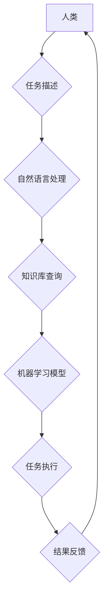

                 

## 人机协作：迈向更智能的未来

> 关键词： 人机协作、人工智能、协同智能、自然语言处理、机器学习、深度学习、算法优化、未来趋势

### 1. 背景介绍

人类文明的发展离不开工具的革新，从石器时代到信息时代，工具的演变不断推动着社会进步。如今，人工智能（AI）正成为新时代的工具，它拥有强大的计算能力和学习能力，能够帮助人类解决复杂问题、提高工作效率，甚至创造新的价值。然而，AI 并非万能，它也存在局限性。因此，人机协作成为未来智能发展的必然趋势。

人机协作是指人类与人工智能系统共同完成任务的过程，它充分发挥了人类的创造力、决策能力和情感智能，以及 AI 的计算能力、数据处理能力和自动化执行能力。这种协同合作模式，能够弥补各自的不足，实现 1+1>2 的协同增效。

### 2. 核心概念与联系

**2.1 人机协作的本质**

人机协作的核心在于建立一种高效、灵活、互补的合作关系。人类负责制定策略、提供创意和判断，而 AI 系统负责执行任务、处理数据和提供支持。这种合作关系需要基于对彼此能力的理解和信任，以及有效的沟通和反馈机制。

**2.2 人机协作的类型**

人机协作可以分为不同的类型，例如：

* **监督式协作:** 人类直接控制 AI 系统，并根据其反馈进行决策。
* **自主式协作:** AI 系统能够独立完成任务，但仍需人类进行监督和评估。
* **协同式协作:** 人类和 AI 系统共同参与任务，并根据彼此的贡献进行分工和合作。

**2.3 人机协作的架构**

人机协作系统通常由以下几个关键组件组成：

* **用户界面:** 提供人类与 AI 系统交互的平台。
* **自然语言处理模块:** 理解和处理人类的自然语言输入。
* **机器学习模块:** 训练 AI 系统，使其能够学习和改进。
* **知识库:** 存储 AI 系统所需的信息和知识。
* **任务规划模块:** 规划和执行 AI 系统的任务。

**Mermaid 流程图**



### 3. 核心算法原理 & 具体操作步骤

**3.1 算法原理概述**

人机协作的核心算法通常涉及以下几个方面：

* **自然语言理解 (NLU):** 理解人类的自然语言输入，将其转换为机器可理解的格式。
* **对话管理:** 控制对话流程，并根据上下文进行响应。
* **知识表示和推理:** 将知识表示为机器可理解的形式，并进行推理和决策。
* **机器学习:** 训练 AI 系统，使其能够学习和改进。

**3.2 算法步骤详解**

以自然语言理解为例，其具体操作步骤如下：

1. **文本预处理:** 对输入文本进行清洗、分词、词性标注等处理，使其更易于理解。
2. **特征提取:** 从预处理后的文本中提取语义特征，例如词向量、句向量等。
3. **分类或回归:** 根据提取的特征，将文本分类或进行回归预测，例如识别文本的意图、情感等。

**3.3 算法优缺点**

* **优点:** 能够理解和处理人类的自然语言，提高人机交互的自然性和流畅性。
* **缺点:** 理解复杂语义和上下文信息仍然存在挑战，需要不断改进算法和模型。

**3.4 算法应用领域**

* **聊天机器人:** 提供自然语言交互，回答用户问题、提供服务等。
* **语音助手:** 理解语音指令，执行相应的操作。
* **文本摘要:** 自动生成文本的摘要。
* **机器翻译:** 将文本从一种语言翻译成另一种语言。

### 4. 数学模型和公式 & 详细讲解 & 举例说明

**4.1 数学模型构建**

自然语言理解通常使用深度学习模型，例如循环神经网络 (RNN) 或 Transformer。这些模型可以学习文本的语义表示，并进行分类或回归预测。

**4.2 公式推导过程**

深度学习模型的训练过程涉及到优化目标函数，例如交叉熵损失函数。目标函数的最小化可以通过梯度下降算法实现。

**4.3 案例分析与讲解**

例如，在文本分类任务中，可以使用 softmax 函数将模型的输出映射到不同的类别概率。

$$
p(y|x) = \frac{e^{w_y^T x}}{\sum_{k=1}^{K} e^{w_k^T x}}
$$

其中，$p(y|x)$ 是给定输入 $x$ 时类别 $y$ 的概率，$w_y$ 是类别 $y$ 的权重向量，$K$ 是类别总数。

### 5. 项目实践：代码实例和详细解释说明

**5.1 开发环境搭建**

可以使用 Python 语言和 TensorFlow 或 PyTorch 深度学习框架进行开发。

**5.2 源代码详细实现**

```python
import tensorflow as tf

# 定义模型结构
model = tf.keras.Sequential([
    tf.keras.layers.Embedding(input_dim=vocab_size, output_dim=embedding_dim),
    tf.keras.layers.LSTM(units=128),
    tf.keras.layers.Dense(units=num_classes, activation='softmax')
])

# 编译模型
model.compile(optimizer='adam',
              loss='sparse_categorical_crossentropy',
              metrics=['accuracy'])

# 训练模型
model.fit(x_train, y_train, epochs=10)

# 评估模型
loss, accuracy = model.evaluate(x_test, y_test)
print('Loss:', loss)
print('Accuracy:', accuracy)
```

**5.3 代码解读与分析**

这段代码定义了一个简单的文本分类模型，使用 Embedding 层将词向量化，LSTM 层学习文本的语义表示，Dense 层进行分类预测。

**5.4 运行结果展示**

训练完成后，可以评估模型的性能，例如准确率等。

### 6. 实际应用场景

人机协作技术已在多个领域得到应用，例如：

* **医疗保健:** 辅助医生诊断疾病、制定治疗方案。
* **教育:** 提供个性化学习体验、辅助教师教学。
* **金融:** 辅助分析市场趋势、识别欺诈行为。
* **制造业:** 优化生产流程、提高生产效率。

**6.4 未来应用展望**

未来，人机协作技术将更加广泛地应用于各个领域，例如：

* **自动驾驶:** 人机协作驾驶系统，提高驾驶安全性和效率。
* **机器人:** 人机协作机器人，完成复杂的任务，例如手术、维修等。
* **创意设计:** 人机协作设计工具，辅助人类进行创意设计。

### 7. 工具和资源推荐

**7.1 学习资源推荐**

* **书籍:**
    * 人机协作：迈向更智能的未来
    * 人工智能：一种现代方法
* **在线课程:**
    * Coursera: 人工智能
    * edX: 深度学习

**7.2 开发工具推荐**

* **Python:** 广泛用于 AI 开发的编程语言。
* **TensorFlow:** 开源深度学习框架。
* **PyTorch:** 开源深度学习框架。

**7.3 相关论文推荐**

* **Attention Is All You Need**
* **BERT: Pre-training of Deep Bidirectional Transformers for Language Understanding**

### 8. 总结：未来发展趋势与挑战

**8.1 研究成果总结**

近年来，人机协作技术取得了显著进展，特别是深度学习技术的突破，使得 AI 系统能够更好地理解和处理人类语言，提高人机交互的自然性和流畅性。

**8.2 未来发展趋势**

未来，人机协作技术将朝着以下方向发展：

* **更加智能的 AI 系统:** AI 系统将更加智能，能够更好地理解人类意图和需求，提供更精准的帮助。
* **更加个性化的协作体验:** 人机协作将更加个性化，根据用户的不同需求和偏好提供定制化的服务。
* **更加广泛的应用场景:** 人机协作将应用于更多领域，例如自动驾驶、机器人、创意设计等。

**8.3 面临的挑战**

人机协作技术也面临一些挑战，例如：

* **数据安全和隐私保护:** 人机协作系统需要处理大量用户数据，因此数据安全和隐私保护至关重要。
* **算法偏见:** AI 系统的训练数据可能存在偏见，导致算法产生偏见的结果。
* **伦理问题:** 人机协作可能会引发一些伦理问题，例如责任归属、工作岗位替代等。

**8.4 研究展望**

未来，需要进一步研究如何解决这些挑战，确保人机协作技术能够安全、公平、可持续地发展，为人类社会带来更多福祉。

### 9. 附录：常见问题与解答

**9.1 如何选择合适的 AI 协作工具？**

选择 AI 协作工具需要根据具体应用场景和需求进行选择。例如，对于需要处理大量文本数据的任务，可以选择基于自然语言处理的工具；对于需要进行图像识别的任务，可以选择基于计算机视觉的工具。

**9.2 如何确保 AI 协作系统的安全性和可靠性？**

确保 AI 协作系统的安全性和可靠性需要从多个方面进行考虑，例如：

* 使用安全的开发环境和工具。
* 对训练数据进行严格的清洗和筛选。
* 对 AI 模型进行充分的测试和评估。
* 建立完善的监控和报警机制。

**9.3 人机协作会取代人类的工作吗？**

人机协作不会完全取代人类的工作，而是会改变工作方式。AI 系统可以帮助人类完成重复性、繁琐性任务，释放人类精力，专注于更需要创造力和决策能力的任务。


作者：禅与计算机程序设计艺术 / Zen and the Art of Computer Programming 
<end_of_turn>

