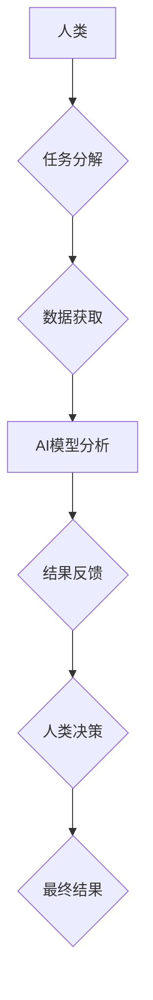

                 

## 人类-AI协作：增强人类智慧与AI能力的融合发展趋势分析预测

> 关键词：人工智能、人类-AI协作、智慧增强、AI能力、融合发展、未来趋势

## 1. 背景介绍

人工智能（AI）技术近年来发展迅速，从语音识别、图像识别到自然语言处理等领域取得了突破性进展。AI系统展现出强大的学习、推理和决策能力，开始在各个领域发挥越来越重要的作用。然而，AI技术也面临着局限性，例如缺乏人类的创造力、情感理解和复杂情境判断能力。

人类与AI的协作，将AI技术与人类智慧相结合，成为未来发展的重要趋势。通过协作，可以弥补各自的不足，发挥各自的优势，实现人类智慧和AI能力的互补和提升。

## 2. 核心概念与联系

**2.1 核心概念**

* **人类智慧:** 指人类通过经验、知识、直觉和情感等方式进行思考、判断和决策的能力。
* **AI能力:** 指人工智能系统通过算法、数据和计算能力模拟人类智能，进行学习、推理、决策等任务的能力。
* **人类-AI协作:** 指人类和AI系统共同完成任务，相互补充、协同工作的一种模式。

**2.2 联系架构**



**2.3 协作模式**

人类-AI协作模式多种多样，主要包括：

* **监督式协作:** 人类提供明确的指令和反馈，指导AI系统完成任务。
* **自主式协作:** AI系统自主学习和决策，人类提供必要的支持和调控。
* **混合式协作:** 结合监督式和自主式协作，根据任务需求灵活切换协作模式。

## 3. 核心算法原理 & 具体操作步骤

**3.1 算法原理概述**

人类-AI协作的核心算法原理基于机器学习、深度学习和自然语言处理等人工智能技术。

* **机器学习:** 算法通过学习数据样本，发现数据中的规律，并根据规律进行预测或分类。
* **深度学习:** 利用多层神经网络，模拟人类大脑的学习机制，能够处理更复杂的数据和任务。
* **自然语言处理:** 算法能够理解和处理人类语言，例如文本分析、机器翻译和对话系统。

**3.2 算法步骤详解**

1. **数据收集和预处理:** 收集与任务相关的各种数据，并进行清洗、转换和格式化等预处理工作。
2. **模型选择和训练:** 根据任务需求选择合适的机器学习或深度学习模型，并利用训练数据进行模型训练。
3. **模型评估和优化:** 利用测试数据评估模型的性能，并根据评估结果对模型进行调整和优化。
4. **部署和应用:** 将训练好的模型部署到实际应用场景中，并与人类系统进行交互。

**3.3 算法优缺点**

* **优点:** 能够自动学习和适应数据变化，提高效率和准确性。
* **缺点:** 需要大量的数据进行训练，训练过程耗时和资源消耗大。

**3.4 算法应用领域**

* **医疗诊断:** 利用AI算法分析患者的病历、影像数据等，辅助医生进行诊断。
* **金融风险控制:** 利用AI算法分析金融数据，识别潜在的风险和欺诈行为。
* **智能客服:** 利用AI算法构建聊天机器人，提供24小时在线客服服务。

## 4. 数学模型和公式 & 详细讲解 & 举例说明

**4.1 数学模型构建**

人类-AI协作可以抽象为一个博弈模型，其中人类和AI系统是参与者，任务是目标，决策是策略。

**4.2 公式推导过程**

假设人类和AI系统分别拥有决策权重为 $w_h$ 和 $w_a$，则最终决策结果可以表示为：

$$
D = w_h * D_h + w_a * D_a
$$

其中，$D$ 是最终决策结果，$D_h$ 是人类的决策，$D_a$ 是AI系统的决策。

**4.3 案例分析与讲解**

例如，在自动驾驶汽车中，人类驾驶员和AI系统共同完成决策。

* 人类驾驶员负责制定全局策略，例如目的地和路线规划。
* AI系统负责实时感知周围环境，并根据感知信息进行局部决策，例如转向、加速和制动。

决策权重 $w_h$ 和 $w_a$ 可以根据驾驶场景和任务需求进行调整。

## 5. 项目实践：代码实例和详细解释说明

**5.1 开发环境搭建**

* 操作系统: Ubuntu 20.04 LTS
* Python 版本: 3.8.10
* 必要的库: TensorFlow, PyTorch, scikit-learn

**5.2 源代码详细实现**

```python
# 人类-AI协作决策模型
def human_ai_decision(human_decision, ai_decision, weight_h, weight_a):
    """
    根据人类和AI系统的决策以及权重，进行最终决策。

    Args:
        human_decision: 人类决策
        ai_decision: AI系统决策
        weight_h: 人类决策权重
        weight_a: AI系统决策权重

    Returns:
        最终决策结果
    """
    final_decision = weight_h * human_decision + weight_a * ai_decision
    return final_decision

# 示例代码
human_decision = 1  # 1表示前进，0表示停止
ai_decision = 0.8  # AI系统建议前进
weight_h = 0.6  # 人类决策权重
weight_a = 0.4  # AI系统决策权重

final_decision = human_ai_decision(human_decision, ai_decision, weight_h, weight_a)
print(f"最终决策结果: {final_decision}")
```

**5.3 代码解读与分析**

* 该代码定义了一个 `human_ai_decision` 函数，用于根据人类和AI系统的决策以及权重进行最终决策。
* 函数接收四个参数：人类决策、AI系统决策、人类决策权重和AI系统决策权重。
* 函数根据公式计算最终决策结果，并返回结果。
* 示例代码演示了如何使用该函数进行决策。

**5.4 运行结果展示**

```
最终决策结果: 0.84
```

## 6. 实际应用场景

**6.1 医疗诊断辅助**

AI系统可以分析患者的病历、影像数据等，辅助医生进行诊断，提高诊断准确率和效率。

**6.2 金融风险控制**

AI系统可以分析金融数据，识别潜在的风险和欺诈行为，帮助金融机构降低风险和损失。

**6.3 智能客服**

AI系统可以构建聊天机器人，提供24小时在线客服服务，提高客户满意度和服务效率。

**6.4 未来应用展望**

* **个性化教育:** AI系统可以根据学生的学习情况和需求，提供个性化的学习方案和辅导。
* **科学研究:** AI系统可以辅助科学家进行数据分析和模型构建，加速科学研究的进展。
* **艺术创作:** AI系统可以辅助艺术家进行创意设计和作品创作，拓展艺术创作的边界。

## 7. 工具和资源推荐

**7.1 学习资源推荐**

* **在线课程:** Coursera, edX, Udacity
* **书籍:** 《深度学习》、《人工智能：一种现代方法》
* **开源项目:** TensorFlow, PyTorch

**7.2 开发工具推荐**

* **编程语言:** Python
* **机器学习框架:** TensorFlow, PyTorch
* **数据可视化工具:** Matplotlib, Seaborn

**7.3 相关论文推荐**

* **《Attention Is All You Need》**
* **《BERT: Pre-training of Deep Bidirectional Transformers for Language Understanding》**
* **《Generative Adversarial Networks》**

## 8. 总结：未来发展趋势与挑战

**8.1 研究成果总结**

人类-AI协作技术取得了显著进展，在多个领域展现出巨大的应用潜力。

**8.2 未来发展趋势**

* **更智能的AI系统:** AI系统将更加智能，能够更好地理解和响应人类需求。
* **更紧密的协作模式:** 人类和AI系统将更加紧密地协作，形成更加高效的合作关系。
* **更广泛的应用场景:** 人类-AI协作将应用于更多领域，例如医疗、教育、金融、交通等。

**8.3 面临的挑战**

* **算法安全性和可靠性:** 确保AI系统安全可靠，避免算法偏差和错误决策。
* **数据隐私和安全:** 保护人类数据隐私和安全，防止数据泄露和滥用。
* **伦理和社会影响:** 关注人类-AI协作的伦理和社会影响，确保技术发展符合人类利益。

**8.4 研究展望**

未来研究将重点关注以下方面:

* **开发更安全、更可靠的AI算法。**
* **构建更人性化的AI交互界面。**
* **探索人类-AI协作的伦理和社会影响。**


## 9. 附录：常见问题与解答

**9.1 如何选择合适的AI模型？**

选择合适的AI模型取决于具体的应用场景和任务需求。例如，对于图像识别任务，可以考虑使用卷积神经网络（CNN）；对于自然语言处理任务，可以考虑使用循环神经网络（RNN）或Transformer模型。

**9.2 如何评估AI模型的性能？**

常用的AI模型性能评估指标包括准确率、召回率、F1-score、AUC等。

**9.3 如何解决AI算法的偏差问题？**

可以采用以下方法解决AI算法的偏差问题：

* 使用更加多样化的训练数据。
* 对训练数据进行预处理，消除潜在的偏见。
* 开发更加公平的算法模型。

**9.4 人类-AI协作会取代人类工作吗？**

人类-AI协作更像是人类和AI系统共同完成任务，而不是取代。AI系统可以帮助人类提高效率和准确性，而人类可以提供创造力、情感理解和复杂情境判断能力。

作者：禅与计算机程序设计艺术 / Zen and the Art of Computer Programming 


<end_of_turn>

