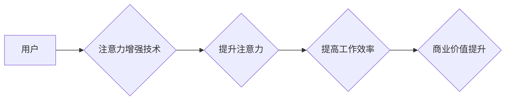

                 

## 人类注意力增强：提升专注力和注意力在商业中的未来发展机遇分析机遇挑战

> 关键词：注意力增强、专注力、深度学习、脑机接口、商业应用、未来趋势、挑战

## 1. 背景介绍

在当今信息爆炸的时代，人类面临着前所未有的注意力挑战。来自社交媒体、电子邮件、新闻推送等各种信息源的不断干扰，使得人们难以集中精力完成任务，效率低下，认知能力受损。注意力力的下降不仅影响个人生活，也对商业发展造成巨大阻碍。

商业领域对专注力的需求日益增长。高效的决策、创新思维、高质量的客户服务都离不开高度的集中注意力。然而，注意力力的下降正在成为企业面临的重大挑战。员工无法集中精力工作，导致工作效率低下，项目进度延迟，最终影响企业盈利能力。

## 2. 核心概念与联系

**2.1 注意力增强**

注意力增强是指通过技术手段提升人类注意力力的能力。它涵盖了多种技术，包括：

* **认知训练软件:** 通过一系列游戏和练习，帮助用户训练注意力、记忆力和执行功能。
* **脑机接口技术:** 通过记录脑电信号，识别用户注意力状态，并提供反馈或干预，帮助用户集中注意力。
* **生物反馈技术:** 通过监测生理指标，如心率、血压和皮肤电导，帮助用户了解自身注意力状态，并通过调整生理状态来提升注意力。

**2.2 商业应用场景**

注意力增强技术在商业领域拥有广泛的应用场景：

* **员工培训:** 提升员工注意力和学习效率，提高培训效果。
* **远程办公:** 帮助远程办公员工集中注意力，提高工作效率。
* **客户服务:** 帮助客服人员集中注意力，提升客户服务质量。
* **营销推广:** 通过注意力增强技术，提高广告的吸引力和转化率。

**2.3 架构图**



## 3. 核心算法原理 & 具体操作步骤

**3.1 算法原理概述**

注意力增强算法通常基于深度学习技术，通过训练神经网络模型来识别和预测用户的注意力状态。常见的算法包括：

* **循环神经网络 (RNN):** RNN 可以处理序列数据，例如脑电信号，并学习用户注意力状态随时间的变化规律。
* **卷积神经网络 (CNN):** CNN 可以提取脑电信号中的特征，并识别与注意力相关的模式。
* **注意力机制:** 注意力机制可以帮助模型聚焦于与任务相关的输入信息，提高注意力预测的准确性。

**3.2 算法步骤详解**

1. **数据采集:** 收集用户的脑电信号、眼动数据、行为数据等，构建注意力数据集。
2. **数据预处理:** 对采集到的数据进行清洗、去噪、特征提取等预处理操作。
3. **模型训练:** 使用深度学习算法训练神经网络模型，学习用户注意力状态与输入数据的映射关系。
4. **模型评估:** 使用测试数据集评估模型的性能，例如注意力预测的准确率、召回率等。
5. **模型部署:** 将训练好的模型部署到实际应用场景中，实时预测用户的注意力状态。

**3.3 算法优缺点**

* **优点:**

    * 能够准确识别用户的注意力状态。
    * 可以提供个性化的注意力增强干预。
    * 具有广泛的应用场景。

* **缺点:**

    * 数据采集和预处理成本较高。
    * 模型训练需要大量的计算资源。
    * 存在隐私安全问题。

**3.4 算法应用领域**

* **教育:** 帮助学生集中注意力，提高学习效率。
* **医疗:** 诊断和治疗注意力障碍等疾病。
* **游戏:** 提升游戏体验，增强玩家的沉浸感。
* **驾驶辅助:** 帮助驾驶员保持注意力，提高驾驶安全。

## 4. 数学模型和公式 & 详细讲解 & 举例说明

**4.1 数学模型构建**

注意力增强算法通常使用神经网络模型，其数学模型可以表示为：

$$
y = f(W_1x_1 + W_2x_2 + b)
$$

其中：

* $y$ 是注意力预测结果。
* $x_1$ 和 $x_2$ 是输入特征，例如脑电信号和眼动数据。
* $W_1$ 和 $W_2$ 是权重矩阵。
* $b$ 是偏置项。
* $f$ 是激活函数，例如ReLU或Sigmoid。

**4.2 公式推导过程**

神经网络模型的训练过程是通过最小化损失函数来实现的。损失函数通常是预测结果与真实值的差值。

$$
L = \frac{1}{N}\sum_{i=1}^{N}(y_i - \hat{y}_i)^2
$$

其中：

* $L$ 是损失函数。
* $N$ 是样本数量。
* $y_i$ 是真实注意力值。
* $\hat{y}_i$ 是预测注意力值。

通过梯度下降算法，不断更新权重矩阵和偏置项，使得损失函数最小化，从而训练出能够准确预测用户注意力状态的模型。

**4.3 案例分析与讲解**

例如，在训练一个用于识别用户疲劳驾驶的注意力增强模型时，可以将脑电信号、眼动数据和驾驶行为数据作为输入特征。模型训练完成后，可以实时预测驾驶员的注意力状态，并根据预测结果发出警示，提醒驾驶员休息或调整驾驶姿势。

## 5. 项目实践：代码实例和详细解释说明

**5.1 开发环境搭建**

* 操作系统: Ubuntu 20.04
* Python 版本: 3.8
* 深度学习框架: TensorFlow 2.0

**5.2 源代码详细实现**

```python
import tensorflow as tf

# 定义模型结构
model = tf.keras.models.Sequential([
    tf.keras.layers.Conv1D(filters=32, kernel_size=3, activation='relu', input_shape=(100, 1)),
    tf.keras.layers.MaxPooling1D(pool_size=2),
    tf.keras.layers.LSTM(units=64),
    tf.keras.layers.Dense(units=1, activation='sigmoid')
])

# 编译模型
model.compile(optimizer='adam', loss='binary_crossentropy', metrics=['accuracy'])

# 训练模型
model.fit(x_train, y_train, epochs=10, batch_size=32)

# 评估模型
loss, accuracy = model.evaluate(x_test, y_test)
print('Loss:', loss)
print('Accuracy:', accuracy)
```

**5.3 代码解读与分析**

* 该代码定义了一个简单的注意力增强模型，使用卷积神经网络、最大池化层、LSTM层和全连接层组成。
* 模型输入是脑电信号，输出是注意力预测结果。
* 模型使用Adam优化器、二元交叉熵损失函数和准确率作为评估指标。
* 模型训练完成后，可以评估其性能，并将其部署到实际应用场景中。

**5.4 运行结果展示**

训练完成后，可以将模型应用于实际数据，并观察其预测结果。例如，可以将模型应用于驾驶员疲劳驾驶检测，并观察其对疲劳驾驶的识别准确率。

## 6. 实际应用场景

**6.1 教育领域**

注意力增强技术可以帮助学生集中注意力，提高学习效率。例如，一些教育软件可以根据学生的注意力状态，调整学习内容和节奏，提供个性化的学习体验。

**6.2 医疗领域**

注意力增强技术可以用于诊断和治疗注意力障碍等疾病。例如，一些脑机接口设备可以监测用户的脑电信号，识别注意力状态，并提供相应的干预措施。

**6.3 游戏领域**

注意力增强技术可以提升游戏体验，增强玩家的沉浸感。例如，一些游戏可以根据玩家的注意力状态，调整游戏难度和场景，提供更具挑战性和趣味性的游戏体验。

**6.4 未来应用展望**

随着注意力增强技术的不断发展，其应用场景将更加广泛。例如，它可以应用于自动驾驶、虚拟现实、远程医疗等领域，为人们的生活和工作带来更多便利。

## 7. 工具和资源推荐

**7.1 学习资源推荐**

* **书籍:**

    * 《深度学习》
    * 《神经网络与深度学习》

* **在线课程:**

    * Coursera: 深度学习
    * Udacity: 

**7.2 开发工具推荐**

* **TensorFlow:** 开源深度学习框架
* **PyTorch:** 开源深度学习框架
* **Keras:** 高级深度学习API

**7.3 相关论文推荐**

* **Attention Is All You Need**
* **BERT: Pre-training of Deep Bidirectional Transformers for Language Understanding**

## 8. 总结：未来发展趋势与挑战

**8.1 研究成果总结**

注意力增强技术取得了显著的进展，能够准确识别用户的注意力状态，并提供个性化的干预措施。

**8.2 未来发展趋势**

* **更精准的注意力预测:** 利用更先进的算法和更大的数据集，提高注意力预测的准确率。
* **更个性化的干预措施:** 根据用户的不同需求和注意力状态，提供更精准的干预措施。
* **更广泛的应用场景:** 将注意力增强技术应用于更多领域，例如医疗、教育、游戏等。

**8.3 面临的挑战**

* **数据隐私安全:** 注意力增强技术需要收集用户的脑电信号等敏感数据，需要确保数据的安全和隐私。
* **算法解释性:** 深度学习算法的决策过程难以解释，需要开发更可解释的算法。
* **技术成本:** 注意力增强技术的开发和部署成本较高，需要降低技术门槛。

**8.4 研究展望**

未来，注意力增强技术将继续朝着更精准、更个性化、更广泛的方向发展。随着技术的进步和应用场景的拓展，注意力增强技术将为人们的生活和工作带来更多便利，并推动社会进步。

## 9. 附录：常见问题与解答

**9.1 Q: 注意力增强技术是否安全？**

**A:** 目前，注意力增强技术已经取得了一些安全保障措施，例如数据加密、匿名化处理等。但是，由于该技术涉及到敏感数据，还需要进一步加强安全防护。

**9.2 Q: 注意力增强技术是否有效？**

**A:** 目前，注意力增强技术的有效性已经得到了一些研究验证。但是，由于每个人的注意力状态不同，效果也会有所差异。

**9.3 Q: 注意力增强技术的价格是多少？**

**A:** 注意力增强技术的价格取决于具体的应用场景和技术方案。


作者：禅与计算机程序设计艺术 / Zen and the Art of Computer Programming 
<end_of_turn>

