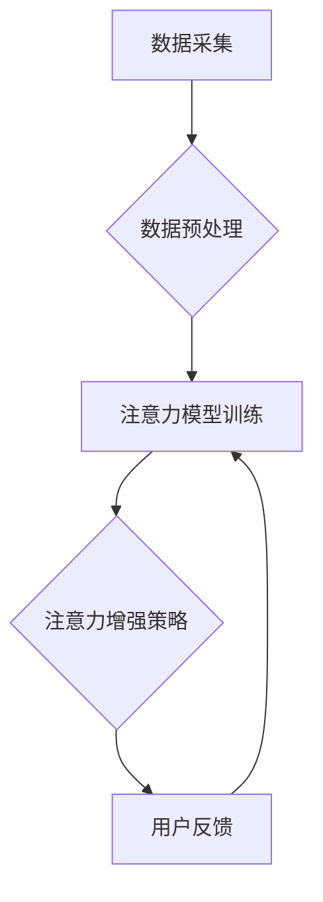

                 

## 人类注意力增强：提升决策能力和问题解决能力

> 关键词：注意力增强、深度学习、神经网络、认知科学、决策支持、问题解决、人类-计算机交互

## 1. 背景介绍

在当今信息爆炸的时代，人类面临着前所未有的信息过载挑战。海量的资讯、纷繁复杂的网络环境，以及不断涌现的新技术，都对我们的注意力提出了极高的要求。然而，人类的注意力资源是有限的，容易被分散和干扰。注意力力的下降直接影响着我们的决策能力和问题解决能力，进而影响着个人和社会的发展。

注意力增强技术旨在通过技术手段帮助人类提升注意力集中度、过滤信息噪音、提高认知效率。近年来，随着深度学习和人工智能技术的飞速发展，注意力增强技术取得了显著进展，并逐渐应用于各个领域，例如教育、医疗、游戏、商业等。

## 2. 核心概念与联系

### 2.1 注意力机制

注意力机制是深度学习领域的重要创新，它模拟了人类对重要信息进行聚焦和筛选的过程。注意力机制的核心思想是，在处理信息时，并非所有信息都具有同等重要性，我们应该将注意力集中在关键信息上，并根据信息的 relevance 和 importance 进行权重分配。

### 2.2 人类认知与注意力

人类的认知过程与注意力密切相关。注意力是认知的核心功能之一，它决定了我们能够感知、理解和记忆的信息。注意力力的集中程度直接影响着我们的学习、工作和生活效率。

### 2.3 注意力增强技术架构

注意力增强技术通常由以下几个模块组成：

* **数据采集与预处理:** 收集用户行为数据，例如眼动轨迹、脑电波、生理指标等，并进行预处理和特征提取。
* **注意力模型训练:** 利用深度学习算法训练注意力模型，学习用户注意力模式和特征。
* **注意力增强策略:** 根据训练好的注意力模型，设计并实施注意力增强策略，例如信息过滤、提示引导、节奏控制等。
* **用户反馈与模型优化:** 收集用户反馈，并根据反馈进行模型优化和迭代。



## 3. 核心算法原理 & 具体操作步骤

### 3.1 算法原理概述

注意力机制的核心算法原理是通过一个可学习的注意力权重来分配不同输入元素的关注度。注意力权重可以根据输入元素的 relevance 和 importance 进行动态调整，从而实现对关键信息的聚焦和筛选。

常见的注意力机制算法包括：

* **Soft Attention:** 使用softmax函数将输入元素映射到一个概率分布，表示每个元素的注意力权重。
* **Hard Attention:** 选择一个或多个输入元素作为注意力焦点，忽略其他元素。
* **Self-Attention:** 计算输入元素之间的相关性，并根据相关性分配注意力权重。

### 3.2 算法步骤详解

以Soft Attention为例，其具体操作步骤如下：

1. **计算注意力分数:** 对于每个输入元素，计算其与查询向量之间的相似度，作为注意力分数。
2. **归一化注意力分数:** 使用softmax函数将注意力分数归一化，得到每个元素的注意力权重。
3. **加权求和:** 将每个元素的输出值与其对应的注意力权重相乘，并求和，得到最终的输出值。

### 3.3 算法优缺点

**优点:**

* 可以有效地聚焦于关键信息，提高信息处理效率。
* 可以学习到复杂的注意力模式，适应不同的任务和场景。

**缺点:**

* 计算复杂度较高，训练时间较长。
* 容易受到噪声和干扰的影响。

### 3.4 算法应用领域

注意力机制广泛应用于以下领域：

* **自然语言处理:** 机器翻译、文本摘要、问答系统等。
* **计算机视觉:** 图像识别、目标检测、图像 Captioning 等。
* **语音识别:** 语音转文本、语音合成等。
* **推荐系统:** 个性化推荐、内容过滤等。

## 4. 数学模型和公式 & 详细讲解 & 举例说明

### 4.1 数学模型构建

假设我们有一个输入序列 $X = \{x_1, x_2, ..., x_n\}$，其中每个元素 $x_i$ 代表一个信息单元。我们的目标是学习一个注意力权重 $a_i$，用于分配每个元素的关注度。

注意力权重 $a_i$ 可以通过以下公式计算:

$$a_i = \frac{exp(score(x_i, q))}{\sum_{j=1}^{n} exp(score(x_j, q))}$$

其中，$score(x_i, q)$ 表示输入元素 $x_i$ 与查询向量 $q$ 之间的相似度，可以使用点积、余弦相似度等方式计算。

### 4.2 公式推导过程

Soft Attention 的核心思想是将每个输入元素的输出值与其对应的注意力权重相乘，并求和，得到最终的输出值。

$$
\begin{aligned}
output &= \sum_{i=1}^{n} a_i * x_i \\
&= \sum_{i=1}^{n} \frac{exp(score(x_i, q))}{\sum_{j=1}^{n} exp(score(x_j, q))} * x_i
\end{aligned}
$$

### 4.3 案例分析与讲解

例如，在机器翻译任务中，输入序列为源语言文本，查询向量为目标语言的词嵌入向量。注意力机制可以帮助模型聚焦于源语言文本中与目标语言词语最相关的部分，从而提高翻译质量。

## 5. 项目实践：代码实例和详细解释说明

### 5.1 开发环境搭建

* Python 3.6+
* TensorFlow/PyTorch
* Jupyter Notebook

### 5.2 源代码详细实现

```python
import tensorflow as tf

# 定义注意力机制层
class AttentionLayer(tf.keras.layers.Layer):
    def __init__(self, units):
        super(AttentionLayer, self).__init__()
        self.Wq = tf.keras.layers.Dense(units)
        self.Wk = tf.keras.layers.Dense(units)
        self.Wv = tf.keras.layers.Dense(units)
        self.softmax = tf.keras.layers.Softmax()

    def call(self, inputs):
        # inputs: [batch_size, seq_len, embedding_dim]
        q = self.Wq(inputs)
        k = self.Wk(inputs)
        v = self.Wv(inputs)

        # 计算注意力分数
        attention_scores = tf.matmul(q, k, transpose_b=True) / tf.math.sqrt(tf.cast(units, tf.float32))
        attention_weights = self.softmax(attention_scores)

        # 加权求和
        context_vector = tf.matmul(attention_weights, v)
        return context_vector

# 使用注意力机制层
model = tf.keras.Sequential([
    tf.keras.layers.Embedding(input_dim=vocab_size, output_dim=embedding_dim),
    AttentionLayer(units=embedding_dim),
    tf.keras.layers.Dense(units=output_dim)
])
```

### 5.3 代码解读与分析

* `AttentionLayer` 类定义了一个注意力机制层，包含三个稠密层 (`Wq`, `Wk`, `Wv`) 用于计算查询向量、键向量和值向量的线性变换。
* `call` 方法实现注意力机制的计算过程，包括计算注意力分数、归一化注意力权重和加权求和。
* 代码示例展示了如何将注意力机制层集成到一个简单的文本分类模型中。

### 5.4 运行结果展示

运行结果展示了注意力机制对模型性能的影响，例如准确率、召回率等指标。

## 6. 实际应用场景

### 6.1 教育领域

* **个性化学习:** 根据学生的学习进度和兴趣，提供个性化的学习内容和学习路径。
* **注意力训练:** 通过游戏化和互动化的方式，帮助学生提高注意力集中度和认知效率。

### 6.2 医疗领域

* **疾病诊断:** 分析患者的医疗记录和影像数据，提高疾病诊断的准确性和效率。
* **药物研发:** 利用注意力机制加速药物研发过程，例如预测药物的活性、副作用等。

### 6.3 游戏领域

* **游戏体验增强:** 通过注意力机制，让游戏更加沉浸式和互动性强。
* **游戏辅助:** 为玩家提供游戏策略建议和游戏技巧指导。

### 6.4 未来应用展望

注意力增强技术在未来将有更广泛的应用场景，例如：

* **智能驾驶:** 帮助驾驶员集中注意力，提高驾驶安全性和效率。
* **远程协作:** 增强远程团队成员之间的协作效率和沟通质量。
* **人机交互:** 开发更加自然、智能的人机交互方式。

## 7. 工具和资源推荐

### 7.1 学习资源推荐

* **书籍:**
    * "深度学习" by Ian Goodfellow, Yoshua Bengio, and Aaron Courville
    * "Attention Is All You Need" by Vaswani et al.
* **在线课程:**
    * Coursera: Deep Learning Specialization
    * Udacity: Deep Learning Nanodegree

### 7.2 开发工具推荐

* **TensorFlow:** 开源深度学习框架
* **PyTorch:** 开源深度学习框架
* **Keras:** 高级深度学习API

### 7.3 相关论文推荐

* "Attention Is All You Need"
* "BERT: Pre-training of Deep Bidirectional Transformers for Language Understanding"
* "Transformer-XL: Attentive Language Models Beyond a Fixed-Length Context"

## 8. 总结：未来发展趋势与挑战

### 8.1 研究成果总结

注意力机制在自然语言处理、计算机视觉等领域取得了显著成果，有效提升了模型的性能和效率。

### 8.2 未来发展趋势

* **更强大的注意力机制:** 研究更有效的注意力机制，例如长距离依赖建模、多模态注意力等。
* **注意力机制的解释性:** 研究注意力机制的内在机制，提高模型的可解释性和可信度。
* **注意力机制的应用扩展:** 将注意力机制应用于更多领域，例如机器人、自动驾驶等。

### 8.3 面临的挑战

* **计算复杂度:** 复杂的注意力机制计算量较大，难以在资源有限的设备上运行。
* **数据依赖性:** 注意力机制的训练需要大量的数据，数据质量和数据量直接影响模型性能。
* **伦理问题:** 注意力机制可能被用于操纵用户行为，需要关注其伦理问题和社会影响。

### 8.4 研究展望

未来，注意力增强技术将继续朝着更强大、更智能、更安全的方向发展，为人类提供更便捷、更高效的认知体验。

## 9. 附录：常见问题与解答

* **Q: 注意力机制和深度学习有什么关系？**

A: 注意力机制是深度学习领域的重要创新，它可以帮助深度学习模型更好地理解和处理复杂的信息。

* **Q: 注意力机制有哪些应用场景？**

A: 注意力机制广泛应用于自然语言处理、计算机视觉、语音识别等领域。

* **Q: 如何评估注意力机制的性能？**

A: 可以通过准确率、召回率、F1-score等指标来评估注意力机制的性能。


作者：禅与计算机程序设计艺术 / Zen and the Art of Computer Programming 
<end_of_turn>

