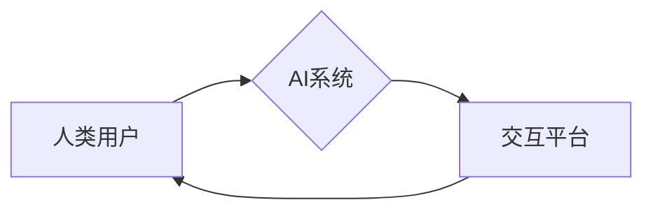

                 

## 人类计算：在AI时代增强人类能力

> 关键词：人工智能、人类计算、协同增强、算法、机器学习、深度学习、未来趋势

### 1. 背景介绍

人工智能（AI）的快速发展正在深刻地改变着我们的世界。从自动驾驶汽车到智能语音助手，AI技术已经渗透到我们生活的方方面面。然而，AI的发展并非意味着人类将被取代，而是将与人类协同工作，共同创造更加美好的未来。

人类计算是指利用人工智能技术来增强人类的认知能力、创造力、效率和决策能力。它强调的是人机协同，将人类的智慧和经验与AI的计算能力相结合，从而实现超越单一智能的全新境界。

### 2. 核心概念与联系

**2.1 人类计算的本质**

人类计算的核心概念是将AI技术作为人类的工具，帮助人类更高效地处理信息、解决问题和进行创造。它不仅仅是将AI应用于特定领域，而是要构建一个全新的计算模式，将人类和AI有机地融合在一起。

**2.2 人机协同的架构**

人类计算的架构通常包括以下几个关键要素：

* **人类用户:** 提供目标、判断、创意和决策。
* **AI系统:** 提供数据分析、模式识别、预测和自动化等能力。
* **交互平台:** 作为人类和AI之间沟通和协作的桥梁。

**2.3 Mermaid 流程图**



**2.4 人类计算的优势**

* **增强人类能力:** AI可以帮助人类处理大量数据、识别复杂模式，从而提高决策效率和准确性。
* **激发创造力:** AI可以提供新的视角和灵感，帮助人类进行更深入的思考和创新。
* **提升协作效率:** 人机协同可以打破信息孤岛，促进团队合作和知识共享。

### 3. 核心算法原理 & 具体操作步骤

**3.1 算法原理概述**

人类计算的核心算法通常基于机器学习和深度学习技术。

* **机器学习:** 算法通过学习数据中的模式和规律，自动构建模型，并根据模型预测未来结果。
* **深度学习:** 是一种更高级的机器学习方法，利用多层神经网络来模拟人类大脑的学习过程，能够处理更复杂的数据和任务。

**3.2 算法步骤详解**

1. **数据收集和预处理:** 收集相关数据，并进行清洗、转换和特征提取等预处理工作。
2. **模型选择和训练:** 选择合适的机器学习或深度学习算法，并根据训练数据进行模型训练。
3. **模型评估和优化:** 使用测试数据评估模型的性能，并根据评估结果进行模型优化。
4. **模型部署和应用:** 将训练好的模型部署到实际应用场景中，并根据用户需求进行调整和改进。

**3.3 算法优缺点**

* **优点:** 能够自动学习和适应数据变化，具有强大的泛化能力。
* **缺点:** 需要大量的训练数据，训练过程可能耗时且资源密集。

**3.4 算法应用领域**

* **自然语言处理:** 语音识别、机器翻译、文本摘要等。
* **计算机视觉:** 图像识别、物体检测、人脸识别等。
* **数据分析:** 预测分析、异常检测、客户画像等。

### 4. 数学模型和公式 & 详细讲解 & 举例说明

**4.1 数学模型构建**

机器学习算法通常基于数学模型，例如线性回归、逻辑回归、支持向量机等。这些模型通过一系列数学公式来描述数据之间的关系，并进行预测或分类。

**4.2 公式推导过程**

例如，线性回归模型的目标是找到一条直线，使得这条直线与数据点之间的误差最小。其数学公式如下：

$$
y = mx + c
$$

其中，$y$ 是预测值，$x$ 是输入特征，$m$ 是斜率，$c$ 是截距。

通过最小二乘法等优化算法，可以求解出最佳的$m$和$c$值，从而得到最优的线性回归模型。

**4.3 案例分析与讲解**

假设我们想要预测房价，输入特征包括房屋面积、房间数量、地理位置等。我们可以使用线性回归模型来建立房价预测模型。

通过训练数据，我们可以得到最佳的$m$和$c$值，例如：

$$
y = 0.05x_1 + 0.1x_2 + 100000
$$

其中，$x_1$ 是房屋面积，$x_2$ 是房间数量，$y$ 是预测房价。

当我们输入一个新的房屋信息，例如面积为100平方米，房间数量为3间时，我们可以使用公式计算出预测房价：

$$
y = 0.05 * 100 + 0.1 * 3 + 100000 = 100300
$$

因此，预测该房屋的房价为100300元。

### 5. 项目实践：代码实例和详细解释说明

**5.1 开发环境搭建**

* Python 3.x
* TensorFlow 或 PyTorch 等深度学习框架
* Jupyter Notebook 或 VS Code 等开发环境

**5.2 源代码详细实现**

```python
import tensorflow as tf

# 定义模型结构
model = tf.keras.models.Sequential([
    tf.keras.layers.Dense(64, activation='relu', input_shape=(784,)),
    tf.keras.layers.Dense(10, activation='softmax')
])

# 编译模型
model.compile(optimizer='adam',
              loss='sparse_categorical_crossentropy',
              metrics=['accuracy'])

# 训练模型
model.fit(x_train, y_train, epochs=10)

# 评估模型
loss, accuracy = model.evaluate(x_test, y_test)
print('Loss:', loss)
print('Accuracy:', accuracy)
```

**5.3 代码解读与分析**

这段代码实现了简单的深度学习模型训练。

* `tf.keras.models.Sequential` 定义了一个顺序模型，即层级结构的模型。
* `tf.keras.layers.Dense` 定义了全连接层，每个神经元都连接到上一层的每个神经元。
* `activation='relu'` 指定了激活函数为ReLU函数，用于引入非线性。
* `optimizer='adam'` 指定了优化算法为Adam算法，用于更新模型参数。
* `loss='sparse_categorical_crossentropy'` 指定了损失函数为稀疏类别交叉熵损失函数，用于分类任务。
* `metrics=['accuracy']` 指定了评估指标为准确率。
* `model.fit()` 函数用于训练模型，传入训练数据和训练轮数。
* `model.evaluate()` 函数用于评估模型，传入测试数据。

**5.4 运行结果展示**

训练完成后，我们可以查看模型的损失值和准确率。

### 6. 实际应用场景

**6.1 智能客服**

AI驱动的智能客服可以自动回答用户常见问题，提供24/7的客户服务，提高客户满意度。

**6.2 个性化推荐**

AI可以分析用户的行为数据，提供个性化的商品、内容或服务推荐，提升用户体验。

**6.3 医疗诊断**

AI可以辅助医生进行疾病诊断，提高诊断准确率和效率。

**6.4 金融风险控制**

AI可以分析金融数据，识别潜在的风险，帮助金融机构进行风险控制。

**6.5 未来应用展望**

随着AI技术的不断发展，人类计算将在更多领域得到应用，例如：

* **教育:** 个性化学习、智能辅导
* **科研:** 数据分析、模型构建
* **艺术创作:** 音乐、绘画、写作

### 7. 工具和资源推荐

**7.1 学习资源推荐**

* **在线课程:** Coursera、edX、Udacity 等平台提供丰富的AI课程。
* **书籍:** 《深度学习》、《机器学习实战》等经典书籍。
* **开源项目:** TensorFlow、PyTorch 等开源深度学习框架。

**7.2 开发工具推荐**

* **Python:** 作为AI开发的主要语言。
* **Jupyter Notebook:** 用于代码编写、数据分析和可视化。
* **VS Code:** 强大的代码编辑器，支持多种语言和插件。

**7.3 相关论文推荐**

* **《ImageNet Classification with Deep Convolutional Neural Networks》**
* **《Attention Is All You Need》**
* **《BERT: Pre-training of Deep Bidirectional Transformers for Language Understanding》**

### 8. 总结：未来发展趋势与挑战

**8.1 研究成果总结**

人类计算已经取得了显著的成果，在多个领域展现出强大的应用潜力。

**8.2 未来发展趋势**

* **更强大的AI算法:** 发展更先进的机器学习和深度学习算法，提高AI的性能和智能水平。
* **更广泛的应用场景:** 将AI技术应用于更多领域，解决更复杂的问题。
* **更安全的AI系统:** 确保AI系统的安全性和可靠性，防止AI被恶意利用。

**8.3 面临的挑战**

* **数据获取和隐私保护:** AI算法依赖于大量数据，如何获取高质量数据并保护用户隐私是一个重要挑战。
* **算法解释性和可信度:** AI算法的决策过程往往难以解释，如何提高算法的可解释性和可信度是一个关键问题。
* **伦理和社会影响:** AI技术的快速发展可能带来伦理和社会问题，需要认真思考和应对。

**8.4 研究展望**

未来，人类计算将继续朝着更智能、更安全、更可持续的方向发展。我们需要加强基础研究，探索更先进的AI算法和技术，并积极应对AI带来的挑战，确保AI技术造福人类。

### 9. 附录：常见问题与解答

**9.1 如何选择合适的AI算法？**

选择合适的AI算法取决于具体的应用场景和数据特点。例如，对于分类任务，可以考虑使用逻辑回归、支持向量机或深度学习算法；对于回归任务，可以考虑使用线性回归、支持向量回归或深度学习算法。

**9.2 如何评估AI模型的性能？**

常用的AI模型评估指标包括准确率、召回率、F1-score、AUC等。选择合适的评估指标取决于具体的应用场景和任务目标。

**9.3 如何解决AI算法的过拟合问题？**

过拟合是指AI模型在训练数据上表现很好，但在测试数据上表现较差。解决过拟合问题的方法包括：

* 增加训练数据量
* 使用正则化技术
* 使用交叉验证技术
* 减少模型复杂度


作者：禅与计算机程序设计艺术 / Zen and the Art of Computer Programming 
<end_of_turn>

