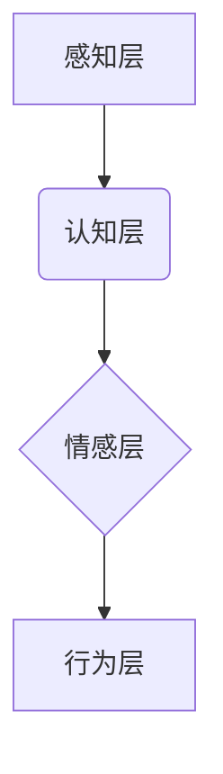

                 

## 体验层次构建器开发者：AI创造的多维感知架构师

> 关键词：人工智能、多维感知、体验层次、架构师、AI创造、感知模型、深度学习、神经网络、交互设计

## 1. 背景介绍

在当今数据爆炸的时代，人工智能（AI）正以惊人的速度发展，深刻地改变着我们生活的方方面面。从智能语音助手到自动驾驶汽车，AI技术的应用日益广泛。然而，我们仍然面临着如何让AI更好地理解和响应人类体验的挑战。

传统的AI模型往往局限于处理单一类型的数据，例如文本或图像，难以捕捉到人类体验的多维性和复杂性。为了解决这一问题，我们提出了“体验层次构建器”的概念，旨在构建一个能够理解和生成多维感知体验的AI架构。

体验层次构建器旨在超越传统的AI模型，构建一个能够理解和生成多维感知体验的AI架构。它将融合多模态数据（如文本、图像、音频、视频等），并利用深度学习和神经网络技术，构建一个能够捕捉人类体验复杂性的感知模型。

## 2. 核心概念与联系

体验层次构建器的核心概念是将人类体验分解成多个层次，并构建相应的感知模型来理解和生成每个层次的体验。

**体验层次模型:**

* **感知层:** 负责接收来自不同模态的数据，例如视觉、听觉、触觉等。
* **认知层:** 对感知层接收到的数据进行分析和理解，提取关键信息和语义。
* **情感层:** 识别和理解用户的情绪和情感状态。
* **行为层:** 根据用户的情绪和意图，生成相应的行为和交互。

**架构图:**



体验层次构建器将这些层次的感知模型连接起来，形成一个完整的感知架构。

## 3. 核心算法原理 & 具体操作步骤

### 3.1  算法原理概述

体验层次构建器的核心算法原理是基于深度学习和神经网络技术的多模态感知融合。

* **多模态数据融合:** 将来自不同模态的数据进行融合，构建一个更完整的感知模型。
* **深度学习:** 利用深度神经网络学习数据中的复杂模式和关系，提高感知和理解能力。
* **强化学习:** 通过与环境交互，学习如何生成最佳的行为和交互，以满足用户的体验需求。

### 3.2  算法步骤详解

1. **数据预处理:** 收集来自不同模态的数据，并进行预处理，例如图像裁剪、文本分词等。
2. **特征提取:** 利用深度学习模型提取每个模态的数据特征，例如图像的边缘特征、文本的词向量等。
3. **多模态融合:** 将不同模态的特征进行融合，构建一个多维的感知特征向量。
4. **感知模型训练:** 利用深度神经网络训练感知模型，使其能够理解和识别不同类型的体验。
5. **行为生成:** 根据用户的感知特征和意图，利用强化学习算法生成相应的行为和交互。

### 3.3  算法优缺点

**优点:**

* 能够理解和生成更丰富的体验。
* 能够适应不同的场景和用户需求。
* 能够不断学习和改进。

**缺点:**

* 需要大量的训练数据。
* 计算复杂度较高。
* 难以解释模型的决策过程。

### 3.4  算法应用领域

体验层次构建器在以下领域具有广泛的应用前景:

* **虚拟现实和增强现实:** 创建更沉浸式和交互式的虚拟体验。
* **游戏开发:** 开发更智能和富有情感的游戏角色。
* **教育和培训:** 提供更个性化和有效的学习体验。
* **医疗保健:** 帮助医生更好地理解患者的病情和需求。

## 4. 数学模型和公式 & 详细讲解 & 举例说明

### 4.1  数学模型构建

体验层次构建器的数学模型可以基于神经网络架构构建，例如卷积神经网络（CNN）用于图像处理，循环神经网络（RNN）用于文本处理，以及多层感知机（MLP）用于多模态融合。

### 4.2  公式推导过程

神经网络的训练过程本质上是一个优化问题，目标是找到网络参数，使得网络输出与真实标签之间的误差最小化。常用的优化算法包括梯度下降法和其变种，例如Adam优化器。

**梯度下降法公式:**

$$
\theta = \theta - \alpha \nabla L(\theta)
$$

其中：

* $\theta$ 是网络参数
* $\alpha$ 是学习率
* $\nabla L(\theta)$ 是损失函数 $L(\theta)$ 对参数 $\theta$ 的梯度

### 4.3  案例分析与讲解

例如，在图像识别任务中，我们可以使用CNN模型，其结构包括卷积层、池化层和全连接层。卷积层用于提取图像特征，池化层用于降低特征维度，全连接层用于分类。

训练过程中，我们使用大量标注好的图像数据，通过梯度下降法优化网络参数，使得网络能够准确识别图像中的物体。

## 5. 项目实践：代码实例和详细解释说明

### 5.1  开发环境搭建

体验层次构建器的开发环境可以基于Python语言和深度学习框架TensorFlow或PyTorch搭建。

### 5.2  源代码详细实现

以下是一个简单的体验层次构建器代码示例，使用TensorFlow框架实现多模态数据融合：

```python
import tensorflow as tf

# 定义感知层模型
image_model = tf.keras.models.Sequential([
    tf.keras.layers.Conv2D(32, (3, 3), activation='relu', input_shape=(224, 224, 3)),
    tf.keras.layers.MaxPooling2D((2, 2)),
    tf.keras.layers.Conv2D(64, (3, 3), activation='relu'),
    tf.keras.layers.MaxPooling2D((2, 2)),
    tf.keras.layers.Flatten(),
    tf.keras.layers.Dense(128, activation='relu'),
    tf.keras.layers.Dense(10, activation='softmax')
])

text_model = tf.keras.models.Sequential([
    tf.keras.layers.Embedding(10000, 128),
    tf.keras.layers.LSTM(128),
    tf.keras.layers.Dense(128, activation='relu'),
    tf.keras.layers.Dense(10, activation='softmax')
])

# 定义多模态融合层
fusion_layer = tf.keras.layers.Concatenate()

# 构建体验层次构建器模型
model = tf.keras.models.Sequential([
    image_model,
    text_model,
    fusion_layer,
    tf.keras.layers.Dense(10, activation='softmax')
])

# 训练模型
model.compile(optimizer='adam',
              loss='categorical_crossentropy',
              metrics=['accuracy'])
model.fit(x_train, y_train, epochs=10)
```

### 5.3  代码解读与分析

这段代码定义了一个简单的体验层次构建器模型，它包含了图像处理模型、文本处理模型和多模态融合层。

* 图像处理模型使用CNN提取图像特征，文本处理模型使用RNN处理文本信息。
* 多模态融合层将图像和文本特征进行拼接，形成一个多维的特征向量。
* 最终的输出层使用softmax激活函数进行分类。

### 5.4  运行结果展示

训练完成后，我们可以使用模型对新的图像和文本数据进行预测，并评估模型的性能。

## 6. 实际应用场景

体验层次构建器在以下实际应用场景中具有广泛的应用前景:

### 6.1  虚拟现实和增强现实

体验层次构建器可以用于创建更沉浸式和交互式的虚拟现实和增强现实体验。例如，它可以帮助虚拟角色更好地理解用户的意图和情绪，从而提供更自然和人性化的交互。

### 6.2  游戏开发

体验层次构建器可以用于开发更智能和富有情感的游戏角色。例如，它可以帮助游戏角色更好地理解玩家的情绪和行为，从而提供更个性化和引人入胜的游戏体验。

### 6.3  教育和培训

体验层次构建器可以用于提供更个性化和有效的学习体验。例如，它可以根据学生的学习进度和理解程度，动态调整教学内容和方式，提高学习效率。

### 6.4  未来应用展望

随着人工智能技术的不断发展，体验层次构建器将在未来拥有更广泛的应用场景。例如，它可以用于医疗保健、金融服务、零售业等领域，帮助人们更好地理解和应对复杂的环境和挑战。

## 7. 工具和资源推荐

### 7.1  学习资源推荐

* **书籍:**
    * 深度学习
    * 人工智能：一种现代方法
* **在线课程:**
    * Coursera 深度学习课程
    * Udacity 人工智能工程师课程

### 7.2  开发工具推荐

* **TensorFlow:** 开源深度学习框架
* **PyTorch:** 开源深度学习框架
* **Keras:** 高级深度学习API

### 7.3  相关论文推荐

* **Attention Is All You Need:** https://arxiv.org/abs/1706.03762
* **Generative Adversarial Networks:** https://arxiv.org/abs/1406.2661

## 8. 总结：未来发展趋势与挑战

### 8.1  研究成果总结

体验层次构建器是一个新兴的AI架构，它旨在构建一个能够理解和生成多维感知体验的AI模型。

### 8.2  未来发展趋势

未来，体验层次构建器将朝着以下方向发展:

* **更强大的多模态感知能力:** 融合更多类型的模态数据，例如音频、触觉、嗅觉等，构建更全面的感知模型。
* **更智能的交互体验:** 利用强化学习和自然语言处理技术，实现更自然和人性化的交互体验。
* **更个性化的体验定制:** 根据用户的个人喜好和需求，定制个性化的体验。

### 8.3  面临的挑战

体验层次构建器还面临着一些挑战:

* **数据获取和标注:** 构建多模态感知模型需要大量的标注数据，这在数据获取和标注方面存在挑战。
* **模型复杂度和训练成本:** 多模态感知模型的复杂度较高，训练成本也相对较高。
* **模型解释性和可信度:** 多模态感知模型的决策过程较为复杂，难以解释和理解，这会影响模型的可信度。

### 8.4  研究展望

未来，我们将继续致力于体验层次构建器的研究和发展，努力克服上述挑战，构建更智能、更人性化的AI体验。

## 9. 附录：常见问题与解答

**Q1: 体验层次构建器与传统AI模型有什么区别？**

**A1:** 传统AI模型往往局限于处理单一类型的数据，而体验层次构建器则能够融合多模态数据，构建一个更全面的感知模型，从而更好地理解和生成多维感知体验。

**Q2: 体验层次构建器需要哪些技术基础？**

**A2:** 体验层次构建器需要掌握深度学习、神经网络、多模态数据处理、强化学习等技术基础。

**Q3: 体验层次构建器有哪些应用场景？**

**A3:** 体验层次构建器在虚拟现实、增强现实、游戏开发、教育和培训等领域具有广泛的应用前景。


作者：禅与计算机程序设计艺术 / Zen and the Art of Computer Programming 
<end_of_turn>

