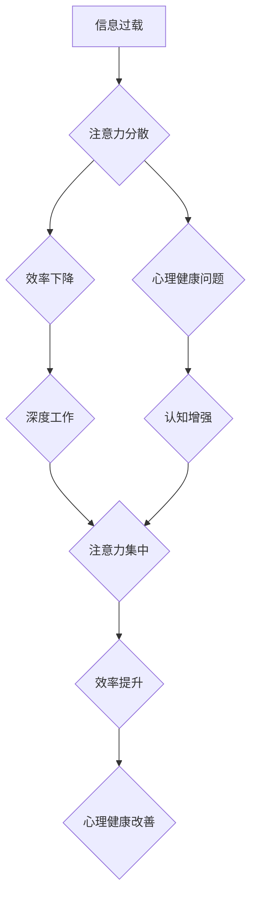

                 

## 信息时代的注意力管理策略：在充满干扰的世界中保持头脑清晰和专注

> 关键词：注意力管理、信息过载、专注力、认知增强、深度工作、干扰消除、时间管理、效率提升、心理健康

### 1. 背景介绍

在当今信息爆炸的时代，我们被来自各个方向的信息和干扰所包围。智能手机、社交媒体、电子邮件、新闻推送等，无时无刻不在争夺我们的注意力。这种信息过载和持续的干扰，严重损害了我们的专注力、效率和心理健康。

注意力，是人类认知的核心能力之一，它决定了我们能够有效地处理信息、学习新知识、完成任务的能力。然而，现代社会的信息环境使得我们的注意力变得越来越脆弱，难以集中。

研究表明，过度使用电子设备和社交媒体会导致注意力分散、记忆力下降、情绪波动等问题。长期处于信息过载状态，还会增加焦虑、抑郁等心理健康风险。

因此，在信息时代，学习有效的注意力管理策略，保持头脑清晰和专注，对于个人成长、工作效率和心理健康都至关重要。

### 2. 核心概念与联系

**2.1  注意力机制**

注意力机制是近年来深度学习领域的重要突破，它模拟了人类的注意力机制，能够帮助模型聚焦于输入信息中最重要的部分。

**2.2  干扰消除**

干扰消除是指通过各种方法减少外界干扰，创造一个专注的环境。

**2.3  深度工作**

深度工作是指专注于一项重要任务，排除所有干扰，全身心投入，直到完成为止。

**2.4  时间管理**

时间管理是指合理规划和安排时间，提高工作效率和生活质量。

**2.5  认知增强**

认知增强是指通过各种方法提高认知能力，例如记忆力、注意力、学习能力等。

**Mermaid 流程图**



### 3. 核心算法原理 & 具体操作步骤

**3.1  算法原理概述**

注意力管理算法的核心是通过分析用户行为和环境信息，识别潜在的干扰源，并采取相应的措施进行干扰消除。

**3.2  算法步骤详解**

1. **数据收集:** 收集用户使用设备、应用程序、网站等行为数据，以及环境信息，例如时间、地点、噪音水平等。
2. **干扰识别:** 利用机器学习算法，分析用户行为和环境信息，识别潜在的干扰源，例如社交媒体通知、电子邮件提醒、网站广告等。
3. **干扰消除:** 根据识别出的干扰源，采取相应的措施进行干扰消除，例如屏蔽通知、限制应用程序使用时间、调整环境音效等。
4. **注意力引导:** 利用用户行为和环境信息，引导用户注意力集中在重要任务上，例如提供专注时间提醒、推荐专注工作环境等。
5. **反馈机制:** 收集用户反馈，不断优化算法模型，提高干扰消除和注意力引导的准确性。

**3.3  算法优缺点**

**优点:**

* 自动化干扰消除，提高效率。
* 个性化注意力管理，满足不同用户的需求。
* 数据驱动优化，不断提升算法效果。

**缺点:**

* 需要大量数据进行训练和优化。
* 可能存在隐私泄露风险。
* 过度依赖算法，可能导致用户失去自主控制能力。

**3.4  算法应用领域**

* **个人注意力管理:** 手机应用程序、桌面软件等，帮助用户集中注意力、提高工作效率。
* **教育领域:** 在线学习平台、智能辅导系统等，帮助学生集中注意力、提高学习效果。
* **医疗领域:** 帮助患者集中注意力，进行康复训练或心理治疗。
* **游戏领域:** 帮助玩家集中注意力，提高游戏体验。

### 4. 数学模型和公式 & 详细讲解 & 举例说明

**4.1  数学模型构建**

注意力机制通常使用一个注意力权重来表示模型对不同输入元素的关注程度。

注意力权重可以表示为：

$$
\alpha_i = \frac{exp(e_i)}{\sum_{j=1}^{n} exp(e_j)}
$$

其中：

* $\alpha_i$ 是第 $i$ 个输入元素的注意力权重。
* $e_i$ 是第 $i$ 个输入元素的得分。
* $n$ 是输入元素的总数。

**4.2  公式推导过程**

注意力权重计算公式的推导过程基于softmax函数，它将输入向量映射到一个概率分布。

softmax函数的公式为：

$$
softmax(x_i) = \frac{exp(x_i)}{\sum_{j=1}^{n} exp(x_j)}
$$

其中：

* $x_i$ 是第 $i$ 个输入元素的得分。
* $n$ 是输入元素的总数。

**4.3  案例分析与讲解**

例如，在机器翻译任务中，注意力机制可以帮助模型关注源语言句子中与目标语言句子相关的重要词语。

模型会计算每个源语言词语的得分，然后使用softmax函数计算每个词语的注意力权重。

最终，模型会根据这些注意力权重，选择源语言句子中最重要的词语进行翻译。

### 5. 项目实践：代码实例和详细解释说明

**5.1  开发环境搭建**

* 操作系统：Windows/macOS/Linux
* 编程语言：Python
* 库依赖：TensorFlow/PyTorch

**5.2  源代码详细实现**

```python
import tensorflow as tf

# 定义注意力机制层
class AttentionLayer(tf.keras.layers.Layer):
    def __init__(self, units):
        super(AttentionLayer, self).__init__()
        self.W1 = tf.keras.layers.Dense(units)
        self.W2 = tf.keras.layers.Dense(units)
        self.V = tf.keras.layers.Dense(1)

    def call(self, inputs):
        # 计算注意力权重
        scores = self.V(tf.nn.tanh(self.W1(inputs) + self.W2(inputs)))
        attention_weights = tf.nn.softmax(scores, axis=-1)
        # 计算加权平均值
        context_vector = tf.matmul(attention_weights, inputs)
        return context_vector
```

**5.3  代码解读与分析**

* `AttentionLayer` 类定义了一个注意力机制层。
* `W1` 和 `W2` 是两个全连接层，用于计算输入向量的得分。
* `V` 是一个全连接层，用于计算注意力权重。
* `call` 方法计算注意力权重和加权平均值。

**5.4  运行结果展示**

运行上述代码，可以得到注意力权重和加权平均值，用于后续的模型训练和预测。

### 6. 实际应用场景

**6.1  信息过滤**

注意力机制可以用于过滤无关信息，例如电子邮件、社交媒体通知等，帮助用户集中注意力处理重要信息。

**6.2  个性化推荐**

注意力机制可以分析用户的行为和偏好，推荐个性化的内容，例如新闻、视频、商品等。

**6.3  机器翻译**

注意力机制可以帮助机器翻译模型关注源语言句子中与目标语言句子相关的重要词语，提高翻译质量。

**6.4  未来应用展望**

注意力机制在未来将有更广泛的应用，例如：

* **自动驾驶:** 帮助自动驾驶系统关注道路上的重要信息，例如车辆、行人、信号灯等。
* **医疗诊断:** 帮助医生分析患者的病历和影像数据，提高诊断准确率。
* **金融风险管理:** 帮助金融机构识别潜在的风险，降低损失。

### 7. 工具和资源推荐

**7.1  学习资源推荐**

* **书籍:**

    * 《深度学习》
    * 《Attention Is All You Need》

* **在线课程:**

    * Coursera: 深度学习
    * Udacity: 自然语言处理

**7.2  开发工具推荐**

* **TensorFlow:** 开源深度学习框架
* **PyTorch:** 开源深度学习框架
* **Keras:** 高级深度学习API

**7.3  相关论文推荐**

* 《Attention Is All You Need》
* 《BERT: Pre-training of Deep Bidirectional Transformers for Language Understanding》

### 8. 总结：未来发展趋势与挑战

**8.1  研究成果总结**

注意力机制是近年来深度学习领域的重要突破，它能够帮助模型聚焦于输入信息中最重要的部分，提高模型的性能。

**8.2  未来发展趋势**

* **更有效的注意力机制:** 研究更有效的注意力机制，例如自注意力机制、动态注意力机制等。
* **跨模态注意力机制:** 研究跨模态注意力机制，例如文本-图像注意力机制、文本-音频注意力机制等。
* **可解释性注意力机制:** 研究可解释性注意力机制，帮助用户理解模型的注意力机制是如何工作的。

**8.3  面临的挑战**

* **计算复杂度:** 一些注意力机制的计算复杂度较高，难以在资源有限的设备上运行。
* **数据依赖性:** 注意力机制需要大量数据进行训练和优化。
* **伦理问题:** 注意力机制可能被用于操纵用户行为，需要谨慎使用。

**8.4  研究展望**

未来，注意力机制将继续在人工智能领域发挥重要作用，并应用于更多领域。

研究人员将继续探索更有效的注意力机制，提高模型的性能和可解释性，并解决注意力机制面临的挑战。

### 9. 附录：常见问题与解答

**9.1  注意力机制和深度学习的关系是什么？**

注意力机制是深度学习的一种重要技术，它能够帮助模型聚焦于输入信息中最重要的部分，提高模型的性能。

**9.2  注意力机制有哪些应用场景？**

注意力机制在机器翻译、图像识别、自然语言处理等领域都有广泛的应用。

**9.3  如何评估注意力机制的效果？**

可以通过模型的性能指标，例如准确率、召回率、F1-score等来评估注意力机制的效果。

**9.4  注意力机制有哪些局限性？**

注意力机制的计算复杂度较高，需要大量数据进行训练和优化，并且可能存在伦理问题。

**9.5  未来注意力机制的发展趋势是什么？**

未来，注意力机制将继续在人工智能领域发挥重要作用，并应用于更多领域。研究人员将继续探索更有效的注意力机制，提高模型的性能和可解释性，并解决注意力机制面临的挑战。


作者：禅与计算机程序设计艺术 / Zen and the Art of Computer Programming 
<end_of_turn>

