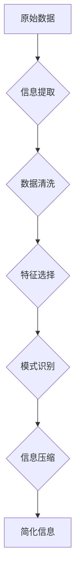

                 

## 信息简化的好处与实践：在复杂世界中简化以改善生活和决策

> 关键词：信息简化、复杂系统、决策支持、数据可视化、认知负荷、算法、机器学习、人工智能

### 1. 背景介绍

我们生活在一个信息爆炸的时代。每天，我们被来自各个方向的海量数据淹没：新闻、社交媒体、电子邮件、广告等等。这种信息过载不仅让我们感到疲惫不堪，还可能导致决策失误、注意力分散，甚至影响我们的心理健康。

信息简化，即从复杂的信息中提取关键信息，并以简洁易懂的方式呈现，成为解决信息过载问题的关键。它不仅可以帮助我们更好地理解世界，还能提高我们的决策效率，改善生活质量。

### 2. 核心概念与联系

信息简化是一个跨学科的概念，涉及到认知科学、计算机科学、信息论等多个领域。其核心在于通过算法和技术手段，将复杂的信息转化为易于理解和处理的形式。

**信息简化流程图:**



**信息简化涉及的关键概念:**

* **信息提取:** 从原始数据中识别和提取有价值的信息。
* **数据清洗:** 去除数据中的噪声、重复信息和错误数据。
* **特征选择:** 选择最能代表数据特征的关键属性。
* **模式识别:** 利用算法识别数据中的潜在模式和趋势。
* **信息压缩:** 将提取的信息以简洁、易于理解的方式呈现。

### 3. 核心算法原理 & 具体操作步骤

**3.1 算法原理概述**

信息简化算法通常基于以下原理：

* **降维:** 通过数学变换将高维数据降维到低维空间，保留数据的主要信息。
* **聚类:** 将数据按照相似性进行分组，将复杂数据结构简化。
* **分类:** 将数据按照预定义的类别进行分类，提取数据中的类别信息。
* **关联规则挖掘:** 从数据中发现数据项之间的关联关系，提取数据中的隐含知识。

**3.2 算法步骤详解**

以降维算法为例，其具体操作步骤如下：

1. **数据预处理:** 对原始数据进行清洗、标准化等预处理操作。
2. **特征选择:** 选择最能代表数据特征的关键属性。
3. **降维算法应用:** 使用降维算法，例如主成分分析 (PCA) 或线性判别分析 (LDA)，将数据降维到低维空间。
4. **结果可视化:** 将降维后的数据进行可视化，例如散点图或热力图，以便于理解和分析。

**3.3 算法优缺点**

**优点:**

* 可以有效地减少数据量，提高数据处理效率。
* 可以帮助我们更好地理解数据结构和模式。
* 可以用于数据可视化，使数据更易于理解和分析。

**缺点:**

* 降维过程可能会丢失部分数据信息。
* 算法的选择需要根据具体的数据特点进行。

**3.4 算法应用领域**

信息简化算法广泛应用于各个领域，例如：

* **数据分析:** 从海量数据中提取关键信息，进行数据分析和挖掘。
* **机器学习:** 减少训练数据量，提高机器学习模型的训练效率。
* **图像处理:** 将图像压缩，降低存储空间和传输带宽。
* **自然语言处理:** 简化文本数据，提高文本分析和理解效率。

### 4. 数学模型和公式 & 详细讲解 & 举例说明

**4.1 数学模型构建**

信息简化算法通常基于数学模型，例如：

* **信息熵:** 用于度量信息的不确定性。
* **互信息:** 用于度量两个随机变量之间的相关性。
* **KL散度:** 用于度量两个概率分布之间的差异。

**4.2 公式推导过程**

以信息熵为例，其公式如下：

$$H(X) = -\sum_{i=1}^{n} p(x_i) \log_2 p(x_i)$$

其中：

* $X$ 是一个随机变量。
* $p(x_i)$ 是随机变量 $X$ 取值为 $x_i$ 的概率。

**4.3 案例分析与讲解**

假设我们有一个包含 4 个类别的数据集，每个类别的概率分别为 0.25、0.25、0.25 和 0.25。

使用信息熵公式计算该数据集的信息熵：

$$H(X) = - (0.25 \log_2 0.25 + 0.25 \log_2 0.25 + 0.25 \log_2 0.25 + 0.25 \log_2 0.25)$$

$$H(X) = 2$$

该数据集的信息熵为 2，表示该数据集的信息量较大。

### 5. 项目实践：代码实例和详细解释说明

**5.1 开发环境搭建**

本项目使用 Python 语言进行开发，所需环境如下：

* Python 3.x
* NumPy
* Pandas
* Matplotlib

**5.2 源代码详细实现**

```python
import numpy as np
from sklearn.decomposition import PCA

# 数据加载
data = np.loadtxt('data.csv', delimiter=',')

# 数据预处理
data = (data - np.mean(data, axis=0)) / np.std(data, axis=0)

# 降维
pca = PCA(n_components=2)
data_reduced = pca.fit_transform(data)

# 数据可视化
import matplotlib.pyplot as plt
plt.scatter(data_reduced[:, 0], data_reduced[:, 1])
plt.show()
```

**5.3 代码解读与分析**

* 数据加载：使用 `np.loadtxt()` 函数加载数据文件。
* 数据预处理：使用 `np.mean()` 和 `np.std()` 函数对数据进行标准化处理。
* 降维：使用 `PCA()` 类进行降维，将数据降维到 2 维。
* 数据可视化：使用 `matplotlib.pyplot` 库绘制散点图，展示降维后的数据。

**5.4 运行结果展示**

运行代码后，将生成一个散点图，展示降维后的数据分布。

### 6. 实际应用场景

信息简化技术在各个领域都有广泛的应用场景：

* **新闻资讯:** 从海量新闻数据中提取关键信息，生成新闻摘要或推荐新闻。
* **金融分析:** 从金融数据中识别趋势和模式，辅助投资决策。
* **医疗诊断:** 从患者数据中提取特征，辅助医生进行诊断。
* **社交媒体分析:** 从社交媒体数据中分析用户行为和舆情趋势。

### 7. 工具和资源推荐

**7.1 学习资源推荐**

* **书籍:**
    * 《信息简化: 在复杂世界中简化以改善生活和决策》
    * 《数据可视化: 从数据到故事》
    * 《机器学习实战》
* **在线课程:**
    * Coursera: 数据科学
    * edX: 机器学习
    * Udacity: 数据分析

**7.2 开发工具推荐**

* **Python:** 广泛应用于数据分析和机器学习。
* **R:** 专注于统计分析和数据可视化。
* **Tableau:** 数据可视化工具。
* **Power BI:** 数据分析和可视化工具。

**7.3 相关论文推荐**

* **Information Theory and Its Applications**
* **Dimensionality Reduction: A Review**
* **Machine Learning for Data Simplification**

### 8. 总结：未来发展趋势与挑战

**8.1 研究成果总结**

信息简化技术取得了显著的进展，为我们提供了有效地处理复杂信息的方法。

**8.2 未来发展趋势**

* **人工智能驱动的信息简化:** 利用人工智能技术，实现更智能、更自动化的信息简化。
* **个性化信息简化:** 根据用户的需求和偏好，提供个性化的信息简化服务。
* **跨模态信息简化:** 将文本、图像、音频等不同模态的信息进行融合简化。

**8.3 面临的挑战**

* **数据质量问题:** 信息简化算法对数据质量要求较高，需要解决数据噪声、不完整等问题。
* **算法解释性问题:** 一些信息简化算法的内部机制难以解释，需要提高算法的可解释性。
* **伦理问题:** 信息简化技术可能被用于操纵信息，需要关注其伦理问题。

**8.4 研究展望**

未来，信息简化技术将继续发展，为我们提供更有效、更智能的信息处理方法，帮助我们更好地理解世界，做出更明智的决策。

### 9. 附录：常见问题与解答

**常见问题:**

* 信息简化和数据压缩有什么区别？
* 如何选择合适的降维算法？
* 信息简化技术有哪些伦理问题？

**解答:**

* 信息简化和数据压缩都是减少数据量的方法，但信息简化更注重保留数据中的关键信息，而数据压缩更注重减少存储空间。
* 选择降维算法需要根据具体的数据特点和应用场景进行。
* 信息简化技术可能被用于操纵信息，例如生成虚假新闻或进行情感操控，需要关注其伦理问题。


作者：禅与计算机程序设计艺术 / Zen and the Art of Computer Programming 
<end_of_turn>

