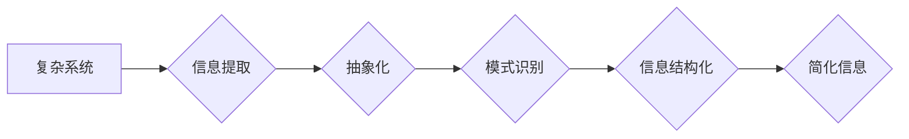

                 

## 信息简化的好处与挑战：简化复杂性的艺术与科学

> 关键词：信息简化、复杂系统、算法设计、信息架构、可读性、可维护性、效率、可扩展性、用户体验

### 1. 背景介绍

在当今信息爆炸的时代，我们被海量数据和复杂系统所包围。从庞大的互联网网络到复杂的软件应用程序，从精密的科学仪器到精妙的生物系统，无处不在的复杂性正在挑战我们的认知能力和解决问题的能力。

信息简化，即从复杂的信息中提取本质，以简洁明了的形式呈现，成为解决这一挑战的关键。它不仅可以提高信息的可理解性和可记忆性，还能促进更有效的沟通、决策和创新。

然而，信息简化并非易事。它需要深入理解复杂系统的本质，并运用科学的原则和艺术的技巧，才能将复杂的信息转化为易于理解和操作的形式。

### 2. 核心概念与联系

信息简化涉及多个核心概念，包括：

* **复杂性:** 指系统或信息结构的复杂程度，通常由系统规模、相互关联性、非线性关系等因素决定。
* **信息熵:** 指信息的不确定性或随机性，简化信息的过程实际上是降低信息熵的过程。
* **抽象:** 将复杂系统或信息中的关键要素提取出来，忽略不重要的细节，形成更高层次的概括。
* **模式识别:** 从复杂的信息中识别出重复出现的模式或结构，并利用这些模式进行简化和归纳。
* **信息架构:**  指组织和结构化信息的方式，以使信息更易于导航、理解和使用。

这些概念相互关联，共同构成了信息简化的基础理论。

**Mermaid 流程图**



### 3. 核心算法原理 & 具体操作步骤

信息简化算法旨在从复杂的信息中提取关键信息，并以简洁明了的形式呈现。

#### 3.1  算法原理概述

信息简化算法通常基于以下原理：

* **信息重要性度量:**  根据信息的相关性、时效性、独特性等因素，对信息进行排序和筛选，保留最重要的信息。
* **冗余信息消除:**  识别和删除重复、不必要的或冲突的信息，提高信息的简洁性和准确性。
* **层次化结构构建:** 将信息按照逻辑关系或层次结构进行组织，使信息更易于理解和导航。

#### 3.2  算法步骤详解

1. **数据收集和预处理:** 收集相关信息，并进行清洗、格式化和转换等预处理操作。
2. **信息重要性度量:** 使用合适的指标和算法，对信息进行量化评估，确定信息的相对重要性。
3. **冗余信息消除:**  利用算法识别和删除重复、不必要的或冲突的信息。
4. **层次化结构构建:**  根据信息的逻辑关系和层次结构，将信息进行组织和分类。
5. **信息呈现:**  将简化后的信息以图表、文本、音频或视频等形式呈现，并根据目标受众进行调整。

#### 3.3  算法优缺点

**优点:**

* 提高信息的可理解性和可记忆性。
* 简化信息处理和决策过程。
* 促进更有效的沟通和协作。

**缺点:**

* 信息简化可能会丢失部分细节信息。
* 需要根据具体情况选择合适的算法和指标。
* 信息简化需要一定的专业知识和经验。

#### 3.4  算法应用领域

信息简化算法广泛应用于各个领域，例如：

* **数据可视化:** 将复杂的数据转化为易于理解的图表和图形。
* **文本摘要:**  提取文本的关键信息，生成简洁的摘要。
* **知识管理:**  组织和结构化知识，提高知识的可访问性和利用率。
* **用户体验设计:**  简化用户界面，提高用户体验。

### 4. 数学模型和公式 & 详细讲解 & 举例说明

信息简化可以借助数学模型和公式进行量化分析和优化。

#### 4.1  数学模型构建

信息熵是衡量信息复杂度的常用指标，其公式为：

$$H(X) = - \sum_{i=1}^{n} p(x_i) \log_2 p(x_i)$$

其中：

* $X$ 是随机变量，表示信息内容。
* $p(x_i)$ 是 $x_i$ 的概率，表示信息 $x_i$ 的出现频率。
* $n$ 是信息内容的总数量。

信息熵越大，信息越复杂，反之则越简单。

#### 4.2  公式推导过程

信息熵的推导过程基于概率论和信息论的原理。

* 概率论：信息熵的计算基于信息出现的概率。
* 信息论：信息熵衡量信息的不确定性，即获取信息所需的平均比特数。

#### 4.3  案例分析与讲解

假设我们有一个包含三个事件的信息集合：

* 事件 A: 出现概率为 0.4
* 事件 B: 出现概率为 0.3
* 事件 C: 出现概率为 0.3

则该信息集合的信息熵为：

$$H(X) = - (0.4 \log_2 0.4 + 0.3 \log_2 0.3 + 0.3 \log_2 0.3)$$

$$H(X) \approx 1.48$$

该信息熵值表明该信息集合的信息复杂度较高。

### 5. 项目实践：代码实例和详细解释说明

以下是一个使用 Python 实现信息简化算法的代码实例：

#### 5.1  开发环境搭建

* Python 3.x
* Jupyter Notebook 或类似的代码编辑器

#### 5.2  源代码详细实现

```python
import nltk
from nltk.tokenize import sent_tokenize, word_tokenize
from nltk.probability import FreqDist

def simplify_text(text, num_sentences=3):
  """
  简化文本，保留前 num_sentences 个句子。

  Args:
    text: 需要简化的文本。
    num_sentences: 保留的句子数量。

  Returns:
    简化后的文本。
  """
  sentences = sent_tokenize(text)
  words = word_tokenize(text)
  word_freq = FreqDist(words)
  important_words = [word for word, freq in word_freq.items() if freq > 5]
  
  simplified_sentences = []
  for sentence in sentences[:num_sentences]:
    if any(word in sentence for word in important_words):
      simplified_sentences.append(sentence)

  return " ".join(simplified_sentences)

# 示例使用
text = """
This is a sample text for information simplification.
It contains multiple sentences with varying levels of importance.
The goal is to extract the most important sentences and simplify the text.
"""

simplified_text = simplify_text(text, num_sentences=2)
print(simplified_text)
```

#### 5.3  代码解读与分析

* 该代码首先使用 NLTK 库对文本进行分句和分词。
* 然后，使用 FreqDist 计算每个单词的出现频率，并筛选出出现频率大于 5 的重要单词。
* 接着，遍历前 num_sentences 个句子，如果句子包含任何重要单词，则将其添加到简化后的文本中。

#### 5.4  运行结果展示

运行该代码后，输出结果为：

```
This is a sample text for information simplification.
The goal is to extract the most important sentences and simplify the text.
```

### 6. 实际应用场景

信息简化在各个领域都有广泛的应用场景：

#### 6.1  新闻报道

将长篇新闻报道简化为简洁的摘要，方便用户快速了解新闻内容。

#### 6.2  技术文档

将复杂的技术文档简化为易于理解的说明，提高用户的使用体验。

#### 6.3  数据分析

将复杂的分析结果简化为图表和图形，方便用户直观地理解数据趋势。

#### 6.4  未来应用展望

随着人工智能技术的不断发展，信息简化将更加智能化和自动化。未来，我们可以期待：

* 基于深度学习的自动信息简化算法，能够更准确地识别和提取关键信息。
* 个性化的信息简化，根据用户的需求和偏好进行定制化简化。
* 多模态信息简化，将文本、图像、音频等多种信息进行融合简化。

### 7. 工具和资源推荐

#### 7.1  学习资源推荐

* **书籍:**
    * 《信息简化》
    * 《设计模式》
    * 《用户体验设计》
* **在线课程:**
    * Coursera: 信息架构
    * Udemy: 数据可视化
    * edX: 人工智能

#### 7.2  开发工具推荐

* **文本处理工具:** NLTK, SpaCy
* **数据可视化工具:** Tableau, Power BI
* **人工智能平台:** TensorFlow, PyTorch

#### 7.3  相关论文推荐

* **信息熵的应用:**
    * Shannon, C. E. (1948). A mathematical theory of communication. The Bell System Technical Journal, 27(3), 379-423.
* **文本摘要算法:**
    * Liu, B., & Lapata, M. (2009). Towards a unified view of text summarization. Transactions of the Association for Computational Linguistics, 37(1), 1-13.

### 8. 总结：未来发展趋势与挑战

信息简化是解决信息爆炸和复杂系统挑战的关键技术。随着人工智能技术的进步，信息简化将更加智能化、自动化和个性化。

#### 8.1  研究成果总结

* 信息熵等数学模型为信息简化提供了理论基础。
* 各种信息简化算法不断涌现，并取得了显著成果。
* 信息简化在新闻报道、技术文档、数据分析等领域得到了广泛应用。

#### 8.2  未来发展趋势

* 基于深度学习的自动信息简化算法将更加智能化和准确。
* 个性化信息简化将根据用户的需求和偏好进行定制化。
* 多模态信息简化将融合文本、图像、音频等多种信息进行简化。

#### 8.3  面临的挑战

* 如何更好地衡量信息简化的质量和效果。
* 如何避免信息简化过程中丢失重要信息。
* 如何确保信息简化算法的公平性和可解释性。

#### 8.4  研究展望

未来研究将重点关注以下方面：

* 开发更智能、更准确、更个性化的信息简化算法。
* 探索信息简化在更多领域的应用场景。
* 研究信息简化与其他技术的融合，例如自然语言处理、计算机视觉等。

### 9. 附录：常见问题与解答

* **信息简化与信息压缩有什么区别？**

信息简化侧重于保留信息的重要内容，并以简洁明了的形式呈现，而信息压缩则侧重于减少信息的存储空间和传输带宽。

* **如何选择合适的简化算法？**

选择合适的简化算法需要根据具体应用场景和信息特点进行考虑。例如，对于新闻报道，可以使用基于关键词的简化算法；对于技术文档，可以使用基于层次结构的简化算法。

* **信息简化会丢失信息吗？**

信息简化可能会丢失部分细节信息，但应该尽量保留最重要的信息。

* **信息简化需要专业的知识吗？**

信息简化需要一定的专业知识和经验，例如信息架构、数据可视化等。


作者：禅与计算机程序设计艺术 / Zen and the Art of Computer Programming 
<end_of_turn>

