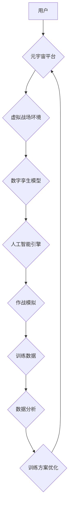

                 

## 元宇宙军事：数字化战争的演练场

> 关键词：元宇宙、军事仿真、虚拟现实、增强现实、人工智能、数字孪生、网络安全、战争演练

### 1. 背景介绍

21世纪，科技发展日新月异，特别是人工智能、虚拟现实、增强现实等技术的飞速发展，为军事领域带来了前所未有的变革。元宇宙作为下一代互联网的雏形，其沉浸式、交互式、共享的特性，为军事训练、战略演练、作战指挥等领域提供了全新的可能性。

传统军事演练往往依赖于实地演习，存在成本高、安全风险大、场地限制等问题。而元宇宙军事仿真则可以构建虚拟战场环境，模拟真实作战场景，让士兵在安全、可控的环境中进行训练，提高实战能力。

### 2. 核心概念与联系

**2.1 元宇宙概述**

元宇宙是指一个基于互联网、融合虚拟现实、增强现实、区块链等技术的虚拟世界，用户可以在其中创建、分享、体验数字内容，并与其他用户进行互动。元宇宙的核心特征包括：

* **沉浸式体验:** 通过VR/AR技术，用户可以身临其境地体验虚拟世界。
* **持久性:** 元宇宙世界不会随着用户退出而消失，而是持续存在，用户可以随时进入和离开。
* **互操作性:** 不同平台和应用之间可以互联互通，用户可以自由地将数字资产和身份迁移到不同的元宇宙环境中。
* **去中心化:** 元宇宙的治理和运营由社区共同参与，而不是由单一机构控制。

**2.2 元宇宙与军事的结合**

元宇宙为军事领域提供了以下优势：

* **沉浸式训练:** 模拟真实作战场景，提高士兵的战术素养和应变能力。
* **成本效益:** 降低实地演习的成本，减少资源浪费。
* **安全保障:** 在虚拟环境中进行训练，避免人员伤亡和设备损毁。
* **数据分析:** 收集训练数据，分析士兵表现，优化训练方案。

**2.3 元宇宙军事仿真架构**



**2.4 核心概念关系**

* **用户:** 元宇宙军事仿真的参与者，可以是士兵、指挥官、研究人员等。
* **元宇宙平台:** 提供虚拟环境、交互工具、数据管理等服务的平台。
* **虚拟战场环境:** 模拟真实作战场景的虚拟空间，包括地形、建筑、武器装备等。
* **数字孪生模型:** 基于真实世界的物理模型，在虚拟环境中进行数字化重建。
* **人工智能引擎:** 利用机器学习、深度学习等技术，赋予虚拟角色智能行为，模拟敌我双方作战决策。
* **作战模拟:** 基于虚拟战场环境和数字孪生模型，进行军事行动的模拟演练。
* **训练数据:** 训练过程中收集到的数据，用于分析士兵表现、优化训练方案。
* **数据分析:** 对训练数据进行分析，提取关键信息，为训练方案优化提供依据。
* **训练方案优化:** 根据数据分析结果，调整训练内容、难度、战术策略等，提高训练效果。

### 3. 核心算法原理 & 具体操作步骤

**3.1 算法原理概述**

元宇宙军事仿真的核心算法包括：

* **路径规划算法:** 用于模拟士兵、车辆、无人机等在虚拟战场环境中的移动路径。
* **战斗仿真算法:** 用于模拟武器装备的攻击效果、人员伤亡、装备损毁等战斗过程。
* **人工智能算法:** 用于赋予虚拟角色智能行为，模拟敌我双方作战决策。

**3.2 算法步骤详解**

**3.2.1 路径规划算法**

1. **构建地图:** 将虚拟战场环境数字化，构建地图数据，包括地形、障碍物、目标点等信息。
2. **确定起点和终点:** 根据任务目标，确定士兵、车辆、无人机等移动的起点和终点。
3. **搜索路径:** 利用路径规划算法，例如A*算法、Dijkstra算法等，搜索从起点到终点的最佳路径。
4. **规划移动轨迹:** 根据搜索到的路径，规划移动轨迹，并考虑环境因素、障碍物、敌我双方动态情况等。

**3.2.2 战斗仿真算法**

1. **建模武器装备:** 建立武器装备的物理模型，包括射程、精度、威力等参数。
2. **模拟攻击效果:** 根据武器装备的模型和目标的属性，模拟攻击效果，例如人员伤亡、装备损毁等。
3. **更新战场状态:** 根据攻击效果，更新虚拟战场环境的状态，例如人员生命值、装备状态等。
4. **计算战斗结果:** 根据战斗过程中的数据，计算战斗结果，例如胜负、伤亡情况、损失情况等。

**3.2.3 人工智能算法**

1. **训练模型:** 利用机器学习、深度学习等技术，训练虚拟角色的决策模型，使其能够根据战场情况做出智能决策。
2. **模拟决策过程:** 根据训练好的模型，模拟虚拟角色的决策过程，例如选择攻击目标、制定战术策略等。
3. **更新角色行为:** 根据决策结果，更新虚拟角色的行为，例如移动、攻击、防御等。

**3.3 算法优缺点**

**3.3.1 路径规划算法**

* **优点:** 可以快速找到最优路径，提高效率。
* **缺点:** 难以处理复杂环境、动态变化的场景。

**3.3.2 战斗仿真算法**

* **优点:** 可以模拟真实的战斗过程，提高训练效果。
* **缺点:** 计算复杂度高，需要强大的计算资源。

**3.3.3 人工智能算法**

* **优点:** 可以赋予虚拟角色智能行为，提高训练的真实性。
* **缺点:** 训练模型需要大量数据，算法复杂度高。

**3.4 算法应用领域**

* **军事训练:** 模拟实战场景，提高士兵的战术素养和应变能力。
* **战略演练:** 评估作战方案的有效性，预测战争结果。
* **武器装备测试:** 在虚拟环境中测试武器装备的性能，优化设计方案。
* **网络安全演练:** 模拟网络攻击场景，提高网络安全防御能力。

### 4. 数学模型和公式 & 详细讲解 & 举例说明

**4.1 数学模型构建**

元宇宙军事仿真中的数学模型主要用于描述虚拟战场环境、武器装备性能、人员行为等。常见的数学模型包括：

* **几何模型:** 用于描述虚拟战场环境的形状、大小、地形等。
* **物理模型:** 用于描述武器装备的运动轨迹、攻击效果、人员伤亡等物理现象。
* **概率模型:** 用于描述人员行为、敌我双方决策等随机事件。

**4.2 公式推导过程**

**4.2.1 武器装备攻击效果模型**

假设一个武器装备的攻击效果由以下因素决定：

* **射程:** 武器装备的攻击范围。
* **精度:** 武器装备的命中率。
* **威力:** 武器装备的攻击强度。

可以建立一个攻击效果模型，例如：

$$
攻击效果 = 射程 * 精度 * 威力
$$

**4.2.2 人员伤亡模型**

假设人员的伤亡概率由以下因素决定：

* **装备防护:** 人员所穿的装备防护能力。
* **攻击强度:** 攻击武器装备的威力。

可以建立一个伤亡概率模型，例如：

$$
伤亡概率 = 1 - 防护能力 / 攻击强度
$$

**4.3 案例分析与讲解**

**4.3.1 虚拟战场环境建模**

可以使用三维建模软件，根据真实战场地形、建筑物等信息，构建虚拟战场环境的几何模型。

**4.3.2 武器装备性能仿真**

可以使用物理引擎，模拟武器装备的运动轨迹、攻击效果等物理现象。

**4.3.3 人员行为模拟**

可以使用行为树、状态机等人工智能算法，模拟人员的决策行为、移动轨迹等。

### 5. 项目实践：代码实例和详细解释说明

**5.1 开发环境搭建**

* **操作系统:** Windows/Linux/macOS
* **编程语言:** C++/Python
* **游戏引擎:** Unity/Unreal Engine
* **虚拟现实平台:** Oculus/HTC Vive

**5.2 源代码详细实现**

```python
# 路径规划算法示例代码 (使用A*算法)

import heapq

class Node:
    def __init__(self, position, parent=None):
        self.position = position
        self.parent = parent
        self.g = 0  # 从起点到该节点的距离
        self.h = 0  # 到目标节点的估计距离
        self.f = 0  # g + h

    def __lt__(self, other):
        return self.f < other.f

def astar(start, goal, grid):
    open_list = []
    closed_list = set()

    start_node = Node(start)
    start_node.g = 0
    start_node.h = heuristic(start, goal)
    start_node.f = start_node.g + start_node.h
    heapq.heappush(open_list, start_node)

    while open_list:
        current_node = heapq.heappop(open_list)
        closed_list.add(current_node.position)

        if current_node.position == goal:
            return reconstruct_path(current_node)

        for neighbor in get_neighbors(current_node, grid):
            if neighbor in closed_list:
                continue

            tentative_g = current_node.g + 1  # 假设每个移动步长为1

            if neighbor not in open_list or tentative_g < neighbor.g:
                neighbor.parent = current_node
                neighbor.g = tentative_g
                neighbor.h = heuristic(neighbor.position, goal)
                neighbor.f = neighbor.g + neighbor.h
                heapq.heappush(open_list, neighbor)

    return None

# ... 其他函数实现 ...
```

**5.3 代码解读与分析**

* **Node类:** 定义节点结构，包含位置、父节点、g值、h值、f值等属性。
* **astar函数:** 实现A*算法，用于寻找最短路径。
* **get_neighbors函数:** 获取节点的邻居节点。
* **heuristic函数:** 计算节点到目标节点的估计距离。
* **reconstruct_path函数:** 根据父节点关系，重建路径。

**5.4 运行结果展示**

运行代码后，可以得到从起点到目标点的最短路径，并可视化展示在虚拟战场环境中。

### 6. 实际应用场景

**6.1 军事训练**

元宇宙军事仿真可以用于模拟各种军事训练场景，例如：

* **步兵战术训练:** 模拟步兵战斗、攻防战等战术演练。
* **坦克装甲车训练:** 模拟坦克装甲车作战、防御战等训练。
* **空军飞行训练:** 模拟飞行员训练、空中作战等场景。
* **特种作战训练:** 模拟特种部队突袭、侦察等任务训练。

**6.2 战略演练**

元宇宙军事仿真可以用于模拟大型军事行动，例如：

* **联合军演:** 模拟多个国家军队联合作战的场景。
* **战争演练:** 模拟不同国家之间的战争冲突，评估作战方案的有效性。
* **危机应对:** 模拟突发事件，例如自然灾害、恐怖袭击等，评估应对措施的有效性。

**6.3 武器装备测试**

元宇宙军事仿真可以用于测试武器装备的性能，例如：

* **射程测试:** 模拟武器装备的射程，评估其攻击范围。
* **精度测试:** 模拟武器装备的命中率，评估其攻击精度。
* **威力测试:** 模拟武器装备的攻击强度，评估其杀伤力。

**6.4 未来应用展望**

随着元宇宙技术的不断发展，其在军事领域的应用将更加广泛和深入，例如：

* **虚拟现实指挥中心:** 利用VR技术，构建沉浸式的指挥中心，提高指挥官的决策效率。
* **增强现实战术指导:** 利用AR技术，为士兵提供实时战术指导，提高作战能力。
* **人工智能辅助作战:** 利用人工智能技术，辅助作战决策，提高作战效率。
* **网络空间安全演练:** 模拟网络攻击场景，提高网络安全防御能力。

### 7. 工具和资源推荐

**7.1 学习资源推荐**

* **书籍:**
    * 《元宇宙：下一代互联网》
    * 《虚拟现实技术》
    * 《人工智能基础》
* **在线课程:**
    * Coursera: 元宇宙与虚拟现实
    * edX: 人工智能与机器学习
* **网站:**
    * Meta: https://about.fb.com/meta/
    * Unity: https://unity.com/
    * Unreal Engine: https://www.unrealengine.com/

**7.2 开发工具推荐**

* **游戏引擎:** Unity, Unreal Engine
* **虚拟现实平台:** Oculus, HTC Vive
* **编程语言:** C++, Python
* **3D建模软件:** Blender, Maya

**7.3 相关论文推荐**

* **元宇宙与军事应用:**
    * "The Metaverse: A New Frontier for Military Training and Simulation"
    * "Using Virtual Reality for Military Training and Education"
* **人工智能与军事应用:**
    * "Artificial Intelligence in Warfare: Challenges and Opportunities"
    * "The Ethics of Autonomous Weapons Systems"

### 8. 总结：未来发展趋势与挑战

**8.1 研究成果总结**

元宇宙军事仿真技术取得了显著进展，能够模拟真实作战场景，提高训练效果，评估作战方案，测试武器装备等。

**8.2 未来发展趋势**

* **沉浸式体验:** 利用VR/AR技术，打造更加沉浸式的虚拟战场环境。
* **人工智能增强:** 利用人工智能技术，赋予虚拟角色更智能的行为，模拟更加复杂的作战场景。
* **网络化协同:** 建立网络化的元宇宙军事仿真平台，实现多方协同训练、演练。
* **数据驱动:** 利用大数据分析技术，挖掘训练数据中的价值，优化训练方案。

**8.3 面临的挑战**

* **技术瓶颈:** 元宇宙军事仿真技术还面临着一些技术瓶颈，例如虚拟现实技术、人工智能技术、网络安全技术等。
* **成本问题:** 建设和维护元宇宙军事仿真平台需要大量的资金投入。
* **伦理问题:** 元宇宙军事仿真技术可能引发一些伦理问题，例如人工智能的自主性、虚拟战场的真实性等。

**8.4 研究展望**

未来，元宇宙军事仿真技术将继续发展，成为军事训练、战略演练、武器装备测试等领域的不可或缺的一部分。


### 9. 附录：常见问题与解答

**9.1 元宇宙军事仿真与现实军事训练相比有什么优势？**

元宇宙军事仿真相对于现实军事训练，具有以下优势：

* **成本效益高:** 降低了实地演习的成本，减少了资源浪费。
* **安全保障:** 在虚拟环境中进行训练，避免人员伤亡和设备损毁。
* **可控性强:** 可以模拟各种复杂场景，并控制场景变化，提高训练的针对性和有效性。
* **数据分析:** 可以收集训练数据，分析士兵表现，优化训练方案。

**9.2 元宇宙军事仿真技术有哪些应用场景？**

元宇宙军事仿真技术可以应用于以下场景：

* 军事训练
* 战略演练
* 武器装备测试
* 网络空间安全演练

**9.3 元宇宙军事仿真技术面临哪些挑战？**

元宇宙军事仿真技术面临以下挑战：

* 技术瓶颈
* 成本问题
* 伦理问题

**9.4 元宇宙军事仿真技术未来发展趋势是什么？**

元宇宙军事仿真技术未来发展趋势包括：

* 沉浸式体验
* 人工智能增强
* 网络化协同
* 数据驱动


作者：禅与计算机程序设计艺术 / Zen and the Art of Computer Programming<end_of_turn>

