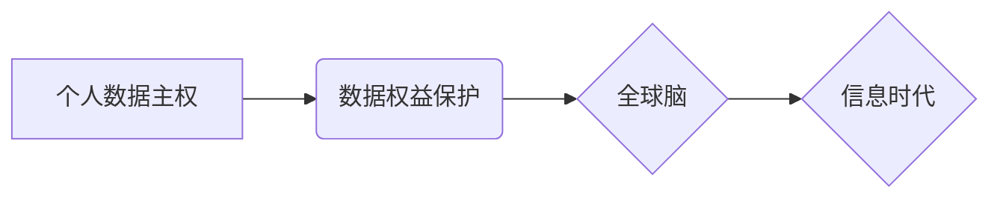

                 

## 全球脑与个人数据主权:信息时代的数据权益保护法

> 关键词：全球脑、个人数据主权、数据权益保护、信息时代、人工智能、隐私保护、数据安全、伦理规范

## 1. 背景介绍

信息时代，数据已成为重要的生产要素，个人数据更是蕴藏着巨大的价值。随着人工智能（AI）技术的飞速发展，全球脑的概念逐渐浮出水面，它指代一个由海量数据和强大计算能力组成的超级智能网络，能够处理和分析人类从未想象过的复杂信息，并为社会带来前所未有的变革。然而，全球脑的构建也引发了人们对个人数据主权和数据权益保护的担忧。

一方面，全球脑的运行需要海量数据作为燃料，这可能会导致个人隐私泄露和滥用风险的增加。另一方面，全球脑的决策可能会对个人生活产生深远影响，例如就业、医疗、教育等方面，这需要我们认真思考数据主权和算法透明度等问题。

因此，如何在保障个人数据主权的同时，推动全球脑的健康发展，成为当今社会面临的重大挑战。

## 2. 核心概念与联系

### 2.1 全球脑

全球脑是一个由分布式计算网络、大数据平台、人工智能算法等技术构成的超级智能系统。它旨在通过连接和整合全球范围内的计算资源和数据资源，实现对复杂问题的全面分析和解决。

### 2.2 个人数据主权

个人数据主权是指个人对自身数据拥有自主控制权，包括收集、使用、存储、共享和删除等权利。它强调个人在数据时代应享有对自身数据的自主决定权，并保障个人数据不被非法获取、滥用或侵犯。

### 2.3 数据权益保护

数据权益保护是指通过法律、技术和社会规范等手段，保障个人在数据收集、使用、存储和共享过程中享有的合法权益。它包括隐私保护、数据安全、数据透明度、数据可控性等方面。

**核心概念关系图**



## 3. 核心算法原理 & 具体操作步骤

### 3.1 算法原理概述

为了实现个人数据主权和数据权益保护，需要开发一系列先进的算法和技术。这些算法可以分为以下几类：

* **隐私保护算法**: 旨在保护个人数据在处理和分析过程中不被泄露，例如差分隐私、联邦学习等。
* **数据安全算法**: 旨在保障个人数据免受恶意攻击和篡改，例如加密算法、身份验证算法等。
* **数据可控算法**: 旨在赋予个人对自身数据进行自主控制的权利，例如数据访问控制、数据共享协议等。

### 3.2 算法步骤详解

以差分隐私为例，其具体操作步骤如下：

1. **添加噪声**: 在对数据进行分析之前，将随机噪声添加到数据中，使得每个数据点的隐私信息被掩盖。
2. **分析加噪数据**: 对加噪数据进行分析，获得分析结果。
3. **移除噪声**: 从分析结果中移除噪声，得到最终的分析结果。

### 3.3 算法优缺点

**差分隐私算法**

* **优点**: 能够有效保护个人隐私，即使攻击者获得了部分数据，也无法推断出个体隐私信息。
* **缺点**: 添加噪声可能会降低分析结果的准确性。

### 3.4 算法应用领域

* **医疗保健**: 保护患者医疗数据的隐私，同时允许研究人员对数据进行分析，以促进医疗研究和进步。
* **金融服务**: 保护客户金融数据的隐私，防止欺诈和身份盗窃。
* **市场营销**: 允许企业对数据进行分析，以更好地了解客户需求，但同时保障客户隐私不被侵犯。

## 4. 数学模型和公式 & 详细讲解 & 举例说明

### 4.1 数学模型构建

差分隐私算法的核心是利用概率论和统计学原理，构建一个数学模型来衡量数据隐私的保护程度。

**定义**: 设数据集为D，隐私预算为ε，则差分隐私定义为：对于任意两个数据集D和D'，其仅相差一个数据点，则对任何算法A，以下不等式成立：

$$P(A(D) \neq A(D')) \leq e^{-\epsilon}$$

其中，P(A(D) ≠ A(D'))表示算法A在两个数据集上的输出结果不同的概率。

### 4.2 公式推导过程

该公式的推导过程涉及到概率论和统计学的知识，需要借助于Laplace机制和指数分布等概念。

### 4.3 案例分析与讲解

假设我们有一个包含1000个用户的医疗数据集，想要分析用户平均年龄。为了保护用户隐私，我们可以使用差分隐私算法，设置隐私预算为ε=1。

在分析过程中，我们会对每个用户的年龄数据添加随机噪声，使得每个用户的年龄数据都有一定的随机性。通过对加噪数据的分析，我们可以得到平均年龄的估计值。

由于添加了噪声，即使攻击者获得了平均年龄的估计值，也无法推断出任何单个用户的年龄信息。

## 5. 项目实践：代码实例和详细解释说明

### 5.1 开发环境搭建

* 操作系统：Linux
* 编程语言：Python
* 库依赖：TensorFlow、PyTorch、NumPy等

### 5.2 源代码详细实现

```python
import numpy as np

def add_noise(data, epsilon):
  """添加噪声到数据中"""
  noise = np.random.laplace(0, 1 / epsilon)
  return data + noise

# 示例数据
data = np.array([1, 2, 3, 4, 5])

# 设置隐私预算
epsilon = 1

# 添加噪声
noisy_data = add_noise(data, epsilon)

# 计算平均值
average = np.mean(noisy_data)

print(f"加噪数据: {noisy_data}")
print(f"平均值: {average}")
```

### 5.3 代码解读与分析

* `add_noise()`函数：添加Laplace噪声到数据中，噪声的大小与隐私预算ε成反比。
* `data`：示例数据，可以替换为实际的数据集。
* `epsilon`：隐私预算，控制噪声的大小。
* `noisy_data`：添加噪声后的数据。
* `average`：对加噪数据的平均值。

### 5.4 运行结果展示

运行代码后，会输出加噪数据和平均值。由于添加了噪声，平均值与实际平均值会有所偏差。

## 6. 实际应用场景

### 6.1 医疗保健

* **患者隐私保护**: 使用差分隐私算法保护患者医疗数据的隐私，允许研究人员对数据进行分析，以促进医疗研究和进步。
* **疾病预测**: 利用全球脑的计算能力和数据分析能力，对患者数据进行分析，预测疾病风险，并提供个性化的医疗建议。

### 6.2 金融服务

* **欺诈检测**: 使用机器学习算法和数据分析技术，识别和预防金融欺诈行为。
* **风险管理**: 利用全球脑的计算能力和数据分析能力，评估金融风险，并制定相应的风险管理策略。

### 6.3 市场营销

* **精准营销**: 利用全球脑的计算能力和数据分析能力，分析客户数据，进行精准营销，提高营销效果。
* **个性化推荐**: 根据用户的兴趣和行为数据，提供个性化的产品和服务推荐。

### 6.4 未来应用展望

* **智能城市**: 利用全球脑的计算能力和数据分析能力，优化城市交通、能源管理、环境保护等方面。
* **教育**: 利用全球脑的计算能力和数据分析能力，提供个性化的教育方案，提高教育效率。

## 7. 工具和资源推荐

### 7.1 学习资源推荐

* **书籍**:
    * 《深度学习》
    * 《人工智能：一种现代方法》
    * 《机器学习》
* **在线课程**:
    * Coursera
    * edX
    * Udacity

### 7.2 开发工具推荐

* **编程语言**: Python
* **机器学习框架**: TensorFlow、PyTorch
* **数据分析工具**: Pandas、NumPy

### 7.3 相关论文推荐

* 《差分隐私》
* 《联邦学习》
* 《全球脑》

## 8. 总结：未来发展趋势与挑战

### 8.1 研究成果总结

* 隐私保护算法和数据安全算法取得了显著进展，能够有效保护个人数据在处理和分析过程中不被泄露。
* 全球脑的概念逐渐被人们接受，并开始在各个领域得到应用。

### 8.2 未来发展趋势

* 隐私保护算法将更加完善，能够更好地平衡数据利用和隐私保护。
* 全球脑的规模和能力将不断提升，为社会带来更多价值。
* 数据权益保护将成为法律法规和社会规范的重要组成部分。

### 8.3 面临的挑战

* 如何平衡数据利用和隐私保护，是一个需要不断探索和解决的难题。
* 全球脑的伦理问题，例如算法偏见、数据垄断等，需要引起人们的重视。
* 数据权益保护的法律法规和技术标准，需要不断完善和更新。

### 8.4 研究展望

* 研究更加高效、准确、安全的隐私保护算法。
* 开发更加可控、透明、可解释的全球脑系统。
* 建立完善的数据权益保护法律法规和技术标准。

## 9. 附录：常见问题与解答

* **什么是差分隐私？**

差分隐私是一种数学模型，用于衡量数据隐私的保护程度。它保证了即使攻击者获得了部分数据，也无法推断出任何单个用户的隐私信息。

* **全球脑的构建需要哪些技术？**

全球脑的构建需要分布式计算网络、大数据平台、人工智能算法等技术。

* **如何保障个人数据主权？**

可以通过法律、技术和社会规范等手段保障个人数据主权，例如隐私保护算法、数据安全算法、数据可控算法等。


作者：禅与计算机程序设计艺术 / Zen and the Art of Computer Programming 
<end_of_turn>

