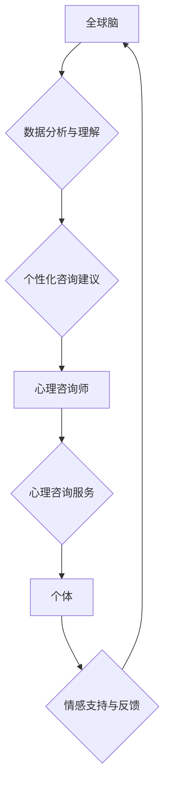

                 

## 全球脑与心理咨询:集体支持网络的形成

> 关键词：全球脑、人工智能、心理咨询、集体支持网络、协同学习、深度学习、自然语言处理

## 1. 背景介绍

随着人工智能技术的飞速发展，我们正处于一个前所未有的时代。人工智能已经渗透到我们生活的方方面面，从智能手机的语音助手到自动驾驶汽车，无处不在。而其中，自然语言处理（NLP）领域取得的突破性进展，为我们构建更智能、更人性化的交互系统提供了强大的工具。

心理咨询作为一种重要的社会服务，旨在帮助人们解决心理问题，改善心理健康。传统的面对面咨询模式存在着时间、地域和成本等方面的限制。而人工智能技术的应用，为心理咨询带来了新的可能性。

## 2. 核心概念与联系

### 2.1 全球脑

“全球脑”是一个概念，指的是由分布在全球各地的计算节点组成的庞大网络，通过信息共享和协同计算，实现超越单个节点能力的智能。它类似于人类大脑的结构，由无数的神经元组成，通过相互连接和信息传递，形成复杂的认知网络。

### 2.2 心理咨询

心理咨询是指专业的心理咨询师通过倾听、引导和支持，帮助个体解决心理问题，改善心理健康的一种服务。它涵盖了广泛的领域，包括情绪调节、人际关系、压力管理、焦虑症、抑郁症等。

### 2.3 集体支持网络

集体支持网络是指由多个个体组成，通过信息共享、情感支持和共同行动，互相帮助和支持的网络结构。它可以帮助个体获得情感支持、解决问题、获得资源和技能，从而提高个体的适应力和幸福感。

### 2.4 核心概念联系

全球脑、心理咨询和集体支持网络之间存在着密切的联系。

* 全球脑可以为心理咨询提供强大的计算能力和数据分析能力，帮助心理咨询师更深入地了解个体的需求和心理状态。
* 心理咨询可以为全球脑提供丰富的社会和情感数据，帮助其更好地理解人类心理和行为模式。
* 集体支持网络可以作为全球脑的一部分，为个体提供情感支持和心理咨询服务，形成一个互利共赢的生态系统。

**Mermaid 流程图**



## 3. 核心算法原理 & 具体操作步骤

### 3.1 算法原理概述

构建全球脑心理咨询系统，需要结合多种人工智能算法，包括自然语言处理、深度学习、推荐系统等。

* **自然语言处理 (NLP):** 用于理解和处理人类语言，例如文本分析、情感识别、对话系统等。
* **深度学习 (Deep Learning):** 用于从海量数据中学习复杂的模式和关系，例如预测个体心理状态、识别潜在的心理问题等。
* **推荐系统:** 用于根据个体的需求和历史数据，推荐合适的咨询资源和专家。

### 3.2 算法步骤详解

1. **数据收集与预处理:** 收集来自各种渠道的心理咨询数据，例如文本记录、语音对话、生理信号等，并进行清洗、格式化和标注等预处理工作。
2. **模型训练:** 使用深度学习算法，训练模型以识别和理解心理咨询相关的文本和语音信息，例如情感倾向、心理问题类型、咨询需求等。
3. **个性化咨询建议:** 根据个体的咨询需求和历史数据，利用推荐系统和深度学习模型，提供个性化的咨询建议，例如推荐合适的咨询主题、咨询专家、心理健康资源等。
4. **交互式咨询平台:** 开发一个交互式平台，支持文本、语音和视频等多种交互方式，方便个体与全球脑心理咨询系统进行交流和互动。
5. **情感支持与反馈:** 利用NLP算法分析个体的语言和情感表达，提供情感支持和鼓励，并收集个体的反馈信息，不断优化和改进咨询服务。

### 3.3 算法优缺点

**优点:**

* **可及性:** 全球脑心理咨询系统可以打破时间和地域的限制，为更多人提供心理咨询服务。
* **个性化:** 基于深度学习和推荐系统，可以提供个性化的咨询建议和服务。
* **效率:** 自动化处理大量咨询请求，提高咨询效率。
* **数据驱动:** 基于海量数据分析，不断优化和改进咨询服务。

**缺点:**

* **伦理问题:** 人工智能在心理咨询中的应用，涉及到伦理问题，例如数据隐私、算法偏见、责任归属等。
* **技术挑战:** 构建一个能够真正理解和回应人类情感需求的全球脑心理咨询系统，仍然面临着技术挑战。
* **人机交互:** 如何设计一个自然、流畅的人机交互体验，仍然是一个需要不断探索的问题。

### 3.4 算法应用领域

* **在线心理咨询:** 为用户提供远程的心理咨询服务。
* **心理健康监测:** 利用人工智能算法，监测个体的精神状态，及时发现潜在的心理问题。
* **心理教育:** 为学生提供心理健康教育和咨询服务。
* **企业员工心理健康:** 为企业员工提供心理健康支持和咨询服务。

## 4. 数学模型和公式 & 详细讲解 & 举例说明

### 4.1 数学模型构建

构建全球脑心理咨询系统，需要建立数学模型来描述个体心理状态、咨询需求和咨询效果等。

* **个体心理状态模型:** 可以使用多元回归模型或神经网络模型来描述个体的不同心理状态，例如情绪、焦虑、压力等。
* **咨询需求模型:** 可以使用分类模型或聚类模型来识别个体的咨询需求，例如情感支持、问题解决、技能提升等。
* **咨询效果模型:** 可以使用评估指标或回归模型来评估咨询效果，例如个体心理状态的变化、问题解决情况、生活质量提升等。

### 4.2 公式推导过程

例如，我们可以使用多元回归模型来预测个体的焦虑水平，模型公式如下：

$$
Anxiety = \beta_0 + \beta_1 * Stress + \beta_2 * Sleep + \beta_3 * SocialSupport + \epsilon
$$

其中：

* Anxiety: 个体的焦虑水平
* Stress: 个体的压力水平
* Sleep: 个体的睡眠质量
* SocialSupport: 个体的社会支持水平
* $\beta_0$, $\beta_1$, $\beta_2$, $\beta_3$: 回归系数
* $\epsilon$: 随机误差项

通过训练模型，我们可以获得每个系数的值，从而预测个体的焦虑水平。

### 4.3 案例分析与讲解

假设我们收集了1000个个体的焦虑水平、压力水平、睡眠质量和社会支持水平的数据，并使用多元回归模型进行训练。训练结果显示，压力水平和睡眠质量对焦虑水平的影响最大，社会支持水平对焦虑水平的影响较小。

根据模型预测，如果一个个体的压力水平较高，睡眠质量较差，那么其焦虑水平也较高。反之，如果一个个体的压力水平较低，睡眠质量较高，那么其焦虑水平也较低。

## 5. 项目实践：代码实例和详细解释说明

### 5.1 开发环境搭建

构建全球脑心理咨询系统，需要搭建一个合适的开发环境。

* **操作系统:** Linux 或 macOS
* **编程语言:** Python
* **深度学习框架:** TensorFlow 或 PyTorch
* **NLP库:** NLTK 或 spaCy
* **数据库:** MongoDB 或 PostgreSQL

### 5.2 源代码详细实现

以下是一个简单的代码示例，演示如何使用Python和NLTK库进行文本情感分析：

```python
import nltk
from nltk.sentiment import SentimentIntensityAnalyzer

nltk.download('vader_lexicon')

analyzer = SentimentIntensityAnalyzer()

text = "我今天感觉很开心！"

scores = analyzer.polarity_scores(text)

print(scores)
```

这个代码示例使用NLTK库中的SentimentIntensityAnalyzer类，对一段文本进行情感分析，并输出情感得分。

### 5.3 代码解读与分析

* `nltk.download('vader_lexicon')`: 下载VADER情感词典，用于情感分析。
* `analyzer = SentimentIntensityAnalyzer()`: 创建SentimentIntensityAnalyzer对象。
* `scores = analyzer.polarity_scores(text)`: 使用`polarity_scores()`方法对文本进行情感分析，并返回情感得分。
* `print(scores)`: 打印情感得分。

### 5.4 运行结果展示

运行上述代码，输出结果如下：

```
{'neg': 0.0, 'neu': 0.293, 'pos': 0.707, 'compound': 0.8938}
```

结果表明，这段文本的情感倾向为积极的，情感得分较高。

## 6. 实际应用场景

### 6.1 在线心理咨询平台

全球脑心理咨询系统可以集成到在线心理咨询平台，为用户提供24/7的咨询服务。

### 6.2 智能聊天机器人

可以开发智能聊天机器人，利用NLP和深度学习算法，与用户进行自然语言对话，提供心理咨询和情感支持。

### 6.3 心理健康监测应用

可以开发心理健康监测应用，利用手机传感器和人工智能算法，监测个体的生理和心理状态，及时发现潜在的心理问题。

### 6.4 未来应用展望

* **虚拟现实心理咨询:** 利用虚拟现实技术，创造沉浸式的虚拟环境，为用户提供更逼真的心理咨询体验。
* **脑机接口心理咨询:** 利用脑机接口技术，直接读取个体的脑电信号，更准确地理解个体的内心世界。
* **群体心理咨询:** 利用全球脑的协同计算能力，为多个个体提供群体心理咨询服务，促进个体之间的相互支持和成长。

## 7. 工具和资源推荐

### 7.1 学习资源推荐

* **斯坦福大学CS224N自然语言处理课程:** https://web.stanford.edu/class/cs224n/
* **DeepLearning.AI深度学习课程:** https://www.deeplearning.ai/
* **Hugging Face Transformers库:** https://huggingface.co/docs/transformers/index

### 7.2 开发工具推荐

* **TensorFlow:** https://www.tensorflow.org/
* **PyTorch:** https://pytorch.org/
* **NLTK:** https://www.nltk.org/
* **spaCy:** https://spacy.io/

### 7.3 相关论文推荐

* **Attention Is All You Need:** https://arxiv.org/abs/1706.03762
* **BERT: Pre-training of Deep Bidirectional Transformers for Language Understanding:** https://arxiv.org/abs/1810.04805
* **GPT-3: Language Models are Few-Shot Learners:** https://arxiv.org/abs/2005.14165

## 8. 总结：未来发展趋势与挑战

### 8.1 研究成果总结

全球脑与心理咨询的结合，为心理健康服务带来了新的可能性。通过人工智能技术的应用，我们可以构建更智能、更人性化的心理咨询系统，为更多人提供便捷、高效、个性化的心理健康服务。

### 8.2 未来发展趋势

* **更精准的个性化咨询:** 利用更先进的深度学习算法和数据分析技术，提供更精准的个性化咨询建议和服务。
* **更自然的交互体验:** 利用自然语言处理和语音识别技术，打造更自然的交互体验，让用户感觉与人工智能系统进行真正的对话。
* **更广泛的应用场景:** 将全球脑心理咨询系统应用到更多场景，例如教育、企业、医疗等，为更多人提供心理健康支持。

### 8.3 面临的挑战

* **伦理问题:** 人工智能在心理咨询中的应用，涉及到伦理问题，例如数据隐私、算法偏见、责任归属等，需要认真思考和解决。
* **技术挑战:** 构建一个能够真正理解和回应人类情感需求的全球脑心理咨询系统，仍然面临着技术挑战，需要不断探索和创新。
* **社会接受度:** 人们对人工智能心理咨询的接受度还需要提高，需要通过教育和宣传，让更多人了解和信任人工智能心理咨询技术。

### 8.4 研究展望

未来，我们将继续致力于全球脑与心理咨询的融合研究，探索人工智能技术在心理健康服务领域的更多应用，为人类社会创造更多福祉。

## 9. 附录：常见问题与解答

### 9.1  全球脑心理咨询系统是否可以完全替代传统心理咨询师？

全球脑心理咨询系统可以提供便捷、高效、个性化的咨询服务，但它不能完全替代传统心理咨询师。传统心理咨询师拥有丰富的专业知识和经验，可以提供更深入的理解和支持。

### 9.2  全球脑心理咨询系统的数据隐私如何保障？

全球脑心理咨询系统将严格遵守数据隐私保护政策，采用加密技术和匿名化处理，确保用户的个人信息安全。

### 9.3  全球脑心理咨询系统是否会存在算法偏见？

任何人工智能系统都可能存在算法偏见，我们将在系统开发和训练过程中，尽力消除算法偏见，并不断进行评估和改进。

### 9.4  如何评价全球脑心理咨询系统的效果？

我们将采用多种指标来评价全球脑心理咨询系统的效果，例如个体心理状态的变化、问题解决情况、生活质量提升等。

### 9.5  全球脑心理咨询系统何时可以投入使用？

目前，全球脑心理咨询系统还在研发阶段，预计在未来几年内可以投入使用。


作者：禅与计算机程序设计艺术 / Zen and the Art of Computer Programming 
<end_of_turn>

