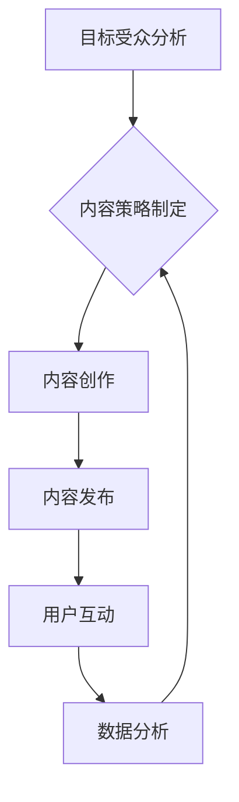

                 

## 内容营销创业：品牌建设的新思路

> 关键词：内容营销、品牌建设、用户体验、数据分析、人工智能

### 1. 背景介绍

在当今数字时代，品牌建设已不再仅仅依赖于传统的广告投放和产品本身的质量。消费者信息获取渠道多元化，对品牌信息的获取方式也发生了巨大变化。他们更倾向于通过网络平台获取品牌信息，并通过社交媒体、博客等渠道进行互动交流。在这种背景下，内容营销应运而生，成为品牌建设的新思路。

内容营销是指通过创造并传播有价值、引人入胜的内容来吸引目标受众，建立品牌信任，最终实现商业目标。它与传统的营销模式不同，更注重提供价值，而非直接推销产品。

### 2. 核心概念与联系

**2.1 内容营销的核心概念**

内容营销的核心概念包括：

* **价值创造:** 内容营销的核心在于为目标受众提供有价值、有意义的内容，满足他们的需求和兴趣。
* **用户体验:** 内容营销注重用户体验，提供易于理解、易于分享、易于参与的内容，提升用户粘性。
* **品牌建设:** 内容营销通过持续输出优质内容，塑造品牌形象，建立品牌信任，提升品牌知名度。
* **数据分析:** 内容营销注重数据分析，通过数据追踪用户行为，了解用户需求，优化内容策略。

**2.2 内容营销与品牌建设的联系**

内容营销与品牌建设是相互促进、相辅相成的关系。

* 内容营销为品牌建设提供了一种新的途径，通过优质内容吸引目标受众，建立品牌信任。
* 品牌建设为内容营销提供了一个方向，明确目标受众，确定内容主题，提升内容价值。

**2.3 内容营销流程图**



### 3. 核心算法原理 & 具体操作步骤

**3.1 算法原理概述**

内容营销的核心算法原理是基于用户行为分析和内容推荐算法。通过分析用户浏览历史、点赞、评论等行为数据，推荐与用户兴趣相符的内容，提升用户参与度和转化率。

**3.2 算法步骤详解**

1. **用户行为数据采集:** 收集用户浏览历史、点赞、评论、分享等行为数据。
2. **用户画像构建:** 基于用户行为数据，构建用户画像，包括用户兴趣、偏好、年龄、性别等信息。
3. **内容主题分析:** 对内容进行主题分析，提取关键词、主题标签等信息。
4. **内容推荐算法:** 基于用户画像和内容主题分析结果，使用内容推荐算法推荐与用户兴趣相符的内容。
5. **内容个性化:** 根据用户个性化需求，对推荐内容进行个性化定制。

**3.3 算法优缺点**

* **优点:** 能够精准推荐用户感兴趣的内容，提升用户参与度和转化率。
* **缺点:** 需要大量用户行为数据进行训练，算法模型需要不断优化。

**3.4 算法应用领域**

* **电商平台:** 推荐商品、个性化商品列表。
* **社交媒体:** 推荐好友动态、兴趣小组。
* **新闻网站:** 推荐新闻资讯、个性化新闻订阅。
* **视频平台:** 推荐视频内容、个性化视频播放列表。

### 4. 数学模型和公式 & 详细讲解 & 举例说明

**4.1 数学模型构建**

内容推荐算法通常使用协同过滤算法或基于内容的推荐算法。

* **协同过滤算法:** 基于用户的历史行为数据，预测用户对特定内容的兴趣。
* **基于内容的推荐算法:** 基于内容的主题标签和特征，推荐与用户兴趣相符的内容。

**4.2 公式推导过程**

协同过滤算法中常用的公式包括：

* **余弦相似度:** 用于计算两个用户或两个内容之间的相似度。

$$
\text{相似度} = \frac{\mathbf{u} \cdot \mathbf{v}}{||\mathbf{u}|| ||\mathbf{v}||}
$$

其中，$\mathbf{u}$ 和 $\mathbf{v}$ 分别表示两个用户的行为向量或两个内容的特征向量。

* **预测评分:** 用于预测用户对特定内容的评分。

$$
\hat{r}_{u,i} = \bar{r}_u + \frac{\sum_{v \in N(u)} \frac{r_{v,i} - \bar{r}_v}{\sigma_v} \cdot \frac{\text{相似度}(u,v)}{\sum_{w \in N(u)} \text{相似度}(u,w)}}{\sigma_u}
$$

其中，$\hat{r}_{u,i}$ 表示用户 $u$ 对内容 $i$ 的预测评分，$\bar{r}_u$ 和 $\bar{r}_v$ 分别表示用户 $u$ 和 $v$ 的平均评分，$r_{v,i}$ 表示用户 $v$ 对内容 $i$ 的真实评分，$\sigma_u$ 和 $\sigma_v$ 分别表示用户 $u$ 和 $v$ 的评分标准差，$N(u)$ 表示与用户 $u$ 相似的用户集合。

**4.3 案例分析与讲解**

假设有一个电商平台，想要推荐商品给用户。可以使用协同过滤算法，根据用户的购买历史数据，预测用户对特定商品的兴趣。

例如，如果用户 A 购买了商品 X 和商品 Y，而用户 B 也购买了商品 X 和商品 Z，则可以推断用户 A 和用户 B 有相似的兴趣，因此可以推荐用户 A 商品 Z。

### 5. 项目实践：代码实例和详细解释说明

**5.1 开发环境搭建**

* Python 3.x
* Pandas
* Scikit-learn
* TensorFlow/PyTorch

**5.2 源代码详细实现**

```python
import pandas as pd
from sklearn.metrics.pairwise import cosine_similarity

# 加载用户行为数据
data = pd.read_csv('user_behavior.csv')

# 构建用户行为矩阵
user_item_matrix = data.pivot_table(index='user_id', columns='item_id', values='rating')

# 计算用户之间的余弦相似度
user_similarity = cosine_similarity(user_item_matrix)

# 获取用户 A 的相似用户
user_A_id = 1
similar_users = user_similarity[user_A_id].argsort()[:-6:-1]

# 获取用户 A 相似用户购买的商品
similar_users_items = user_item_matrix.iloc[similar_users].mean(axis=0)

# 推荐给用户 A 的商品
recommended_items = similar_users_items.sort_values(ascending=False).index

print(f'推荐给用户 {user_A_id} 的商品: {recommended_items}')
```

**5.3 代码解读与分析**

* 首先，加载用户行为数据，构建用户行为矩阵。
* 然后，使用余弦相似度计算用户之间的相似度。
* 获取用户 A 的相似用户，并获取这些用户购买的商品。
* 最后，根据相似用户购买的商品，推荐给用户 A 的商品。

**5.4 运行结果展示**

运行代码后，会输出推荐给用户 A 的商品列表。

### 6. 实际应用场景

**6.1 电商平台**

* 商品推荐: 根据用户的购买历史和浏览记录，推荐与用户兴趣相符的商品。
* 个性化商品列表: 为每个用户创建个性化的商品列表，提升用户购物体验。

**6.2 社交媒体平台**

* 朋友推荐: 根据用户的兴趣和好友关系，推荐新的朋友。
* 兴趣小组推荐: 根据用户的兴趣爱好，推荐相关的兴趣小组。

**6.3 新闻网站**

* 新闻推荐: 根据用户的阅读历史和兴趣标签，推荐与用户感兴趣的新闻资讯。
* 个性化新闻订阅: 为每个用户创建个性化的新闻订阅列表，推送用户感兴趣的新闻。

**6.4 视频平台**

* 视频推荐: 根据用户的观看历史和兴趣标签，推荐与用户感兴趣的视频内容。
* 个性化视频播放列表: 为每个用户创建个性化的视频播放列表，提升用户观看体验。

**6.5 未来应用展望**

随着人工智能技术的不断发展，内容营销将更加智能化、个性化。未来，内容营销将更加注重用户体验，提供更加精准、个性化的内容推荐，提升用户参与度和转化率。

### 7. 工具和资源推荐

**7.1 学习资源推荐**

* **书籍:**
    * 《内容营销》
    * 《内容营销的艺术》
* **在线课程:**
    * Coursera: 内容营销
    * Udemy: 内容营销

**7.2 开发工具推荐**

* **内容管理系统 (CMS):** WordPress, Drupal, Joomla
* **数据分析工具:** Google Analytics, Adobe Analytics
* **内容推荐引擎:** Amazon Personalize, Google Recommendations AI

**7.3 相关论文推荐**

* **协同过滤算法:**
    * "Collaborative Filtering: A User-Based Approach"
    * "Collaborative Filtering: Item-Based Approach"
* **基于内容的推荐算法:**
    * "Content-Based Recommendation Systems"
    * "Hybrid Recommender Systems"

### 8. 总结：未来发展趋势与挑战

**8.1 研究成果总结**

内容营销已成为品牌建设的新思路，并取得了显著的成果。通过优质内容吸引目标受众，建立品牌信任，提升品牌知名度。

**8.2 未来发展趋势**

* **智能化:** 利用人工智能技术，实现更加智能化的内容推荐和个性化内容创作。
* **数据驱动:** 更加注重数据分析，通过数据洞察用户需求，优化内容策略。
* **跨平台:** 内容营销将更加跨平台，在多个平台进行内容传播和互动。

**8.3 面临的挑战**

* **内容质量:** 确保内容质量，提供有价值、有意义的内容。
* **用户隐私:** 尊重用户隐私，合理使用用户数据。
* **算法可解释性:** 提升算法的可解释性，让用户理解推荐机制。

**8.4 研究展望**

未来，内容营销将更加注重用户体验，提供更加精准、个性化的内容推荐，提升用户参与度和转化率。同时，需要关注内容质量、用户隐私和算法可解释性等问题，确保内容营销的健康发展。

### 9. 附录：常见问题与解答

**9.1 如何评估内容营销的效果？**

可以使用网站流量、用户参与度、转化率等指标来评估内容营销的效果。

**9.2 如何选择合适的平台进行内容营销？**

需要根据目标受众、内容类型和营销目标选择合适的平台。

**9.3 如何避免内容营销的过度营销？**

需要注重用户体验，提供有价值、有意义的内容，避免过度营销。


作者：禅与计算机程序设计艺术 / Zen and the Art of Computer Programming 
<end_of_turn>

