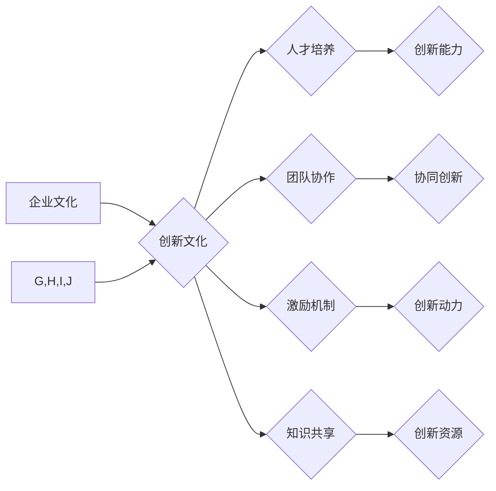

                 

## 创新文化建设：激发全员创新精神

> 关键词：创新文化、企业文化、技术创新、人才培养、团队协作、激励机制、知识共享

### 1. 背景介绍

在当今瞬息万变的科技时代，创新已成为企业持续发展的生命线。面对激烈的市场竞争和不断涌现的新技术，企业需要建立健全的创新文化，激发全员的创新精神，才能保持竞争优势，实现可持续发展。

传统企业文化往往强调稳定、规范和执行力，而创新文化则需要打破固有思维，鼓励尝试、鼓励失败，并从失败中吸取经验教训。建立创新文化并非易事，它需要企业从领导层到基层员工，共同努力，形成一种氛围，鼓励每个人都积极参与到创新活动中来。

### 2. 核心概念与联系

#### 2.1 创新文化

创新文化是指一种企业内部的价值观、理念、行为模式和组织结构，它鼓励和支持员工进行创新活动，并为创新活动提供必要的资源和支持。

#### 2.2 企业文化

企业文化是指企业在长期发展过程中形成的价值观、理念、行为规范、组织结构和管理模式等方面的整体特征。它影响着企业的经营管理、员工行为和企业形象。

#### 2.3 创新文化与企业文化的联系

创新文化是企业文化的组成部分，它与企业文化相互影响、相互促进。良好的企业文化可以为创新文化提供基础，而创新文化则可以丰富和完善企业文化，使其更加适应时代发展需求。

**Mermaid 流程图**



### 3. 核心算法原理 & 具体操作步骤

#### 3.1 算法原理概述

创新文化建设是一个复杂的过程，需要采用多种方法和手段，才能有效激发全员的创新精神。

#### 3.2 算法步骤详解

1. **领导层带头，树立创新导向：** 领导层要以身作则，树立创新榜样，并制定明确的创新战略和目标，将创新作为企业的核心价值观。

2. **建立健全的创新机制：** 企业要建立完善的创新激励机制，鼓励员工积极参与创新活动，并对创新成果给予充分的奖励和认可。

3. **营造开放包容的创新氛围：** 企业要鼓励员工敢于尝试、敢于失败，并为员工提供一个安全、舒适的创新环境，让他们能够自由地表达自己的想法和创意。

4. **加强人才培养，提升创新能力：** 企业要重视人才培养，通过培训、学习和交流等方式，提升员工的创新能力和素质。

5. **促进团队协作，激发协同创新：** 企业要鼓励团队协作，打破部门壁垒，促进不同部门之间的信息交流和资源共享，激发协同创新。

6. **加强知识共享，促进创新资源的流动：** 企业要建立健全的知识管理体系，促进知识共享，让员工能够及时获取最新的技术信息和创新成果。

#### 3.3 算法优缺点

**优点：**

* 能够有效激发全员的创新精神，提高企业的创新能力。
* 能够促进企业文化建设，形成积极向上的企业氛围。
* 能够增强企业的核心竞争力，实现可持续发展。

**缺点：**

* 建立创新文化需要时间和精力，需要企业付出持续的努力。
* 创新文化建设需要得到所有员工的参与和支持，否则难以取得成功。
* 创新文化建设需要不断调整和完善，以适应企业的不断发展变化。

#### 3.4 算法应用领域

创新文化建设适用于所有类型的企业，无论其规模大小、行业类型或发展阶段。

### 4. 数学模型和公式 & 详细讲解 & 举例说明

#### 4.1 数学模型构建

创新文化建设可以抽象为一个复杂系统，其核心要素包括：

* **领导力 (L)：** 领导层的创新导向和支持力度。
* **激励机制 (M)：** 对创新成果的奖励和认可机制。
* **团队协作 (T)：** 不同部门之间的信息交流和资源共享程度。
* **人才培养 (P)：** 员工的创新能力和素质。
* **知识共享 (K)：** 企业内部知识的流动和传播程度。

我们可以用以下公式来描述创新文化建设的整体效果：

$$
Innovation \ Effect (IE) = f(L, M, T, P, K)
$$

其中，$f$ 代表一个复杂的非线性函数，它反映了各个要素之间的相互作用关系。

#### 4.2 公式推导过程

由于创新文化建设是一个复杂系统，其内部关系非常复杂，难以用简单的数学公式精确描述。

但是，我们可以通过分析各个要素之间的影响关系，建立一些简化的数学模型，来理解创新文化建设的基本原理。

例如，我们可以假设领导力对创新效果的影响是线性的，激励机制对创新效果的影响是二次函数，团队协作、人才培养和知识共享对创新效果的影响是指数函数。

#### 4.3 案例分析与讲解

假设一家科技公司想要建立创新文化，它可以根据上述模型，制定相应的策略：

* **加强领导层的创新导向：** 领导层可以定期组织创新沙龙，鼓励员工提出创新想法，并对创新成果给予充分的奖励和认可。
* **建立完善的激励机制：** 公司可以设立创新奖金、股票期权等激励措施，鼓励员工积极参与创新活动。
* **促进团队协作：** 公司可以打破部门壁垒，鼓励不同部门之间的信息交流和资源共享，形成协同创新机制。
* **加强人才培养：** 公司可以为员工提供培训、学习和交流的机会，提升员工的创新能力和素质。
* **加强知识共享：** 公司可以建立内部知识库，鼓励员工分享自己的经验和知识，促进知识的流动和传播。

通过以上措施，这家科技公司可以有效地建立创新文化，激发全员的创新精神，实现企业的可持续发展。

### 5. 项目实践：代码实例和详细解释说明

#### 5.1 开发环境搭建

为了更好地理解创新文化建设的实践，我们可以通过一个简单的项目来进行演示。

假设我们要开发一个在线创新平台，帮助企业建立创新文化，激发员工的创新精神。

为了搭建开发环境，我们需要准备以下工具：

* **编程语言：** Python
* **框架：** Django
* **数据库：** MySQL
* **云服务器：** AWS

#### 5.2 源代码详细实现

以下是一个简单的在线创新平台的代码示例：

```python
# models.py
from django.db import models

class Idea(models.Model):
    title = models.CharField(max_length=200)
    description = models.TextField()
    author = models.ForeignKey(User, on_delete=models.CASCADE)
    created_at = models.DateTimeField(auto_now_add=True)

# views.py
from django.shortcuts import render, redirect
from .models import Idea

def idea_list(request):
    ideas = Idea.objects.all()
    return render(request, 'idea_list.html', {'ideas': ideas})

def idea_create(request):
    if request.method == 'POST':
        title = request.POST['title']
        description = request.POST['description']
        Idea.objects.create(title=title, description=description, author=request.user)
        return redirect('idea_list')
    return render(request, 'idea_create.html')
```

#### 5.3 代码解读与分析

这段代码实现了在线创新平台的基本功能：

* **models.py:** 定义了Idea模型，用于存储创新想法的信息。
* **views.py:** 定义了idea_list和idea_create两个视图函数，分别用于展示所有创新想法和创建新的创新想法。

#### 5.4 运行结果展示

运行上述代码后，我们可以访问在线创新平台，查看所有创新想法，并提交自己的创新想法。

### 6. 实际应用场景

#### 6.1 企业创新平台

在线创新平台可以帮助企业建立内部创新机制，收集员工的创新想法，并对创新成果进行评选和奖励。

#### 6.2 开放式创新平台

开放式创新平台可以连接企业、高校、科研机构等不同主体，促进资源共享和协同创新。

#### 6.3 社区创新平台

社区创新平台可以聚集志同道合的人，共同参与到创新活动中，促进社会创新发展。

#### 6.4 未来应用展望

随着人工智能、大数据等技术的不断发展，在线创新平台将更加智能化、个性化和协同化，能够更好地服务于企业和社会创新发展。

### 7. 工具和资源推荐

#### 7.1 学习资源推荐

* **书籍：**
    * 《创新者的窘境》
    * 《零到一》
    * 《颠覆创新》
* **网站：**
    * 创新者联盟
    * 创新中国
    * TED

#### 7.2 开发工具推荐

* **编程语言：** Python, Java, JavaScript
* **框架：** Django, Spring Boot, React
* **数据库：** MySQL, PostgreSQL, MongoDB
* **云服务器：** AWS, Azure, Google Cloud

#### 7.3 相关论文推荐

* **《创新文化建设的理论与实践》**
* **《企业创新文化建设的路径研究》**
* **《创新文化与企业绩效的关系研究》**

### 8. 总结：未来发展趋势与挑战

#### 8.1 研究成果总结

创新文化建设是一个复杂而重要的课题，它需要企业从多个方面进行努力，才能取得成功。

#### 8.2 未来发展趋势

未来，创新文化建设将更加注重以下几个方面：

* **个性化定制：** 创新文化建设需要根据企业的具体情况进行定制，不能一刀切。
* **数字化转型：** 随着数字化转型的深入，创新文化建设将更加注重数字化工具和技术的应用。
* **全球化视野：** 在全球化背景下，创新文化建设需要更加注重国际化视野和跨文化交流。

#### 8.3 面临的挑战

创新文化建设也面临着一些挑战：

* **文化差异：** 不同企业、不同部门、不同个体之间的文化差异，可能会阻碍创新文化的建设。
* **组织结构：** 传统的组织结构可能会阻碍创新，需要进行改革和创新。
* **人才短缺：** 创新文化建设需要人才支撑，而目前一些企业面临着创新人才短缺的问题。

#### 8.4 研究展望

未来，我们需要继续深入研究创新文化建设的理论和实践，探索更加有效的创新文化建设方法，帮助企业更好地激发全员的创新精神，实现可持续发展。

### 9. 附录：常见问题与解答

#### 9.1 如何建立创新文化？

建立创新文化是一个系统工程，需要企业从领导层到基层员工，共同努力。

#### 9.2 如何激励员工创新？

可以通过设立创新奖金、股票期权等激励措施，鼓励员工积极参与创新活动。

#### 9.3 如何促进团队协作？

可以通过打破部门壁垒，鼓励不同部门之间的信息交流和资源共享，形成协同创新机制。


作者：禅与计算机程序设计艺术 / Zen and the Art of Computer Programming 
<end_of_turn>

