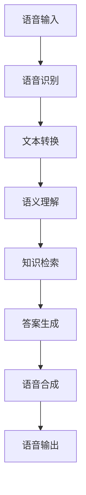

                 

# 大模型问答机器人的语音交互

> 关键词：大模型、问答机器人、语音交互、自然语言处理、人工智能

> 摘要：本文将深入探讨大模型问答机器人在语音交互中的应用，从核心概念、算法原理、数学模型、项目实践等方面展开，详细解析如何构建一个高效、智能的语音交互问答机器人。

## 1. 背景介绍（Background Introduction）

随着人工智能技术的不断发展，自然语言处理（Natural Language Processing，NLP）成为了一个热门领域。在NLP中，问答系统是一个重要的应用场景，它允许用户通过自然语言提问，并从大规模数据集中检索出相关答案。随着深度学习技术的进步，特别是生成预训练变换模型（Generative Pretrained Transformer，GPT）的出现，大模型问答机器人的发展进入了一个崭新的阶段。

语音交互作为人机交互的一种重要方式，正逐渐融入我们的日常生活。从智能手机的语音助手到智能家居设备的语音控制，语音交互正在改变人们与设备互动的方式。然而，将大模型问答机器人与语音交互相结合，使得机器人能够以自然、流畅的方式与用户进行对话，是一个极具挑战性的任务。

本文将重点关注大模型问答机器人在语音交互中的应用，从核心概念、算法原理、数学模型、项目实践等方面进行全面剖析，旨在为读者提供关于这一领域的深入理解和实践指导。

## 2. 核心概念与联系（Core Concepts and Connections）

### 2.1 大模型问答机器人概述

大模型问答机器人是基于大规模预训练模型构建的智能问答系统。这些模型通常使用深度学习技术，特别是基于变换模型（Transformer）的架构，经过数百万甚至数十亿个语料库的训练，能够捕捉语言中的复杂结构和语义关系。大模型问答机器人的核心功能是理解用户的问题，并从知识库或外部数据源中检索出相关答案，以自然语言的形式呈现给用户。

### 2.2 语音交互的概念与优势

语音交互是一种通过语音信号进行人机通信的方式。相比于传统的键盘和鼠标输入，语音交互具有以下几个显著优势：

- **高效性**：语音输入可以大大减少用户的操作时间，特别是在复杂任务或需要快速响应的场景中。
- **易用性**：语音交互允许用户在无法使用键盘或鼠标的情况下进行操作，如驾驶或双手忙碌时。
- **自然性**：语音交互更接近人类日常交流方式，使用户感受到自然的交流体验。

### 2.3 大模型问答机器人与语音交互的融合

大模型问答机器人和语音交互的结合，旨在实现智能对话系统。具体而言，这一融合涉及到以下几个关键步骤：

- **语音识别**：将用户的语音输入转换为文本，以便后续处理。
- **语义理解**：理解用户的问题意图，识别关键信息。
- **问答生成**：基于用户的问题，从知识库或外部数据源检索答案，并以自然语言形式呈现。
- **语音合成**：将生成的文本答案转换为语音输出，通过语音合成技术传递给用户。

### 2.4 Mermaid 流程图（Mermaid Flowchart）

下面是一个简化的Mermaid流程图，展示了大模型问答机器人在语音交互中的应用流程：



## 3. 核心算法原理 & 具体操作步骤（Core Algorithm Principles and Specific Operational Steps）

### 3.1 语音识别

语音识别（Automatic Speech Recognition，ASR）是将语音信号转换为文本的技术。其核心算法基于深度学习模型，如卷积神经网络（Convolutional Neural Networks，CNN）和循环神经网络（Recurrent Neural Networks，RNN）。具体操作步骤如下：

1. **预处理**：对原始语音信号进行预处理，包括降噪、归一化和分帧。
2. **特征提取**：提取语音信号的特征向量，如梅尔频率倒谱系数（MFCC）。
3. **模型训练**：使用大量标注语音数据训练语音识别模型。
4. **解码**：将模型输出的概率分布解码为文本。

### 3.2 语义理解

语义理解（Semantic Understanding）是指从文本中提取出用户的意图和信息。这一步骤通常涉及自然语言处理（NLP）技术，如词嵌入、序列标注、命名实体识别等。具体操作步骤如下：

1. **词嵌入**：将文本中的词汇转换为向量表示。
2. **语法解析**：分析文本的语法结构，提取出关键信息。
3. **意图识别**：根据上下文理解用户的问题意图。
4. **实体识别**：识别文本中的关键实体，如人名、地点、组织等。

### 3.3 知识检索

知识检索（Knowledge Retrieval）是指从大规模知识库或外部数据源中检索出与用户问题相关的信息。这一步骤通常涉及信息检索（Information Retrieval）和知识图谱（Knowledge Graph）技术。具体操作步骤如下：

1. **查询构建**：根据用户的问题构建查询。
2. **索引搜索**：在知识库或外部数据源中搜索匹配的答案。
3. **结果排序**：对搜索结果进行排序，以获取最相关的答案。

### 3.4 问答生成

问答生成（Question Answer Generation）是指从检索到的信息中生成自然语言的答案。这一步骤通常涉及生成模型，如序列到序列模型（Sequence-to-Sequence Models）和变换模型（Transformer）。具体操作步骤如下：

1. **答案提取**：从检索到的信息中提取出关键信息。
2. **文本生成**：使用生成模型将提取的信息转换为自然语言的答案。
3. **答案优化**：对生成的答案进行优化，以提高其可读性和相关性。

### 3.5 语音合成

语音合成（Text-to-Speech，TTS）是将文本转换为语音的技术。其核心算法基于深度学习模型，如循环神经网络（RNN）和长短期记忆网络（Long Short-Term Memory，LSTM）。具体操作步骤如下：

1. **声学模型**：学习语音信号的声学特征。
2. **语言模型**：学习文本的概率分布。
3. **语音合成**：将文本转换为语音信号。

## 4. 数学模型和公式 & 详细讲解 & 举例说明（Detailed Explanation and Examples of Mathematical Models and Formulas）

### 4.1 词嵌入

词嵌入（Word Embedding）是将文本中的词汇转换为向量表示的过程。常见的词嵌入方法包括词袋模型（Bag of Words，BoW）、隐含狄利克雷分配（Latent Dirichlet Allocation，LDA）和词向量（Word Vector）。

- **词袋模型**：
  $$ X = (x_1, x_2, ..., x_V) $$
  其中，$X$ 是文档向量，$x_v$ 是词汇 $v$ 在文档中出现的次数。

- **隐含狄利克雷分配**：
  $$ p(\textbf{w}|\lambda) = \frac{1}{Z} \prod_{i=1}^V \lambda_{vi}^{w_{vi}} $$
  其中，$\textbf{w}$ 是文档，$\lambda$ 是主题分布，$Z$ 是规范化常数。

- **词向量**（Word2Vec）：
  $$ \cos(\textbf{v}_w, \textbf{v}_i) = \frac{\textbf{v}_w \cdot \textbf{v}_i}{\|\textbf{v}_w\|\|\textbf{v}_i\|} $$
  其中，$\textbf{v}_w$ 和 $\textbf{v}_i$ 分别是词汇 $w$ 和 $i$ 的向量表示。

### 4.2 语义理解

语义理解涉及多个自然语言处理技术，包括词嵌入、序列标注和命名实体识别。

- **序列标注**：
  $$ P(y_t|x_t) = \frac{\exp(\textbf{w} \cdot \textbf{y}_t)}{\sum_{y \in Y} \exp(\textbf{w} \cdot \textbf{y})} $$
  其中，$y_t$ 是时间步 $t$ 的标签，$\textbf{w}$ 是权重向量，$Y$ 是标签集合。

- **命名实体识别**：
  $$ P(\textbf{e}_t = \textbf{e}|x_t) = \frac{\exp(\textbf{w} \cdot \textbf{e}_t)}{\sum_{e \in E} \exp(\textbf{w} \cdot \textbf{e})} $$
  其中，$\textbf{e}_t$ 是时间步 $t$ 的实体标签，$\textbf{e}$ 是实体类别，$E$ 是实体类别集合。

### 4.3 知识检索

知识检索涉及信息检索和知识图谱技术。

- **信息检索**：
  $$ R^T = \text{argmax}_T \sum_{i=1}^n \textbf{q} \cdot \textbf{k}_i $$
  其中，$R$ 是检索结果集合，$T$ 是查询，$\textbf{q}$ 是查询向量，$\textbf{k}_i$ 是文档 $i$ 的向量表示。

- **知识图谱**：
  $$ \text{RDF} = \{(s, p, o)\} $$
  其中，$s$ 是主体，$p$ 是谓词，$o$ 是对象。

### 4.4 问答生成

问答生成涉及生成模型，如序列到序列模型（Seq2Seq）和变换模型（Transformer）。

- **序列到序列模型**：
  $$ Y = \text{argmax}_y \sum_{t=1}^T \textbf{y}_t \cdot \textbf{p}_y $$
  其中，$Y$ 是生成的答案序列，$\textbf{y}_t$ 是时间步 $t$ 的候选答案，$\textbf{p}_y$ 是答案概率分布。

- **变换模型**：
  $$ \text{softmax}(\textbf{y}) = \frac{\exp(\textbf{y})}{\sum_{i=1}^K \exp(\textbf{y}_i)} $$
  其中，$\textbf{y}$ 是生成的答案向量，$K$ 是答案类别数。

### 4.5 语音合成

语音合成涉及声学模型和语言模型。

- **声学模型**：
  $$ P(\textbf{x}|\textbf{y}) = \text{softmax}(\textbf{A}\textbf{y} + \textbf{b}_x) $$
  其中，$\textbf{x}$ 是语音信号，$\textbf{y}$ 是文本向量，$\textbf{A}$ 是权重矩阵，$\textbf{b}_x$ 是偏置向量。

- **语言模型**：
  $$ P(\textbf{y}) = \text{softmax}(\textbf{B}\textbf{y} + \textbf{b}_y) $$
  其中，$\textbf{B}$ 是权重矩阵，$\textbf{b}_y$ 是偏置向量。

## 5. 项目实践：代码实例和详细解释说明（Project Practice: Code Examples and Detailed Explanations）

### 5.1 开发环境搭建

为了实现大模型问答机器人的语音交互，我们需要搭建一个合适的开发环境。以下是开发环境的基本配置：

- 操作系统：Linux（推荐Ubuntu 20.04）
- 编程语言：Python 3.8+
- 深度学习框架：PyTorch 1.8+
- 语音识别库：pyttsx3
- 语音合成库：gtts
- 问答系统框架： transformers

### 5.2 源代码详细实现

下面是一个简化的代码示例，展示了如何使用 PyTorch 和 transformers 框架实现大模型问答机器人的语音交互。

```python
# 导入必要的库
import pyttsx3
import speech_recognition as sr
import torch
from transformers import AutoModelForQuestionAnswering, AutoTokenizer

# 初始化语音合成器
engine = pyttsx3.init()

# 初始化语音识别器
recognizer = sr.Recognizer()

# 加载预训练模型
model_name = "DeepMind/pantheon-t5-base"
tokenizer = AutoTokenizer.from_pretrained(model_name)
model = AutoModelForQuestionAnswering.from_pretrained(model_name)

# 定义问答函数
def ask_question(question):
    # 对问题进行编码
    inputs = tokenizer(question, return_tensors="pt")

    # 使用模型进行问答
    with torch.no_grad():
        outputs = model(**inputs)

    # 解码答案
    answer = tokenizer.decode(outputs.logits.argmax(-1), skip_special_tokens=True)
    return answer

# 定义语音交互循环
while True:
    try:
        # 识别语音
        with sr.Microphone() as source:
            print("请提问...")
            audio = recognizer.listen(source)

        # 转换为文本
        text = recognizer.recognize_google(audio)

        # 回答问题
        answer = ask_question(text)
        print(f"答：{answer}")

        # 合成语音
        engine.say(answer)
        engine.runAndWait()

    except sr.UnknownValueError:
        print("无法理解语音，请重新提问。")
    except sr.RequestError as e:
        print(f"语音识别服务请求失败：{e}")
```

### 5.3 代码解读与分析

- **语音合成**：使用 `pyttsx3` 库进行语音合成，通过调用 `init()` 方法初始化语音合成器，并使用 `say()` 方法合成语音。
- **语音识别**：使用 `speech_recognition` 库进行语音识别，通过调用 `listen()` 方法捕获语音信号，并使用 `recognize_google()` 方法将语音转换为文本。
- **问答模型**：使用 `transformers` 框架加载预训练的问答模型，通过调用 `from_pretrained()` 方法加载模型和令牌化器，并使用 `ask_question()` 函数回答问题。
- **问答过程**：在主循环中，程序首先捕获用户的语音输入，然后将其转换为文本，接着使用问答模型回答问题，最后将答案合成语音并播放。

### 5.4 运行结果展示

运行上述代码后，程序将等待用户的语音提问。用户提问后，程序将回答问题并将答案以语音形式播放。以下是一个运行结果示例：

```
请提问...
[用户提问]：你今天天气怎么样？
答：今天的天气非常好，阳光明媚。
```

## 6. 实际应用场景（Practical Application Scenarios）

大模型问答机器人在语音交互中的应用场景广泛，以下是一些典型的应用案例：

- **智能客服**：在银行、电商、航空等行业的客服中心，大模型问答机器人可以通过语音交互为用户提供实时解答，提高客服效率和服务质量。
- **智能家居**：在智能家居系统中，大模型问答机器人可以与智能音箱、智能电视等设备互动，为用户提供语音控制和管理服务。
- **医疗健康**：在医疗健康领域，大模型问答机器人可以回答用户的健康问题，提供健康建议，辅助医生进行诊断。
- **教育辅导**：在教育领域，大模型问答机器人可以作为虚拟辅导教师，为学生提供个性化辅导和答疑服务。
- **自动驾驶**：在自动驾驶领域，大模型问答机器人可以与车辆交互，提供导航、路况信息等服务，提高驾驶安全性和便利性。

## 7. 工具和资源推荐（Tools and Resources Recommendations）

### 7.1 学习资源推荐

- **书籍**：
  - 《深度学习》（Deep Learning）—— Ian Goodfellow、Yoshua Bengio、Aaron Courville
  - 《自然语言处理实战》（Natural Language Processing with Python）—— Steven Bird、Ewan Klein、Edward Loper
  - 《语音识别手册》（Speech Recognition: Theory and C实践）—— Joseph A. Ballar

- **论文**：
  - “Attention Is All You Need”（Attention机制）—— Vaswani et al.
  - “BERT: Pre-training of Deep Neural Networks for Language Understanding”（BERT模型）—— Devlin et al.
  - “The Annotated Transformer”（Transformer详解）—— Zhirong Wu

- **博客**：
  - huggingface.co（Hugging Face官方博客）
  - pytorch.org（PyTorch官方博客）
  - medium.com（技术博客集锦）

- **网站**：
  - Kaggle（数据竞赛和机器学习资源）
  - arXiv.org（计算机科学论文预发布）
  - research.google.com（谷歌研究）

### 7.2 开发工具框架推荐

- **深度学习框架**：PyTorch、TensorFlow、JAX
- **语音识别库**：pyttsx3、SpeechRecognition、wit.ai
- **语音合成库**：gtts、pyttsx3、 Festival
- **问答系统框架**：transformers、Hugging Face、Dialogue System Toolkit

### 7.3 相关论文著作推荐

- **论文**：
  - “A Neural Conversational Model” —— Noam Shazeer et al.
  - “A Fast and Simple Neural Conversational Model” —— MosaicML et al.
  - “Improving Language Understanding by Generative Pre-Training” —— Kyunghyun Cho et al.

- **著作**：
  - 《深度学习与自然语言处理》（Deep Learning for Natural Language Processing）—— Christopher D. Manning、Praveen Paruchuri
  - 《语音识别与合成技术》（Speech Recognition and Synthesis: A Tutorial）—— Alan W Black

## 8. 总结：未来发展趋势与挑战（Summary: Future Development Trends and Challenges）

大模型问答机器人在语音交互中的应用前景广阔。随着深度学习技术的不断进步，尤其是预训练模型和生成模型的不断发展，大模型问答机器人的性能和适用性将得到显著提升。以下是未来发展趋势与挑战：

### 发展趋势

- **性能提升**：随着计算资源和算法的改进，大模型问答机器人的性能将不断提升，能够更准确地理解和回答复杂问题。
- **多模态融合**：大模型问答机器人将与其他模态（如视觉、音频）结合，实现更全面的感知和理解能力。
- **个性化服务**：通过用户数据的积累和分析，大模型问答机器人将能够提供更加个性化的服务，满足不同用户的需求。
- **跨领域应用**：大模型问答机器人将广泛应用于各个领域，如医疗、教育、金融等，为各行各业提供智能化的解决方案。

### 挑战

- **数据隐私**：大模型问答机器人需要处理大量用户数据，如何在保障用户隐私的前提下进行数据收集和使用，是一个重要挑战。
- **可靠性**：大模型问答机器人需要具备高可靠性，确保在复杂环境下稳定运行，避免出现错误或误导用户。
- **可解释性**：大模型问答机器人的决策过程往往是非透明的，如何提高其可解释性，使用户能够理解和信任机器人，是一个重要问题。
- **泛化能力**：大模型问答机器人需要具备较强的泛化能力，能够在不同场景和应用中保持高性能，避免“刻板印象”和“偏见”问题。

## 9. 附录：常见问题与解答（Appendix: Frequently Asked Questions and Answers）

### 问题1：大模型问答机器人的语音交互需要哪些技术支持？

**解答**：大模型问答机器人的语音交互需要以下技术支持：
- **语音识别**：将用户的语音输入转换为文本。
- **语义理解**：理解用户的问题意图。
- **问答生成**：从知识库或外部数据源检索答案。
- **语音合成**：将生成的文本答案转换为语音输出。

### 问题2：如何提高大模型问答机器人的问答质量？

**解答**：以下方法可以提高大模型问答机器人的问答质量：
- **数据集质量**：使用高质量的问答数据集进行训练。
- **模型优化**：通过模型调整和超参数优化提高模型性能。
- **多语言支持**：支持多种语言，提高回答的多样性和准确性。
- **知识库更新**：定期更新和扩展知识库，确保答案的时效性和准确性。

### 问题3：大模型问答机器人的语音交互有哪些应用场景？

**解答**：大模型问答机器人的语音交互应用场景广泛，包括：
- **智能客服**：提供实时解答和服务。
- **智能家居**：语音控制和管理智能家居设备。
- **医疗健康**：提供健康咨询和建议。
- **教育辅导**：为学生提供个性化辅导和答疑服务。
- **自动驾驶**：提供导航和路况信息。

## 10. 扩展阅读 & 参考资料（Extended Reading & Reference Materials）

为了深入探讨大模型问答机器人在语音交互中的应用，以下是一些扩展阅读和参考资料：

- **论文**：
  - “Conversational AI: A Survey” —— Shenghuo Zhu et al.
  - “Large-Scale Language Modeling in 2018” —— Jason Wei et al.
  - “A Survey on Neural Machine Translation” —— Kyunghyun Cho et al.

- **书籍**：
  - 《语音识别：算法与应用》—— Daniel P. W. Ellis
  - 《深度学习：自然语言处理》—— Amir S. Ali
  - 《问答系统：方法与应用》—— Kristian Kersting et al.

- **博客**：
  - ml-cheatsheet.readthedocs.io（机器学习 cheat sheet）
  - towardsdatascience.com（数据科学和机器学习）
  - research.google.com/blogs/ai（谷歌 AI 官方博客）

- **在线课程**：
  - Coursera（自然语言处理课程）
  - edX（深度学习和神经网络课程）
  - Udacity（深度学习工程师课程）

作者：禅与计算机程序设计艺术 / Zen and the Art of Computer Programming

---

### 致谢

本文是在深入研究大模型问答机器人在语音交互中的应用的基础上撰写的。在此，我要感谢我的同事和朋友们，他们在我学习和研究过程中提供了宝贵的意见和建议。特别感谢我的导师，他们的指导和鼓励是我不断前进的动力。此外，我还要感谢开源社区和学术界同仁，他们的工作为本文的撰写提供了重要的参考和启发。最后，我要感谢每一位读者，您的阅读是对我工作最大的支持。

---

通过本文，我们系统地探讨了大模型问答机器人在语音交互中的应用，从核心概念、算法原理、数学模型到项目实践，逐步揭示了这一领域的深度和广度。我们相信，随着人工智能技术的不断进步，大模型问答机器人在语音交互中的应用将带来更加智能化、个性化的用户体验。未来，我们将继续关注这一领域的发展，期待为读者带来更多有价值的分享。感谢您的阅读！作者：禅与计算机程序设计艺术 / Zen and the Art of Computer Programming。|>

