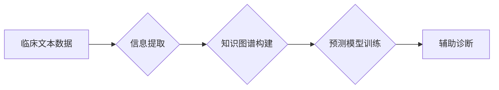

                 

## 医疗诊断中的自然语言处理应用

> 关键词：自然语言处理，医疗诊断，机器学习，深度学习，临床文本，知识图谱，医疗信息提取，预测模型

## 1. 背景介绍

医疗诊断是临床实践的核心环节，准确的诊断是治疗方案成功的基石。传统的医疗诊断主要依赖于医生的经验和临床表现的观察，然而，随着医疗数据的爆炸式增长和复杂性增加，传统的诊断方法面临着挑战。自然语言处理（NLP）技术作为人工智能领域的重要分支，在医疗诊断领域展现出巨大的潜力。

NLP技术能够理解、分析和处理人类语言，包括文本和语音。在医疗领域，NLP可以用于处理海量临床文本数据，例如病历、手术记录、影像报告等，从中提取关键信息，辅助医生进行诊断。

## 2. 核心概念与联系

### 2.1 自然语言处理（NLP）

NLP是计算机科学的一个分支，致力于使计算机能够理解、解释和生成人类语言。它涉及到许多子领域，例如：

* **文本分析：** 分析文本结构、语义和情感。
* **机器翻译：** 将一种语言翻译成另一种语言。
* **语音识别：** 将语音转换为文本。
* **对话系统：** 与人类进行自然语言对话。

### 2.2 医疗诊断

医疗诊断是指根据患者的症状、体征、病史和检查结果，确定患者所患的疾病的过程。

### 2.3 NLP在医疗诊断中的应用

NLP技术可以应用于医疗诊断的各个环节，例如：

* **临床文本信息提取：** 从病历、手术记录等文本中提取患者的症状、诊断、治疗方案等关键信息。
* **疾病知识图谱构建：** 建立疾病、症状、治疗方案等之间的知识关系图谱，辅助医生进行诊断推理。
* **预测模型构建：** 利用机器学习算法，从历史患者数据中学习，预测患者患病风险或疾病类型。

**NLP在医疗诊断中的应用流程图：**



## 3. 核心算法原理 & 具体操作步骤

### 3.1  算法原理概述

在医疗诊断中，常用的NLP算法包括：

* **机器学习算法：** 

例如支持向量机（SVM）、决策树、随机森林等，可以用于疾病分类、风险预测等任务。

* **深度学习算法：** 

例如循环神经网络（RNN）、长短期记忆网络（LSTM）、Transformer等，可以用于处理长文本序列，例如病历摘要，并进行更精细的诊断分析。

### 3.2  算法步骤详解

以疾病分类为例，使用机器学习算法进行医疗诊断的步骤如下：

1. **数据收集和预处理：** 收集大量病历数据，并进行清洗、标注和格式化处理。
2. **特征提取：** 从病历文本中提取特征，例如症状、体征、诊断等，可以使用词袋模型、TF-IDF等方法。
3. **模型训练：** 使用机器学习算法，例如SVM，对提取的特征进行训练，建立疾病分类模型。
4. **模型评估：** 使用测试数据评估模型的性能，例如准确率、召回率、F1-score等。
5. **模型部署：** 将训练好的模型部署到实际应用环境中，用于辅助医生进行疾病分类。

### 3.3  算法优缺点

**机器学习算法：**

* **优点：** 能够从数据中学习，并进行准确的预测。
* **缺点：** 需要大量的训练数据，对数据质量要求高，难以解释模型的决策过程。

**深度学习算法：**

* **优点：** 可以处理更复杂的文本数据，并获得更准确的预测结果。
* **缺点：** 需要更多的计算资源和训练时间，模型参数较多，难以解释模型的决策过程。

### 3.4  算法应用领域

* **疾病诊断：** 辅助医生诊断各种疾病，例如癌症、心血管疾病等。
* **风险预测：** 预测患者患病风险，例如糖尿病、心血管疾病等。
* **个性化治疗：** 根据患者的基因信息和病史，制定个性化的治疗方案。

## 4. 数学模型和公式 & 详细讲解 & 举例说明

### 4.1  数学模型构建

在医疗诊断中，可以使用概率模型来表示疾病的诊断结果。例如，可以使用贝叶斯定理来计算患者患某疾病的概率，根据患者的症状、体征、病史等信息。

**贝叶斯定理：**

$$P(A|B) = \frac{P(B|A)P(A)}{P(B)}$$

其中：

* $P(A|B)$ 是在已知事件 B 发生的情况下，事件 A 发生的概率。
* $P(B|A)$ 是在已知事件 A 发生的情况下，事件 B 发生的概率。
* $P(A)$ 是事件 A 发生的概率。
* $P(B)$ 是事件 B 发生的概率。

### 4.2  公式推导过程

假设我们想要预测患者患有某种疾病的概率，我们可以使用贝叶斯定理。

* $A$：患者患有疾病。
* $B$：患者表现出某种症状。

根据贝叶斯定理，我们可以计算患者患有疾病的概率，即 $P(A|B)$。

$$P(A|B) = \frac{P(B|A)P(A)}{P(B)}$$

其中：

* $P(B|A)$ 是患者表现出某种症状的概率，假设已知患者患有疾病。
* $P(A)$ 是患者患有疾病的先验概率。
* $P(B)$ 是患者表现出某种症状的概率，无论是否患有疾病。

### 4.3  案例分析与讲解

例如，假设某疾病的先验概率为 1%，表现出某种症状的概率为 90%，已知患者患有该疾病的情况下，表现出该症状的概率为 100%。

那么，根据贝叶斯定理，我们可以计算患者表现出该症状的概率患有该疾病为：

$$P(A|B) = \frac{1 * 0.01}{0.9} = 0.0111$$

即，患者表现出该症状的概率患有该疾病为 1.11%。

## 5. 项目实践：代码实例和详细解释说明

### 5.1  开发环境搭建

* **操作系统：** Ubuntu 20.04
* **编程语言：** Python 3.8
* **深度学习框架：** TensorFlow 2.0
* **其他依赖库：** NLTK, spaCy, scikit-learn

### 5.2  源代码详细实现

```python
import tensorflow as tf
from tensorflow.keras.models import Sequential
from tensorflow.keras.layers import Embedding, LSTM, Dense

# 数据预处理
# ...

# 模型构建
model = Sequential()
model.add(Embedding(input_dim=vocab_size, output_dim=embedding_dim, input_length=max_length))
model.add(LSTM(units=128))
model.add(Dense(units=num_classes, activation='softmax'))

# 模型编译
model.compile(optimizer='adam', loss='sparse_categorical_crossentropy', metrics=['accuracy'])

# 模型训练
model.fit(x_train, y_train, epochs=10, batch_size=32)

# 模型评估
loss, accuracy = model.evaluate(x_test, y_test)
print('Test Loss:', loss)
print('Test Accuracy:', accuracy)
```

### 5.3  代码解读与分析

* **数据预处理：** 将文本数据转换为数字格式，例如使用词袋模型或Word2Vec进行词嵌入。
* **模型构建：** 使用深度学习框架构建一个LSTM模型，用于处理文本序列数据。
* **模型编译：** 使用Adam优化器、交叉熵损失函数和准确率指标进行模型编译。
* **模型训练：** 使用训练数据训练模型，并设置训练轮数和批处理大小。
* **模型评估：** 使用测试数据评估模型的性能，并打印测试损失和准确率。

### 5.4  运行结果展示

训练完成后，可以将模型部署到实际应用环境中，例如使用API接口提供诊断服务。

## 6. 实际应用场景

### 6.1  疾病分类

NLP技术可以用于辅助医生诊断各种疾病，例如癌症、心血管疾病等。

### 6.2  风险预测

NLP技术可以用于预测患者患病风险，例如糖尿病、心血管疾病等。

### 6.3  个性化治疗

NLP技术可以根据患者的基因信息和病史，制定个性化的治疗方案。

### 6.4  未来应用展望

* **更精准的诊断：** 利用更先进的NLP算法和更大的数据规模，实现更精准的疾病诊断。
* **早期预警：** 通过分析患者的日常语言记录，例如社交媒体帖子、电子邮件等，进行疾病的早期预警。
* **远程医疗：** 利用NLP技术，实现远程医疗诊断和咨询服务。

## 7. 工具和资源推荐

### 7.1  学习资源推荐

* **Stanford NLP Group:** https://nlp.stanford.edu/
* **Hugging Face:** https://huggingface.co/
* **ACL Anthology:** https://aclanthology.org/

### 7.2  开发工具推荐

* **spaCy:** https://spacy.io/
* **NLTK:** https://www.nltk.org/
* **Gensim:** https://radimrehurek.com/gensim/

### 7.3  相关论文推荐

* **Attention Is All You Need:** https://arxiv.org/abs/1706.03762
* **BERT: Pre-training of Deep Bidirectional Transformers for Language Understanding:** https://arxiv.org/abs/1810.04805

## 8. 总结：未来发展趋势与挑战

### 8.1  研究成果总结

NLP技术在医疗诊断领域取得了显著的进展，能够辅助医生进行更精准的诊断、更有效的风险预测和更个性化的治疗方案。

### 8.2  未来发展趋势

* **更强大的模型：** 开发更强大的NLP模型，例如Transformer变体，能够处理更复杂的医疗文本数据。
* **多模态融合：** 将NLP技术与其他模态数据，例如影像数据、基因数据等进行融合，实现更全面的医疗诊断。
* **解释性模型：** 开发更具解释性的NLP模型，能够解释模型的决策过程，提高医生对模型结果的信任度。

### 8.3  面临的挑战

* **数据隐私和安全：** 医疗数据具有高度敏感性，需要采取有效的措施保护患者隐私和数据安全。
* **模型可解释性：** 许多深度学习模型难以解释其决策过程，这可能会阻碍医生对模型结果的信任和接受。
* **伦理问题：** NLP技术在医疗诊断中的应用可能会引发一些伦理问题，例如算法偏见、责任归属等，需要进行深入的探讨和研究。

### 8.4  研究展望

未来，NLP技术将在医疗诊断领域发挥越来越重要的作用，为患者提供更精准、更有效的医疗服务。


## 9. 附录：常见问题与解答

* **Q1：NLP技术在医疗诊断中的应用有哪些？**

**A1：** NLP技术在医疗诊断中的应用包括疾病分类、风险预测、个性化治疗等。

* **Q2：NLP技术在医疗诊断中有哪些挑战？**

**A2：** 医疗诊断中的NLP技术面临着数据隐私和安全、模型可解释性和伦理问题等挑战。

* **Q3：如何评估NLP模型在医疗诊断中的性能？**

**A3：** 可以使用准确率、召回率、F1-score等指标评估NLP模型在医疗诊断中的性能。

作者：禅与计算机程序设计艺术 / Zen and the Art of Computer Programming


<end_of_turn>

