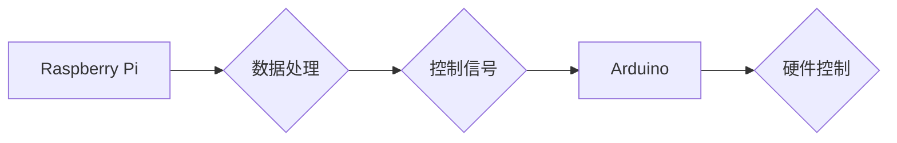

                 

## 单板计算机项目灵感：Raspberry Pi 和 Arduino 的应用场景

> 关键词：单板计算机、Raspberry Pi、Arduino、嵌入式系统、物联网、开源硬件、项目灵感

## 1. 背景介绍

单板计算机（Single Board Computer，SBC）近年来发展迅速，凭借其低成本、高性能和开源特性，在教育、研究、工业和消费领域获得了广泛应用。其中，Raspberry Pi 和 Arduino 是两款最为流行的单板计算机平台。

Raspberry Pi 是一款基于 ARM 处理器的微型计算机，拥有丰富的接口和强大的计算能力，能够运行完整的 Linux 操作系统，支持各种软件应用。Arduino 则是一款基于 AVR 微控制器平台的开源硬件，以其易于使用和丰富的扩展模块而闻名，主要用于控制硬件设备和构建嵌入式系统。

这两款单板计算机平台各自拥有独特的优势，也为开发者提供了丰富的应用场景。本文将深入探讨 Raspberry Pi 和 Arduino 的核心概念、应用原理、项目实践以及实际应用场景，为读者提供丰富的项目灵感和开发指南。

## 2. 核心概念与联系

### 2.1 Raspberry Pi

Raspberry Pi 是一款基于 ARM 处理器的微型计算机，其核心部件包括：

* **处理器:**  Raspberry Pi 采用 Broadcom 制造的 ARM 处理器，性能强大，能够运行完整的 Linux 操作系统。
* **内存:**  Raspberry Pi 提供多种内存配置，从 512MB 到 8GB不等，满足不同应用需求。
* **存储:**  Raspberry Pi 支持 SD 卡存储，也可以通过 USB 接口连接外部硬盘或固态硬盘。
* **接口:**  Raspberry Pi 拥有丰富的接口，包括 GPIO、USB、HDMI、Ethernet 和 Wi-Fi 等，方便连接各种硬件设备和网络。

### 2.2 Arduino

Arduino 是一款基于 AVR 微控制器的开源硬件平台，其核心部件包括：

* **微控制器:**  Arduino 使用 Atmel 制造的 AVR 微控制器，具有较低的功耗和成本，适合小型嵌入式系统应用。
* **编程语言:**  Arduino 使用基于 C/C++ 的简易编程语言，易于学习和使用。
* **扩展模块:**  Arduino 拥有丰富的扩展模块，包括传感器、电机驱动、通信模块等，可以扩展其功能和应用场景。

### 2.3 联系

Raspberry Pi 和 Arduino 虽然在硬件架构和应用场景上有所不同，但它们都属于开源硬件平台，拥有强大的社区支持和丰富的开发资源。

* **互补性:**  Raspberry Pi 拥有强大的计算能力和丰富的软件生态，而 Arduino 则擅长控制硬件设备和构建嵌入式系统。两者可以相互配合，实现更复杂的应用场景。
* **协同工作:**  可以通过串口、I2C 或 SPI 等通信协议，将 Raspberry Pi 和 Arduino 连接起来，实现数据交换和协同工作。

**Mermaid 流程图**



## 3. 核心算法原理 & 具体操作步骤

### 3.1 算法原理概述

单板计算机项目通常涉及到各种算法，例如数据处理、图像识别、控制算法等。这些算法的原理和实现方式取决于具体的应用场景。

* **数据处理算法:**  用于处理传感器数据、图像数据或其他类型的数据，例如滤波、平均值计算、傅里叶变换等。
* **图像识别算法:**  用于识别图像中的物体或特征，例如卷积神经网络、支持向量机等。
* **控制算法:**  用于控制硬件设备的运动或状态，例如PID 控制、状态机等。

### 3.2 算法步骤详解

具体的算法步骤需要根据应用场景进行设计和实现。以下是一个简单的例子，演示如何使用 PID 控制算法控制电机转速。

1. **设定目标值:**  确定电机需要达到的转速。
2. **获取实际值:**  通过传感器读取电机当前的转速。
3. **计算误差:**  将目标值与实际值进行比较，得到误差值。
4. **根据误差值调整控制量:**  使用 PID 控制算法，根据误差值、比例系数、积分系数和微分系数计算出控制量，用于调整电机驱动信号。
5. **重复步骤 2-4:**  持续获取实际值、计算误差值和调整控制量，直到电机转速达到目标值。

### 3.3 算法优缺点

不同的算法具有不同的优缺点，需要根据具体的应用场景进行选择。

* **PID 控制算法:**  简单易实现，能够有效控制系统的稳定性和精度，但对参数的调整较为敏感。
* **状态机:**  能够处理复杂的逻辑控制，但实现起来较为复杂。
* **卷积神经网络:**  能够实现高精度的图像识别，但需要大量的训练数据和计算资源。

### 3.4 算法应用领域

单板计算机项目中的算法应用领域非常广泛，包括：

* **物联网:**  传感器数据采集、处理和分析、设备控制和远程监控。
* **机器人:**  运动控制、路径规划、视觉识别和决策。
* **自动化:**  工业自动化、家居自动化、农业自动化等。
* **娱乐:**  游戏开发、音乐制作、视频处理等。

## 4. 数学模型和公式 & 详细讲解 & 举例说明

### 4.1 数学模型构建

单板计算机项目中，数学模型可以用于描述系统行为、预测输出结果或优化算法参数。例如，在控制算法中，可以使用数学模型来描述电机转速与驱动信号之间的关系。

### 4.2 公式推导过程

具体的数学模型和公式需要根据应用场景进行设计和推导。以下是一个简单的例子，演示如何使用 PID 控制算法推导控制量公式。

假设电机转速的动态模型为：

$$
\dot{w} = \frac{1}{J} (u - T_l)
$$

其中：

* $w$ 是电机转速
* $u$ 是驱动信号
* $J$ 是电机转动惯量
* $T_l$ 是负载转矩

PID 控制算法的目标是使电机转速 $w$ 跟踪目标值 $w_d$。PID 控制器的输出信号 $u$ 可以表示为：

$$
u = K_p e + K_i \int e dt + K_d \frac{de}{dt}
$$

其中：

* $K_p$ 是比例系数
* $K_i$ 是积分系数
* $K_d$ 是微分系数
* $e$ 是误差值，即 $e = w_d - w$

### 4.3 案例分析与讲解

通过将电机转速动态模型和 PID 控制算法公式结合起来，可以得到完整的控制算法。通过调整比例系数、积分系数和微分系数，可以优化控制算法的性能，例如提高稳定性和精度。

## 5. 项目实践：代码实例和详细解释说明

### 5.1 开发环境搭建

* **Raspberry Pi:**  下载和安装 Raspbian 操作系统，配置网络连接和 SSH 访问。
* **Arduino:**  安装 Arduino IDE 软件，选择相应的 Arduino 板型。

### 5.2 源代码详细实现

以下是一个简单的例子，演示如何使用 Raspberry Pi 和 Arduino 控制 LED 灯的闪烁。

**Raspberry Pi 代码 (Python):**

```python
import RPi.GPIO as GPIO
import time

GPIO.setmode(GPIO.BCM)
GPIO.setup(17, GPIO.OUT)

while True:
    GPIO.output(17, GPIO.HIGH)
    time.sleep(1)
    GPIO.output(17, GPIO.LOW)
    time.sleep(1)
```

**Arduino 代码:**

```cpp
const int ledPin = 13;

void setup() {
  pinMode(ledPin, OUTPUT);
}

void loop() {
  digitalWrite(ledPin, HIGH);
  delay(1000);
  digitalWrite(ledPin, LOW);
  delay(1000);
}
```

**代码解读与分析:**

* **Raspberry Pi 代码:**  使用 RPi.GPIO 库控制 GPIO 端口 17，将其设置为输出模式。循环控制 GPIO 端口 17 的高低电平，实现 LED 灯的闪烁。
* **Arduino 代码:**  使用 `pinMode()` 函数将 LED 灯连接的引脚设置为输出模式。使用 `digitalWrite()` 函数控制 LED 灯的亮灭状态，实现 LED 灯的闪烁。

### 5.3 运行结果展示

运行上述代码后，Raspberry Pi 会通过串口发送控制信号给 Arduino，Arduino 会根据控制信号控制 LED 灯的闪烁。

## 6. 实际应用场景

### 6.1 智能家居

* **灯光控制:**  使用 Raspberry Pi 和 Arduino 控制家居灯光，实现定时开关、场景切换和语音控制。
* **温度控制:**  使用传感器和控制模块，实现智能恒温控制，自动调节室内温度。
* **安防监控:**  使用摄像头和运动传感器，实现家居安全监控，报警提醒。

### 6.2 工业自动化

* **设备监控:**  使用传感器采集设备运行数据，实时监控设备状态，预警故障。
* **过程控制:**  使用 PID 控制算法控制工业设备的运行参数，实现自动化生产。
* **机器人控制:**  使用 Raspberry Pi 和 Arduino 控制工业机器人，实现自动化操作。

### 6.3 教育与研究

* **嵌入式系统学习:**  使用 Arduino 学习嵌入式系统编程和硬件接口。
* **物联网实验:**  使用 Raspberry Pi 和 Arduino 搭建物联网实验平台，学习数据采集、处理和传输。
* **人工智能研究:**  使用 Raspberry Pi 和深度学习框架，进行小型人工智能模型的训练和测试。

### 6.4 其他应用场景

* **医疗设备:**  使用单板计算机开发便携式医疗设备，例如血糖仪、血压计等。
* **农业科技:**  使用传感器和控制模块，实现智能农业，例如精准灌溉、病虫害监测等。
* **艺术创作:**  使用单板计算机控制灯光、音响和机械装置，创作互动式艺术作品。

### 6.5 未来应用展望

随着单板计算机技术的不断发展，其应用场景将更加广泛和深入。例如：

* **边缘计算:**  将计算任务部署到靠近数据源的边缘设备，实现更快速、更低延迟的数据处理。
* **人工智能芯片:**  开发专门用于人工智能计算的单板计算机芯片，提高人工智能应用的效率和性能。
* **可穿戴设备:**  使用单板计算机开发更智能、更功能丰富的可穿戴设备，例如智能手表、智能眼镜等。

## 7. 工具和资源推荐

### 7.1 学习资源推荐

* **Raspberry Pi 官方网站:**  https://www.raspberrypi.org/
* **Arduino 官方网站:**  https://www.arduino.cc/
* **电子工程学习网站:**  https://www.instructables.com/
* **开源硬件社区:**  https://hackaday.com/

### 7.2 开发工具推荐

* **Python:**  https://www.python.org/
* **C/C++:**  https://www.cplusplus.com/
* **Arduino IDE:**  https://www.arduino.cc/en/software
* **Visual Studio Code:**  https://code.visualstudio.com/

### 7.3 相关论文推荐

* **Raspberry Pi for Embedded Systems Development:**  https://ieeexplore.ieee.org/document/7609463
* **Arduino: A Platform for Educational Robotics:**  https://ieeexplore.ieee.org/document/7107137

## 8. 总结：未来发展趋势与挑战

### 8.1 研究成果总结

单板计算机技术发展迅速，为教育、研究、工业和消费领域带来了革命性的变化。Raspberry Pi 和 Arduino 作为两款最受欢迎的单板计算机平台，为开发者提供了丰富的应用场景和开发资源。

### 8.2 未来发展趋势

* **更强大的计算能力:**  单板计算机的处理器性能将不断提升，能够运行更复杂的软件应用。
* **更丰富的功能模块:**  单板计算机将集成更多功能模块，例如传感器、通信模块、人工智能芯片等，实现更强大的功能。
* **更易于使用的开发环境:**  单板计算机的开发环境将更加友好和易用，吸引更多开发者参与开发。

### 8.3 面临的挑战

* **开源生态的维护:**  需要持续维护和完善开源硬件和软件生态，确保其稳定性和安全性。
* **技术标准的统一:**  需要推动单板计算机技术的标准化，方便开发者进行跨平台开发。
* **成本控制:**  需要不断降低单板计算机的成本，使其更普及。

### 8.4 研究展望

未来，单板计算机技术将继续发展，应用场景将更加广泛和深入。研究者需要关注以下几个方面：

* **边缘计算:**  开发更强大的边缘计算平台，实现更智能、更高效的数据处理。
* **人工智能:**  将人工智能技术应用到单板计算机平台，开发更智能的应用。
* **安全性和隐私:**  加强单板计算机的安全性和隐私保护，确保其安全可靠的使用。


## 9. 附录：常见问题与解答

### 9.1 如何选择合适的单板计算机平台？

选择合适的单板计算机平台需要根据具体的应用场景和需求进行考虑。

* **Raspberry Pi:**  适合需要强大计算能力和丰富的软件生态的应用场景。
* **Arduino:**  适合需要控制硬件设备和构建嵌入式系统的应用场景。

### 9.2 如何连接 Raspberry Pi 和 Arduino？

可以使用串口、I2C 或 SPI 等通信协议连接 Raspberry Pi 和 Arduino。

### 9.3 如何编写单板计算机程序？

需要根据具体的单板计算机平台和编程语言进行学习和实践。

* **Raspberry Pi:**  可以使用 Python、C/C++ 等编程语言编写程序。
* **Arduino:**  可以使用 Arduino IDE 和 C/C++ 语言编写程序。


作者：禅与计算机程序设计艺术 / Zen and the Art of Computer Programming 
<end_of_turn>

