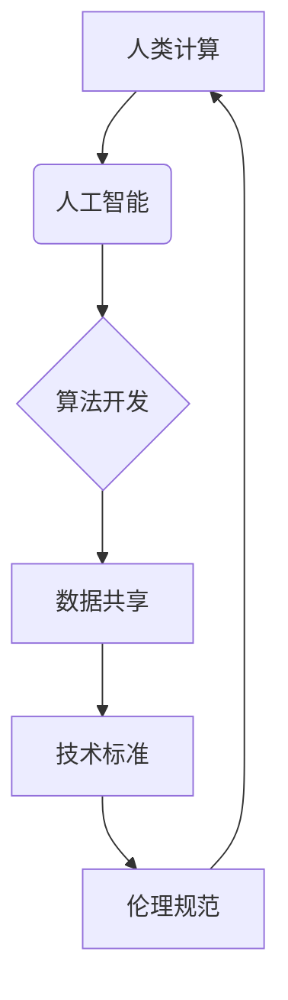

                 

## 国际合作：共同塑造人类计算的未来

> 关键词：人工智能、国际合作、计算模型、算法发展、技术标准、数据共享、伦理规范、未来趋势

### 1. 背景介绍

人类计算正处于一个前所未有的发展阶段。人工智能（AI）技术的飞速进步，特别是深度学习的突破，为我们带来了前所未有的机遇和挑战。从自动驾驶到医疗诊断，从个性化教育到科学发现，AI正在深刻地改变着我们的生活和工作方式。然而，AI技术的快速发展也引发了诸多伦理、安全和社会影响等问题，需要全球范围内的共同努力来解决。

国际合作在推动人类计算发展中扮演着至关重要的角色。不同国家和地区的科研机构、企业和政府拥有各自独特的优势和资源，通过合作可以汇聚智慧，共享知识，加速技术进步。同时，国际合作也可以帮助我们共同应对AI技术带来的挑战，确保其安全、可控和可持续发展。

### 2. 核心概念与联系

**2.1 核心概念**

* **人类计算:** 指人类与计算机协同工作，共同完成复杂任务的计算模式。它强调人机之间的交互和协作，旨在发挥人类的创造力和智能，以及计算机的计算能力和数据处理能力的优势。
* **人工智能 (AI):** 指使计算机模拟人类智能行为的能力。AI技术涵盖了多个领域，包括机器学习、深度学习、自然语言处理、计算机视觉等。
* **国际合作:** 指不同国家和地区之间在政治、经济、文化等领域进行合作。在人类计算领域，国际合作是指不同国家和地区的科研机构、企业和政府之间进行合作，共同推动AI技术的发展和应用。

**2.2 核心概念联系**



**2.3 核心概念原理和架构**

人类计算的核心在于人机协作，通过将人类的智慧和计算机的计算能力相结合，实现超越单一智能的协同效应。

* **数据共享:** 国际合作的关键在于数据共享。不同国家和地区的科研机构和企业拥有大量的数据资源，通过共享这些数据可以为AI算法的训练和开发提供更丰富的素材，从而加速技术进步。
* **技术标准:** 为了确保不同国家和地区的AI技术能够互操作，需要制定统一的技术标准。国际合作可以帮助我们共同制定这些标准，促进全球AI技术的融合发展。
* **伦理规范:** AI技术的快速发展也引发了诸多伦理问题，例如算法偏见、数据隐私等。国际合作可以帮助我们共同制定伦理规范，确保AI技术的发展符合人类的价值观和利益。

### 3. 核心算法原理 & 具体操作步骤

**3.1 算法原理概述**

深度学习是目前人工智能领域最热门的算法之一。它通过模拟人类大脑的神经网络结构，学习数据中的复杂模式和关系。深度学习算法可以应用于各种任务，例如图像识别、语音识别、自然语言处理等。

**3.2 算法步骤详解**

1. **数据预处理:** 将原始数据转换为深度学习算法可以理解的格式。
2. **网络结构设计:** 根据具体任务设计神经网络的结构，包括层数、节点数、激活函数等。
3. **参数初始化:** 为神经网络中的参数赋予初始值。
4. **前向传播:** 将输入数据通过神经网络传递，得到输出结果。
5. **反向传播:** 计算输出结果与真实值的误差，并根据误差调整神经网络的参数。
6. **迭代训练:** 重复前向传播和反向传播的过程，直到模型的性能达到预期的水平。

**3.3 算法优缺点**

* **优点:** 深度学习算法能够学习数据中的复杂模式，具有强大的泛化能力。
* **缺点:** 深度学习算法需要大量的训练数据，训练时间长，计算资源消耗大。

**3.4 算法应用领域**

深度学习算法广泛应用于各个领域，例如：

* **计算机视觉:** 图像识别、物体检测、图像分割等。
* **语音识别:** 语音转文本、语音合成等。
* **自然语言处理:** 文本分类、情感分析、机器翻译等。
* **医疗诊断:** 疾病预测、影像分析等。

### 4. 数学模型和公式 & 详细讲解 & 举例说明

**4.1 数学模型构建**

深度学习算法的核心是神经网络模型。神经网络模型由多个层组成，每层包含多个神经元。神经元之间通过连接权重进行信息传递。

**4.2 公式推导过程**

深度学习算法的训练过程基于梯度下降算法。梯度下降算法的目标是找到一个能够最小化模型误差的参数值。

* **损失函数:** 用于衡量模型预测结果与真实值的差异。常见的损失函数包括均方误差、交叉熵等。
* **梯度:** 损失函数对参数的偏导数，表示参数变化对损失函数的影响。
* **学习率:** 控制梯度下降算法更新参数的速度。

**4.3 案例分析与讲解**

假设我们有一个简单的线性回归模型，用于预测房价。模型的输入特征包括房屋面积和房间数，输出是房价。

* **损失函数:** 均方误差

$$
L = \frac{1}{n} \sum_{i=1}^{n} (y_i - \hat{y}_i)^2
$$

其中，$y_i$ 是真实房价，$\hat{y}_i$ 是模型预测的房价，$n$ 是样本数量。

* **梯度:** 损失函数对模型参数的偏导数。

* **学习率:** 设置为0.01。

通过梯度下降算法，不断更新模型参数，直到损失函数达到最小值。

### 5. 项目实践：代码实例和详细解释说明

**5.1 开发环境搭建**

* Python 3.x
* TensorFlow 或 PyTorch 等深度学习框架
* Jupyter Notebook 或 VS Code 等代码编辑器

**5.2 源代码详细实现**

```python
import tensorflow as tf

# 定义模型结构
model = tf.keras.models.Sequential([
    tf.keras.layers.Dense(64, activation='relu', input_shape=(2,)),
    tf.keras.layers.Dense(1)
])

# 编译模型
model.compile(optimizer='adam', loss='mse')

# 训练模型
model.fit(X_train, y_train, epochs=10)

# 评估模型
loss = model.evaluate(X_test, y_test)
```

**5.3 代码解读与分析**

* **模型结构:** 使用两层全连接神经网络，第一层有64个神经元，激活函数为ReLU，输入特征维度为2。第二层只有一个神经元，输出房价。
* **模型编译:** 使用Adam优化器和均方误差损失函数。
* **模型训练:** 使用训练数据训练模型10个epoch。
* **模型评估:** 使用测试数据评估模型的性能，并打印损失值。

**5.4 运行结果展示**

训练完成后，可以将模型应用于新的数据进行预测。

### 6. 实际应用场景

**6.1 医疗诊断**

深度学习算法可以用于分析医学影像，辅助医生诊断疾病。例如，可以用于检测癌症、心血管疾病等。

**6.2 自动驾驶**

深度学习算法可以用于训练自动驾驶汽车的感知系统，识别道路、交通信号灯、行人等。

**6.3 个性化教育**

深度学习算法可以根据学生的学习情况，提供个性化的学习内容和建议。

**6.4 科学发现**

深度学习算法可以用于分析海量科学数据，帮助科学家发现新的规律和知识。

**6.5 未来应用展望**

随着人工智能技术的不断发展，深度学习算法将在更多领域得到应用，例如：

* **机器人技术:** 训练机器人进行更复杂的感知和决策。
* **金融科技:** 用于风险评估、欺诈检测等。
* **智能制造:** 优化生产流程、提高生产效率。

### 7. 工具和资源推荐

**7.1 学习资源推荐**

* **在线课程:** Coursera、edX、Udacity 等平台提供深度学习相关的在线课程。
* **书籍:** 《深度学习》、《动手学深度学习》等书籍。
* **开源代码库:** TensorFlow、PyTorch 等深度学习框架的开源代码库。

**7.2 开发工具推荐**

* **Python:** 深度学习开发的主要编程语言。
* **Jupyter Notebook:** 用于编写和运行深度学习代码的交互式环境。
* **VS Code:** 一款功能强大的代码编辑器。

**7.3 相关论文推荐**

* **AlexNet:** 《ImageNet Classification with Deep Convolutional Neural Networks》
* **VGGNet:** 《Very Deep Convolutional Networks for Large-Scale Image Recognition》
* **ResNet:** 《Deep Residual Learning for Image Recognition》

### 8. 总结：未来发展趋势与挑战

**8.1 研究成果总结**

近年来，深度学习算法取得了显著的成果，在图像识别、语音识别、自然语言处理等领域取得了突破性的进展。

**8.2 未来发展趋势**

* **模型更深、更广:** 研究更深层次、更广阔结构的神经网络模型。
* **数据更丰富、更智能:** 利用更多类型的数据，并开发更智能的数据处理方法。
* **算法更高效、更鲁棒:** 研究更有效的训练算法，提高模型的效率和鲁棒性。

**8.3 面临的挑战**

* **数据隐私和安全:** 深度学习算法需要大量数据进行训练，如何保护数据隐私和安全是一个重要的挑战。
* **算法偏见:** 深度学习算法可能存在算法偏见，导致不公平的结果。
* **可解释性:** 深度学习模型的决策过程难以解释，这限制了其在一些领域应用的推广。

**8.4 研究展望**

未来，需要加强对深度学习算法的理论研究，解决算法偏见、可解释性等问题，并探索更安全、更可控的深度学习技术。

### 9. 附录：常见问题与解答

**9.1 如何选择合适的深度学习框架？**

选择深度学习框架需要根据具体项目需求和个人经验进行选择。TensorFlow 和 PyTorch 是目前最流行的深度学习框架，各有优缺点。

**9.2 如何处理深度学习算法中的过拟合问题？**

过拟合是指模型在训练数据上表现很好，但在测试数据上表现较差。常用的处理方法包括：

* 增加训练数据量
* 使用正则化技术
* 使用交叉验证

**9.3 如何评估深度学习模型的性能？**

常用的评估指标包括准确率、召回率、F1-score 等。选择合适的评估指标需要根据具体任务需求进行选择。


作者：禅与计算机程序设计艺术 / Zen and the Art of Computer Programming 
<end_of_turn>

