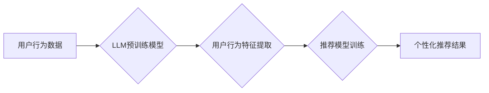

                 

## 基于LLM的推荐系统用户行为预测

> 关键词：LLM,推荐系统,用户行为预测,自然语言处理,深度学习,Transformer,BERT,Fine-tuning

## 1. 背景介绍

推荐系统是互联网时代的重要组成部分，其核心目标是根据用户的历史行为、偏好和上下文信息，预测用户对特定物品的兴趣，并推荐最相关的物品。传统的推荐系统主要依赖于协同过滤、内容过滤和基于知识的推荐算法，但这些方法在面对冷启动问题、数据稀疏性以及用户行为的多样性时，往往表现力不足。

近年来，大语言模型（LLM）的快速发展为推荐系统带来了新的机遇。LLM 拥有强大的文本理解和生成能力，能够从用户行为数据中提取更丰富的语义信息，并生成更个性化、更精准的推荐结果。基于LLM的推荐系统能够更好地理解用户的意图和需求，从而提供更有效的推荐服务。

## 2. 核心概念与联系

### 2.1  LLM概述

大语言模型（LLM）是一种基于深度学习的Transformer网络架构，通过训练海量文本数据，学习语言的语法、语义和上下文关系。LLM 能够理解和生成人类语言，并具备强大的文本处理能力，例如文本分类、问答、文本摘要、机器翻译等。

### 2.2  推荐系统概述

推荐系统旨在根据用户的历史行为、偏好和上下文信息，预测用户对特定物品的兴趣，并推荐最相关的物品。推荐系统广泛应用于电商、视频、音乐、新闻等领域，帮助用户发现感兴趣的内容，提高用户体验。

### 2.3  LLM与推荐系统的结合

LLM 的强大文本理解和生成能力可以为推荐系统带来以下优势：

* **更精准的用户画像:** LLM 可以从用户的文本数据中，例如评论、搜索历史、浏览记录等，提取更丰富的语义信息，构建更精准的用户画像。
* **更个性化的推荐:** LLM 可以根据用户的个性化需求，生成更个性化的推荐结果，例如推荐用户可能感兴趣的商品、文章或视频。
* **更有效的冷启动问题解决:** LLM 可以利用其对语言的理解能力，对新用户或新物品进行建模，从而有效解决冷启动问题。

**核心架构流程图:**



## 3. 核心算法原理 & 具体操作步骤

### 3.1  算法原理概述

基于LLM的推荐系统通常采用以下核心算法：

* **Transformer网络:** Transformer网络是一种深度学习模型，能够有效捕捉文本序列中的长距离依赖关系。
* **BERT模型:** BERT（Bidirectional Encoder Representations from Transformers）是一种预训练的Transformer模型，能够理解文本的上下文语义。
* **Fine-tuning:** 将预训练的LLM模型在特定推荐任务上进行微调，使其能够更好地适应推荐场景。

### 3.2  算法步骤详解

1. **数据预处理:** 收集用户行为数据，例如用户点击、浏览、购买等行为，并进行清洗、格式化和编码。
2. **用户行为特征提取:** 利用LLM模型，例如BERT，从用户行为数据中提取语义特征，例如用户兴趣、偏好、购买习惯等。
3. **推荐模型训练:** 使用提取的用户行为特征，训练推荐模型，例如基于深度学习的协同过滤模型或内容过滤模型。
4. **个性化推荐:** 根据用户的最新行为和特征，利用训练好的推荐模型生成个性化的推荐结果。

### 3.3  算法优缺点

**优点:**

* **更精准的用户画像:** LLM能够从文本数据中提取更丰富的语义信息，构建更精准的用户画像。
* **更个性化的推荐:** LLM可以根据用户的个性化需求，生成更个性化的推荐结果。
* **更有效的冷启动问题解决:** LLM可以利用其对语言的理解能力，对新用户或新物品进行建模，从而有效解决冷启动问题。

**缺点:**

* **训练成本高:** LLM模型训练需要大量的计算资源和时间。
* **数据依赖性强:** LLM模型的性能依赖于训练数据的质量和数量。
* **解释性差:** LLM模型的决策过程较为复杂，难以解释其推荐结果背后的逻辑。

### 3.4  算法应用领域

基于LLM的推荐系统可以应用于以下领域:

* **电商推荐:** 推荐商品、优惠券、促销活动等。
* **视频推荐:** 推荐视频、电视剧、电影等。
* **音乐推荐:** 推荐歌曲、专辑、音乐人等。
* **新闻推荐:** 推荐新闻文章、博客文章、论坛帖子等。
* **社交媒体推荐:** 推荐好友、群组、话题等。

## 4. 数学模型和公式 & 详细讲解 & 举例说明

### 4.1  数学模型构建

基于LLM的推荐系统通常采用以下数学模型:

* **协同过滤模型:** 

$$
r_{ui} = \alpha_{u} + \beta_{i} + \gamma_{u,i}
$$

其中:

* $r_{ui}$ 表示用户 $u$ 对物品 $i$ 的评分。
* $\alpha_{u}$ 表示用户 $u$ 的平均评分偏置。
* $\beta_{i}$ 表示物品 $i$ 的平均评分偏置。
* $\gamma_{u,i}$ 表示用户 $u$ 对物品 $i$ 的特定评分偏置。

* **内容过滤模型:**

$$
P(u|i) = \frac{exp(w_{u} \cdot w_{i})}{\sum_{j} exp(w_{u} \cdot w_{j})}
$$

其中:

* $P(u|i)$ 表示用户 $u$ 对物品 $i$ 的兴趣概率。
* $w_{u}$ 表示用户 $u$ 的特征向量。
* $w_{i}$ 表示物品 $i$ 的特征向量。

### 4.2  公式推导过程

协同过滤模型的公式推导过程基于矩阵分解的方法，通过最小化用户评分与预测评分之间的误差来学习用户和物品的潜在特征。内容过滤模型的公式推导过程基于概率论和统计学，通过计算用户和物品特征之间的相似度来预测用户对物品的兴趣。

### 4.3  案例分析与讲解

**案例:** 假设有一个电商平台，用户 $u$ 对商品 $i$ 的评分为 4 分。根据协同过滤模型，我们可以计算出用户 $u$ 的平均评分偏置 $\alpha_{u}$、商品 $i$ 的平均评分偏置 $\beta_{i}$ 和用户 $u$ 对商品 $i$ 的特定评分偏置 $\gamma_{u,i}$。然后，我们可以利用这些信息来预测其他用户对商品 $i$ 的评分。

**案例:** 假设一个音乐平台，用户 $u$ 喜欢摇滚乐，而商品 $i$ 是一个摇滚乐专辑。根据内容过滤模型，我们可以计算出用户 $u$ 和商品 $i$ 的特征向量之间的相似度。如果相似度较高，则表示用户 $u$ 可能会喜欢这个专辑。

## 5. 项目实践：代码实例和详细解释说明

### 5.1  开发环境搭建

* **操作系统:** Linux/macOS
* **编程语言:** Python
* **深度学习框架:** TensorFlow/PyTorch
* **LLM模型库:** HuggingFace Transformers

### 5.2  源代码详细实现

```python
# 导入必要的库
import torch
from transformers import AutoModelForSequenceClassification, AutoTokenizer

# 加载预训练的LLM模型和词典
model_name = "bert-base-uncased"
tokenizer = AutoTokenizer.from_pretrained(model_name)
model = AutoModelForSequenceClassification.from_pretrained(model_name)

# 预处理用户行为数据
def preprocess_data(text):
  # 将文本转换为模型输入格式
  inputs = tokenizer(text, return_tensors="pt")
  return inputs

# 使用LLM模型提取用户行为特征
def extract_features(inputs):
  # 将输入数据送入模型进行预测
  outputs = model(**inputs)
  # 获取模型输出的特征向量
  features = outputs.last_hidden_state[:, 0, :]
  return features

# 训练推荐模型
# ...

# 生成个性化推荐结果
def generate_recommendations(user_features):
  # ...
```

### 5.3  代码解读与分析

* **加载预训练模型:** 使用HuggingFace Transformers库加载预训练的LLM模型和词典。
* **预处理数据:** 将用户行为数据转换为模型输入格式。
* **提取特征:** 使用LLM模型提取用户行为特征。
* **训练推荐模型:** 使用提取的用户行为特征训练推荐模型。
* **生成推荐结果:** 根据用户的特征向量，利用训练好的推荐模型生成个性化的推荐结果。

### 5.4  运行结果展示

运行代码后，可以得到个性化的推荐结果，例如推荐用户可能感兴趣的商品、文章或视频。

## 6. 实际应用场景

### 6.1  电商推荐

基于LLM的推荐系统可以帮助电商平台更精准地推荐商品，提高用户转化率。例如，可以根据用户的浏览历史、购买记录和评论内容，推荐用户可能感兴趣的商品。

### 6.2  视频推荐

基于LLM的推荐系统可以帮助视频平台更精准地推荐视频，提高用户粘性。例如，可以根据用户的观看历史、点赞记录和评论内容，推荐用户可能感兴趣的视频。

### 6.3  音乐推荐

基于LLM的推荐系统可以帮助音乐平台更精准地推荐音乐，提高用户体验。例如，可以根据用户的播放历史、收藏记录和评论内容，推荐用户可能喜欢的音乐。

### 6.4  未来应用展望

基于LLM的推荐系统在未来将有更广泛的应用场景，例如：

* **个性化教育推荐:** 根据学生的学习进度、兴趣和能力，推荐个性化的学习内容。
* **医疗健康推荐:** 根据患者的病史、症状和体征，推荐个性化的医疗方案。
* **金融理财推荐:** 根据用户的风险偏好、投资目标和财务状况，推荐个性化的理财产品。

## 7. 工具和资源推荐

### 7.1  学习资源推荐

* **HuggingFace Transformers:** https://huggingface.co/docs/transformers/index
* **BERT论文:** https://arxiv.org/abs/1810.04805

### 7.2  开发工具推荐

* **TensorFlow:** https://www.tensorflow.org/
* **PyTorch:** https://pytorch.org/

### 7.3  相关论文推荐

* **BERT for Recommendation:** https://arxiv.org/abs/1908.08938
* **LLaMA for Recommender Systems:** https://arxiv.org/abs/2302.05422

## 8. 总结：未来发展趋势与挑战

### 8.1  研究成果总结

基于LLM的推荐系统在提高推荐精准度、个性化程度和冷启动能力方面取得了显著成果。LLM模型的强大文本理解能力为推荐系统带来了新的机遇，并推动了推荐系统的向更智能化、更个性化的方向发展。

### 8.2  未来发展趋势

* **多模态推荐:** 将文本、图像、音频等多模态数据融合到推荐系统中，提升推荐的丰富性和准确性。
* **联邦学习推荐:** 利用联邦学习技术，在保护用户隐私的前提下，实现跨平台、跨机构的推荐模型训练。
* **可解释性推荐:** 研究如何提高推荐系统的可解释性，让用户能够理解推荐结果背后的逻辑。

### 8.3  面临的挑战

* **数据安全与隐私:** LLM模型训练需要大量用户数据，如何保护用户数据安全和隐私是一个重要的挑战。
* **模型可解释性:** LLM模型的决策过程较为复杂，难以解释其推荐结果背后的逻辑，这可能会导致用户对推荐结果的信任度降低。
* **模型效率:** LLM模型训练和推理过程需要大量的计算资源，如何提高模型的效率是一个重要的研究方向。

### 8.4  研究展望

未来，基于LLM的推荐系统将继续朝着更智能化、更个性化、更安全的方向发展。研究者们将继续探索新的算法、模型和技术，以解决当前面临的挑战，并为用户提供更优质的推荐服务。

## 9. 附录：常见问题与解答

**Q1: 基于LLM的推荐系统与传统的推荐系统相比有什么优势？**

**A1:** 基于LLM的推荐系统能够从用户行为数据中提取更丰富的语义信息，构建更精准的用户画像，并生成更个性化的推荐结果。

**Q2: 如何解决基于LLM的推荐系统的数据安全和隐私问题？**

**A2:** 可以采用联邦学习技术，在保护用户隐私的前提下，实现跨平台、跨机构的推荐模型训练。

**Q3: 如何提高基于LLM的推荐系统的可解释性？**

**A3:** 可以研究如何将可解释性方法融入到LLM模型中，例如使用注意力机制来解释模型的决策过程。


作者：禅与计算机程序设计艺术 / Zen and the Art of Computer Programming 
<end_of_turn>

