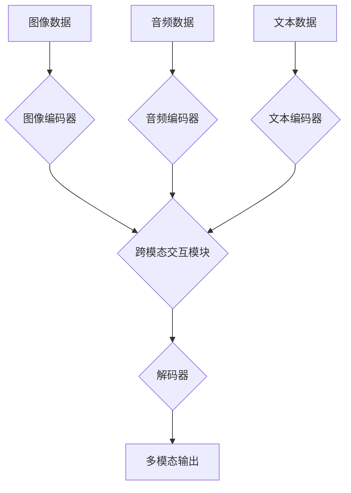

                 

## 多模态AI应用：图像、音频和视频处理技术

> 关键词：多模态学习、图像处理、音频处理、视频处理、深度学习、计算机视觉、自然语言处理、Transformer模型

## 1. 背景介绍

近年来，人工智能（AI）技术取得了飞速发展，特别是深度学习的突破，为多模态AI的应用提供了强有力的技术支撑。多模态AI是指能够理解和处理多种不同类型的模态数据（如图像、音频、文本、视频等）的智能系统。与单模态AI相比，多模态AI能够更好地理解和交互于真实世界，拥有更强大的认知能力和应用潜力。

图像、音频和视频是人类感知世界的重要方式，它们蕴含着丰富的语义信息。传统的单模态AI技术难以充分挖掘这些信息，而多模态AI则能够通过融合不同模态数据，构建更完整的语义理解模型，从而实现更精准、更智能的应用。

## 2. 核心概念与联系

多模态AI的核心是将不同模态数据进行融合，从而实现跨模态的知识表示和理解。

**2.1 多模态学习**

多模态学习旨在学习不同模态数据之间的关系，并构建一个统一的语义表示空间。它可以分为以下几种类型：

* **模态匹配:** 预测不同模态数据之间的对应关系，例如图像与文本的匹配。
* **跨模态检索:** 根据一个模态查询，在另一个模态中进行检索，例如根据图像查询相关的文本。
* **跨模态生成:** 根据一个模态输入，生成另一个模态的输出，例如根据文本描述生成图像。

**2.2 多模态架构**

多模态AI的架构通常包括以下几个模块：

* **模态编码器:** 将每个模态数据编码成低维向量表示。
* **跨模态交互模块:** 将不同模态的向量表示进行融合，学习模态之间的关系。
* **解码器:** 根据融合后的表示，生成最终的输出，例如文本、图像或视频。

**2.3 Mermaid 流程图**



## 3. 核心算法原理 & 具体操作步骤

### 3.1 算法原理概述

多模态AI算法的原理主要基于深度学习，特别是卷积神经网络（CNN）、循环神经网络（RNN）和Transformer模型。

* **CNN:** 用于图像数据处理，能够提取图像的特征和语义信息。
* **RNN:** 用于序列数据处理，例如音频和文本，能够捕捉序列中的时间依赖关系。
* **Transformer模型:** 能够处理任意长度的序列数据，并具有强大的语义理解能力，在多模态学习中取得了显著的成果。

### 3.2 算法步骤详解

1. **数据预处理:** 将图像、音频和文本数据进行预处理，例如图像裁剪、音频降噪、文本分词等。
2. **模态编码:** 使用相应的深度学习模型（CNN、RNN或Transformer）对每个模态数据进行编码，生成低维向量表示。
3. **跨模态交互:** 使用注意力机制或其他融合方法，将不同模态的向量表示进行融合，学习模态之间的关系。
4. **解码:** 根据融合后的表示，使用解码器生成最终的输出，例如文本、图像或视频。

### 3.3 算法优缺点

**优点:**

* 能够融合多种模态数据，实现更全面的语义理解。
* 具有更强的泛化能力和鲁棒性。
* 应用场景广泛，例如图像字幕、视频理解、情感分析等。

**缺点:**

* 数据集规模大，训练成本高。
* 跨模态融合方法复杂，需要大量的研究和探索。
* 模型解释性较差，难以理解模型的决策过程。

### 3.4 算法应用领域

多模态AI算法在各个领域都有广泛的应用，例如：

* **计算机视觉:** 图像识别、物体检测、场景理解、图像字幕生成等。
* **自然语言处理:** 文本摘要、情感分析、机器翻译、对话系统等。
* **语音识别:** 语音转文本、语音合成、语音情感分析等。
* **医疗保健:** 病理图像诊断、疾病预测、患者监测等。
* **教育:** 智能辅导系统、个性化学习推荐等。

## 4. 数学模型和公式 & 详细讲解 & 举例说明

### 4.1 数学模型构建

多模态AI模型通常采用以下数学模型进行构建：

* **注意力机制:** 用于学习不同模态数据之间的关系，赋予重要信息更高的权重。

* **损失函数:** 用于衡量模型的预测结果与真实值的差异，例如交叉熵损失函数、均方误差损失函数等。

* **优化算法:** 用于更新模型参数，例如梯度下降算法、Adam算法等。

### 4.2 公式推导过程

**注意力机制公式:**

$$
\text{Attention}(Q, K, V) = \text{softmax}\left(\frac{QK^T}{\sqrt{d_k}}\right)V
$$

其中：

* $Q$：查询向量
* $K$：键向量
* $V$：值向量
* $d_k$：键向量的维度
* $\text{softmax}$：softmax函数

**交叉熵损失函数公式:**

$$
\text{CrossEntropy}(y, \hat{y}) = - \sum_{i=1}^{n} y_i \log \hat{y}_i
$$

其中：

* $y$：真实标签
* $\hat{y}$：模型预测结果

### 4.3 案例分析与讲解

**图像字幕生成:**

使用多模态AI模型，可以根据图像生成相应的文本描述。例如，给定一张图片，模型可以学习图像中的物体、场景和关系，并生成一个描述性的文本，例如“一只小狗在公园里玩耍”。

**视频理解:**

使用多模态AI模型，可以理解视频中的内容，例如人物的动作、场景的变化和事件发生。例如，给定一段视频，模型可以识别视频中的人物、物体和场景，并生成一个视频摘要，例如“这段视频讲述了两个人在海边散步的故事”。

## 5. 项目实践：代码实例和详细解释说明

### 5.1 开发环境搭建

* **操作系统:** Ubuntu 20.04
* **编程语言:** Python 3.8
* **深度学习框架:** PyTorch 1.8

### 5.2 源代码详细实现

```python
import torch
import torch.nn as nn

class MultiModalEncoder(nn.Module):
    def __init__(self, image_dim, audio_dim, text_dim):
        super(MultiModalEncoder, self).__init__()
        self.image_encoder = nn.Linear(image_dim, 512)
        self.audio_encoder = nn.Linear(audio_dim, 512)
        self.text_encoder = nn.Linear(text_dim, 512)

    def forward(self, image, audio, text):
        image_embedding = self.image_encoder(image)
        audio_embedding = self.audio_encoder(audio)
        text_embedding = self.text_encoder(text)
        return image_embedding, audio_embedding, text_embedding

class MultiModalFusion(nn.Module):
    def __init__(self):
        super(MultiModalFusion, self).__init__()
        self.attention = nn.MultiheadAttention(embed_dim=512, num_heads=8)

    def forward(self, image_embedding, audio_embedding, text_embedding):
        # 使用注意力机制融合多模态特征
        fused_embedding = self.attention(image_embedding, audio_embedding, text_embedding)[0]
        return fused_embedding

class MultiModalDecoder(nn.Module):
    def __init__(self, fused_dim, output_dim):
        super(MultiModalDecoder, self).__init__()
        self.decoder = nn.Linear(fused_dim, output_dim)

    def forward(self, fused_embedding):
        # 使用解码器生成最终输出
        output = self.decoder(fused_embedding)
        return output

# 实例化多模态AI模型
model = MultiModalAI(image_dim=1024, audio_dim=512, text_dim=512)

# 训练模型
# ...

# 使用模型进行预测
# ...
```

### 5.3 代码解读与分析

* **MultiModalEncoder:** 用于编码图像、音频和文本数据，将它们转换为低维向量表示。
* **MultiModalFusion:** 使用注意力机制融合不同模态的向量表示，学习模态之间的关系。
* **MultiModalDecoder:** 根据融合后的表示，生成最终的输出，例如文本、图像或视频。

### 5.4 运行结果展示

运行结果展示需要根据具体的应用场景和数据集进行分析，例如：

* **图像字幕生成:** 展示模型生成的文本描述与真实描述的匹配度。
* **视频理解:** 展示模型识别的人物、物体和场景的准确率。

## 6. 实际应用场景

### 6.1 多模态搜索

多模态搜索是指根据图像、音频或视频查询，在文本数据库中进行检索，或者根据文本查询，在图像、音频或视频数据库中进行检索。例如，用户可以上传一张图片，搜索与该图片相关的文本信息，或者输入一段文本，搜索与该文本相关的视频。

### 6.2 多模态对话系统

多模态对话系统能够理解和生成文本、语音和图像等多种模态信息，从而实现更自然、更丰富的用户交互体验。例如，用户可以与聊天机器人进行语音对话，并通过图像进行表达，机器人能够理解用户的意图并提供相应的回复。

### 6.3 多模态内容创作

多模态AI可以帮助用户创作更丰富的、更具创意的内容。例如，用户可以输入文本描述，AI模型可以生成相应的图像或视频；用户可以上传图像或视频，AI模型可以生成相应的文本描述或音乐。

### 6.4 未来应用展望

多模态AI技术的发展将带来更多创新应用，例如：

* **虚拟现实和增强现实:** 多模态AI可以增强虚拟现实和增强现实体验，例如，用户可以与虚拟角色进行自然对话，并通过图像和声音进行交互。
* **个性化教育:** 多模态AI可以根据学生的学习风格和需求，提供个性化的学习内容和教学方式。
* **医疗诊断:** 多模态AI可以辅助医生进行疾病诊断，例如，根据患者的图像、语音和文本信息，AI模型可以识别潜在的疾病风险。

## 7. 工具和资源推荐

### 7.1 学习资源推荐

* **书籍:**
    * 《深度学习》 by Ian Goodfellow, Yoshua Bengio, and Aaron Courville
    * 《动手学深度学习》 by Aurélien Géron
* **在线课程:**
    * Coursera: Deep Learning Specialization
    * Udacity: Deep Learning Nanodegree
* **博客和网站:**
    * Towards Data Science
    * Machine Learning Mastery

### 7.2 开发工具推荐

* **深度学习框架:** PyTorch, TensorFlow, Keras
* **图像处理库:** OpenCV, Pillow
* **音频处理库:** Librosa, PyDub
* **自然语言处理库:** NLTK, SpaCy

### 7.3 相关论文推荐

* **Attention Is All You Need:** https://arxiv.org/abs/1706.03762
* **BERT: Pre-training of Deep Bidirectional Transformers for Language Understanding:** https://arxiv.org/abs/1810.04805
* **DALL-E 2: Hierarchical Text-Conditional Image Generation with CLIP Latents:** https://openai.com/blog/dall-e-2/

## 8. 总结：未来发展趋势与挑战

### 8.1 研究成果总结

近年来，多模态AI取得了显著的进展，在图像识别、视频理解、语音识别、自然语言处理等领域取得了突破性成果。

### 8.2 未来发展趋势

* **更强大的模型:** 研究人员将继续开发更强大的多模态AI模型，例如基于Transformer模型的更深层次的网络结构，以及能够处理更多模态数据的模型。
* **更丰富的应用场景:** 多模态AI技术将应用于更多领域，例如医疗保健、教育、娱乐等，为人们的生活带来更多便利和乐趣。
* **更强的解释性:** 研究人员将致力于提高多模态AI模型的解释性，使模型的决策过程更加透明和可理解。

### 8.3 面临的挑战

* **数据获取和标注:** 多模态AI模型需要大量的多模态数据进行训练，而获取和标注这些数据非常困难。
* **跨模态融合:** 如何有效地融合不同模态的数据，学习模态之间的关系，仍然是一个重要的挑战。
* **模型效率:** 多模态AI模型通常非常复杂，训练和推理速度较慢，需要进一步提高模型的效率。

### 8.4 研究展望

未来，多模态AI将继续朝着更智能、更通用、更安全的方向发展，为人类社会带来更多福祉。


## 9. 附录：常见问题与解答

**Q1: 多模态AI与单模态AI相比有什么优势？**

**A1:** 多模态AI能够融合多种模态数据，实现更全面的语义理解，具有更强的泛化能力和鲁棒性。

**Q2: 如何选择合适的多模态AI模型？**

**A2:** 选择合适的模型需要根据具体的应用场景和数据特点进行考虑，例如，图像字幕生成可以使用基于Transformer模型的模型，而视频理解可以使用基于CNN和RNN的模型。

**Q3: 多模态AI技术有哪些伦理问题？**

**A3:** 多模态AI技术可能存在一些伦理问题，例如数据隐私、算法偏见、信息操纵等，需要引起重视并进行相应的规制和引导。


作者：禅与计算机程序设计艺术 / Zen and the Art of Computer Programming<end_of_turn>

