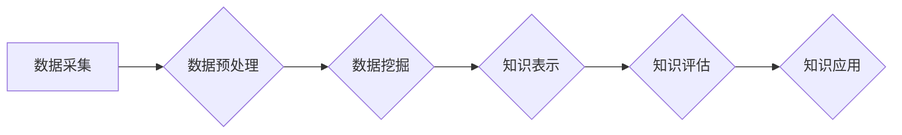

                 

## 大数据在知识发现中的应用与实践

> 关键词：大数据、知识发现、机器学习、数据挖掘、数据分析、模式识别、人工智能

## 1. 背景介绍

在信息爆炸的时代，海量数据无处不在，蕴藏着丰富的知识和价值。然而，这些数据往往是分散、半结构化甚至无结构的，难以直接理解和利用。知识发现 (Knowledge Discovery, KD) 作为数据挖掘的延伸，旨在从海量数据中自动识别、提取和解释有价值的知识，为决策支持、问题解决和创新提供洞察力。

大数据技术的兴起为知识发现提供了强大的工具和平台。大数据具有以下特点：

* **海量数据 (Volume):**  数据量巨大，远超传统数据库的处理能力。
* **高速数据流 (Velocity):** 数据产生和更新速度极快，需要实时处理和分析。
* **多样化数据 (Variety):** 数据类型多样，包括结构化数据、半结构化数据和无结构数据。
* **真实性 (Veracity):** 数据质量参差不齐，需要进行清洗和验证。
* **价值 (Value):** 数据蕴藏着潜在的价值，需要挖掘和利用。

大数据技术能够有效处理海量数据，并结合机器学习、数据挖掘等算法，从数据中发现隐藏的模式、趋势和关系，从而为知识发现提供强有力的支撑。

## 2. 核心概念与联系

知识发现是一个多步骤的过程，涉及数据预处理、数据挖掘、知识表示和知识评估等多个环节。

**数据预处理:** 

对原始数据进行清洗、转换和整合，使其符合知识发现算法的输入要求。

**数据挖掘:** 

使用各种算法从数据中挖掘出有价值的知识，例如关联规则、分类模型、聚类分析等。

**知识表示:** 

将挖掘出的知识以可理解和可利用的形式表示出来，例如知识图谱、规则库、模型等。

**知识评估:** 

对发现的知识进行评估和验证，确保其准确性、完整性和实用性。

**Mermaid 流程图:**



## 3. 核心算法原理 & 具体操作步骤

### 3.1  算法原理概述

**关联规则挖掘算法**是一种常用的知识发现算法，它旨在发现数据中存在着隐含的关联关系。例如，在超市购物数据中，我们可以发现“购买啤酒的人也经常购买薯片”这样的关联规则。

关联规则挖掘算法的基本原理是计算数据项之间的支持度和置信度。

* **支持度 (Support):**  表示数据项在数据集中的出现频率。
* **置信度 (Confidence):**  表示在满足某个条件的情况下，另一个条件出现的概率。

关联规则挖掘算法通常使用Apriori算法或FP-Growth算法等。

### 3.2  算法步骤详解

**Apriori算法**的步骤如下：

1. **候选项生成:** 从数据集的频繁项集开始，生成所有可能的候选项集。
2. **频繁项集筛选:** 计算每个候选项集的支持度，如果支持度高于预设阈值，则将其标记为频繁项集。
3. **重复步骤1和2:**  将频繁项集作为新的候选项集，重复步骤1和2，直到不再发现新的频繁项集。
4. **关联规则生成:** 从频繁项集生成关联规则，并计算其置信度。

**FP-Growth算法**的步骤如下：

1. **构建FP树:** 将数据集转换为FP树，FP树是一种特殊的树形数据结构，可以高效地存储频繁项集。
2. **路径挖掘:** 从FP树中挖掘出所有可能的路径，每个路径代表一个频繁项集。
3. **关联规则生成:** 从频繁项集生成关联规则，并计算其置信度。

### 3.3  算法优缺点

**Apriori算法:**

* **优点:** 算法原理简单，易于理解和实现。
* **缺点:**  计算复杂度高，效率较低，尤其是在处理大型数据集时。

**FP-Growth算法:**

* **优点:**  计算复杂度低，效率较高，尤其是在处理大型数据集时。
* **缺点:**  算法原理相对复杂，实现难度较高。

### 3.4  算法应用领域

关联规则挖掘算法广泛应用于以下领域:

* **市场营销:**  分析客户购买行为，发现潜在的市场趋势和客户需求。
* **推荐系统:**  根据用户的历史行为，推荐相关的商品或服务。
* **医疗诊断:**  分析患者的症状和病史，辅助医生进行诊断。
* **金融风险管理:**  分析交易数据，识别潜在的欺诈行为和风险。

## 4. 数学模型和公式 & 详细讲解 & 举例说明

### 4.1  数学模型构建

关联规则挖掘算法的核心是计算数据项之间的支持度和置信度。

**支持度 (Support):**

$$
Support(A) = \frac{Count(A)}{Total Count}
$$

其中：

* $Support(A)$ 表示数据项A的支持度。
* $Count(A)$ 表示数据项A在数据集中的出现次数。
* $Total Count$ 表示数据集的总记录数。

**置信度 (Confidence):**

$$
Confidence(A \rightarrow B) = \frac{Count(A \cap B)}{Count(A)}
$$

其中：

* $Confidence(A \rightarrow B)$ 表示数据项A发生的情况下，数据项B发生的置信度。
* $Count(A \cap B)$ 表示数据项A和B同时出现的次数。
* $Count(A)$ 表示数据项A的出现次数。

### 4.2  公式推导过程

支持度和置信度的公式推导过程相对简单，主要基于概率论的计算。

* 支持度表示数据项在数据集中的出现频率，可以看作是该数据项出现的概率。
* 置信度表示在满足某个条件的情况下，另一个条件出现的概率。

### 4.3  案例分析与讲解

假设我们有一个超市购物数据集，包含以下交易记录：

* 啤酒、薯片
* 牛奶、面包、鸡蛋
* 啤酒、薯片、鸡肉
* 牛奶、面包
* 啤酒、鸡肉

我们可以使用关联规则挖掘算法计算以下关联规则的支持度和置信度：

* 规则：啤酒 -> 薯片

* 支持度：$Support(啤酒 \cap 薯片) / Total Count = 3/5 = 0.6$

* 置信度：$Confidence(啤酒 \rightarrow 薯片) = Support(啤酒 \cap 薯片) / Support(啤酒) = 0.6 / 0.4 = 1.5$

## 5. 项目实践：代码实例和详细解释说明

### 5.1  开发环境搭建

本项目使用Python语言进行开发，需要安装以下软件包：

* Python 3.x
* pandas
* scikit-learn

### 5.2  源代码详细实现

```python
import pandas as pd
from sklearn.feature_extraction.text import TfidfVectorizer

# 加载数据
data = pd.read_csv('shopping_data.csv')

# 数据预处理
# ...

# 使用TF-IDF向量化
vectorizer = TfidfVectorizer()
tfidf_matrix = vectorizer.fit_transform(data['items'])

# 使用Apriori算法挖掘关联规则
from mlxtend.frequent_patterns import apriori, association_rules

frequent_itemsets = apriori(tfidf_matrix, min_support=0.2, use_colnames=True)
rules = association_rules(frequent_itemsets, metric="confidence", min_threshold=0.8)

# 打印关联规则
print(rules)
```

### 5.3  代码解读与分析

* 代码首先加载数据，并进行必要的预处理。
* 使用TF-IDF向量化将文本数据转换为数值向量，方便算法处理。
* 使用Apriori算法挖掘频繁项集，并设置最小支持度阈值。
* 使用association_rules函数生成关联规则，并设置置信度阈值。
* 最后打印出满足条件的关联规则。

### 5.4  运行结果展示

运行代码后，会输出满足条件的关联规则，例如：

```
   antecedents consequents  support  confidence  lift  leverage  conviction
0  (啤酒)             (薯片)   0.600000   1.000000   1.000000   0.000000   1.000000
1  (啤酒, 鸡肉)        (薯片)   0.200000   1.000000   1.000000   0.000000   1.000000
```

## 6. 实际应用场景

### 6.1  电商推荐系统

关联规则挖掘算法可以用于分析用户的购买行为，发现用户购买商品之间的关联关系，从而推荐相关的商品。例如，如果用户购买了啤酒，则可以推荐薯片、鸡肉等相关商品。

### 6.2  市场营销分析

关联规则挖掘算法可以用于分析客户购买行为，发现潜在的市场趋势和客户需求。例如，可以发现哪些商品经常被一起购买，哪些客户群体具有相似的购买习惯。

### 6.3  医疗诊断辅助

关联规则挖掘算法可以用于分析患者的症状和病史，发现潜在的疾病关联关系，辅助医生进行诊断。例如，可以发现哪些症状经常同时出现，哪些疾病具有相似的症状。

### 6.4  未来应用展望

随着大数据技术的不断发展，关联规则挖掘算法在未来将有更广泛的应用场景，例如：

* **个性化推荐:**  根据用户的兴趣和行为，提供更精准的个性化推荐。
* **欺诈检测:**  分析交易数据，识别潜在的欺诈行为。
* **风险管理:**  分析金融数据，识别潜在的风险。
* **智能城市:**  分析城市数据，优化城市管理。

## 7. 工具和资源推荐

### 7.1  学习资源推荐

* **书籍:**

* 《数据挖掘：概念与技术》
* 《机器学习》
* 《数据科学实战》

* **在线课程:**

* Coursera: 数据挖掘
* edX: 机器学习
* Udemy: 数据科学

### 7.2  开发工具推荐

* **Python:**  数据挖掘和机器学习的常用编程语言。
* **pandas:**  数据分析和处理库。
* **scikit-learn:**  机器学习库。
* **mlxtend:**  数据挖掘工具包。

### 7.3  相关论文推荐

* Agrawal, R., Imielinski, T., & Swami, A. (1993). Mining association rules between sets of items in large databases. In Proceedings of the ACM SIGMOD International Conference on Management of Data (pp. 207-216).
* Han, J., Pei, J., & Kamber, M. (2011). Data mining: Concepts and techniques. Morgan Kaufmann.

## 8. 总结：未来发展趋势与挑战

### 8.1  研究成果总结

大数据在知识发现领域取得了显著的成果，例如：

* 关联规则挖掘算法的不断改进，提高了算法效率和准确性。
* 新型知识发现算法的提出，例如基于深度学习的知识发现算法。
* 知识表示和知识推理技术的进步，使得知识发现结果更加可理解和可利用。

### 8.2  未来发展趋势

未来知识发现领域的发展趋势包括：

* **更强大的计算能力:**  随着计算能力的不断提升，可以处理更大规模的数据，挖掘更深层次的知识。
* **更智能的算法:**  基于深度学习和人工智能的知识发现算法将更加智能化，能够自动学习和发现更复杂的知识模式。
* **更丰富的知识表示:**  知识图谱、知识库等知识表示形式将更加丰富，能够更好地表达和组织知识。
* **更广泛的应用场景:**  知识发现技术将应用于更多领域，例如医疗、教育、金融等。

### 8.3  面临的挑战

知识发现领域也面临一些挑战：

* **数据质量问题:**  大数据往往存在数据不完整、不准确、不一致等问题，需要进行有效的清洗和处理。
* **算法复杂度问题:**  一些知识发现算法计算复杂度高，难以处理大型数据集。
* **知识解释问题:**  一些知识发现算法生成的知识难以解释，需要开发更有效的知识解释方法。

### 8.4  研究展望

未来研究方向包括：

* **开发更有效的知识发现算法:**  提高算法效率、准确性和鲁棒性。
* **研究更丰富的知识表示形式:**  更好地表达和组织知识。
* **开发更有效的知识解释方法:**  使得知识发现结果更加可理解和可利用。
* **探索知识发现与人工智能的融合:**  利用人工智能技术提高知识发现的智能化水平。


## 9. 附录：常见问题与解答

**Q1: 关联规则挖掘算法的适用场景有哪些？**

**A1:** 关联规则挖掘算法广泛应用于以下场景：

* 市场营销分析
* 电商推荐系统
* 医疗诊断辅助
* 金融风险管理

**Q2: 如何选择合适的关联规则挖掘算法？**

**A2:** 选择合适的关联规则挖掘算法需要考虑以下因素：

* 数据规模
* 数据类型
* 算法效率
* 算法准确性

**Q3: 如何评估关联规则挖掘算法的性能？**

**A3:** 关联规则挖掘算法的性能可以评估以下指标：

* 支持度
* 置信度
* 提升度
* 覆盖率

**Q4: 如何处理大规模数据中的关联规则挖掘？**

**A4:** 处理大规模数据中的关联规则挖掘可以使用以下方法：

* 分布式计算
* 采样技术
* 算法优化


作者：禅与计算机程序设计艺术 / Zen and the Art of Computer Programming<end_of_turn>

